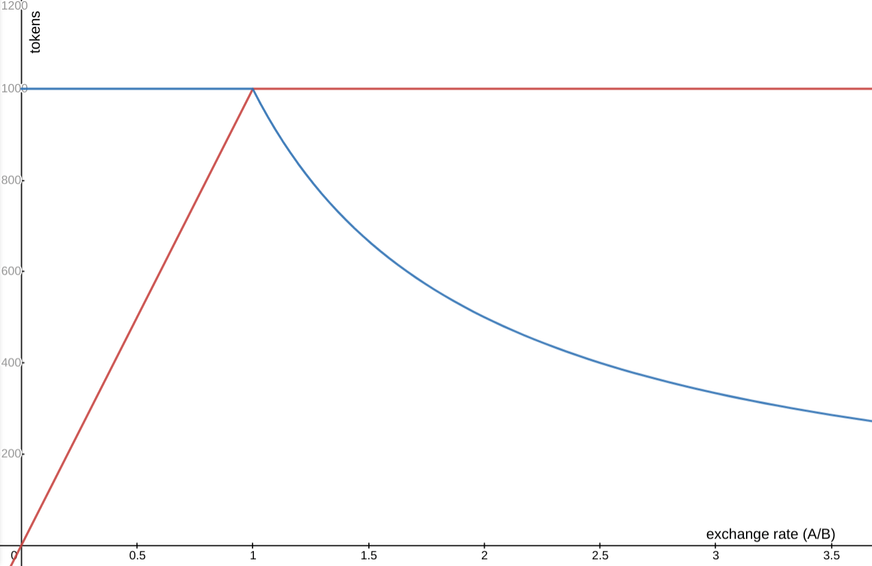

## Introduction {#introduction}

[Uniswap v2](https://uniswap.org/whitepaper.pdf) can create an exchange market between any two ERC-20 tokens. In this
article we will go over the source code for the contracts that implement this protocol and see why they are written
this way.


### What Does Uniswap Do? {#what-does-uniswap-do}

Basically, there are two types of users: *liquidity providers* and *traders*. 

The liquidity providers provide the pool with the two tokens that can be exchanged (we'll call them
**Token0** and **Token1**). In return, they receive a third token that represents partial ownership of
the pool.

Trades send one type of token to the pool and receive the other (for example, send **Token0** and receive
**Token1**) out of the pool provided by the liquidity providers. The exchange rate is determined by the 
relative number of **Token0**s and **Token1**s that the pool has. In addition, the pool takes a small 
percent as a reward for the liquidity pool.

When liquidity providers want their assets back they can burn the pool tokens and receive back their tokens, 
including their share of the rewards.

[Click here for a fuller description](https://uniswap.org/docs/v2/core-concepts/swaps/).


### Why v2? Why not v3? {#why-v2}

As I'm writing this, [Uniswap v3](https://uniswap.org/whitepaper-v3.pdf) is almost ready. However, it is an upgrade
that is much more complicated than the original. It is easier to first learn v2, which is simpler, and then go to v3.


### Core Contracts vs Periphery Contracts  {#contract-types}

Uniswap v2 is divided into two components, a core and a periphery. This division allows the core contracts,
which hold the assets in the market and therefore *have* to be secure, to be simpler and easier to audit. 
All the extra functionality required by traders can then be provided by periphery contracts. 


## Data and Control Flows {#flows}

GOON

## The Core Contracts {#core-contracts}

These are the secure contracts which hold the liquidity. 


### UniswapV2Pair.sol   {#UniswapV2Pair}

[This contract](https://github.com/Uniswap/uniswap-v2-core/blob/master/contracts/UniswapV2Pair.sol) implements an
actual pool that exchanges tokens. It is the core Uniswap functionality.


```solidity
pragma solidity =0.5.16;

import './interfaces/IUniswapV2Pair.sol';
import './UniswapV2ERC20.sol';
import './libraries/Math.sol';
import './libraries/UQ112x112.sol';
import './interfaces/IERC20.sol';
import './interfaces/IUniswapV2Factory.sol';
import './interfaces/IUniswapV2Callee.sol';
```

These are all the interfaces that the contract needs to know about, either because the contract implements them
(`IUniswapV2Pair` and `UniswapV2ERC20`) or because it calls contracts that implement them.

```solidity
contract UniswapV2Pair is IUniswapV2Pair, UniswapV2ERC20 {
```

This contract inherits from `UniswapV2ERC20`, which provides all the ERC-20 functions for the liquidity token that
liquidity providers receive.

```solidity
    using SafeMath  for uint;
```

The [SafeMath library](https://docs.openzeppelin.com/contracts/2.x/api/math) is used to avoid overflows and 
underflows. This is important because otherwise we might end up with a situation where a value should be `-1`,
but is instead `2^256-1`.

```solidity
    using UQ112x112 for uint224;
```

A lot of calculations in the pool contract require fractions. However, fractions are not supported by the EVM.
The solution that Uniswap found is to use 224 bit values, with 112 bits for the integer part, and 112 bits 
for the fraction. So `1.0` is represented as `2^112`, `1.5` is represented as `2^112 + 2^111`, etc.

#### Variables {#pair-vars}

```solidity
    uint public constant MINIMUM_LIQUIDITY = 10**3;
```    

To avoid cases of division by zero, there is a minimum number of liquidity tokens that always
exist (but are owned by account zero). That number is **MINIMUM_LIQUIDITY**, a thousand.

    
```solidity    
    bytes4 private constant SELECTOR = bytes4(keccak256(bytes('transfer(address,uint256)')));
```

This is the ABI selector for the ERC-20 transfer function. It is used to transfer ERC-20 tokens
in the two token accounts.

```solidity
    address public factory;
```

This is the factory contract that created this pool. Every pool is an exchange between two ERC-20 
tokens, the factory is a central point that connects all of these pools.
    
```solidity    
    address public token0;
    address public token1;
```

There are the addresses of the contracts for the two types of ERC-20 tokens that can be exchanged 
by this pool.

```solidity
    uint112 private reserve0;           // uses single storage slot, accessible via getReserves
    uint112 private reserve1;           // uses single storage slot, accessible via getReserves
```

The reserves the pool has for each token type.

```solidity
    uint32  private blockTimestampLast; // uses single storage slot, accessible via getReserves
```

The timestamp for the last block in which an exchange occured, used to track exchange rates across time.

One of the biggest gas expenses of Ethereum contracts is storage, which persists from one call of the contract
to the next. Each storage cell is 256 bits long. These three variables are allocated in such a way a single
storage value can include all three of them (112+112+32=256).
    
```solidity
    uint public price0CumulativeLast;
    uint public price1CumulativeLast;
```

These variables hold the cumulative costs for each token (each in term of the other). They can be used to calculate
the average exchange rate over a period of time.

```solidity
    uint public kLast; // reserve0 * reserve1, as of immediately after the most recent liquidity event
```

The way the pool decides on the exchange rate between token0 and token1 is to keep the multiple of 
the two reserves constant during trades. `kLast` is this value. It changes when a liquidity provider
deposits or withdraws tokens.


Here is a simple example. Note that for the sake of simplicity the table only has has three digits after the decimal point, and we ignore the
0.3% trading fee so the numbers are not accurate.

| Event                                                    |  reserve0  | reserve1 | reserve0 * reserve1 | Average exchange rate (token1 / token0) |
| -------------------------------------------------------- |       --------: |      ----------: |       ----------------: | -----------------------  |
| Initial setup                                            |     1,000.000   |        1,000.000 | 1,000,000               |                          |
| Trader A deposits 50 token0 and gets 47.619  token1 back |     1,050.000   |          952.381 | 1,000,000               | 0.952                    |
| Trader B deposits 10 token0 and gets  8.984  token1 back |     1,060.000   |          943.396 | 1,000,000               | 0.898                    |
| Trader C deposits 40 token0 and gets 34.305  token1 back |     1,100.000   |          909.090 | 1,000,000               | 0.858                    |
| Trader D deposits 100 token1 and gets 109.01 token0 back |       990.990   |        1,009.090 | 1,000,000               | 0.917                    |
| Trader E deposits 10 token0 and gets 10.079 token1 back  |     1,000.990   |          999.010 | 1,000,000               | 1.008                    |

As you can see, as traders provide more of token0, the relative value of token1 increases, and vice versa, implementing supply and demand.

#### Lock   {#pair-lock}

```solidity
    uint private unlocked = 1;
```

There is a class of security vulnerabilities that are based on 
[reentrancy abuse](https://medium.com/coinmonks/ethernaut-lvl-10-re-entrancy-walkthrough-how-to-abuse-execution-ordering-and-reproduce-the-dao-7ec88b912c14).
Uniswap needs to transfer arbitrary ERC-20 tokens, which means calling ERC-20 contracts that may attempt to abuse the Uniswap market that calls them. 
By having an `unlocked` variable as part of the contract, we can prevent functions from being called while they are running (within the same 
transaction).

```solidity
    modifier lock() {
```

This function is a [modifier](https://docs.soliditylang.org/en/v0.8.3/contracts.html#function-modifiers), a function that wraps around a 
normal function to change its behavior is some way.

```solidity
        require(unlocked == 1, 'UniswapV2: LOCKED');
        unlocked = 0;
```

If `unlocked` is equal to one, set it to zero. If it is already zero revert the call, make it fail.

```solidity
        _;
```

In a modifier `_;` is the original function call (with all the parameters). Here it means that the function call only happens if 
`unlocked` was one when it was called, and while it is running the value of `unlocked` is zero.

```solidity
        unlocked = 1;
    }
```

After the main function returns, release the lock.


#### Misc. functions {#pair-misc}

```solidity
    function getReserves() public view returns (uint112 _reserve0, uint112 _reserve1, uint32 _blockTimestampLast) {
        _reserve0 = reserve0;
        _reserve1 = reserve1;
        _blockTimestampLast = blockTimestampLast;
    }
```

This function provides callers with the current state of the exchange. Notice that Solidity functions [can return multiple
values](https://docs.soliditylang.org/en/v0.8.3/contracts.html#returning-multiple-values).

```solidity
    function _safeTransfer(address token, address to, uint value) private {
        (bool success, bytes memory data) = token.call(abi.encodeWithSelector(SELECTOR, to, value));
```

This internal function transfers an amount of ERC20 tokens from the exchange to somebody else. `SELECTOR` specifies
the function was are calling is `transfer(address,uint)` (see defintion above). 

To avoid having to import an interface for the token function, we "manually" create the call using one of the 
[ABI functions](https://docs.soliditylang.org/en/v0.8.3/units-and-global-variables.html#abi-encoding-and-decoding-functions).

```solidity
        require(success && (data.length == 0 || abi.decode(data, (bool))), 'UniswapV2: TRANSFER_FAILED');
    }
```

There are two ways in which this call can fail:

1. Revert. If a call to an external contract reverts than the boolean return value is `false`
2. End normally but report a failure. In that case the return value buffer has a non-zero length, and when decoded as a boolean value it is `false`

If either of these conditions happen, revert.

#### Events {#pair-events}

```solidity
    event Mint(address indexed sender, uint amount0, uint amount1);
    event Burn(address indexed sender, uint amount0, uint amount1, address indexed to);
```

These two events are emitted when a liquidity provider either deposits liquidity (`Mint`) or withdraws it (`Burn`). In
either case, the amounts of token0 and token1 that are deposited or withdrawn are part of the event, as well as the identity
of the account that called us (`sender`). In the case of a withdrawal, the event also includes the target that received
the tokens (`to`), which may not be the same as the sender.

```solidity
    event Swap(
        address indexed sender,
        uint amount0In,
        uint amount1In,
        uint amount0Out,
        uint amount1Out,
        address indexed to
    );
```

This event is emitted when a trader swaps one token for the other. Again, the sender and the destination may not be the same.
Each token may be either sent to the exchange, or received from it.

```solidity
    event Sync(uint112 reserve0, uint112 reserve1);
```

Finally, `Sync` is emitted every time tokens are added or withdrawn, regardless of the reason, to provide the latest reserve information.


#### Setup Functions {#pair-setup}

These functions are supposed to be called once when the new pair exchange is set up.

```solidity
    constructor() public {
        factory = msg.sender;
    }
```

The constructor makes sure we'll keep track of the address of the factory that created the pair. This
information is required for `initialize` and for the factory fee (if one exists)

```solidity
    // called once by the factory at time of deployment
    function initialize(address _token0, address _token1) external {
        require(msg.sender == factory, 'UniswapV2: FORBIDDEN'); // sufficient check
        token0 = _token0;
        token1 = _token1;
    }
```

This function allows the factory (and only the factory) to specify the two ERC-20 tokens that this pair will exchange.


#### Internal Update Functions {#pair-update-internal}

```solidity
    // update reserves and, on the first call per block, price accumulators
    function _update(uint balance0, uint balance1, uint112 _reserve0, uint112 _reserve1) private {
```    

This function is called every time tokens are deposited or withdrawn.

```solidity
        require(balance0 <= uint112(-1) && balance1 <= uint112(-1), 'UniswapV2: OVERFLOW');
```

If the update makes either balance higher than 2^111 (so it would be interpreted as a negative number) refuse
to do it to prevent overflows. With a normal token that can be subdivided into 10^18 units, this means each
exchange is limited to about 2.5\*10^15 of each tokens. So far that has not been a problem.

```solidity
        uint32 blockTimestamp = uint32(block.timestamp % 2**32);
        uint32 timeElapsed = blockTimestamp - blockTimestampLast; // overflow is desired
        if (timeElapsed > 0 && _reserve0 != 0 && _reserve1 != 0) {        
```

If the time elapsed is not zero, it means we are the first exchange transaction on this block. In that case,
we need to update the cost accumulators. 

```solidity
            // * never overflows, and + overflow is desired
            price0CumulativeLast += uint(UQ112x112.encode(_reserve1).uqdiv(_reserve0)) * timeElapsed;
            price1CumulativeLast += uint(UQ112x112.encode(_reserve0).uqdiv(_reserve1)) * timeElapsed;
        }
```

Each cost accumulator is updated with the latest cost (<reserve of the other token>/<reserve of this token>) times the elapsed time
in seconds. To get an average price you read the cumulative price is two points in time, and divide by the time difference
between them. For example, assume this sequence of events:


| Event                                                    |  reserve0       | reserve1         | timestamp | Marginal exchange rate (reserve1 / reserve0) | price0CumulativeLast |
| -------------------------------------------------------- |       --------: |      ----------: | --------- | ----: | ---: |
| Initial setup                                            |     1,000.000   |        1,000.000 | 5,000 | 1.000 |  0 |
| Trader A deposits 50 token0 and gets 47.619  token1 back |     1,050.000   |          952.381 | 5,020 | 0.907 | 20 |
| Trader B deposits 10 token0 and gets  8.984  token1 back |     1,060.000   |          943.396 | 5,030 | 0.890 | 20+10\*0.907 = 29.07 | 
| Trader C deposits 40 token0 and gets 34.305  token1 back |     1,100.000   |          909.090 | 5,100 | 0.826 | 29.07+70\*0.890 = 91.37 |
| Trader D deposits 100 token1 and gets 109.01 token0 back |       990.990   |        1,009.090 | 5,110 | 1.018 | 91.37+10\*0.826 = 99.63 |
| Trader E deposits 10 token0 and gets 10.079 token1 back  |     1,000.990   |          999.010 | 5,150 | 0.998 | 99.63+40\*1.1018 = 143.702 |

Lets say we want to calculate the average price of **Token0** between the timestamps 5,030 and 5,150. The difference in the value of
`price0Culumative` is 143.702-29.07=114.632. However, this is the average across two minutes (120 seconds). So the average price is
114.632/120 = 0.955.

This price calculation is the reason we need to know the old reserve sizes.

```solidity
        reserve0 = uint112(balance0);
        reserve1 = uint112(balance1);
        blockTimestampLast = blockTimestamp;
        emit Sync(reserve0, reserve1);
    }
```

Finally, update the global variables and emit a `Sync` event.


```solidity
    // if fee is on, mint liquidity equivalent to 1/6th of the growth in sqrt(k)
    function _mintFee(uint112 _reserve0, uint112 _reserve1) private returns (bool feeOn) {
```

In Uniswap 2.0 traders pay a 0.30% fee to use the market. Most of that fee (0.25% of the trade) 
always goes to the liquidity providers. The remaining 0.05% can go either to the liquidity
providers or to an address specified by the factory as a protocol fee, which pays Unisoft for
their development effort.

To reduce calculations (and therefore gas costs), this fee is only calculated when liquidity
is added or removed from the pool, rather than at each transaction.

```solidity
        address feeTo = IUniswapV2Factory(factory).feeTo();
        feeOn = feeTo != address(0);
```

Read the fee destination of the factory. If it is zero then there is no protocol fee and no 
need to calculate it that fee.

```solidity
        uint _kLast = kLast; // gas savings
```

The `kLast` state variable is located in storage, so it will have a value between different calls to the contract.
Access to storage is a lot more expensive than access to the volatile memory that is released when the function
call to the contract ends, so we use an internal variable to save on gas.

```solidity
        if (feeOn) {
            if (_kLast != 0) {
```

The liquidity providers get their cut simply by the appreciation of their liquidity tokens. But the protocol
fee requires new liquidity tokens to be minted and provided to the `feeTo` address.

```solidity
                uint rootK = Math.sqrt(uint(_reserve0).mul(_reserve1));
                uint rootKLast = Math.sqrt(_kLast);
                if (rootK > rootKLast) {
```

If there is new liquidity on which to collect a protocol fee.

```solidity
                    uint numerator = totalSupply.mul(rootK.sub(rootKLast));
                    uint denominator = rootK.mul(5).add(rootKLast);
                    uint liquidity = numerator / denominator;
```

This complicated calculation of fees is explained in [the whitepaper](https://uniswap.org/whitepaper.pdf) on page 5. We know 
that between the time `kLast` was calculated and the present no liquidity was added or removed (because we run this
calculation every time liquidity is added or removed, before it actually changes), so any change in `reserve0 * reserve1` has to 
come from transaction fees (without them we'd keep `reserve0 * reserve1` constant).

```solidity
                    if (liquidity > 0) _mint(feeTo, liquidity);
                }
            }
```

Use the `UniswapV2ERC20.\_mint` function to actually create the additional liquidity tokens and assign them to `feeTo`.

```solidity
        } else if (_kLast != 0) {
            kLast = 0;
        }
    }
```

If there is no fee set `kLast` to zero (if it isn't that already). When this contract was written there
was a [gas refund feature](https://github.com/ethereum/EIPs/blob/master/EIPS/eip-3298.md) that encouraged 
contracts to reduce the overall size of the Ethereum state by zeroing out storage they did not need.
This code gets that refund when possible.

```solidity
    // this low-level function should be called from a contract which performs important safety checks
    function mint(address to) external lock returns (uint liquidity) {
```

This function is called when a liquidity provider adds liquidity to the pool. It mints additional liquidity
tokens as a reward. It should be called from [a periphery 
contract](https://github.com/Uniswap/uniswap-v2-periphery/blob/master/contracts/UniswapV2Router02.sol#L61)
that calls it after adding the liquidity in the same transaction (so nobody else would be able to submit a 
transaction that claims the new liquidity before the legitimate owner).

```solidity
        (uint112 _reserve0, uint112 _reserve1,) = getReserves(); // gas savings
```

This is the way to read the results of a Solidity function that returns multiple values. We discard the last
returned values, the block timestamp, because we don't need it.

```solidity
        uint balance0 = IERC20(token0).balanceOf(address(this));
        uint balance1 = IERC20(token1).balanceOf(address(this));
        uint amount0 = balance0.sub(_reserve0);
        uint amount1 = balance1.sub(_reserve1);
```

Get the current balances and see how much was added of each token type.

```solidity
        bool feeOn = _mintFee(_reserve0, _reserve1);
```

Calculate the protocol fees to collect, if any, and mint liquidity tokens accordingly. Because the parameters 
to `_mintFee` are the old reserve values, the fee is calculated accuratedly based only on pool changes due to
fees.

```solidity
        uint _totalSupply = totalSupply; // gas savings, must be defined here since totalSupply can update in _mintFee
        if (_totalSupply == 0) {
            liquidity = Math.sqrt(amount0.mul(amount1)).sub(MINIMUM_LIQUIDITY);
           _mint(address(0), MINIMUM_LIQUIDITY); // permanently lock the first MINIMUM_LIQUIDITY tokens
```

If this is the first deposit, create `MINIMUM_LIQUIDITY` tokens and send them to address zero to lock them. They can
never to redeemed, which means the pool will never be emptied completely (this saves us from division by zero in
some places). The value of `MINIMUM_LIQUIDITY` is a thousand, which considering most ERC-20 are subdivided into units
of 10^-18'th of a token, as ETH is divided into wei, is roughly 10^-15 to the value of a single token. Not a high cost.

In the time of the first deposit we don't know the relative value of the two tokens, so we just multiply the amounts
and take a square root, assuming that the deposit provides us with equal value in both tokens. It is in
the depositor's interest to provide equal value, to avoid losing value to arbitrage.

Let's say that the value of the two tokens is identical, but our depositor deposited four times as many of **Token1** as
of **Token0**. A trader can use the fact the pool thinks that **Token0** is more valuable to extract value.


| Event                                                         | reserve0  | reserve1    | reserve0 * reserve1     | Value of the pool (reserve0 + reserve1) |
| ------------------------------------------------------------- | --------: | ----------: |       ----------------: | ----------------------: |
| Initial setup                                                 |         8 |          32 | 1024                    | 40                      |
| Trader deposits 8 **Token0** tokens, gets back 16 **Token1**  |        16 |          16 | 1024                    | 32                      |

As you can see, the trader earned an extra 8 tokens, which come from a reduction in the value of the pool, hurting the depositor that owns it.

```solidity           
        } else {        
            liquidity = Math.min(amount0.mul(_totalSupply) / _reserve0, amount1.mul(_totalSupply) / _reserve1);
```        

With every subsequent deposit we already know the exchange rate between the two assets, and we expect liquidity providers to provide
equal value in both. If they don't, we give them liquidity tokens based on the lesser value they provided as a punishment.

Whether it is the initial deposit or a subsequent one, the number of liquidity tokens we provide is equal to the square
root of the change in `reserve0*reserve1` and the value of the liquidity token doesn't change (unless we get a deposit that doesn't have equal values of both
types, in which case the "fine" gets distributed). Here is another example with two tokens that have the same value, with three good deposits and one bad one
(deposit of only one token type, so it doesn't produce any liquidity tokens).

| Event                     | reserve0      | reserve1        | reserve0 * reserve1 | Pool value (reserve0 + reserve1) | Liquidity tokens minted for this deposit | Total liquidity tokens | value of each liquidity token |
| ------------------------- | ------------: | --------------: | ------------------: | --------------------------:  | -------:     | ------: | -------------: |
| Initial setup             |         8.000 |           8.000 | 64                  | 16.000                       | 8            | 8       | 2.000       |
| Deposit four of each type |        12.000 |          12.000 | 144                 | 24.000                       | 4            | 12      | 2.000      |
| Deposit two of each type  |        14.000 |          14.000 | 196                 | 28.000                       | 2            | 14      | 2.000      |
| Unequal value deposit     |        18.000 |          14.000 | 252                 | 32.000                       | 0            | 14      | ~2.286 |
| After arbitrage           |       ~15.874 |         ~15.874 | 252                 | ~31.748                      | 0            | 14      | ~2.267 |

```solidity
        }
        require(liquidity > 0, 'UniswapV2: INSUFFICIENT_LIQUIDITY_MINTED');
        _mint(to, liquidity);
```

Use the `UniswapV2ERC20.\_mint` function to actually create the additional liquidity tokens and give them to the correct account.

```solidity

        _update(balance0, balance1, _reserve0, _reserve1);        
        if (feeOn) kLast = uint(reserve0).mul(reserve1); // reserve0 and reserve1 are up-to-date
        emit Mint(msg.sender, amount0, amount1);
    }
```

Update the state variables (`reserve0`, `reserve1`, and if needed `kLast`) and emit the appropriate event.

```solidity
    // this low-level function should be called from a contract which performs important safety checks
    function burn(address to) external lock returns (uint amount0, uint amount1) {
```

This function is called when liquidity is withdrawn and the appropriate liquidity tokens need to be burned. 
Is should also be called [from a periphery 
account](https://github.com/Uniswap/uniswap-v2-periphery/blob/master/contracts/UniswapV2Router02.sol#L103).

```solidity
        (uint112 _reserve0, uint112 _reserve1,) = getReserves(); // gas savings
        address _token0 = token0;                                // gas savings
        address _token1 = token1;                                // gas savings
        uint balance0 = IERC20(_token0).balanceOf(address(this));
        uint balance1 = IERC20(_token1).balanceOf(address(this));
        uint liquidity = balanceOf[address(this)];
```

The periphery contract transfers the liquidity to be burned to this contract before the call. That way
we know how much liquidity to burn, and we can make sure that it gets burned.

```solidity
        bool feeOn = _mintFee(_reserve0, _reserve1);
        uint _totalSupply = totalSupply; // gas savings, must be defined here since totalSupply can update in _mintFee
        amount0 = liquidity.mul(balance0) / _totalSupply; // using balances ensures pro-rata distribution
        amount1 = liquidity.mul(balance1) / _totalSupply; // using balances ensures pro-rata distribution
        require(amount0 > 0 && amount1 > 0, 'UniswapV2: INSUFFICIENT_LIQUIDITY_BURNED');
```

The liquidity provider receives equal value of both tokens. This way we don't change the exchange rate.

```solidity
        _burn(address(this), liquidity);
        _safeTransfer(_token0, to, amount0);
        _safeTransfer(_token1, to, amount1);
        balance0 = IERC20(_token0).balanceOf(address(this));
        balance1 = IERC20(_token1).balanceOf(address(this));

        _update(balance0, balance1, _reserve0, _reserve1);
        if (feeOn) kLast = uint(reserve0).mul(reserve1); // reserve0 and reserve1 are up-to-date
        emit Burn(msg.sender, amount0, amount1, to);
    }

```

The rest of the `burn` function is the mirror image of the `mint` function above.

```solidity
    // this low-level function should be called from a contract which performs important safety checks
    function swap(uint amount0Out, uint amount1Out, address to, bytes calldata data) external lock {
```

This function is also supposed to be called from [a periphery 
contract](https://github.com/Uniswap/uniswap-v2-periphery/blob/master/contracts/UniswapV2Router02.sol#L224). 


```solidity
        require(amount0Out > 0 || amount1Out > 0, 'UniswapV2: INSUFFICIENT_OUTPUT_AMOUNT');
        (uint112 _reserve0, uint112 _reserve1,) = getReserves(); // gas savings
        require(amount0Out < _reserve0 && amount1Out < _reserve1, 'UniswapV2: INSUFFICIENT_LIQUIDITY');

        uint balance0;
        uint balance1;
        { // scope for _token{0,1}, avoids stack too deep errors
            address _token0 = token0;
            address _token1 = token1;
```

This way the variables declared here are only available in a limited scope, and the same memory can later be used for other
variables. This is important, because using memory in an EVM program has a gas cost (see 
[the yellow paper, the formal Ethereum specifications](https://ethereum.github.io/yellowpaper/paper.pdf), p. 26, equation
298). 

```solidity
            require(to != _token0 && to != _token1, 'UniswapV2: INVALID_TO');
            if (amount0Out > 0) _safeTransfer(_token0, to, amount0Out); // optimistically transfer tokens
            if (amount1Out > 0) _safeTransfer(_token1, to, amount1Out); // optimistically transfer tokens
```

This transfer is optimistic, because we transfer before we are sure all the conditions are met. This is OK in Ethereum
because if the conditions aren't met later in the call we revert out of it and any changes it created.

```solidity
            if (data.length > 0) IUniswapV2Callee(to).uniswapV2Call(msg.sender, amount0Out, amount1Out, data);
```

Inform the receiver about the swap if requested.

```solidity
            balance0 = IERC20(_token0).balanceOf(address(this));
            balance1 = IERC20(_token1).balanceOf(address(this));
        }
```

Get the current balances. This is relevant because the periphery contract sends us the tokens before calling
us for the swap. This makes it easy for the contract to check that it is not being cheated, a check that
*has* to happen in the core contract.

```solidity
        uint amount0In = balance0 > _reserve0 - amount0Out ? balance0 - (_reserve0 - amount0Out) : 0;
        uint amount1In = balance1 > _reserve1 - amount1Out ? balance1 - (_reserve1 - amount1Out) : 0;
        require(amount0In > 0 || amount1In > 0, 'UniswapV2: INSUFFICIENT_INPUT_AMOUNT');
        { // scope for reserve{0,1}Adjusted, avoids stack too deep errors
        uint balance0Adjusted = balance0.mul(1000).sub(amount0In.mul(3));
        uint balance1Adjusted = balance1.mul(1000).sub(amount1In.mul(3));
        require(balance0Adjusted.mul(balance1Adjusted) >= uint(_reserve0).mul(_reserve1).mul(1000**2), 'UniswapV2: K');
        }

        _update(balance0, balance1, _reserve0, _reserve1);
        emit Swap(msg.sender, amount0In, amount1In, amount0Out, amount1Out, to);
    }
```

Update `reserve0` and `reserve1`, and if necessary the price accumulators and the timestamp and emit an event.


```solidity
    // force balances to match reserves
    function skim(address to) external lock {
        address _token0 = token0; // gas savings
        address _token1 = token1; // gas savings
        _safeTransfer(_token0, to, IERC20(_token0).balanceOf(address(this)).sub(reserve0));
        _safeTransfer(_token1, to, IERC20(_token1).balanceOf(address(this)).sub(reserve1));
    }
```

This function is used as a safeguard in case the balances and reserves are out of sync.

```solidity
    // force reserves to match balances
    function sync() external lock {
        _update(IERC20(token0).balanceOf(address(this)), IERC20(token1).balanceOf(address(this)), reserve0, reserve1);
    }
}
```

This function is the normal update, used to update the reserves.


### UniswapV2Factory.sol  {#UniswapV2Factory}

[This contract](https://github.com/Uniswap/uniswap-v2-core/blob/master/contracts/UniswapV2Factory.sol) creates the pair
exchanges.


```solidity
pragma solidity =0.5.16;

import './interfaces/IUniswapV2Factory.sol';
import './UniswapV2Pair.sol';

contract UniswapV2Factory is IUniswapV2Factory {
    address public feeTo;
    address public feeToSetter;
```

These state variables are necessary to implement the protocol fee (see [the whitepaper](https://uniswap.org/whitepaper.pdf), p. 5). 
The `feeTo` address accumulates the ERC-20 tokens of the protocol fee, and `feeToSetter` is the address allowed to change `feeTo` to 
a different address.


```solidity
    mapping(address => mapping(address => address)) public getPair;
    address[] public allPairs;
```

These variables keep track of the pairs, the exchanges between two token types. 

The first one, `getPair`, is a mapping that identifies a pair exchange contract based on the 
two ERC-20 tokens it exchanges. ERC-20 tokens are identified by the addresses of the contracts
that implement them, so the keys and the value are all addresses. To get the address of the
pair exchange that lets you convert from `tokenA` to `tokenB`, you use 
`getPair[<tokenA address>][<tokenB address>]` (or the other way around).

The second variable, `allPairs`, is an array that includes all the addresses of pair 
exchanges created by this factory. In Ethereum you cannot iterate over the content of a mapping,
or get a list of all the keys, so this variable is the only way to know which exchanges this
factory manages.

Note: The reason you cannot iterate over all the keys of a mapping is that contract data
storage is *expensive*, so the less of it we use the better, and the less often we change
it the better. You can create [mappings that support 
iteration](https://github.com/ethereum/dapp-bin/blob/master/library/iterable_mapping.sol),
but they require extra storage for a list of keys. In most applications you do not need.


```solidity
    event PairCreated(address indexed token0, address indexed token1, address pair, uint);
```

This event is emitted when a new pair exchange is created. It includes the tokens' addresses,
the pair exchange's address, and the total number of exchanges managed by the factory.

```solidity
    constructor(address _feeToSetter) public {
        feeToSetter = _feeToSetter;
    }
```

The only thing the constructor does is specify the `feeToSetter`. Factories start without
a fee, and only `feeSetter` can change that.

```solidity
    function allPairsLength() external view returns (uint) {
        return allPairs.length;
    }
```

This function returns the number of exchange pairs.

```solidity
    function createPair(address tokenA, address tokenB) external returns (address pair) {
```

This is the main function of the factory, to create a pair exchange between two ERC-20 tokens. Note 
that anybody can call this function. You do not need permission from Uniswap to create a new pair
exchange.

```solidity
        require(tokenA != tokenB, 'UniswapV2: IDENTICAL_ADDRESSES');
        (address token0, address token1) = tokenA < tokenB ? (tokenA, tokenB) : (tokenB, tokenA);
```

We want the address of the new exchange to be deterministic, so it can be calculated in advance off chain
(this can be useful for [layer 2 transactions](https://ethereum.org/en/developers/docs/layer-2-scaling/)). 
To do this we need to have a consistent order of the token addresses, regardless of the order in which we have 
received them, so we sort them here.

```solidity
        require(token0 != address(0), 'UniswapV2: ZERO_ADDRESS');
        require(getPair[token0][token1] == address(0), 'UniswapV2: PAIR_EXISTS'); // single check is sufficient
```

Large liquidity pools are better than small ones, because they have more stable prices. We don't want to have more
than a single liquidity pool per pair of tokens. If there is already an exchange, there's no need to create another
one for the same pair.

```solidity
        bytes memory bytecode = type(UniswapV2Pair).creationCode;
```

To create a new contract we need the code that creates it (both the constructor function and code that writes 
to memory the EVM bytecode of the actual contract). Normally in Solidity we just use 
`addr = new <name of contract>(<constructor parameters>)` and the compiler takes care of everything for us, but to
has a deterministic contract address we need to use [the CREATE2 opcode](https://eips.ethereum.org/EIPS/eip-1014).
When this code was written that opcode was not yet supported by Solidity, so it was necessary to manually get the 
code. This is no longer an issue, because 
[Solidity now supports CREATE2](https://docs.soliditylang.org/en/v0.8.3/control-structures.html#salted-contract-creations-create2).

```solidity
        bytes32 salt = keccak256(abi.encodePacked(token0, token1));
        assembly {
            pair := create2(0, add(bytecode, 32), mload(bytecode), salt)
        }
```

When an opcode is not supported by Solidity yet we can call it using [inline assembly](https://docs.soliditylang.org/en/v0.8.3/assembly.html).

```solidity
        IUniswapV2Pair(pair).initialize(token0, token1);
```

Call the `initialize` function to tell the new exchange what two tokens it exchanges.

```solidity
        getPair[token0][token1] = pair;
        getPair[token1][token0] = pair; // populate mapping in the reverse direction
        allPairs.push(pair);
        emit PairCreated(token0, token1, pair, allPairs.length);
    }
```

Save the new pair information in the state variables and emit an event to inform the world of the new pair exchange.

```solidity
    function setFeeTo(address _feeTo) external {
        require(msg.sender == feeToSetter, 'UniswapV2: FORBIDDEN');
        feeTo = _feeTo;
    }

    function setFeeToSetter(address _feeToSetter) external {
        require(msg.sender == feeToSetter, 'UniswapV2: FORBIDDEN');
        feeToSetter = _feeToSetter;
    }
}
```

These two functions allow `feeSetter` to control the fee recipient (if any), and to change `feeSetter` to a new 
address.


### UniswapV2ERC20.sol    {#UniswapV2ERC20}

[This contract](https://github.com/Uniswap/uniswap-v2-core/blob/master/contracts/UniswapV2ERC20.sol) implements the
ERC-20 liquidity token. It is similar to the [OpenWhisk ERC-20 contract](/developers/tutorials/erc20-annotated-code), so
I will only explain the parts that are different. 

GOON GOON GOON

```solidity
    bytes32 public DOMAIN_SEPARATOR;
    // keccak256("Permit(address owner,address spender,uint256 value,uint256 nonce,uint256 deadline)");
    bytes32 public constant PERMIT_TYPEHASH = 0x6e71edae12b1b97f4d1f60370fef10105fa2faae0126114a169c64845d6126c9;
    mapping(address => uint) public nonces;


    constructor() public {
        uint chainId;
        assembly {
            chainId := chainid
        }
        DOMAIN_SEPARATOR = keccak256(
            abi.encode(
                keccak256('EIP712Domain(string name,string version,uint256 chainId,address verifyingContract)'),
                keccak256(bytes(name)),
                keccak256(bytes('1')),
                chainId,
                address(this)
            )
        );
    }
    
    
    function permit(address owner, address spender, uint value, uint deadline, uint8 v, bytes32 r, bytes32 s) external {
        require(deadline >= block.timestamp, 'UniswapV2: EXPIRED');
        bytes32 digest = keccak256(
            abi.encodePacked(
                '\x19\x01',
                DOMAIN_SEPARATOR,
                keccak256(abi.encode(PERMIT_TYPEHASH, owner, spender, value, nonces[owner]++, deadline))
            )
        );
        address recoveredAddress = ecrecover(digest, v, r, s);
        require(recoveredAddress != address(0) && recoveredAddress == owner, 'UniswapV2: INVALID_SIGNATURE');
        _approve(owner, spender, value);
    }
    
```


## The Periphery Contracts {#periphery-contracts}

The periphery contracts are the API (application program interface) for Uniswap. They are available for external calls, either from 
other contracts or decentralized applications. You could call the core contracts directly, but that's more complicated and you
might lose value if you make a mistake. The core contracts only contain tests to make sure they aren't cheated, not sanity checks 
for anybody else.


### UniswapV2Router01.sol  {#UniswapV2Router01}

[This contract](https://github.com/Uniswap/uniswap-v2-periphery/blob/master/contracts/UniswapV2Router01.sol) 
has problems, and [should no longer be used](https://uniswap.org/docs/v2/smart-contracts/router01/). Luckily,
the periphery contracts are stateless and don't hold any assets, so it is easy to deprecate it and suggest
people use the replacement, `UniswapV2Router02`, instead.


### UniswapV2Router02.sol  {#UniswapV2Router02} 

In most cases you would use Uniswap through [this contract](https://github.com/Uniswap/uniswap-v2-periphery/blob/master/contracts/UniswapV2Router02.sol). 
You are see how to use it [here](https://uniswap.org/docs/v2/smart-contracts/router02/).

```solidity
pragma solidity =0.6.6;

import '@uniswap/v2-core/contracts/interfaces/IUniswapV2Factory.sol';
import '@uniswap/lib/contracts/libraries/TransferHelper.sol';

import './interfaces/IUniswapV2Router02.sol';
import './libraries/UniswapV2Library.sol';
import './libraries/SafeMath.sol';
import './interfaces/IERC20.sol';
import './interfaces/IWETH.sol';
```

Most of these we either encountered before, or are fairly obvious. The one exception is `IWETH.sol`. Uniswap v2 allows exchanges for
any pair of ERC-20 tokens, but ether (ETH) itself isn't an ERC-20 token. It predates the standard and is transfered by unique mechanisms. To
enable the use of ETH in contracts that apply to ERC-20 tokens people came up with the [wrapped ether (WETH)](https://weth.io/) contract. You 
send this contract ETH, and it gives you an equivalent amount of WETH. Or you can redeem WETH, and get ETH back.


```solidity
contract UniswapV2Router02 is IUniswapV2Router02 {
    using SafeMath for uint;

    address public immutable override factory;
    address public immutable override WETH;
```

The router needs to know what factory to use, and for transactions that require WETH what WETH contract to use. These values are 
[immutable](https://docs.soliditylang.org/en/v0.8.3/contracts.html#constant-and-immutable-state-variables), meaning they can
only be set in the constructor. This gives users the confidence that nobody would be able to change them to point to less honest
contracts.


```solidity
    modifier ensure(uint deadline) {
        require(deadline >= block.timestamp, 'UniswapV2Router: EXPIRED');
        _;
    }
```

This modifier makes sure that time limited transactions ("do X before time Y if you can") don't happen after their time limit.

```solidity
    constructor(address _factory, address _WETH) public {
        factory = _factory;
        WETH = _WETH;
    }
```

The constructor just sets the immutable state variables.

```solidity
    receive() external payable {
        assert(msg.sender == WETH); // only accept ETH via fallback from the WETH contract
    }
```

This function is called when we redeem tokens from the WETH contract back into ETH. Only the WETH contract we use is authorized 
to do that.

#### Add Liquidity {#add-liquidity}

These functions add tokens to the pair exchange, which increases the liquidity pool.

```solidity

    // **** ADD LIQUIDITY ****
    function _addLiquidity(
```

This function is used to calculate the amount of A and B tokens that should be deposited into the
pair exchange.

```solidity
        address tokenA,
        address tokenB,
```        

These are the addresses of the ERC-20 token contracts.

```solidity
        uint amountADesired,
        uint amountBDesired,
```

These are the amounts the liquidity provider wants to deposit. They are also the maximum amounts of A and
B to be deposited.

```solidity
        uint amountAMin,
        uint amountBMin
```

These are the minimum acceptable amounts to deposit. If the transaction cannot take place with
these amounts, revert out of it.

```solidity
    ) internal virtual returns (uint amountA, uint amountB) {
```

The function returns the amounts the liquidity provider should deposit to have a ratio equal to the current
ratio between reserves.

```solidity
        // create the pair if it doesn't exist yet
        if (IUniswapV2Factory(factory).getPair(tokenA, tokenB) == address(0)) {
            IUniswapV2Factory(factory).createPair(tokenA, tokenB);
        }
```

If there is no exchange for this token pair yet, create it.

```solidity
        (uint reserveA, uint reserveB) = UniswapV2Library.getReserves(factory, tokenA, tokenB);
```

Get the current reserves in the pair.

```solidity
        if (reserveA == 0 && reserveB == 0) {
            (amountA, amountB) = (amountADesired, amountBDesired);            
```        

If the current reserves are empty then it's simple - the amounts to be deposited should be exactly
the same as those the liquidity provider wants to provide.
            
```solidity            
        } else {
            uint amountBOptimal = UniswapV2Library.quote(amountADesired, reserveA, reserveB);
```

If we need to see what amounts will be, we get the optimal amount using 
[this function](https://github.com/Uniswap/uniswap-v2-periphery/blob/master/contracts/libraries/UniswapV2Library.sol#L35).
We want the same ratio as the current reserves.

```solidity
            if (amountBOptimal <= amountBDesired) {
                require(amountBOptimal >= amountBMin, 'UniswapV2Router: INSUFFICIENT_B_AMOUNT');
                (amountA, amountB) = (amountADesired, amountBOptimal);
```

If `amountBOptimal` is smaller than the amount the liquidity provider wants to deposit it means that token B is more
valuable currently than the liquidity depositor thinks, so a smaller amount is required. 

```solidity
            } else {
                uint amountAOptimal = UniswapV2Library.quote(amountBDesired, reserveB, reserveA);
                assert(amountAOptimal <= amountADesired);
                require(amountAOptimal >= amountAMin, 'UniswapV2Router: INSUFFICIENT_A_AMOUNT');
                (amountA, amountB) = (amountAOptimal, amountBDesired);
```

If the optimal B amount is more than the desired B amount it means B tokens are less valuable currently than the
liquidity depositor thinks, so a higher amount is required. However, the desired amount is a maximum, so we cannot
do that. Instead we calculate the optimal number of A tokens for the desired amount of B tokens.

Putting it all together we get this graph. Assume you're trying to deposit a thousand A tokens (blue line) and a
thousand B tokens (red line). The x axis is the exchange rate, A/B. If x=1, they are equal in value and you deposit
a thousand of each. If x=2, A is twice the value of B (you get two B tokens for each A token) so you deposit a thousand
B tokens, but only 500 A tokens. If x=0.5, the situation is reversed, a thousand A tokens and five hundred B tokens.





```solidity
            }
        }
    }
```


You could deposit liquidity directly into the core contract (using 
[UniswapV2Pair::mint](https://github.com/Uniswap/uniswap-v2-core/blob/master/contracts/UniswapV2Pair.sol#L110)), but the core contract 
only checks that it is not getting cheated itself, so you run the risk of losing value if the exchange rate changes between the time
you submit your transaction and the time it is executed. If you use the periphery contract, it figures the amount you should deposits
and deposits it immediately, so the exchange rate doesn't change and you don't lose anything.


```solidity
    function addLiquidity(
        address tokenA,
        address tokenB,
        uint amountADesired,
        uint amountBDesired,
        uint amountAMin,
        uint amountBMin,
        address to,
        uint deadline
```

This function can be called by a transaction to deposit liquidity. Most parameters are the same as in `_addLiquidity` above, with
two exceptions:

. `to` is the address that gets the new liquidity tokens minted to show the liquidity provider's portion of the pool
. `deadline` is a time limit on the transaction


```solidity
    ) external virtual override ensure(deadline) returns (uint amountA, uint amountB, uint liquidity) {
        (amountA, amountB) = _addLiquidity(tokenA, tokenB, amountADesired, amountBDesired, amountAMin, amountBMin);
        address pair = UniswapV2Library.pairFor(factory, tokenA, tokenB);
```

We calculate the amounts to actually deposit and then find the address of the liquidity pool. To save gas we don't do this by
asking the factory, but using the library function `pairFor` (see below in libraries)

```solidity
        TransferHelper.safeTransferFrom(tokenA, msg.sender, pair, amountA);
        TransferHelper.safeTransferFrom(tokenB, msg.sender, pair, amountB);
```

Transfer the correct amounts of tokens from the user into the pair exchange.


```solidity
        liquidity = IUniswapV2Pair(pair).mint(to);
    }
```    

And in return give the `to` address tokens for partial ownership of the pool.
    
```solidity    
    function addLiquidityETH(
        address token,
        uint amountTokenDesired,
        uint amountTokenMin,
        uint amountETHMin,
        address to,
        uint deadline
    ) external virtual override payable ensure(deadline) returns (uint amountToken, uint amountETH, uint liquidity) {
        (amountToken, amountETH) = _addLiquidity(
            token,
            WETH,
            amountTokenDesired,
            msg.value,
            amountTokenMin,
            amountETHMin
        );
        address pair = UniswapV2Library.pairFor(factory, token, WETH);
        TransferHelper.safeTransferFrom(token, msg.sender, pair, amountToken);
        IWETH(WETH).deposit{value: amountETH}();
        assert(IWETH(WETH).transfer(pair, amountETH));
        liquidity = IUniswapV2Pair(pair).mint(to);
        // refund dust eth, if any
        if (msg.value > amountETH) TransferHelper.safeTransferETH(msg.sender, msg.value - amountETH);
    }

    // **** REMOVE LIQUIDITY ****
    function removeLiquidity(
        address tokenA,
        address tokenB,
        uint liquidity,
        uint amountAMin,
        uint amountBMin,
        address to,
        uint deadline
    ) public virtual override ensure(deadline) returns (uint amountA, uint amountB) {
        address pair = UniswapV2Library.pairFor(factory, tokenA, tokenB);
        IUniswapV2Pair(pair).transferFrom(msg.sender, pair, liquidity); // send liquidity to pair
        (uint amount0, uint amount1) = IUniswapV2Pair(pair).burn(to);
        (address token0,) = UniswapV2Library.sortTokens(tokenA, tokenB);
        (amountA, amountB) = tokenA == token0 ? (amount0, amount1) : (amount1, amount0);
        require(amountA >= amountAMin, 'UniswapV2Router: INSUFFICIENT_A_AMOUNT');
        require(amountB >= amountBMin, 'UniswapV2Router: INSUFFICIENT_B_AMOUNT');
    }
    function removeLiquidityETH(
        address token,
        uint liquidity,
        uint amountTokenMin,
        uint amountETHMin,
        address to,
        uint deadline
    ) public virtual override ensure(deadline) returns (uint amountToken, uint amountETH) {
        (amountToken, amountETH) = removeLiquidity(
            token,
            WETH,
            liquidity,
            amountTokenMin,
            amountETHMin,
            address(this),
            deadline
        );
        TransferHelper.safeTransfer(token, to, amountToken);
        IWETH(WETH).withdraw(amountETH);
        TransferHelper.safeTransferETH(to, amountETH);
    }
    function removeLiquidityWithPermit(
        address tokenA,
        address tokenB,
        uint liquidity,
        uint amountAMin,
        uint amountBMin,
        address to,
        uint deadline,
        bool approveMax, uint8 v, bytes32 r, bytes32 s
    ) external virtual override returns (uint amountA, uint amountB) {
        address pair = UniswapV2Library.pairFor(factory, tokenA, tokenB);
        uint value = approveMax ? uint(-1) : liquidity;
        IUniswapV2Pair(pair).permit(msg.sender, address(this), value, deadline, v, r, s);
        (amountA, amountB) = removeLiquidity(tokenA, tokenB, liquidity, amountAMin, amountBMin, to, deadline);
    }
    function removeLiquidityETHWithPermit(
        address token,
        uint liquidity,
        uint amountTokenMin,
        uint amountETHMin,
        address to,
        uint deadline,
        bool approveMax, uint8 v, bytes32 r, bytes32 s
    ) external virtual override returns (uint amountToken, uint amountETH) {
        address pair = UniswapV2Library.pairFor(factory, token, WETH);
        uint value = approveMax ? uint(-1) : liquidity;
        IUniswapV2Pair(pair).permit(msg.sender, address(this), value, deadline, v, r, s);
        (amountToken, amountETH) = removeLiquidityETH(token, liquidity, amountTokenMin, amountETHMin, to, deadline);
    }

    // **** REMOVE LIQUIDITY (supporting fee-on-transfer tokens) ****
    function removeLiquidityETHSupportingFeeOnTransferTokens(
        address token,
        uint liquidity,
        uint amountTokenMin,
        uint amountETHMin,
        address to,
        uint deadline
    ) public virtual override ensure(deadline) returns (uint amountETH) {
        (, amountETH) = removeLiquidity(
            token,
            WETH,
            liquidity,
            amountTokenMin,
            amountETHMin,
            address(this),
            deadline
        );
        TransferHelper.safeTransfer(token, to, IERC20(token).balanceOf(address(this)));
        IWETH(WETH).withdraw(amountETH);
        TransferHelper.safeTransferETH(to, amountETH);
    }
    function removeLiquidityETHWithPermitSupportingFeeOnTransferTokens(
        address token,
        uint liquidity,
        uint amountTokenMin,
        uint amountETHMin,
        address to,
        uint deadline,
        bool approveMax, uint8 v, bytes32 r, bytes32 s
    ) external virtual override returns (uint amountETH) {
        address pair = UniswapV2Library.pairFor(factory, token, WETH);
        uint value = approveMax ? uint(-1) : liquidity;
        IUniswapV2Pair(pair).permit(msg.sender, address(this), value, deadline, v, r, s);
        amountETH = removeLiquidityETHSupportingFeeOnTransferTokens(
            token, liquidity, amountTokenMin, amountETHMin, to, deadline
        );
    }

    // **** SWAP ****
    // requires the initial amount to have already been sent to the first pair
    function _swap(uint[] memory amounts, address[] memory path, address _to) internal virtual {
        for (uint i; i < path.length - 1; i++) {
            (address input, address output) = (path[i], path[i + 1]);
            (address token0,) = UniswapV2Library.sortTokens(input, output);
            uint amountOut = amounts[i + 1];
            (uint amount0Out, uint amount1Out) = input == token0 ? (uint(0), amountOut) : (amountOut, uint(0));
            address to = i < path.length - 2 ? UniswapV2Library.pairFor(factory, output, path[i + 2]) : _to;
            IUniswapV2Pair(UniswapV2Library.pairFor(factory, input, output)).swap(
                amount0Out, amount1Out, to, new bytes(0)
            );
        }
    }
    function swapExactTokensForTokens(
        uint amountIn,
        uint amountOutMin,
        address[] calldata path,
        address to,
        uint deadline
    ) external virtual override ensure(deadline) returns (uint[] memory amounts) {
        amounts = UniswapV2Library.getAmountsOut(factory, amountIn, path);
        require(amounts[amounts.length - 1] >= amountOutMin, 'UniswapV2Router: INSUFFICIENT_OUTPUT_AMOUNT');
        TransferHelper.safeTransferFrom(
            path[0], msg.sender, UniswapV2Library.pairFor(factory, path[0], path[1]), amounts[0]
        );
        _swap(amounts, path, to);
    }
    function swapTokensForExactTokens(
        uint amountOut,
        uint amountInMax,
        address[] calldata path,
        address to,
        uint deadline
    ) external virtual override ensure(deadline) returns (uint[] memory amounts) {
        amounts = UniswapV2Library.getAmountsIn(factory, amountOut, path);
        require(amounts[0] <= amountInMax, 'UniswapV2Router: EXCESSIVE_INPUT_AMOUNT');
        TransferHelper.safeTransferFrom(
            path[0], msg.sender, UniswapV2Library.pairFor(factory, path[0], path[1]), amounts[0]
        );
        _swap(amounts, path, to);
    }
    function swapExactETHForTokens(uint amountOutMin, address[] calldata path, address to, uint deadline)
        external
        virtual
        override
        payable
        ensure(deadline)
        returns (uint[] memory amounts)
    {
        require(path[0] == WETH, 'UniswapV2Router: INVALID_PATH');
        amounts = UniswapV2Library.getAmountsOut(factory, msg.value, path);
        require(amounts[amounts.length - 1] >= amountOutMin, 'UniswapV2Router: INSUFFICIENT_OUTPUT_AMOUNT');
        IWETH(WETH).deposit{value: amounts[0]}();
        assert(IWETH(WETH).transfer(UniswapV2Library.pairFor(factory, path[0], path[1]), amounts[0]));
        _swap(amounts, path, to);
    }
    function swapTokensForExactETH(uint amountOut, uint amountInMax, address[] calldata path, address to, uint deadline)
        external
        virtual
        override
        ensure(deadline)
        returns (uint[] memory amounts)
    {
        require(path[path.length - 1] == WETH, 'UniswapV2Router: INVALID_PATH');
        amounts = UniswapV2Library.getAmountsIn(factory, amountOut, path);
        require(amounts[0] <= amountInMax, 'UniswapV2Router: EXCESSIVE_INPUT_AMOUNT');
        TransferHelper.safeTransferFrom(
            path[0], msg.sender, UniswapV2Library.pairFor(factory, path[0], path[1]), amounts[0]
        );
        _swap(amounts, path, address(this));
        IWETH(WETH).withdraw(amounts[amounts.length - 1]);
        TransferHelper.safeTransferETH(to, amounts[amounts.length - 1]);
    }
    function swapExactTokensForETH(uint amountIn, uint amountOutMin, address[] calldata path, address to, uint deadline)
        external
        virtual
        override
        ensure(deadline)
        returns (uint[] memory amounts)
    {
        require(path[path.length - 1] == WETH, 'UniswapV2Router: INVALID_PATH');
        amounts = UniswapV2Library.getAmountsOut(factory, amountIn, path);
        require(amounts[amounts.length - 1] >= amountOutMin, 'UniswapV2Router: INSUFFICIENT_OUTPUT_AMOUNT');
        TransferHelper.safeTransferFrom(
            path[0], msg.sender, UniswapV2Library.pairFor(factory, path[0], path[1]), amounts[0]
        );
        _swap(amounts, path, address(this));
        IWETH(WETH).withdraw(amounts[amounts.length - 1]);
        TransferHelper.safeTransferETH(to, amounts[amounts.length - 1]);
    }
    function swapETHForExactTokens(uint amountOut, address[] calldata path, address to, uint deadline)
        external
        virtual
        override
        payable
        ensure(deadline)
        returns (uint[] memory amounts)
    {
        require(path[0] == WETH, 'UniswapV2Router: INVALID_PATH');
        amounts = UniswapV2Library.getAmountsIn(factory, amountOut, path);
        require(amounts[0] <= msg.value, 'UniswapV2Router: EXCESSIVE_INPUT_AMOUNT');
        IWETH(WETH).deposit{value: amounts[0]}();
        assert(IWETH(WETH).transfer(UniswapV2Library.pairFor(factory, path[0], path[1]), amounts[0]));
        _swap(amounts, path, to);
        // refund dust eth, if any
        if (msg.value > amounts[0]) TransferHelper.safeTransferETH(msg.sender, msg.value - amounts[0]);
    }

    // **** SWAP (supporting fee-on-transfer tokens) ****
    // requires the initial amount to have already been sent to the first pair
    function _swapSupportingFeeOnTransferTokens(address[] memory path, address _to) internal virtual {
        for (uint i; i < path.length - 1; i++) {
            (address input, address output) = (path[i], path[i + 1]);
            (address token0,) = UniswapV2Library.sortTokens(input, output);
            IUniswapV2Pair pair = IUniswapV2Pair(UniswapV2Library.pairFor(factory, input, output));
            uint amountInput;
            uint amountOutput;
            { // scope to avoid stack too deep errors
            (uint reserve0, uint reserve1,) = pair.getReserves();
            (uint reserveInput, uint reserveOutput) = input == token0 ? (reserve0, reserve1) : (reserve1, reserve0);
            amountInput = IERC20(input).balanceOf(address(pair)).sub(reserveInput);
            amountOutput = UniswapV2Library.getAmountOut(amountInput, reserveInput, reserveOutput);
            }
            (uint amount0Out, uint amount1Out) = input == token0 ? (uint(0), amountOutput) : (amountOutput, uint(0));
            address to = i < path.length - 2 ? UniswapV2Library.pairFor(factory, output, path[i + 2]) : _to;
            pair.swap(amount0Out, amount1Out, to, new bytes(0));
        }
    }
    function swapExactTokensForTokensSupportingFeeOnTransferTokens(
        uint amountIn,
        uint amountOutMin,
        address[] calldata path,
        address to,
        uint deadline
    ) external virtual override ensure(deadline) {
        TransferHelper.safeTransferFrom(
            path[0], msg.sender, UniswapV2Library.pairFor(factory, path[0], path[1]), amountIn
        );
        uint balanceBefore = IERC20(path[path.length - 1]).balanceOf(to);
        _swapSupportingFeeOnTransferTokens(path, to);
        require(
            IERC20(path[path.length - 1]).balanceOf(to).sub(balanceBefore) >= amountOutMin,
            'UniswapV2Router: INSUFFICIENT_OUTPUT_AMOUNT'
        );
    }
    function swapExactETHForTokensSupportingFeeOnTransferTokens(
        uint amountOutMin,
        address[] calldata path,
        address to,
        uint deadline
    )
        external
        virtual
        override
        payable
        ensure(deadline)
    {
        require(path[0] == WETH, 'UniswapV2Router: INVALID_PATH');
        uint amountIn = msg.value;
        IWETH(WETH).deposit{value: amountIn}();
        assert(IWETH(WETH).transfer(UniswapV2Library.pairFor(factory, path[0], path[1]), amountIn));
        uint balanceBefore = IERC20(path[path.length - 1]).balanceOf(to);
        _swapSupportingFeeOnTransferTokens(path, to);
        require(
            IERC20(path[path.length - 1]).balanceOf(to).sub(balanceBefore) >= amountOutMin,
            'UniswapV2Router: INSUFFICIENT_OUTPUT_AMOUNT'
        );
    }
    function swapExactTokensForETHSupportingFeeOnTransferTokens(
        uint amountIn,
        uint amountOutMin,
        address[] calldata path,
        address to,
        uint deadline
    )
        external
        virtual
        override
        ensure(deadline)
    {
        require(path[path.length - 1] == WETH, 'UniswapV2Router: INVALID_PATH');
        TransferHelper.safeTransferFrom(
            path[0], msg.sender, UniswapV2Library.pairFor(factory, path[0], path[1]), amountIn
        );
        _swapSupportingFeeOnTransferTokens(path, address(this));
        uint amountOut = IERC20(WETH).balanceOf(address(this));
        require(amountOut >= amountOutMin, 'UniswapV2Router: INSUFFICIENT_OUTPUT_AMOUNT');
        IWETH(WETH).withdraw(amountOut);
        TransferHelper.safeTransferETH(to, amountOut);
    }

    // **** LIBRARY FUNCTIONS ****
    function quote(uint amountA, uint reserveA, uint reserveB) public pure virtual override returns (uint amountB) {
        return UniswapV2Library.quote(amountA, reserveA, reserveB);
    }

    function getAmountOut(uint amountIn, uint reserveIn, uint reserveOut)
        public
        pure
        virtual
        override
        returns (uint amountOut)
    {
        return UniswapV2Library.getAmountOut(amountIn, reserveIn, reserveOut);
    }

    function getAmountIn(uint amountOut, uint reserveIn, uint reserveOut)
        public
        pure
        virtual
        override
        returns (uint amountIn)
    {
        return UniswapV2Library.getAmountIn(amountOut, reserveIn, reserveOut);
    }

    function getAmountsOut(uint amountIn, address[] memory path)
        public
        view
        virtual
        override
        returns (uint[] memory amounts)
    {
        return UniswapV2Library.getAmountsOut(factory, amountIn, path);
    }

    function getAmountsIn(uint amountOut, address[] memory path)
        public
        view
        virtual
        override
        returns (uint[] memory amounts)
    {
        return UniswapV2Library.getAmountsIn(factory, amountOut, path);
    }
}
```


### UniswapV2Migrator.sol  {#UniswapV2Migrator}


## The Libraries {#libraries}

The [SafeMath library](https://docs.openzeppelin.com/contracts/2.x/api/math) is well documented, so there's no need
to document it here. 


### Math {#Math}

This library contains some math functions that are not normally needed in Solidity code.

```solidity
pragma solidity =0.5.16;

// a library for performing various math operations

library Math {
    function min(uint x, uint y) internal pure returns (uint z) {
        z = x < y ? x : y;
    }

    // babylonian method (https://en.wikipedia.org/wiki/Methods_of_computing_square_roots#Babylonian_method)
    function sqrt(uint y) internal pure returns (uint z) {
        if (y > 3) {
            z = y;
            uint x = y / 2 + 1;
            while (x < z) {
                z = x;
                x = (y / x + x) / 2;
            }
        } else if (y != 0) {
            z = 1;
        }
    }
}
```


### Fixed Point Fractions (UQ112x112)    {#FixedPoint}

```solidity
pragma solidity =0.5.16;

// a library for handling binary fixed point numbers (https://en.wikipedia.org/wiki/Q_(number_format))

// range: [0, 2**112 - 1]
// resolution: 1 / 2**112

library UQ112x112 {
    uint224 constant Q112 = 2**112;

    // encode a uint112 as a UQ112x112
    function encode(uint112 y) internal pure returns (uint224 z) {
        z = uint224(y) * Q112; // never overflows
    }

    // divide a UQ112x112 by a uint112, returning a UQ112x112
    function uqdiv(uint224 x, uint112 y) internal pure returns (uint224 z) {
        z = x / uint224(y);
    }
}
```


### UniswapV2Library

This library is used only by the periphery contracts

```solidity
pragma solidity >=0.5.0;

import '@uniswap/v2-core/contracts/interfaces/IUniswapV2Pair.sol';

import "./SafeMath.sol";

library UniswapV2Library {
    using SafeMath for uint;

    // returns sorted token addresses, used to handle return values from pairs sorted in this order
    function sortTokens(address tokenA, address tokenB) internal pure returns (address token0, address token1) {
        require(tokenA != tokenB, 'UniswapV2Library: IDENTICAL_ADDRESSES');
        (token0, token1) = tokenA < tokenB ? (tokenA, tokenB) : (tokenB, tokenA);
        require(token0 != address(0), 'UniswapV2Library: ZERO_ADDRESS');
    }
```

Sort the two tokens by address, so we'll be able to get the address of the pair exchange for them. This is
necessary because otherwise we'd have two possibilities, one for the parameters A,B and another for the
parameters B,A, leading to two exchanges instead of one.

```solidity
    // calculates the CREATE2 address for a pair without making any external calls
    function pairFor(address factory, address tokenA, address tokenB) internal pure returns (address pair) {
        (address token0, address token1) = sortTokens(tokenA, tokenB);
        pair = address(uint(keccak256(abi.encodePacked(
                hex'ff',
                factory,
                keccak256(abi.encodePacked(token0, token1)),
                hex'96e8ac4277198ff8b6f785478aa9a39f403cb768dd02cbee326c3e7da348845f' // init code hash
            ))));
    }
```

This function calculates the address of the pair exchange for the two tokens. This contract is created using 
[the CREATE2 opcode](https://eips.ethereum.org/EIPS/eip-1014), so we can calculate the address using the same algorithm
if we know the parameters it uses.

```solidity
    // fetches and sorts the reserves for a pair
    function getReserves(address factory, address tokenA, address tokenB) internal view returns (uint reserveA, uint reserveB) {
        (address token0,) = sortTokens(tokenA, tokenB);
        (uint reserve0, uint reserve1,) = IUniswapV2Pair(pairFor(factory, tokenA, tokenB)).getReserves();
        (reserveA, reserveB) = tokenA == token0 ? (reserve0, reserve1) : (reserve1, reserve0);
    }

    // given some amount of an asset and pair reserves, returns an equivalent amount of the other asset
    function quote(uint amountA, uint reserveA, uint reserveB) internal pure returns (uint amountB) {
        require(amountA > 0, 'UniswapV2Library: INSUFFICIENT_AMOUNT');
        require(reserveA > 0 && reserveB > 0, 'UniswapV2Library: INSUFFICIENT_LIQUIDITY');
        amountB = amountA.mul(reserveB) / reserveA;
    }

    // given an input amount of an asset and pair reserves, returns the maximum output amount of the other asset
    function getAmountOut(uint amountIn, uint reserveIn, uint reserveOut) internal pure returns (uint amountOut) {
        require(amountIn > 0, 'UniswapV2Library: INSUFFICIENT_INPUT_AMOUNT');
        require(reserveIn > 0 && reserveOut > 0, 'UniswapV2Library: INSUFFICIENT_LIQUIDITY');
        uint amountInWithFee = amountIn.mul(997);
        uint numerator = amountInWithFee.mul(reserveOut);
        uint denominator = reserveIn.mul(1000).add(amountInWithFee);
        amountOut = numerator / denominator;
    }

    // given an output amount of an asset and pair reserves, returns a required input amount of the other asset
    function getAmountIn(uint amountOut, uint reserveIn, uint reserveOut) internal pure returns (uint amountIn) {
        require(amountOut > 0, 'UniswapV2Library: INSUFFICIENT_OUTPUT_AMOUNT');
        require(reserveIn > 0 && reserveOut > 0, 'UniswapV2Library: INSUFFICIENT_LIQUIDITY');
        uint numerator = reserveIn.mul(amountOut).mul(1000);
        uint denominator = reserveOut.sub(amountOut).mul(997);
        amountIn = (numerator / denominator).add(1);
    }

    // performs chained getAmountOut calculations on any number of pairs
    function getAmountsOut(address factory, uint amountIn, address[] memory path) internal view returns (uint[] memory amounts) {
        require(path.length >= 2, 'UniswapV2Library: INVALID_PATH');
        amounts = new uint[](path.length);
        amounts[0] = amountIn;
        for (uint i; i < path.length - 1; i++) {
            (uint reserveIn, uint reserveOut) = getReserves(factory, path[i], path[i + 1]);
            amounts[i + 1] = getAmountOut(amounts[i], reserveIn, reserveOut);
        }
    }

    // performs chained getAmountIn calculations on any number of pairs
    function getAmountsIn(address factory, uint amountOut, address[] memory path) internal view returns (uint[] memory amounts) {
        require(path.length >= 2, 'UniswapV2Library: INVALID_PATH');
        amounts = new uint[](path.length);
        amounts[amounts.length - 1] = amountOut;
        for (uint i = path.length - 1; i > 0; i--) {
            (uint reserveIn, uint reserveOut) = getReserves(factory, path[i - 1], path[i]);
            amounts[i - 1] = getAmountIn(amounts[i], reserveIn, reserveOut);
        }
    }
}
```


### Transfer Helper {#transfer-helper}

[This library](https://github.com/Uniswap/uniswap-lib/blob/master/contracts/libraries/TransferHelper.sol) adds sanity checks around
ERC-20 and Ethereum transfers to avoid certain pitfalls. 

```solidity
// SPDX-License-Identifier: GPL-3.0-or-later

pragma solidity >=0.6.0;

// helper methods for interacting with ERC20 tokens and sending ETH that do not consistently return true/false
library TransferHelper {
    function safeApprove(
        address token,
        address to,
        uint256 value
    ) internal {
        // bytes4(keccak256(bytes('approve(address,uint256)')));
        (bool success, bytes memory data) = token.call(abi.encodeWithSelector(0x095ea7b3, to, value));
        require(
            success && (data.length == 0 || abi.decode(data, (bool))),
            'TransferHelper::safeApprove: approve failed'
        );
    }

    function safeTransfer(
        address token,
        address to,
        uint256 value
    ) internal {
        // bytes4(keccak256(bytes('transfer(address,uint256)')));
        (bool success, bytes memory data) = token.call(abi.encodeWithSelector(0xa9059cbb, to, value));
        require(
            success && (data.length == 0 || abi.decode(data, (bool))),
            'TransferHelper::safeTransfer: transfer failed'
        );
    }

    function safeTransferFrom(
        address token,
        address from,
        address to,
        uint256 value
    ) internal {
        // bytes4(keccak256(bytes('transferFrom(address,address,uint256)')));
        (bool success, bytes memory data) = token.call(abi.encodeWithSelector(0x23b872dd, from, to, value));
        require(
            success && (data.length == 0 || abi.decode(data, (bool))),
            'TransferHelper::transferFrom: transferFrom failed'
        );
    }

    function safeTransferETH(address to, uint256 value) internal {
        (bool success, ) = to.call{value: value}(new bytes(0));
        require(success, 'TransferHelper::safeTransferETH: ETH transfer failed');
    }
}

```


## Conclusion {#Conclusion}
