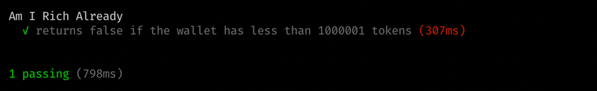
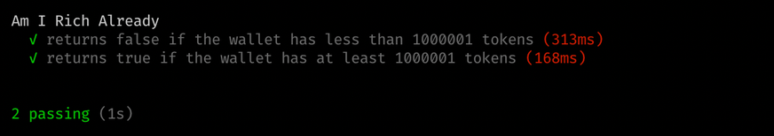
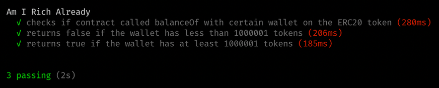

## What is this tutorial about? {#what-is-this-tutorial-about}

In this tutorial you will learn how to:

- use dynamic mocking
- test interactions between smart contracts

Assumptions:

- you already know how to write a simple smart contract in `Solidity`
- you know your way around `JavaScript` and `TypeScript`
- you've done other `Waffle` tutorials or know a thing or two about it

## Dynamic mocking {#dynamic-mocking}

Why is dynamic mocking useful? Well, it allows us to write unit tests instead of integration tests. What does it mean? It means that we don't have to worry about smart contracts' dependencies, thus we can test all of them in complete isolation. Let me show you how exactly you can do it.

### **1. Project** {#1-project}

Before we start we need to prepare a simple node.js project:

```bash
$ mkdir dynamic-mocking
$ cd dynamic-mocking
$ mkdir contracts src

$ yarn init
# or if you're using npm
$ npm init
```

Let's start with adding typescript and test dependencies - mocha & chai:

```bash
$ yarn add --dev @types/chai @types/mocha chai mocha ts-node typescript
# or if you're using npm
$ npm install @types/chai @types/mocha chai mocha ts-node typescript --save-dev
```

Now let's add `Waffle` and `ethers`:

```bash
$ yarn add --dev ethereum-waffle ethers
# or if you're using npm
$ npm install ethereum-waffle ethers --save-dev
```

Your project structure should look like this now:

```
.
├── contracts
├── package.json
└── test
```

### **2. Smart contract** {#2-smart-contract}

To start dynamic mocking, we need a smart contract with dependencies. Don't worry, I've got you covered!

Here's a simple smart contract written in `Solidity` whose sole purpose is to check if we're rich. It uses ERC20 token to check if we have enough tokens. Put it in `./contracts/AmIRichAlready.sol`.

```solidity
pragma solidity ^0.6.2;

interface IERC20 {
    function balanceOf(address account) external view returns (uint256);
}

contract AmIRichAlready {
    IERC20 private tokenContract;
    uint public richness = 1000000 * 10 ** 18;

    constructor (IERC20 _tokenContract) public {
        tokenContract = _tokenContract;
    }

    function check() public view returns (bool) {
        uint balance = tokenContract.balanceOf(msg.sender);
        return balance > richness;
    }
}
```

As we want to use dynamic mocking we don't need the whole ERC20, that's why we're using the IERC20 interface with only one function.

It's time to build this contract! For that we will use `Waffle`. First, we're going to create a simple `waffle.json` config file which specifies compilation options.

```json
{
  "compilerType": "solcjs",
  "compilerVersion": "0.6.2",
  "sourceDirectory": "./contracts",
  "outputDirectory": "./build"
}
```

Now we're ready to build the contract with Waffle:

```bash
$ npx waffle
```

Easy, right? In `build/` folder two files corresponding to the contract and the interface appeared. We will use them later for testing.

### **3. Testing** {#3-testing}

Let's create a file called `AmIRichAlready.test.ts` for the actual testing. First of all, we have to handle the imports. We will need them for later:

```typescript
import { expect, use } from "chai"
import { Contract, utils, Wallet } from "ethers"
import {
  deployContract,
  deployMockContract,
  MockProvider,
  solidity,
} from "ethereum-waffle"
```

Except for JS dependencies, we need to import our built contract and interface:

```typescript
import IERC20 from "../build/IERC20.json"
import AmIRichAlready from "../build/AmIRichAlready.json"
```

Waffle uses `chai` for testing. However, before we can use it, we have to inject Waffle's matchers into chai itself:

```typescript
use(solidity)
```

We need to implement `beforeEach()` function that will reset the state of the contract before each test. Let's first think of what we need there. To deploy a contract we need two things: a wallet and a deployed ERC20 contract to pass it as an argument for the `AmIRichAlready` contract.

Firstly we create a wallet:

```typescript
const [wallet] = new MockProvider().getWallets()
```

Then we need to deploy an ERC20 contract. Here's the tricky part - we have only an interface. This is the part where Waffle comes to save us. Waffle has a magical `deployMockContract()` function that creates a contract using solely the _abi_ of the interface:

```typescript
const mockERC20 = await deployMockContract(wallet, IERC20.abi)
```

Now with both the wallet and the deployed ERC20, we can go ahead and deploy the `AmIRichAlready` contract:

```typescript
const contract = await deployContract(wallet, AmIRichAlready, [
  mockERC20.address,
])
```

With all of that, our `beforeEach()` function is finished. So far your `AmIRichAlready.test.ts` file should look like this:

```typescript
import { expect, use } from "chai"
import { Contract, utils, Wallet } from "ethers"
import {
  deployContract,
  deployMockContract,
  MockProvider,
  solidity,
} from "ethereum-waffle"

import IERC20 from "../build/IERC20.json"
import AmIRichAlready from "../build/AmIRichAlready.json"

use(solidity)

describe("Am I Rich Already", () => {
  let mockERC20: Contract
  let contract: Contract
  let wallet: Wallet

  beforeEach(async () => {
    ;[wallet] = new MockProvider().getWallets()
    mockERC20 = await deployMockContract(wallet, IERC20.abi)
    contract = await deployContract(wallet, AmIRichAlready, [mockERC20.address])
  })
})
```

Let's write the first test to the the `AmIRichAlready` contract. What do you think our test should be about? Yeah, you're right! We should check if we are already rich :)

But wait a second. How will our mocked contract know what values to return? We haven't implemented any logic for the `balanceOf()` function. Again, Waffle can help here. Our mocked contract has some new fancy stuff to it now:

```typescript
await mockERC20.mock.<nameOfMethod>.returns(<value>)
await mockERC20.mock.<nameOfMethod>.withArgs(<arguments>).returns(<value>)
```

With this knowledge we can finally write our first test:

```typescript
it("returns false if the wallet has less than 1000000 tokens", async () => {
  await mockERC20.mock.balanceOf.returns(utils.parseEther("999999"))
  expect(await contract.check()).to.be.equal(false)
})
```

Let's brake down this test into parts:

1. We set our mock ERC20 contract to always return balance of 999999 tokens.
2. Check if the `contract.check()` method returns `false`.

We're ready to fire up the beast:



So the test works, but... there's still some room for improvement. The `balanceOf()` function will always return 99999. We can improve it by specifying a wallet for which the function should return something - just like a real contract:

```typescript
it("returns false if the wallet has less than 1000001 tokens", async () => {
  await mockERC20.mock.balanceOf
    .withArgs(wallet.address)
    .returns(utils.parseEther("999999"))
  expect(await contract.check()).to.be.equal(false)
})
```

So far, we've tested only the case where we're not rich enough. Let's test the opposite instead:

```typescript
it("returns true if the wallet has at least 1000001 tokens", async () => {
  await mockERC20.mock.balanceOf
    .withArgs(wallet.address)
    .returns(utils.parseEther("1000001"))
  expect(await contract.check()).to.be.equal(true)
})
```

You run the tests...



...and here you are! Our contract seems to work as intended :)

## Testing contract calls {#testing-contract-calls}

Let's sum up what've done so far. We've tested the functionality of our `AmIRichAlready` contract and it seems to be working properly. That means we're done, right? Not exactly! Waffle allows us to test our contract even further. But how exactly? Well, in Waffle's arsenal there's a `calledOnContract()` and `calledOnContractWith()` matchers. They will allow us to check if our contract called the ERC20 mock contract. Here's a basic test with one of these matchers:

```typescript
it("checks if contract called balanceOf on the ERC20 token", async () => {
  await mockERC20.mock.balanceOf.returns(utils.parseEther("999999"))
  await contract.check()
  expect("balanceOf").to.be.calledOnContract(mockERC20)
})
```

We can go even further and improve this test with the other matcher I told you about:

```typescript
it("checks if contract called balanceOf with certain wallet on the ERC20 token", async () => {
  await mockERC20.mock.balanceOf
    .withArgs(wallet.address)
    .returns(utils.parseEther("999999"))
  await contract.check()
  expect("balanceOf").to.be.calledOnContractWith(mockERC20, [wallet.address])
})
```

Let's check if the tests are correct:



Great, all tests are green.

Testing contract calls with Waffle is super easy. And here's the best part. These matchers work with both normal and mocked contracts! It is because Waffle records and filters EVM calls rather than inject code, like it is the case of popular testing libraries for other technologies.

## The Finish Line {#the-finish-line}

Congrats! Now you know how to use Waffle to test contract calls and mock contracts dynamically. There are far more interesting features to discover. I recommend diving into Waffle's documentation.

Waffle's documentation is available [here](https://ethereum-waffle.readthedocs.io/).

Source code for this tutorial can be found [here](https://github.com/EthWorks/Waffle/tree/master/examples/dynamic-mocking-and-testing-calls).

Tutorials you may also be interested in:

- [Testing smart contracts with Waffle](/developers/tutorials/testing-smart-contract-with-waffle/)
