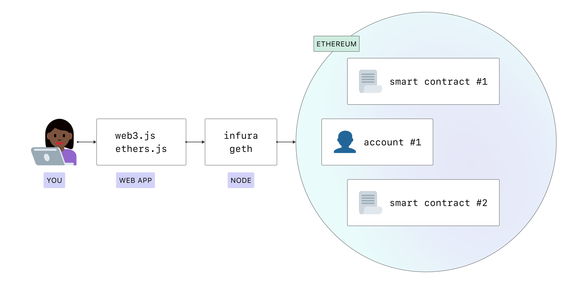

# Nodes and clients

For Ethereum to work in a decentralized way it needs a distributed network of nodes that can verify blocks and transaction data. You need an application, known as a client, on your device to "run" a node.

## Prerequisites

You should understand the concept of a decentralized network before diving deeper and running your own instance of an Ethereum client.

## What are nodes and clients?

"Node" refers to a piece of software known as a client. A client is an implementation of Ethereum that verifies all transactions in each block, keeping the network secure and the data accurate.

You can see a real-time view of the Ethereum network by looking at this [map of nodes](https://etherscan.io/nodetracker).

## Why should I run an Ethereum node?

Running a node allows you to trustlessly and privately use Ethereum while supporting the ecosystem.

### Benefits to you

Running your own node enables you to use Ethereum in a truly private, self-sufficient and trustless manner. You don't need to trust the network because you can verify the data yourself with your client. "Don't trust, verify" is a popular blockchain mantra.

- Your node verifies all the transactions and blocks against consensus rules by itself. This means you don’t have to rely on any other nodes in the network or fully trust them.
- You won't have to leak your addresses and balances to random nodes. Everything can be checked with your own client.
- Your dapp caan be more secure and private if you use your own node. [Metamask](https://metamask.io), [MyEtherWallet](https://myetherwallet.com) and some other wallets can be easily pointed to your own local node.

### Network benefits

A diverse set of nodes is important for Ethereum’s health, security and operational resiliency.

- They provide access to blockchain data for lightweight clients that depend on it. In high peaks of usage, there need to be enough full nodes to help light nodes sync. Light nodes don't store the whole blockchain, instead they verify data via the [state roots in block headers](/en/edn/learn/blocks/#block-anatomy). They can request more information from blocks if they need it.
- Full nodes enforce the proof-of-work consensus rules so they can’t be tricked into accepting blocks that don't follow them. This provides extra security in the network because if all the nodes were light nodes, which don't do full verification, miners could attack the network and, for example, create blocks with higher rewards.

If you run a full node, the whole Ethereum network benefits from it.

## Alternatives

Running own node can be difficult and you don’t always need to run your own instance. In this case, you can use a third party API provider like [Infura](https://infura.io) or [Alchemy](https://alchemyapi.io). Alternatively [ArchiveNode](https://archivenode.io/) is a community-funded Archive node that hopes to bring archive data on the Ethereum blockchain to small time developers who otherwise couldn't afford it.

If somebody runs an Ethereum node with a public API in your community, you can point your light wallets (like MetaMask) to a community node [via Custom RPC](https://metamask.zendesk.com/hc/en-us/articles/360015290012-Using-a-Local-Node) and gain more privacy than with some random tusted third party.

On the other hand, if you run a client, you can share it with your friends who might need it.

## Node types

If you want to run your own node, you should understand that there are different types of node that consume data differently. In fact, clients can run 3 different types of node - light, full and archive. There are also options of different sync strategies which enables faster synchronization time. Synchronization refers to how quickly it can get the most up-to-date information on Ethereum's state.

### Full node

- Stores full blockchain data.
- Participates in block validation, verifies all blocks and states.
- All states can be derived from a full node.
- Serves the network and provides data on request.

### Light node

- Stores the header chain and requests everything else.
- Can verify the validity of the data against the state roots in the block headers.
- Useful for low capacity devices, such as embedded devices or mobile phones, which can't afford to store gigabytes of blockchain data.

### Archive node

- Stores everything kept in the full node and builds an archive of historical states. Needed if you want to query something like an account balance at block #4,000,000.
- These data represent units of terabytes which makes archive nodes less attractive for average users but can be handy for services like block explorers, wallet vendors, and chain analytics.

Syncing clients in any mode other than archive will result in pruned blockchain data. This means, there is no archive of all historical state but the full node is able to build them on demand.

## Choose a client

Ethereum is designed to offer different clients, developed by different teams using different programming languages. This makes the network stronger and more diverse. The ideal goal is to achieve diversity without any client dominating to reduce any single points of failure.

Each client has unique use cases and advantages, so you should choose one based on your own preferences.

This table summarises the different clients. All of them are actively worked on, maintained, and pass [client tests](https://github.com/ethereum/tests).

| Client       | Language | Operating systems     | Networks                                   | Sync strategies         | State pruning   |
| ------------ | -------- | --------------------- | ------------------------------------------ | ----------------------- | --------------- |
| Geth         | Go       | Linux, Windows, macOS | Mainnet, Görli, Rinkeby, Ropsten           | Fast, Full              | Archive, Pruned |
| OpenEthereum | Rust     | Linux, Windows, macOS | Mainnet, Kovan, Ropsten, and more          | Warp, Full              | Archive, Pruned |
| Nethermind   | C#, .NET | Linux, Windows, macOS | Mainnet, Görli, Ropsten, Rinkeby, and more | Fast, Full              | Archive, Pruned |
| Besu         | Java     | Linux, Windows, macOS | Mainnet, Rinkeby, Ropsten, and Görli       | Fast, Full              | Archive, Pruned |
| Trinity      | Python   | Linux, macOS          | Mainnet, Görli, Ropsten, and more          | Full, Beam, Fast/Header | Archive         |

For more on supported networks, read up on [Ethereum networks](/en/edn/learn/networks/).

### Sync modes

- Full – downloads all blocks (including headers, transactions and receipts) and generates the state of the blockchain incrementally by executing every block.
- Fast (Default) – downloads all blocks (including headers, transactions and receipts), verifies all headers, and downloads the state and verifies it against the headers.
- Light – downloads all block headers, block data, and verifies some randomly.
- Warp sync – Every 5,000 blocks, nodes will take a consensus-critical snapshot of that block’s state. Any node can fetch these snapshots over the network, enabling a fast sync. [More on Warp](https://openethereum.github.io/wiki/Warp-Sync-Snapshot-Format)
- Beam sync – A sync mode that allows you to get going faster. It doesn't require long waits to sync, instead it back-fills data over time. [More on Beam](https://medium.com/@jason.carver/intro-to-beam-sync-a0fd168be14a)
- Header sync – you can use a trusted checkpoint to start syncing from a more recent header and then leave it up to a background process to fill the gaps eventually

You define the type of sync when you get set up, like so:

**Setting up light sync in GETH**

`geth --syncmode "light"`

**Setting up header sync in Trinity**

`trinity --sync-from-checkpoint eth://block/byhash/0xa65877df954e1ff2012473efee8287252eee956c0d395a5791f1103a950a1e21?score=15,835,269,727,022,672,760,774`

## Hardware

Hardware requirements differ by client but generally are not that high since the node just need to stay synced. Don't confuse it with mining which requires much more computing power. Sync time and performance do improve with more powerful hardware however. Depending on your needs and wants, Ethereum can be run on your computer, home server, single-board computers or virtual private servers in the cloud.

An easy way to run your own node is using 'plug and play' boxes like [DAppNode](https://dappnode.io/). It provides hardware for running clients and applications that depend on them with a simple user interface.

### Requirements

Before installing any client, please ensure your computer has enough resources to run it. Minimum and recommended requirements can be found below, however the key part is the disk space. Syncing the Ethereum blockchain is very input/output intensive. It is best to have a solid-state drive (SSD). To run an Ethereum client on HDD, you will need at least 8GB of RAM to use as a cache.

#### Minimum requirements

- CPU with 2+ cores
- 4 GB RAM minimum with an SSD, 8 GB+ if you have an HDD
- 8 MBit/s bandwidth

#### Recommended specifications

- Fast CPU with 4+ cores
- 16 GB+ RAM
- Fast SSD with at least 500 GB free space
- 25+ MBit/s bandwidth

Depending on which software and sync mode are you going to use, hundreds of GBs of disk space is need. Approximate numbers and growth can be found below.

| Client       | Disk size (fast sync) | Disk size (full archive) |
| ------------ | --------------------- | ------------------------ |
| Geth         | 400GB+                | 4.7TB+                   |
| OpenEthereum | 280GB+                | 4.6TB+                   |
| Nethermind   | 200GB+                | 3TB+                     |
| Besu         | 750GB+                | 4TB+                     |

These charts show how storage requirements are always changing. For the most up-to-date data for Geth and Parity, see the [full sync data](https://etherscan.io/chartsync/chaindefault) and [archive sync data](https://etherscan.io/chartsync/chainarchive).

### Ethereum on a single-board computer

The most convenient and cheap way of running Ethereum node is to use a single board computer with ARM architecture like Raspberry Pi. [Ethereum on ARM](https://twitter.com/EthereumOnARM) provides images of Geth, Parity, Nethermind, and Besu clients. Here's a simple tutorial on [how to build and setup an ARM client](/en/edn/tutorials/run-node-raspberry-pi/).

Small, affordable and efficient devices like these are ideal for running a node at home.

## Further reading

There is a lot of instructions and information about Ethereum clients on the internet, here are few that might be helpful.

- [Ethereum 101 - Part 2 - Understanding Nodes](https://kauri.io/ethereum-101-part-2-understanding-nodes/48d5098292fd4f11b251d1b1814f0bba/a) _– Wil Barnes, 13 February 2019_
- [Running Ethereum Full Nodes: A Guide for the Barely Motivated](https://medium.com/@JustinMLeroux/running-ethereum-full-nodes-a-guide-for-the-barely-motivated-a8a13e7a0d31) _– Justin Leroux, 7 November 2019_
- [Running an Ethereum Node](https://docs.ethhub.io/using-ethereum/running-an-ethereum-node/) _– ETHHub, updated often_
- [Analyzing the hardware requirements to be an Ethereum full validated node](https://medium.com/coinmonks/analyzing-the-hardware-requirements-to-be-an-ethereum-full-validated-node-dc064f167902) _– Albert Palau, 24 September 2018_
- [Running a Hyperledger Besu Node on the Ethereum Mainnet: Benefits, Requirements, and Setup](https://pegasys.tech/running-a-hyperledger-besu-node-on-the-ethereum-mainnet-benefits-requirements-and-setup/) _– Felipe Faraggi, 7 May 2020_

## Related topics

- [Blocks](/en/edn/learn/blocks/)
- [Networks](/en/edn/learn/network/)
