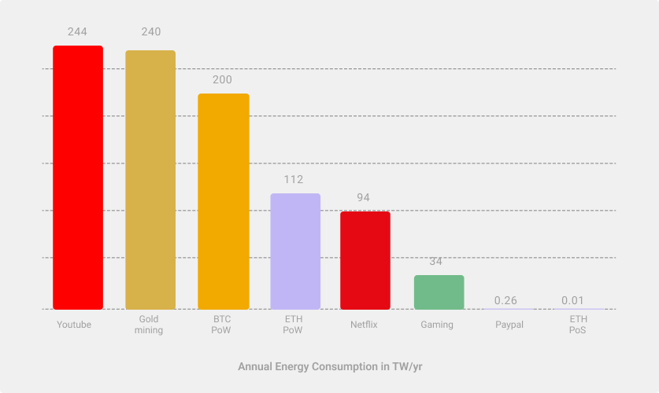

# Ethereum energy consumption {#introduction}

Ethereum's energy consumption will be reduced by ~99.95% following [The Merge](/en/upgrades/merge) from proof-of-work (PoW) to proof-of-stake (PoS). After The Merge, Ethereum will use dramatically less carbon to be more secure.

Since its inception, Ethereum has aimed to implement a proof-of-stake consensus mechanism, but doing this without sacrificing security and decentralization has taken years of focused research and development. Therefore, the network started by using proof-of-work consensus. Proof-of-work consensus requires miners to use their computing hardware to solve a puzzle. The solution to the puzzle proves that energy has been expended by the miner, demonstrating that they invested real-world value for the right to add to the blockchain. Both proof-of-work and proof-of-stake are just mechanisms to decide who gets to add the next block. Swapping proof-of-work for proof-of-stake, where the real-world value invested comes from ETH staked directly in a smart contract, removes the need for miners to burn energy to add to the blockchain. Therefore, the environmental cost of securing the network is drastically reduced.

## The Merge {#the-merge}

[The Beacon Chain](/upgrades/beacon-chain/) has been running the proof-of-stake since November 2020 alongside the proof-of-work Ethereum Mainnet. In 2022, Ethereum developers transitioned several **testing networks (testnets)** running proof-of-stake to proof-of-stake by merging with their own Beacon Chains. These helped client teams test the software before moving to longer-lived networks. After these testnets, Ethereum developers launched new testnets for the community to use (Kiln & Kintsugi) and ran multiple shadow forks of existing testnets and Mainnet. Now that these have stabilized, teams are moving to the final stages of testing: transitioning long-lived testnets (Ropsten, Goerli, Sepolia) to proof-of-stake. Merging Ethereum Mainnet with the Beacon Chain is expected to happen in the second half of 2022. At the moment of the merge, Ethereum's proof-of-work mining will be switched off, proof-of-stake consensus will take over, and the energy consumed by the network will drop to <0.05% of its pre-merge amount.

## Why proof-of-stake is greener than proof-of-work {#why-pos-is-greener-than-pow}

Proof-of-work is a robust way to secure the network. Transactions on the Ethereum blockchain are validated by [miners](/developers/docs/consensus-mechanisms/pow/mining). Miners bundle together transactions into ordered blocks and add them to the Ethereum blockchain. The new blocks get broadcast to all the other node operators who run the transactions independently and verify that they are valid. Any dishonesty shows up as an inconsistency between different nodes. Honest blocks are added to the blockchain and become an immutable part of history.
The ability for any miner to add new blocks only works if there is a cost associated with mining and unpredictability about which specific node submits the next block. These conditions are met by imposing proof-of-work. To be eligible to submit a block of transactions, a miner must be the first to submit the solution to a computationally expensive puzzle. To successfully take control of the blockchain, a dishonest miner would have to consistently win the proof-of-work race by investing in sufficient hardware and energy to outperform the majority of other miners.

This mechanism of securing the network is problematic for several reasons. First, miners can increase their odds of success by investing in more powerful hardware, creating conditions for an arms race with miners acquiring increasingly power-hungry mining equipment. This increases the network's energy consumption and generates hardware waste. Second, Ethereum's proof-of-work protocol currently has a total annualized power consumption approximately equal to that of Finland [^1] and a carbon footprint similar to Switzerland[^1].

Proof-of-stake uses validators instead of miners. Validators perform the same function as miners, except that instead of expending their assets up-front as energy expenditure, they stake ETH as collateral against dishonest behavior. This staked ETH can be destroyed if the validator misbehaves, with more severe penalties for more nefarious actions. This strongly incentivizes active and honest participation in securing the network without requiring large energy expenditure. Since almost all of the energy expended securing the proof-of-work network comes from the mining algorithm, switching to proof-of-stake dramatically reduces energy expenditure. There is also no benefit to be had by investing in more powerful hardware under proof-of-stake, so there is no arms-race condition and less electronic waste. Ethereum validators can run on typical laptops or low-power devices such as [Raspberry Pi](https://ethereum-on-arm-documentation.readthedocs.io/en/latest/user-guide/ethereum2.0.html).

Read more on [how Ethereum implements proof-of-stake](/developers/docs/consensus-mechanisms/pos) and how it compares to proof-of-work.

## Proof-of-stake energy expenditure {#proof-of-stake-energy}

Estimates based on the current Beacon Chain suggest that The Merge to proof-of-stake could result in a 99.95% reduction in total energy use, with proof-of-stake being ~2000x more energy-efficient than proof-of-work. The energy expenditure of Ethereum will be roughly equal to the cost of running a modest laptop for each node on the network.

Many articles estimate "per-transaction" energy expenditure to compare blockchains to other industries. The benefit of this is that it is easy to understand, but the energy required to mine a block is independent of the number of transactions within it. A per transaction unit of energy expenditure implies that fewer transactions would lead to smaller energy expenditure and vice-versa, which is not the case. A per-transaction estimate is highly dependent upon how a blockchain's transaction throughput is defined, and tweaking this definition can be gamed to make the value seem larger or smaller.

For example, on Ethereum, the transaction throughput is not only that of the base layer - it is also the sum of the transaction throughput of all of its "[layer 2](/layer-2/)" rollups, which are not generally included in calculations and would drastically reduce them. This is why tools that compare energy consumption per transaction across platforms are misleading.

More relevant is the overall energy consumption and carbon footprint of the network as a whole. From those values, we can examine what that network offers to its users and society at large and make a more holistic evaluation of whether that energy expenditure is justified or not. Per transaction measurements, on the other hand, imply the value of the network only comes from its role in transferring crypto between accounts and prohibits an honest cost-benefit analysis.

[Digiconomist provides whole-network energy consumption and carbon footprints for Bitcoin and Ethereum](https://digiconomist.net/ethereum-energy-consumption). At the time of writing this article, Ethereum's total energy consumption is ~112 TWh/yr, comparable to that of the Netherlands, with a Carbon emission equivalent to that of Singapore (53 MT/yr). For comparison, Bitcoin currently expends about 200 TWh/yr of energy and emits about 100 MT/yr C, while generating about 32,000 T of electrical waste from obsolete hardware annually. Switching off Ethereum's proof-of-work in favor of proof-of-stake will reduce this energy expenditure by more than 99.95%, implying that the total energy expenditure for securing Ethereum is closer to **0.01 TWh/yr**.

The figure above shows the estimated annual energy consumption in TWh/yr for various industries (retrieved in June 2022).
_Note that the estimates presented in the plot are from publicly available sources that have been linked to in the text below. They are
illustrative and do not represent an official estimate, promise or forecast._

To put Ethereum's energy consumption in context, we can compare annualized estimates for other industries. If we take Ethereum to be a platform for securely holding digital assets as investments, perhaps we can compare to mining gold, which has been estimated to expend about [240 TWh/yr](https://www.kitco.com/news/2021-05-17/Gold-s-energy-consumption-doubles-that-of-bitcoin-Galaxy-Digital.html). As a digital payments platform we could perhaps compare to PayPal (estimated to consume about [0.26 TWh/yr](https://app.impaakt.com/analyses/paypal-consumed-264100-mwh-of-energy-in-2020-24-from-non-renewable-sources-27261)). As an entertainment platform we could perhaps compare to the gaming industry which has been estimated to expend about [34 TW/yr](https://www.researchgate.net/publication/336909520_Toward_Greener_Gaming_Estimating_National_Energy_Use_and_Energy_Efficiency_Potential). Estimates of energy consumption by Netflix range dramatically between [about 0.45TWhr/yr](https://s22.q4cdn.com/959853165/files/doc_downloads/2020/02/0220_Netflix_EnvironmentalSocialGovernanceReport_FINAL.pdf) (their own estimates reported in 2019) up to about 94 TWh/yr (as estimated by [Shift Project](https://theshiftproject.org/en/article/unsustainable-use-online-video/)) - there is some discussion about the assumptions underlying these estimates available on [Carbon Brief](https://www.carbonbrief.org/factcheck-what-is-the-carbon-footprint-of-streaming-video-on-netflix). Alternatively, Ethereum could be compared to Youtube which has been estimated to expend about [244 TWh/yr](https://thefactsource.com/how-much-electricity-does-youtube-use/), although these values depend a lot on the type of device videos are streamed on and the energy-efficiency of underlying infrastructure such as data centers. Estimates of Youtube's energy expenditure have been broken down by channel and individual videos. [Those estimates](https://thefactsource.com/how-much-electricity-does-youtube-use/) imply that people consumed 45 times more energy watching Gangnam Style in 2019 than proof-of-stake Ethereum will use in a year.

## A greener Ethereum {#green-ethereum}

While Ethereum's energy consumption has historically been substantial, there has been a significant investment of developer time and intellect into transitioning from energy-hungry to energy-efficient block production. To quote [Bankless](http://podcast.banklesshq.com/), the best way to reduce the energy consumed by proof-of-work is simply to "turn it off", which is the approach Ethereum has committed to taking.

At the same time, there is a substantial, growing, and highly active **regenerative finance (ReFI)** community building on Ethereum. ReFi applications use DeFi components to build financial applications that have positive externalities benefiting the environment. ReFi is part of a wider "Solarpunk" movement that is closely aligned with Ethereum and aims to couple technological advancement and environmental stewardship. The decentralized, permissionless, composable nature of Ethereum makes it the ideal base layer for the ReFi and solarpunk communities. After The Merge, the technology and philosophy of Ethereum will finally reconcile, and Ethereum should become an environmentally-positive technology.

<InfoBanner emoji=":evergreen_tree:">
  If you think these stats are incorrect or can be made more accurate, please raise an issue or PR. These are estimates by the ethereum.org team made using publicly accessible information and the current Ethereum roadmap. These statements don't represent an official promise from the Ethereum Foundation. 
</InfoBanner>

## Further reading {#further-reading}

- [A country's worth of power, no more](https://blog.ethereum.org/2021/05/18/country-power-no-more/) – _Carl Beekhuizen, May 18 2021_
- [Ethereum's energy consumption](https://mirror.xyz/jmcook.eth/ODpCLtO4Kq7SCVFbU4He8o8kXs418ZZDTj0lpYlZkR8)
- [Ethereum Emissions: A Bottom-up Estimate](https://kylemcdonald.github.io/ethereum-emissions/) _ Kyle McDonald_
- [Ethereum Energy Consumption Index](https://digiconomist.net/ethereum-energy-consumption/) – _Digiconomist_
- [ETHMerge.com](https://ethmerge.com/) — *[@InsideTheSim](https://twitter.com/InsideTheSim)*

## Related topics {#related-topics}

- [Ethereum's vision](/upgrades/vision/)
- [The Beacon Chain](/upgrades/beacon-chain)
- [The Merge](/upgrades/merge/)
- [Sharding](/upgrades/beacon-chain/)
