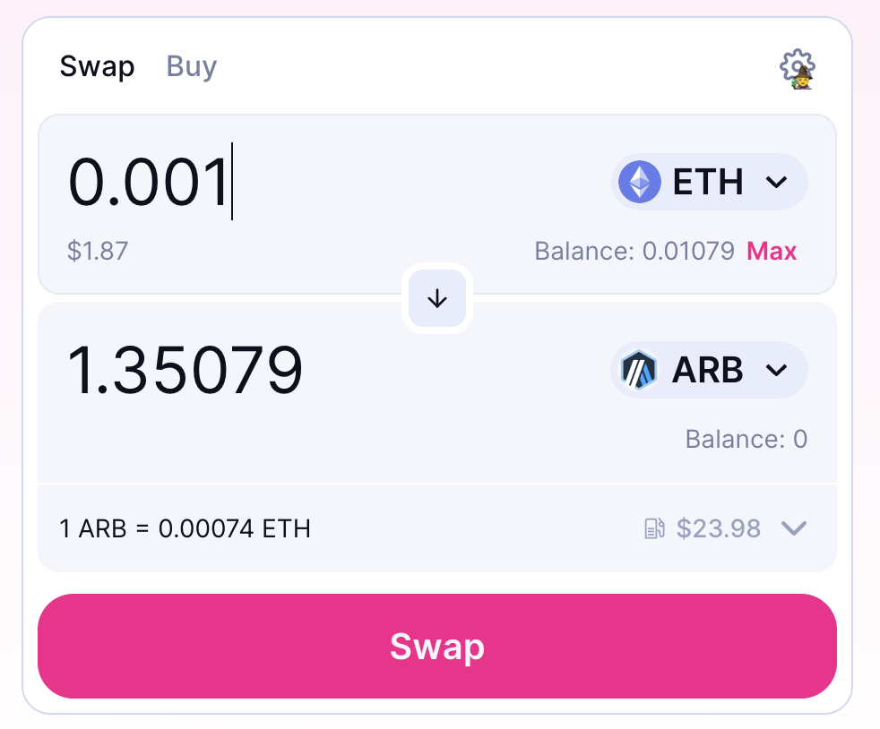
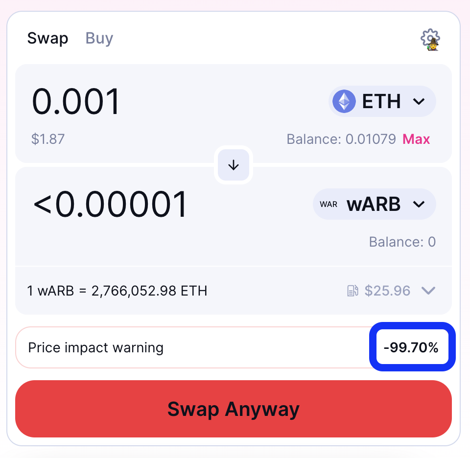

# How to identify scam tokens

One of the most common uses for Ethereum is for a group to create a tradable token, in a sense their own currency. These tokens typically follow a standard, [ERC-20](/developers/docs/standards/tokens/erc-20/). However, anywhere they are legitimate use cases that bring value, there are also criminals who try to steal that value for themselves. In this case, there are two way in which they are likely to do so:

- Try to sell you *scam tokens*, which look like the legitimate token you want to purchase, but are issued by the scammers and worthless.
- Try to direct you into their own user interface, where they attempt to trick you into signing transactions that give them your ETH, your real tokens, etc. 

To illustrate what scam tokens are, and how to identify them, we are going to look at [`wARB`](https://etherscan.io/token/0xb047c8032b99841713b8e3872f06cf32beb27b82). This token attempts to look like the legitimate [`ARB`](https://etherscan.io/address/0xb50721bcf8d664c30412cfbc6cf7a15145234ad1) token.

<ExpandableCard
title="What is `ARB`?"
contentPreview=''>

[Arbitrum](https://developer.arbitrum.io/intro/) is an organization that runs and manages an [optimistic rollup](/developers/docs/scaling/optimistic-rollups/). Initially Arbitrum was organized as a for-profit company, but they recently [started to decentralize](https://arbitrumfoundation.medium.com/arbitrum-the-next-phase-of-decentralization-e7f8b37b5226). As part of that process, they issued a tradeable [governance token](/dao/#token-based-membership).

</ExpandableCard>

<ExpandableCard
title="Why is the scam token called `wARB`?"
contentPreview=''>
  
There is a convention in Ethereum that when an asset is not ERC-20 compliant we create a "wrapped" version of it with the name starting with `w`. So, for example, we have [`wBTC` for Bitcoin](https://wbtc.network/) and [`wETH` for Ether](https://cointelegraph.com/news/what-is-wrapped-ethereum-weth-and-how-does-it-work).
  
It does not make sense to create a wrapped version of an ERC-20 token that is already on Ethereum, but scammers rely on the appearance of legitimacy rather than underlying reality.

</ExpandableCard>

## How do scam tokens work?

The whole point of Ethereum is decentralization. This means that there is no central authority that can confiscate your assets or prevent you from deploying a smart contract. But it also means that scammers can deploy any smart contract they wish.

<ExpandableCard
title="What are smart contracts?"
contentPreview=''>
  
[*Smart contracts*](/developers/docs/smart-contracts/) are the programs that run on top of the Ethereum blockchain. Each ERC-20 token, for example, is implemented as a smart contract.
  
</ExpandableCard>

Specifically, just because Arbitrum deployed a contract that uses the symbol `ARB`, doesn't mean that other people can't also deploy a contract that uses the exact same symbol, or a similar one. And whoever writes the contract gets to set what the contract will do.

## Appearing legitimate

There are several tricks that scam token creator pull to appear legitimate. They can do those, because they write the smart contract that implements the scam token. This means it can produce any effect they want from that contract.

- **Legitimate name and symbol**. As mentioned before, ERC-20 contracts can have the same symbol and name as other ERC-20 contracts. You cannot count on those fields for security.

- **Legitimate owners**. Scam tokens often airdrop significant balances to addresses that can be expected to be legitimate holders of the real token.

  For example, lets look at `wARB` again. [About 16% of the tokens](https://etherscan.io/token/0xb047c8032b99841713b8e3872f06cf32beb27b82?a=0x1c8db745abe3c8162119b9ef2c13864cd1fdd72f) are held by an address whose public tag is [Arbitrum Foundation: Deployer](https://etherscan.io/address/0x1c8db745abe3c8162119b9ef2c13864cd1fdd72f). This is *not* a fake address, it really is the address that [deployed the real ARB contract on Ethereum mainnet](https://etherscan.io/tx/0x242b50ab4fe9896cb0439cfe6e2321d23feede7eeceb31aa2dbb46fc06ed2670). The ERC-20 balance of an address is part of the ERC-20 contract's storage, and can be specified by the contract to be whatever the contract developer wishes.

- **Legitimate transfers**. *Legitimate owners wouldn't pay to transfer a scam token around, so if there are transfers it must be legitimate, right?* Wrong. `Transfer` events are emitted by the ERC-20 contract. A scammer can easily write the contract in such a way it will emit those events, with any desired source and destination, at will. 

<ExpandableCard
title="What are `Transfer` events?"
contentPreview=''>
  
In theory a program running offchain can view all the transactions that affected a particular ERC-20 contract from its initial deployment, and use that to identify transfers. In practice, doing this would require too much network bandwidth and CPU power. To allow for simpler analysis, ERC-20 contracts are [required by the standard](https://eips.ethereum.org/EIPS/eip-20#transfer-1) to emit events tagged as transfers whenever tokens are transferred from one account to another. [Events](https://docs.alchemy.com/docs/deep-dive-into-eth_getlogs#what-are-logs-or-events) are written to the blockchain and indexed, which makes it a lot easier to obtain and analyse onchain data.
  
</ExpandableCard>

## Scammy UI

Another trick that scammers pull is to direct users to user interfaces that entice them to sign bad transactions. For example, [this scam token](https://optimistic.etherscan.io/token/0x15992f382d8c46d667b10dc8456dc36651af1452) tried to direct users to `https://op-claim.xyz`. This probably used to host a scam, but since then the scammer must have given up and stopped paying for web hosting.

## Conclusion: What can you trust?

How do you protect yourself? How do you know that the token you're getting is legitimate? The most important rule is **check the contract address**. Legitimate tokens come from legitimate organizations, and you can see the contract addresses on the organization's web site. For example, [for `ARB` you can see the legitimate addresses here](https://docs.arbitrum.foundation/deployment-addresses#token). 

**Liquidity pools**

Additionally, you can look at the size of liquidity pools. Scam tokens typically have tiny liquidity pools, if any, because the scammers don't want to risk real assets. For example, the `ARB` Uniswap pool holds over 300k$ as I'm writing this ([see here for the up to date value](https://info.uniswap.org/#/tokens/0xb50721bcf8d664c30412cfbc6cf7a15145234ad1)) and buying a small amount is not going to change the price:

**Explain buying on Uniswap**

But if I try to buy `vARB`, even a tiny purchase would change the prince by over 90%:

