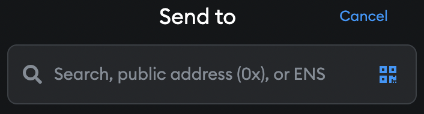
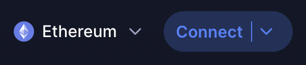
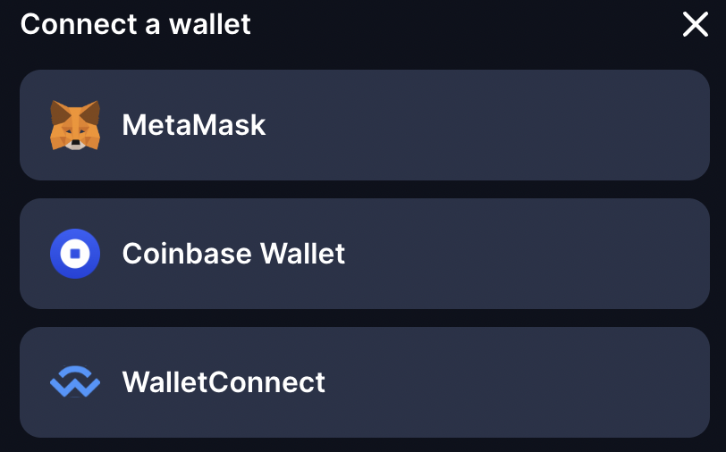

# How to use a wallet

Learn how to operate all the basic functions of a wallet. If you don’t have one yet, check out our [How to: "Register" an Ethereum account](/guides/how-to-register-an-ethereum-account/).

## Open your wallet

You should see a dashboard that will likely show your balance and contain buttons to send and receive tokens.

## Receive cryptocurrency

Do you want to receive crypto into your wallet?

Each Ethereum account has its own receiving address which is a unique sequence of numbers and letters. The address functions like a bank account number. Ethereum addresses will always start with “0x”.

You need to provide the sender with your receiving address. Many wallet apps let you copy to clipboard the address or show a QR code to scan for easier usage. Avoid typing any Ethereum address manually. This is unsafe, and can easily lead to clerical errors and lost funds.

This is a general pattern, and different apps may vary or use different language. It should also be similar process if you are trying to send your funds from an exchange.

1. Open your wallet app.
2. Click on "Receive" or similarly worded option on the dashboard
3. Copy your Ethereum address to clipboard.
4. Provide the sender with your receiving Ethereum address.

## Send cryptocurrency

Would you like to send ETH to another wallet?

1. Prepare the receiving address and the network of the recipient.
2. Open your wallet app.
3. Click on a “Send” button on the dashboard of your wallet or similarly worded alternative.
4. Enter the receiving address or scan a QR code with your camera so that you don’t have to write the address manually.

 

5. Many assets, like DAI or USDC, exist on multiple networks. When transferring crypto tokens, make sure that the recipient is using the same network as you are, since these are not interchangeable.
6. Ensure that your wallet has sufficient ETH to cover the transaction fee which varies depending on network conditions. Most wallets will automatically add the suggested fee to the transaction which you can then confirm.
7. Once your transaction is processed, the corresponding crypto amount will show up in the recipient’s account. This might take anywhere from a few seconds to a few minutes depending on network transaction prioritisation.

## Connecting to projects

Your address represents you on all Ethereum projects. You will not need to register individually on any project. Once you have a wallet, you can connect to any Ethereum project without any additional information. No emails or any other personal information are needed.

1. Visit any project’s website.
2. If the project's landing page is just a static description of the project, you should be able to click on an "Open the App" button in the menu which will navigate you to the actual web app.
3. Once you are in the app click on “Connect”

4. Select your wallet from the provided options list. If you can't see your wallet, it may be hidden under the “WalletConnect” option.

5. Confirm the signature request in your wallet to establish the connection. Do note that signing this message should not require spending any ETH.
6. That's it! Start using the app. You can find some interesting projects on our [dApps page](/dapps/#explore).

<InfoBanner shouldSpaceBetween emoji=":eyes:">
  
Want to learn more?

  <ButtonLink to="/guides/">
    See our other guides
  </ButtonLink>
</InfoBanner>

## Frequently asked questions

### If I own an ETH address, do I own the same address on other blockchains?

You can use the same address on all EVM compatible blockchains (if you have the type of wallet with a recovery phrase). This [list](https://chainlist.org/) will show you which blockchains you can use with the same address. Some blockchains, like Bitcoin, implement a completely separate set of network rules and you will need a different address with a different format. If you have a smart contract wallet you should check its product website for more info on which blockchains are supported.

### Can I use the same address on multiple devices?

Yes you can use the same address on multiple devices. Wallets are technically only an interface to show you your balance and to make transactions, your account isn't stored inside the wallet, but on the blockchain.

### I have not received the crypto, where can I check the status of a transaction?

You can use [block explorers](https://ethereum.org/en/developers/docs/data-and-analytics/block-explorers/) to see the status of any transaction in real time. All you need to do is to search your wallet address or the ID of the transaction.

### Can I cancel or return transactions?

No, once a transaction is confirmed, you can not cancel the transaction.
