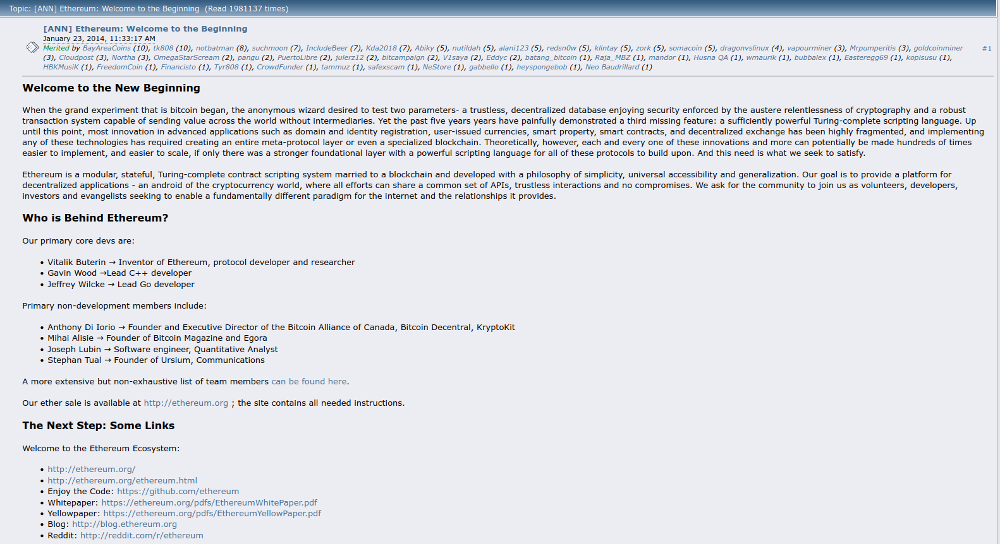

# The history of Ethereum {#the-history-of-ethereum}

A timeline of protocol upgrades since Ethereum's inception is provided later on this page. First, the early history of Ethereum is explored in some detail, from Ethereum's inception to its first production release (Homestead).

## Inception {#inception}

Ethereum was initially described by Vitalik Buterin in late 2013 as a result of his research and work in the Bitcoin community. Shortly thereafter, Vitalik published the [Ethereum white paper](/whitepaper/whitepaper-pdf), where he described in detail the technical design and rationale for the Ethereum protocol and smart contracts architecture. In January 2014, Ethereum was formally announced by Vitalik at the The North American Bitcoin Conference in Miami, Florida, USA.

_Vitalik Buterin's announcement for the launch of Ethereum on [bitcointalk.org](https://bitcointalk.org/index.php?topic=428589.0)_

Around that time, Vitalik also started working with Dr. Gavin Wood. In April 2014, Gavin published the [Ethereum Yellow Paper](https://ethereum.github.io/yellowpaper/paper.pdf) that would serve as the technical specification for the Ethereum Virtual Machine (EVM). By following the detailed specification in the Yellow Paper, Ethereum clients were implemented in seven programming languages (C++, Go, Python, Java, JavaScript, Haskell, Rust) by 2016, some of which have since been deprecated.

## The Ethereum Foundation and ether presale {#foundation-and-presale}

In addition to developing the software for Ethereum, the ability to launch a new cryptocurrency and blockchain requires a massive bootstrapping effort in order to assemble the resources needed to get it up and running. To kickstart a large network of developers, miners, investors, and other stakeholders, Ethereum announced its plan to conduct a presale of ether tokens, the currency unit of Ethereum. The legal and financial complexities of raising funds through a presale led to the creation of several legal entities, including the Ethereum Foundation (Stiftung Ethereum) established June 2014 in Zug, Switzerland.

Beginning in July 2014, Ethereum distributed the initial allocation of ether via a 42-day public ether presale, netting 31,591 bitcoins, worth $18,439,086 at that time, in exchange for about 60,102,216 ether. The results of the sale were initially used to pay back mounting legal debts and also for the months of developer effort that had yet to be compensated, and to finance the ongoing development of the Ethereum.

- [Official announcement of the ether sale](https://blog.ethereum.org/2014/07/22/launching-the-ether-sale)

- [Slacknation ether sale report](https://medium.com/@slacknation/overview-ethereum-s-initial-public-sale-563c05e95501)

- [Presale T&Cs](https://www.cryptocompare.com/media/1383735/pdfs-termsandconditionsoftheethereumgenesissale.pdf)

## ETH/DEV and Ethereum development {#development}

Following the successful ether presale, Ethereum development was formalized under a non-for-profit organization called ETH DEV, which managed the development of Ethereum under contract from Ethereum Suisse – with Vitalik Buterin, Gavin Wood, and Jeffrey Wilcke as the 3 directors of the organization. Developer interest in Ethereum grew steadily throughout 2014 and the ETH DEV team delivered a series of proof-of-concept (PoC) releases for the development community to evaluate. Frequent posts by ETH DEV team on the the Ethereum blog also kept the excitement and momentum around Ethereum going. Increasing traffic and growing user-base on both the Ethereum forum and the ethereum subreddit testified that the platform is attracting a fast-growing and devoted developer community. This trend has been continuing to this very day.

## DEVCON-0 {#devcon-0}

In November 2014, ETH DEV organized the DEVCON-0 event, which brought together Ethereum developers from around the world to Berlin to meet and discuss a diverse range of Ethereum technology topics. Several of the presentations and sessions at DEVCON-0 would later drive important initiatives to make Ethereum more reliable, more secure, and more scalable. Overall, the event galvanized developers as they continued to work towards the launch of Ethereum.

[DEVCON-0 talks youtube playlist](https://www.youtube.com/watch?v=_BvvUlKDqp0&list=PLJqWcTqh_zKEjpSej3ddtDOKPRGl_7MhS)
[DEVCON-0 reddit post](https://www.reddit.com/r/ethereum/comments/2nle7m/community_update_whats_going_on_devcon0/)
[Gav’s DEV update mentioning DEVCON-0](https://blog.ethereum.org/2014/11/18/gavs-d%CE%BEv-update-iii/)
[DEVcon-0 recap blog post](https://blog.ethereum.org/2014/12/05/d%CE%BEvcon-0-recap/)

## Olympic testnet, bug bounty and security audit {#olympic-testnet}

Throughout 2014 and 2015 development went through a series of proof of concept releases leading to the 9th POC open testnet, called Olympic. The developer community was invited to test the limits of the network and a substantial prize fund was allocated to award those holding various records or having success in breaking the system in some way or other. The rewards were announced officially a month after the live release.

In early 2015, an Ethereum Bounty Program was launched, offering BTC rewards for finding vulnerabilities in any part of the Ethereum software stack. This has undoubtedly contributed to the reliability and security of Ethereum and the confidence of the Ethereum community in the technology. The bounty program is currently still active.

The Ethereum security audit began at the end of 2014 and continued through the first half of 2015. Ethereum engaged multiple third party software security firms to conduct an end-to-end audit of all protocol-critical components (Ethereum VM, networking, Proof of Work). The audits uncovered security issues that were addressed and tested again and as a result ultimately led to a more secure platform.

[Olympic testnet prerelease](https://blog.ethereum.org/2015/05/09/olympic-frontier-pre-release/)
[Olympic rewards announced](https://blog.ethereum.org/2015/08/26/olympic-rewards-announced/)
[Bug bounty program launch](https://blog.ethereum.org/2015/03/20/juttas-update-bug-bounty-program-security-audit/)
[Least Authority audit blogpost](https://blog.ethereum.org/2015/07/07/know-ethereum-secure/)

## The Ethereum Frontier launch {#frontier-launch}

The Ethereum Frontier network launched on July 30th, 2015, and developers began writing smart contracts and decentralized apps to deploy on the live Ethereum network. In addition, miners began to join the Ethereum network to help secure the Ethereum blockchain and earn ether from mining blocks. Even though the Frontier release is the first milestone in the Ethereum project and was intended for use by developers as a beta version, it turned out to be more capable and reliable than anyone expected, and developers rushed in to build solutions and improve the Ethereum ecosystem.

[Original announcement of the release scheme by Vinay Gupta](https://blog.ethereum.org/2015/03/03/ethereum-launch-process/)
[Frontier is coming - Frontier launch announcement by Stephan Tual](https://blog.ethereum.org/2015/07/22/frontier-is-coming-what-to-expect-and-how-to-prepare/)
[Frontier launch final steps - Follow-up post to announcement](https://blog.ethereum.org/2015/07/27/final-steps/)
[Ethereum goes live with Frontier launch](https://blog.ethereum.org/2015/07/30/ethereum-launches/)
[The frontier website](https://web.archive.org/web/20160207033817/https://ethereum.org/)

## DEVCON-1 {#devcon-1}

The second developers’ conference DEVCON-1 took place in the city of London at the beginning of November 2015. The 5-day event featured more than 100 presentations, panel discussions and lightning talks, attracted more than 400 participants, a mix of developers, entrepreneurs, thinkers, and business executives. The talks were all recorded and are freely available

The presence of large companies like UBS, IBM and Microsoft clearly indicated enterprise interest in the technology. Microsoft announced that it would offer Ethereum on its new Blockchain as a Service offering on the Microsoft Azure cloud platform. In conjunction with DEVCON-1, this announcement will be remembered as the moment when blockchain technology became mainstream, with Ethereum at the center of it.

[DEVCON-1 talks Youtube playlist](https://www.youtube.com/playlist?list=PLJqWcTqh_zKHQUFX4IaVjWjfT2tbS4NVk)

## The Homestead Release {#homestead-release}

Homestead was the second major version of the Ethereum platform and the first production release of Ethereum. It includes several protocol changes and a networking change that provides the ability to do further network upgrades. The first version of Ethereum, called the Frontier release, was essentially a beta release that allowed developers to learn, experiment, and begin building Ethereum decentralized apps and tools.

At this point Ethereum was a production network. Since the Homestead release Ethereum has undergone many significant changes. These are enumnerated in the Timeline section below. There will also be mroe changes to ethereum in the future. The [merge](/upgrades/merge), expected in summer 2022, will arguably be the most substantial upgrade since inception. Further upgrades beyond the merge are sketched out in the Ethereum [roadmap](https://ethereum-magicians.org/t/a-rollup-centric-ethereum-roadmap/4698).

# Upgrade Timeline {#upgrade-timeline}

Below is a timeline of all the major milestones, forks, and updates to the Ethereum blockchain with the most recent first. To explore future protocol upgrades visit our [upgrades page](/upgrades/).

<ExpandableCard title="What are forks?" contentPreview="Changes to the rules of the Ethereum protocol which often include planned technical upgrades.">

Forks are when major technical upgrades or changes need to be made to the network – they typically stem from [Ethereum Improvement Proposals (EIPs)](/eips/) and change the "rules" of the protocol.

When upgrades are needed in traditional, centrally-controlled software, the company will just publish a new version for the end-user. Blockchains work differently because there is no central ownership. [Ethereum clients](/developers/docs/nodes-and-clients/) must update their software to implement the new fork rules. Plus block creators (miners in a proof-of-work world, validators in a proof-of-stake world) and nodes must create blocks and validate against the new rules. [More on consensus mechanisms](/developers/docs/consensus-mechanisms/)

These rule changes may create a temporary split in the network. New blocks could be produced according to the new rules or the old ones. Forks are usually agreed upon ahead of time so that clients adopt the changes in unison and the fork with the upgrades becomes the main chain. However, in rare cases, disagreements over forks can cause the network to permanently split – most notably the creation of Ethereum Classic with the [DAO fork](#dao-fork).

</ExpandableCard>

<Divider />

## 2021 {#2021}

### Arrow Glacier {#arrow-glacier}

<Emoji text=":calendar:" size={1} mr={"0.5rem"} mb={"0.5rem"} /><code>Dec-09-2021 07:55:23 PM +UTC</code> 
<Emoji text=":bricks:" size={1} mr={"0.5rem"} mb={"0.5rem"} />Block number: <a href="https://etherscan.io/block/13773000">13,773,000</a> 
<Emoji text=":money_bag:" size={1} mr={"0.5rem"} mb={"0.5rem"} />ETH price: $4111 USD 
<Emoji text=":desktop_computer:" size={1} mr={"0.5rem"} mb={"0.5rem"} /> <a href="https://web.archive.org/web/20211207064430/https://ethereum.org/en/">ethereum.org on waybackmachine</a>

#### Summary {#arrow-glacier-summary}

The Arrow Glacier network upgrade pushed back the [difficulty bomb](/glossary/#difficulty-bomb) by several months. This is the only change introduced in this upgrade, and is similar in nature to the [Muir Glacier](#muir-glacier) upgrade. Similar changes have been performed on the [Byzantium](#byzantium), [Constantinople](#constantinople) and [London](#london) network upgrades.

- [EF Blog - Arrow Glacier Upgrade Announcement](https://blog.ethereum.org/2021/11/10/arrow-glacier-announcement/)
- [Ethereum Cat Herders - Ethereum Arrow Glacier Upgrade](https://medium.com/ethereum-cat-herders/ethereum-arrow-glacier-upgrade-e8d20fa4c002)

<ExpandableCard title="Arrow Glacier EIPs" contentPreview="Official improvements included in this upgrade.">

- [EIP-4345](https://eips.ethereum.org/EIPS/eip-4345) – _delays the difficulty bomb until June 2022_

</ExpandableCard>

#### <Emoji text=":police_car_light:" size={1} mr="0.5rem" />Node operators {#arrow-glacier-node-operators}

Be sure to upgrade your client software to the latest version before December 5, 2021 to account for variable block times. This will help avoid having your client sync to a pre-fork chain, resulting in the inability to send funds or properly verify transactions.

---

### Altair {#altair}

<Emoji text=":calendar:" size={1} mr={"0.5rem"} mb={"0.5rem"} /><code>Oct-27-2021 10:56:23 AM +UTC</code> 
<Emoji text=":bricks:" size={1} mr={"0.5rem"} mb={"0.5rem"} />Epoch number: 74,240 
<Emoji text=":money_bag:" size={1} mr={"0.5rem"} mb={"0.5rem"} />ETH price: $4024 USD 
<Emoji text=":desktop_computer:" size={1} mr={"0.5rem"} mb={"0.5rem"} /> <a href="https://web.archive.org/web/20211026174951/https://ethereum.org/en/">ethereum.org on waybackmachine</a>

#### Summary {#altair-summary}

The Altair upgrade was the first scheduled upgrade for the [Beacon Chain](/upgrades/beacon-chain). It added support for "sync committees"—enabling light clients, and bringing validator inactivity and slashing penalties up to their full values.

- [Read the Altair upgrade specification](https://github.com/ethereum/consensus-specs/tree/dev/specs/altair)

#### <Emoji text=":tada:" size={1} mr="0.5rem" />Fun fact! {#altair-fun-fact}

Altair was the first major network upgrade that had an exact rollout time. Every upgrade prior had been based on a declared block number on the proof-of-work chain, where block times vary. The Beacon Chain does not require solving for proof-of-work, and instead works on a time-based epoch system consisting of 32 twelve-second "slots" of time where validators can propose blocks. This is why we knew exactly when we would hit epoch 74,240 and Altair became live!

- [Beaconcha.in Glossary - Slots](https://kb.beaconcha.in/glossary#slots)

---

### London {#london}

<Emoji text=":calendar:" size={1} mr={"0.5rem"} mb={"0.5rem"} /> <code>Aug-05-2021 12:33:42 PM +UTC</code> 
<Emoji text=":bricks:" size={1} mr={"0.5rem"} mb={"0.5rem"} /> Block number: <a href="https://etherscan.io/block/12965000">12,965,000</a> 
<Emoji text=":money_bag:" size={1} mr={"0.5rem"} mb={"0.5rem"} /> ETH price: $2621 USD 
<Emoji text=":desktop_computer:" size={1} mr={"0.5rem"} mb={"0.5rem"} /> <a href="https://web.archive.org/web/20210805124609/https://ethereum.org/en/">ethereum.org on waybackmachine</a>

#### Summary {#london-summary}

The London upgrade introduced [EIP-1559](https://eips.ethereum.org/EIPS/eip-1559), which reformed the transaction fee market, along with changes to how gas refunds are handled and the [Ice Age](/glossary/#ice-age) schedule.

- [Are you a dApp developer? Be sure to upgrade your libraries and tooling.](https://github.com/ethereum/eth1.0-specs/blob/master/network-upgrades/ecosystem-readiness.md)
- [Read the Ethereum Foundation announcement](https://blog.ethereum.org/2021/07/15/london-mainnet-announcement/)
- [Read the Ethereum Cat Herder's explainer](https://medium.com/ethereum-cat-herders/london-upgrade-overview-8eccb0041b41)

<ExpandableCard title="London EIPs" contentPreview="Official improvements included in this upgrade.">

- [EIP-1559](https://eips.ethereum.org/EIPS/eip-1559) – _improves the transaction fee market_
- [EIP-3198](https://eips.ethereum.org/EIPS/eip-3198) – _returns the `BASEFEE` from a block_
- [EIP-3529](https://eips.ethereum.org/EIPS/eip-3529) - _reduces gas refunds for EVM operations_
- [EIP-3541](https://eips.ethereum.org/EIPS/eip-3541) - _prevents deploying contracts starting with `0xEF`_
- [EIP-3554](https://eips.ethereum.org/EIPS/eip-3554) – _delays the Ice Age until December 2021_

</ExpandableCard>

---

### Berlin {#berlin}

<Emoji text=":calendar:" size={1} mr={"0.5rem"} mb={"0.5rem"} /> <code>Apr-15-2021 10:07:03 AM +UTC</code> 
<Emoji text=":bricks:" size={1} mr={"0.5rem"} mb={"0.5rem"} /> Block number: <a href="https://etherscan.io/block/12244000">12,244,000</a> 
<Emoji text=":money_bag:" size={1} mr={"0.5rem"} mb={"0.5rem"} /> ETH price: $2454 USD 
<Emoji text=":desktop_computer:" size={1} mr={"0.5rem"} mb={"0.5rem"} /> <a href="https://web.archive.org/web/20210415093618/https://ethereum.org/">ethereum.org on waybackmachine</a>

#### Summary {#berlin-summary}

The Berlin upgrade optimized gas cost for certain EVM actions, and increases support for multiple transaction types.

- [Read the Ethereum Foundation announcement](https://blog.ethereum.org/2021/03/08/ethereum-berlin-upgrade-announcement/)
- [Read the Ethereum Cat Herder's explainer](https://medium.com/ethereum-cat-herders/the-berlin-upgrade-overview-2f7ad710eb80)

<ExpandableCard title="Berlin EIPs" contentPreview="Official improvements included in this upgrade.">

- [EIP-2565](https://eips.ethereum.org/EIPS/eip-2565) – _lowers ModExp gas cost_
- [EIP-2718](https://eips.ethereum.org/EIPS/eip-2718) – _enables easier support for multiple transaction types_
- [EIP-2929](https://eips.ethereum.org/EIPS/eip-2929) – _gas cost increases for state access opcodes_
- [EIP-2930](https://eips.ethereum.org/EIPS/eip-2930) – _adds optional access lists_

</ExpandableCard>

<Divider />

## 2020 {#2020}

### Beacon Chain genesis {#beacon-chain-genesis}

<Emoji text=":calendar:" size={1} mr={"0.5rem"} mb={"0.5rem"} /> <code>Dec-01-2020 12:00:35 PM +UTC</code> 
<Emoji text=":bricks:" size={1} mr={"0.5rem"} mb={"0.5rem"} /> Beacon Chain block number: <a href="https://beaconscan.com/slot/1">1</a> 
<Emoji text=":money_bag:" size={1} mr={"0.5rem"} mb={"0.5rem"} /> ETH price: $586.23 USD 
<Emoji text=":desktop_computer:" size={1} mr={"0.5rem"} mb={"0.5rem"} /> <a href="https://web.archive.org/web/20201207184633/https://www.ethereum.org/en/">ethereum.org on waybackmachine</a>

#### Summary {#beacon-chain-genesis-summary}

The [Beacon Chain](/upgrades/beacon-chain/) needed 16384 deposits of 32 staked ETH to ship securely. This happened on November 27, meaning the Beacon Chain started producing blocks on December 1, 2020. This is an important first step in achieving the [Ethereum vision](/upgrades/vision/).

[Read the Ethereum Foundation announcement](https://blog.ethereum.org/2020/11/27/eth2-quick-update-no-21/)

<DocLink to="/upgrades/beacon-chain/">
  The Beacon Chain
</DocLink>

---

### Staking deposit contract deployed {#staking-deposit-contract}

<Emoji text=":calendar:" size={1} mr={"0.5rem"} mb={"0.5rem"} /> <code>Oct-14-2020 09:22:52 AM +UTC</code> 
<Emoji text=":bricks:" size={1} mr={"0.5rem"} mb={"0.5rem"} /> Block number: <a href="https://etherscan.io/block/11052984">11,052,984</a> 
<Emoji text=":money_bag:" size={1} mr={"0.5rem"} mb={"0.5rem"} /> ETH price: $379.04 USD 
<Emoji text=":desktop_computer:" size={1} mr={"0.5rem"} mb={"0.5rem"} /> <a href="https://web.archive.org/web/20201104235727/https://ethereum.org/en/">ethereum.org on waybackmachine</a>

#### Summary {#deposit-contract-summary}

The staking deposit contract introduced [staking](/glossary/#staking) to the Ethereum ecosystem. Although a [Mainnet](/glossary/#mainnet) contract, it had a direct impact on the timeline for launching the [Beacon Chain](/upgrades/beacon-chain/), an important [Ethereum upgrade](/upgrades/).

[Read the Ethereum Foundation announcement](https://blog.ethereum.org/2020/11/04/eth2-quick-update-no-19/)

<DocLink to="/staking/">
  Staking
</DocLink>

---

### Muir Glacier {#muir-glacier}

<Emoji text=":calendar:" size={1} mr={"0.5rem"} mb={"0.5rem"} /> <code>Jan-02-2020 08:30:49 AM +UTC</code> 
<Emoji text=":bricks:" size={1} mr={"0.5rem"} mb={"0.5rem"} /> Block number: <a href="https://etherscan.io/block/9200000">9,200,000</a> 
<Emoji text=":money_bag:" size={1} mr={"0.5rem"} mb={"0.5rem"} /> ETH price: $127.18 USD 
<Emoji text=":desktop_computer:" size={1} mr={"0.5rem"} mb={"0.5rem"} /> <a href="https://web.archive.org/web/20200103093618/https://ethereum.org/">ethereum.org on waybackmachine</a>

#### Summary {#muir-glacier-summary}

The Muir Glacier fork introduced a delay to the [difficulty bomb](/glossary/#difficulty-bomb). Increases in block difficulty of the [proof-of-work](/developers/docs/consensus-mechanisms/pow/) consensus mechanism threatened to degrade the usability of Ethereum by increasing wait times for sending transactions and using dapps.

- [Read the Ethereum Foundation announcement](https://blog.ethereum.org/2019/12/23/ethereum-muir-glacier-upgrade-announcement/)
- [Read the Ethereum Cat Herder's explainer](https://medium.com/ethereum-cat-herders/ethereum-muir-glacier-upgrade-89b8cea5a210)

<ExpandableCard title="Muir Glacier EIPs" contentPreview="Official improvements included in this fork.">

- [EIP-2384](https://eips.ethereum.org/EIPS/eip-2384) – _delays the difficulty bomb for another 4,000,000 blocks, or ~611 days._

</ExpandableCard>

<Divider />

## 2019 {#2019}

### Istanbul {#istanbul}

<Emoji text=":calendar:" size={1} mr={"0.5rem"} mb={"0.5rem"} /> <code>Dec-08-2019 12:25:09 AM +UTC</code> 
<Emoji text=":bricks:" size={1} mr={"0.5rem"} mb={"0.5rem"} /> Block number: <a href="https://etherscan.io/block/9069000">9,069,000</a> 
<Emoji text=":money_bag:" size={1} mr={"0.5rem"} mb={"0.5rem"} /> ETH price: $151.06 USD 
<Emoji text=":desktop_computer:" size={1} mr={"0.5rem"} mb={"0.5rem"} /> <a href="https://web.archive.org/web/20191216101254if*/https://ethereum.org/">ethereum.org on waybackmachine</a>

#### Summary {#istanbul-summary}

The Istanbul fork:

- Optimised the [gas](/glossary/#gas) cost of certain actions in the [EVM](/developers/docs/ethereum-stack/#ethereum-virtual-machine).
- Improved denial-of-service attack resilience.
- Made [Layer 2 scaling](/developers/docs/scaling/#layer-2-scaling) solutions based on SNARKs and STARKs more performant.
- Enabled Ethereum and Zcash to interoperate.
- Allowed contracts to introduce more creative functions.

[Read the Ethereum Foundation announcement](https://blog.ethereum.org/2019/11/20/ethereum-istanbul-upgrade-announcement/)

<ExpandableCard title="Istanbul EIPs" contentPreview="Official improvements included in this fork.">

- [EIP-152](https://eips.ethereum.org/EIPS/eip-152) – _allow Ethereum to work with privacy-preserving currency like Zcash._
- [EIP-1108](https://eips.ethereum.org/EIPS/eip-1108) – _cheaper cryptography to improve [gas](/glossary/#gas) costs._
- [EIP-1344](https://eips.ethereum.org/EIPS/eip-1344) – _protects Ethereum against replay attacks by adding `CHAINID` [opcode](/developers/docs/ethereum-stack/#ethereum-virtual-machine)._
- [EIP-1884](https://eips.ethereum.org/EIPS/eip-1884) – _optimising opcode gas prices based on consumption._
- [EIP-2028](https://eips.ethereum.org/EIPS/eip-2028) – _reduces the cost of CallData to allow more data in blocks – good for [Layer 2 scaling](/developers/docs/scaling/#layer-2-scaling)._
- [EIP-2200](https://eips.ethereum.org/EIPS/eip-2200) – _other opcode gas price alterations._

</ExpandableCard>

---

### Constantinople {#constantinople}

<Emoji text=":calendar:" size={1} mr={"0.5rem"} mb={"0.5rem"} /> <code>Feb-28-2019 07:52:04 PM +UTC</code> 
<Emoji text=":bricks:" size={1} mr={"0.5rem"} mb={"0.5rem"} /> Block number: <a href="https://etherscan.io/block/7280000">7,280,000</a> 
<Emoji text=":money_bag:" size={1} mr={"0.5rem"} mb={"0.5rem"} /> ETH price: $136.29 USD 
<Emoji text=":desktop_computer:" size={1} mr={"0.5rem"} mb={"0.5rem"} /> <a href="https://web.archive.org/web/20190415163751/https://www.ethereum.org/">ethereum.org on waybackmachine</a>

#### Summary {#constantinople-summary}

The Constantinople fork:

- Ensured the blockchain didn't freeze before [proof-of-stake was implemented](#beacon-chain-genesis).
- Optimised the [gas](/glossary/#gas) cost of certain actions in the [EVM](/developers/docs/ethereum-stack/#ethereum-virtual-machine).
- Added the ability to interact with addresses that haven't been created yet.

[Read the Ethereum Foundation announcement](https://blog.ethereum.org/2019/02/22/ethereum-constantinople-st-petersburg-upgrade-announcement/)

<ExpandableCard title="Constantinople EIPs" contentPreview="Official improvements included in this fork.">

- [EIP-145](https://eips.ethereum.org/EIPS/eip-145) – _optimises cost of certain on-chain actions._
- [EIP-1014](https://eips.ethereum.org/EIPS/eip-1014) – _allows you to interact with addresses that have yet to be created._
- [EIP-1052](https://eips.ethereum.org/EIPS/eip-1052) – _optimises cost of certain on-chain actions._
- [EIP-1234](https://eips.ethereum.org/EIPS/eip-1234) – _makes sure the blockchain doesn't freeze before proof-of-stake._

</ExpandableCard>

<Divider />

## 2017 {#2017}

### Byzantium {#byzantium}

<Emoji text=":calendar:" size={1} mr={"0.5rem"} mb={"0.5rem"} /> <code>Oct-16-2017 05:22:11 AM +UTC</code> 
<Emoji text=":bricks:" size={1} mr={"0.5rem"} mb={"0.5rem"} /> Block number: <a href="https://etherscan.io/block/4370000">4,370,000</a> 
<Emoji text=":money_bag:" size={1} mr={"0.5rem"} mb={"0.5rem"} /> ETH price: $334.23 USD 
<Emoji text=":desktop_computer:" size={1} mr={"0.5rem"} mb={"0.5rem"} /> <a href="https://web.archive.org/web/20171017201143/https://www.ethereum.org/">ethereum.org on waybackmachine</a>

#### Summary {#byzantium-summary}

The Byzantium fork:

- Reduced block [mining](/developers/docs/consensus-mechanisms/pow/mining/) rewards from 5 to 3 ETH.
- Delayed the [difficulty bomb](/glossary/#difficulty-bomb) by a year.
- Added ability to make non-state-changing calls to other contracts.
- Added certain cryptography methods to allow for [layer 2 scaling](/developers/docs/scaling/#layer-2-scaling).

[Read the Ethereum Foundation announcement](https://blog.ethereum.org/2017/10/12/byzantium-hf-announcement/)

<ExpandableCard title="Byzantium EIPs" contentPreview="Official improvements included in this fork.">

- [EIP-140](https://eips.ethereum.org/EIPS/eip-140) – _adds `REVERT` opcode._
- [EIP-658](https://eips.ethereum.org/EIPS/eip-658) – _status field added to transaction receipts to indicate success or failure._
- [EIP-196](https://eips.ethereum.org/EIPS/eip-196) – _adds elliptic curve and scalar multiplication to allow for [ZK-Snarks](/developers/docs/scaling/zk-rollups/)._
- [EIP-197](https://eips.ethereum.org/EIPS/eip-197) – _adds elliptic curve and scalar multiplication to allow for [ZK-Snarks](/developers/docs/scaling/zk-rollups/)._
- [EIP-198](https://eips.ethereum.org/EIPS/eip-198) – _enables RSA signature verification._
- [EIP-211](https://eips.ethereum.org/EIPS/eip-211) – _adds support for variable length return values._
- [EIP-214](https://eips.ethereum.org/EIPS/eip-214) – _adds `STATICCALL` opcode, allowing non-state-changing calls to other contracts._
- [EIP-100](https://eips.ethereum.org/EIPS/eip-100) – _changes difficulty adjustment formula._
- [EIP-649](https://eips.ethereum.org/EIPS/eip-649) – _delays [difficulty bomb](/glossary/#difficulty-bomb) by 1 year and reduces block reward from 5 to 3 ETH._

</ExpandableCard>

<Divider />

## 2016 {#2016}

### Spurious Dragon {#spurious-dragon}

<Emoji text=":calendar:" size={1} mr={"0.5rem"} mb={"0.5rem"} /> <code>Nov-22-2016 04:15:44 PM +UTC</code> 
<Emoji text=":bricks:" size={1} mr={"0.5rem"} mb={"0.5rem"} /> Block number: <a href="https://etherscan.io/block/2675000">2,675,000</a> 
<Emoji text=":money_bag:" size={1} mr={"0.5rem"} mb={"0.5rem"} /> ETH price: $9.84 USD 
<Emoji text=":desktop_computer:" size={1} mr={"0.5rem"} mb={"0.5rem"} /> <a href="https://web.archive.org/web/20161127154654/https://www.ethereum.org/">ethereum.org on waybackmachine</a>

#### Summary {#spurious-dragon-summary}

The Spurious Dragon fork was the second response to the denial of service (DoS) attacks on the network (September/October 2016) including:

- tuning opcode pricing to prevent future attacks on the network.
- enabling “debloat” of the blockchain state.
- adding replay attack protection.

[Read the Ethereum Foundation announcement](https://blog.ethereum.org/2016/11/18/hard-fork-no-4-spurious-dragon/)

<ExpandableCard title="Spurious Dragon EIPs" contentPreview="Official improvements included in this fork.">

- [EIP-155](https://eips.ethereum.org/EIPS/eip-155) – _prevents transactions from one Ethereum chain from being rebroadcasted on an alternative chain, for example a testnet transaction being replayed on the main Ethereum chain._
- [EIP-160](https://eips.ethereum.org/EIPS/eip-160) – _adjusts prices of `EXP` opcode – makes it more difficult to slow down the network via computationally expensive contract operations._
- [EIP-161](https://eips.ethereum.org/EIPS/eip-161) – _allows for removal of empty accounts added via the DOS attacks._
- [EIP-170](https://eips.ethereum.org/EIPS/eip-170) – _changes the maximum code size that a contract on the blockchain can have – to 24576 bytes._

</ExpandableCard>

---

### Tangerine whistle {#tangerine-whistle}

<Emoji text=":calendar:" size={1} mr={"0.5rem"} mb={"0.5rem"} /> <code>Oct-18-2016 01:19:31 PM +UTC</code> 
<Emoji text=":bricks:" size={1} mr={"0.5rem"} mb={"0.5rem"} /> Block number: <a href="https://etherscan.io/block/2463000">2,463,000</a> 
<Emoji text=":money_bag:" size={1} mr={"0.5rem"} mb={"0.5rem"} /> ETH price: $12.50 USD 
<Emoji text=":desktop_computer:" size={1} mr={"0.5rem"} mb={"0.5rem"} /> <a href="https://web.archive.org/web/20161030043727/https://www.ethereum.org/">ethereum.org on waybackmachine</a>

#### Summary {#tangerine-whistle-summary}

The Tangerine Whistle fork was the first response to the denial of service (DoS) attacks on the network (September/October 2016) including:

- addressing urgent network health issues concerning underpriced operation codes.

[Read the Ethereum Foundation announcement](https://blog.ethereum.org/2016/10/18/faq-upcoming-ethereum-hard-fork/)

<ExpandableCard title="Tangerine Whistle EIPs" contentPreview="Official improvements included in this fork.">

- [EIP-150](https://eips.ethereum.org/EIPS/eip-150) – _increases gas costs of opcodes that can be used in spam attacks._
- [EIP-158](https://eips.ethereum.org/EIPS/eip-158) – _reduces state size by removing a large number of empty accounts that were put in the state at very low cost due to flaws in earlier versions of the Ethereum protocol._

</ExpandableCard>

---

### DAO fork {#dao-fork}

<Emoji text=":calendar:" size={1} mr={"0.5rem"} mb={"0.5rem"} /> <code>Jul-20-2016 01:20:40 PM +UTC</code> 
<Emoji text=":bricks:" size={1} mr={"0.5rem"} mb={"0.5rem"} /> Block number: <a href="https://etherscan.io/block/1920000">1,920,000</a> 
<Emoji text=":money_bag:" size={1} mr={"0.5rem"} mb={"0.5rem"} /> ETH price: $12.54 USD 
<Emoji text=":desktop_computer:" size={1} mr={"0.5rem"} mb={"0.5rem"} /> <a href="https://web.archive.org/web/20160803215306/https://ethereum.org/">ethereum.org on waybackmachine</a>

#### Summary {#dao-fork-summary}

The DAO fork was in response to the [2016 DAO attack](https://www.coindesk.com/markets/2016/06/25/understanding-the-dao-attack/) where an insecure [DAO](/glossary/#dao) contract was drained of over 3.6 million ETH in a hack. The fork moved the funds from the faulty contract to a [new contract](https://etherscan.io/address/0xbf4ed7b27f1d666546e30d74d50d173d20bca754) with a single function: withdraw. Anyone who lost funds could withdraw 1 ETH for every 100 DAO tokens in their wallets.

This course of action was voted on by the Ethereum community. Any ETH holder was able to vote via a transaction on [a voting platform](http://v1.carbonvote.com/). The decision to fork reached over 85% of the votes.

Some miners refused to fork because the DAO incident wasn't a defect in the protocol. They went on to form [Ethereum Classic](https://ethereumclassic.org/).

[Read the Ethereum Foundation announcement](https://blog.ethereum.org/2016/07/20/hard-fork-completed/)

---

### Homestead {#homestead}

<Emoji text=":calendar:" size={1} mr={"0.5rem"} mb={"0.5rem"} /> <code>Mar-14-2016 06:49:53 PM +UTC</code> 
<Emoji text=":bricks:" size={1} mr={"0.5rem"} mb={"0.5rem"} /> Block number: <a href="https://etherscan.io/block/1150000">1,150,000</a> 
<Emoji text=":money_bag:" size={1} mr={"0.5rem"} mb={"0.5rem"} /> ETH price: $12.50 USD 
<Emoji text=":desktop_computer:" size={1} mr={"0.5rem"} mb={"0.5rem"} /> <a href="https://web.archive.org/web/20160313203843/https://www.ethereum.org/">ethereum.org on waybackmachine</a>

#### Summary {#homestead-summary}

The Homestead fork that looked to the future. It included several protocol changes and a networking change that gave Ethereum the ability to do further network upgrades.

[Read the Ethereum Foundation announcement](https://blog.ethereum.org/2016/02/29/homestead-release/)

<ExpandableCard title="Homestead EIPs" contentPreview="Official improvements included in this fork.">

- [EIP-2](https://eips.ethereum.org/EIPS/eip-2) – _makes edits to contract creation process._
- [EIP-7](https://eips.ethereum.org/EIPS/eip-7) – _adds new opcode: `DELEGATECALL`_
- [EIP-8](https://eips.ethereum.org/EIPS/eip-8) – _introduces devp2p forward compatibility requirements_

</ExpandableCard>

<Divider />

## 2015 {#2015}

### Frontier thawing {#frontier-thawing}

<Emoji text=":calendar:" size={1} mr={"0.5rem"} mb={"0.5rem"} /> <code>Sep-07-2015 09:33:09 PM +UTC</code> 
<Emoji text=":bricks:" size={1} mr={"0.5rem"} mb={"0.5rem"} /> Block number: <a href="https://etherscan.io/block/200000">200,000</a> 
<Emoji text=":money_bag:" size={1} mr={"0.5rem"} mb={"0.5rem"} /> ETH price: $1.24 USD 
<Emoji text=":desktop_computer:" size={1} mr={"0.5rem"} mb={"0.5rem"} /> <a href="https://web.archive.org/web/20150912193811/https://www.ethereum.org/">ethereum.org on waybackmachine</a>

#### Summary {#frontier-thawing-summary}

The frontier thawing fork lifted the 5,000 [gas](/glossary/#gas) limit per [block](/glossary/#block) and set the default gas price to 51 [gwei](/glossary/#gwei). This allowed for transactions – transactions require 21,000 gas.

[Read the Ethereum Foundation announcement](https://blog.ethereum.org/2015/08/04/the-thawing-frontier/)

---

### Frontier {#frontier}

<Emoji text=":calendar:" size={1} mr={"0.5rem"} mb={"0.5rem"} /> <code>Jul-30-2015 03:26:13 PM +UTC</code> 
<Emoji text=":bricks:" size={1} mr={"0.5rem"} mb={"0.5rem"} /> Block number: <a href="https://etherscan.io/block/0">0</a> 
<Emoji text=":money_bag:" size={1} mr={"0.5rem"} mb={"0.5rem"} /> ETH price: N/A 
<Emoji text=":desktop_computer:" size={1} mr={"0.5rem"} mb={"0.5rem"} /> <a href="https://web.archive.org/web/20150802035735/https://www.ethereum.org/">ethereum.org on waybackmachine</a>

#### Summary {#frontier-summary}

Frontier was a live, but barebone implementation of the Ethereum project. It followed the successful Olympic testing phase. It was intended for technical users, specifically developers. [Blocks](/glossary/#block) had a [gas](/glossary/#gas) limit of 5,000. This ‘thawing’ period enabled miners to start their operations and for early adopters to install their clients without having to ‘rush’.

[Read the Ethereum Foundation announcement](https://blog.ethereum.org/2015/07/22/frontier-is-coming-what-to-expect-and-how-to-prepare/)

<Divider />

## 2014 {#2014}

### Ether sale {#ether-sale}

<Emoji text=":calendar:" size={1} mr={"0.5rem"} mb={"0.5rem"} /> July 22 - September 02, 2014 
<Emoji text=":desktop_computer:" size={1} mr={"0.5rem"} mb={"0.5rem"} /> <a href="https://web.archive.org/web/20140804235628/https://www.ethereum.org/">ethereum.org on waybackmachine</a>

Ether officially went on sale for 42 days. You could buy it with BTC.

[Read the Ethereum Foundation announcement](https://blog.ethereum.org/2014/07/22/launching-the-ether-sale/)

---

### Yellowpaper released {#yellowpaper}

<Emoji text=":calendar:" size={1} mr={"0.5rem"} mb={"0.5rem"} /> April 01, 2014 
<Emoji text=":desktop_computer:" size={1} mr={"0.5rem"} mb={"0.5rem"} /> <a href="https://web.archive.org/web/20140509173418/https://www.ethereum.org/">ethereum.org on waybackmachine</a>

The Yellow Paper, authored by Dr. Gavin Wood, is a technical definition of the Ethereum protocol.

[View the Yellow Paper](https://github.com/ethereum/yellowpaper)

<Divider />

## 2013 {#2013}

### Whitepaper released {#whitepaper}

<Emoji text=":calendar:" size={1} mr={"0.5rem"} mb={"0.5rem"} /> November 27, 2013 
<Emoji text=":desktop_computer:" size={1} mr={"0.5rem"} mb={"0.5rem"} /> <a href="https://web.archive.org/web/20140208030136/http://www.ethereum.org/">ethereum.org on waybackmachine</a>

The introductory paper, published in 2013 by Vitalik Buterin, the founder of Ethereum, before the project's launch in 2015.

<DocLink to="/whitepaper/">
  Whitepaper
</DocLink>
