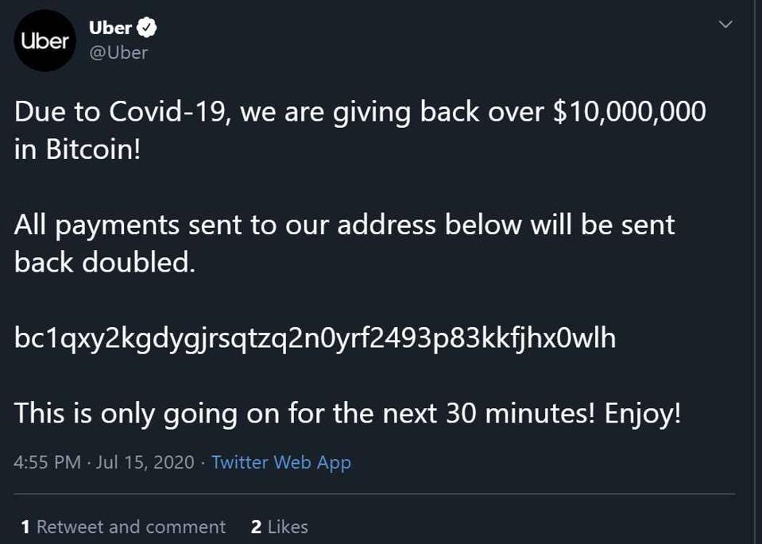
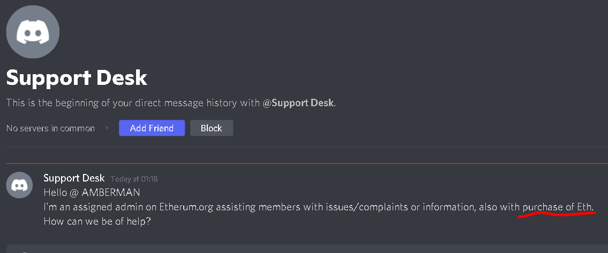

## Staying Safe on Ethereum

With interest in cryptocurrencies growing exponentially, learning best practices when using cryptocurrency is essential. Crypto can be fun and exciting, but there are also serious risks. If you put in this small amount of upfront work, you can mitigate these risks.

<Divider />

## Web Security 101

### Use strong passwords

Over 80% of account hacks are a result of weak or stolen passwords. A long combination of characters, numbers and symbols is best to keep your accounts secure.

A common mistake individuals make is using a combination of two to three common, related dictionary words. Passwords like this are insecure because they are prone to a simple hacking technique known as a [dictionary attack](<[https://en.wikipedia.org/wiki/Dictionary_attack](https://en.wikipedia.org/wiki/Dictionary_attack)>).

```md
Example of a weak password: CuteFluffyKittens!

Example of a strong password: ymv\*azu.EAC8eyp8umf
```

#### Good password practices:

- Make passwords as long as allowed by either your password generator or the form you're filling out.
- Use a mixture of uppercase, lowercase, numbers and symbols
- Avoid common dictionary words

[More on creating strong passwords](https://terranovasecurity.com/how-to-create-a-strong-password-in-7-easy-steps/)

### Use unique passwords for everything

A strong password doesn't provide as much protection if the password is revealed in a data breach. The website [Have I Been Pwned](https://haveibeenpwned.com) allows you to check if your accounts were involved in any data breaches stored in their database. If they have, **you should change pwned passwords immediately**. Using unique passwords for every account lowers the risk of hackers getting access to all of your accounts when one of your passwords is compromised.

### Use a password manager

<InfoBanner emoji=":bulb:">
  <div>
    Using a password manager takes care of creating strong, unique passwords and remembering them! We <strong>strongly</strong> recommend using one.
  </div>
</InfoBanner>

Remembering strong, unique passwords for every account you have isn't ideal. A password manager offers a secure, encrypted store for all your passwords that you can access through one strong master password. They also suggest strong passwords when signing up for a new service, so you don't have to create your own. Many password managers will also tell you if you have been involved in a data breach, allowing you to change the passwords before any malicious attacks.


#### Try a password manager:

- [Bitwarden](https://bitwarden.com/)
- [KeePass](https://keepass.info/)
- [LastPass](https://www.lastpass.com/)
- [1Password](https://1password.com/)

### Use Two-Factor Authentication

To prove you are you there are different unique proofs that can be used for authentication. These are known as factors and the three main factors are:

- something you know (your password)
- something you are (such as a fingerprint or iris scanner)
- and something you own (a security key)

Using **Two-Factor Authentication (2FA)** provides an additional *security factor* for your online accounts so that knowing your password alone (something you know) is not enough to access an account. Most commonly, the second factor is a randomised 6-digit code (something you own) that you can access through an authenticator app such as Google Authenticator or Authy. These work as a "something you own" factor because the seed is stored on your device.

<InfoBanner emoji=":lock:">
  <div>
    Note: Using SMS-based 2FA is susceptible to 
    <a href="https://www.vice.com/en/article/3kx4ej/sim-jacking-mobile-phone-fraud">
      SIM jacking
    </a>
     and is not secure. For the best security, use a service like{" "}
    <a href="https://mashable.com/article/how-to-set-up-google-authenticator">
      Google Authenticator
    </a>
     or <a href="https://authy.com/">Authy</a>.
  </div>
</InfoBanner>

Watch more on the 2FA:

<iframe width="100%" height="315px" src="https://www.youtube.com/embed/m8jlnZuV1i4?start=3479&end=3875" frameborder="0" allow="accelerometer; autoplay; clipboard-write; encrypted-media; gyroscope; picture-in-picture" allowfullscreen></iframe>

### Uninstall browser extentions

Browser extensions like Chrome extensions or Add-ons for Firefox can augment useful browser functionality and improve user experience, but they come with risks. By default, most browser extensions ask for access to 'read and change site data', allowing them to do almost anything with your data. Chrome extensions are always automatically updated, so a previously safe extension may update later to include malicious code. Most browser extensions are not trying to steal your data, but you should be aware that they can.

#### Stay safe by:

- Only install browser extensions from trusted sources
- Removing unused browser extensions
- Install Chrome extensions locally to stop auto-updating (Advanced)

[More on the risks of browser extentions](<[https://www.kaspersky.co.uk/blog/browser-extensions-security/12750/](https://www.kaspersky.co.uk/blog/browser-extensions-security/12750/)>)

<Divider />

## Crypto Security 101

### Upgrade Your Knowledge

One of the biggest reasons people get scammed in crypto generally is a lack of understanding. If you don't understand that no one owns the Ethereum network, then it's easy to fall prey to the kind customer service agent who promises to return your lost ETH in exchange for your private keys. Educating yourself on how Ethereum works is a worthwhile investment.

<DocLink to="/what-is-ethereum/" title="What is Ethereum?" />

<DocLink to="/eth/" title="What is ether?" />

## Wallet Security

### Don't give out your Private keys

**Never, for anyone reason, hand out your private keys!**

The private key to your wallet acts as your digital signature. It is the only thing stopping someone who knows your wallet address from draining your account of all of its funds!

### Use a Hardware Wallet

A hardware wallet provides offline storage for private keys. They are considered the most secure wallet option for storing your private keys.

Keeping private keys offline massively reduces the risk of being hacked, even if a hacker gets control of your computer.

#### Try a hardware wallet:

- [Ledger](<[https://www.ledger.com/](https://www.ledger.com/)>)
- [Trezor](<[https://trezor.io/](https://trezor.io/)>)

### Double check transactions

Accidently sending crypto to the wrong wallet address is a common mistake. Unless you know the address owner, there will be no way for you to retrieve your funds.

Always make sure the address you are sending to exactly matches the desired recipient's address before sending a transaction.

### Set smart contract spend limits

When interacting with smart contracts, do not allow unlimited spend limits. An unlimited spend could enable the smart contract to drain your wallet. Instead, set spending limits to only the amount necessary for the transaction.

### Don't take screenshots of your seed phrases/private keys

By screenshotting your seed phrases or private keys, you risk syncing them to the cloud and potentially making them accessible to hackers. Obtaining private keys from the cloud is a common attack vector for hackers.

<Divider />

## Common Scams

Todo: add copy here

### Giveaway scam (Double your ETH)

One of the most common scams in cryptocurrency is the giveaway scam. The giveaway scam can take many forms, but the general premise is that if you send ETH to the provided wallet address, you will receive your ETH back but doubled. *For this reason, it is also known as the 2-for-1 scam.*

These scams usually stipulate a limited time of opportunity to claim the giveaway to encourage poor decision-making and create a sense of false urgency.

#### Twitter Hack

A high-profile version of this occurred in July 2020, when the Twitter accounts of prominent celebrities and organisations got hacked. The hacker simultaneously posted a Bitcoin giveaway on the hacked accounts. Although the deceptive tweets were quickly noticed and deleted, the hackers still managed to get away with 11 bitcoin (or $500,000 as of September 2021)



#### Vitalik Giveaway

The Vitalik giveaway is another common form the giveaway scam takes. The scammers will take a recorded video interview or conference talk given by Vitalik Buterin, co-founder of Ethereum, and livestream it on YouTube - making it appear as though Vitalik was giving a live video interview endorsing a cryptocurrency giveaway.

Vitalik is used most often in this scam, but many other prominent people involved in crypto are also used (e.g. Elon Musk or Charles Hoskinson). Including a well-known person gives the scammers livestream a sense of legitimacy (this looks sketchy, but Vitalik is involved, so it must be ok!).

**Giveaways are always scams. If you send your funds to these accounts, you will lose them forever.**


### Support Scams

Cryptocurrency is a relatively young and misunderstood technology. A common scam that takes advantage of this is the support scam, where scammers will impersonate support personnel for popular wallets, exchanges, or blockchains.

Much of the discussion about Ethereum happens on Discord. Support scammers will commonly find their target by searching for support questions in public discord channels and then sending the enquirer a private message offering support. By building trust, support scammers try to trick you into revealing your private keys or sending your funds to their wallets.



As a general rule, staff will never communicate with you through private, unofficial channels. Some simple things to keep in mind when dealing with support:

- Never share your private keys, seed phrases or passwords
- Never allow anyone remote access into your computer
- Never communicate in unofficial private channels

<InfoBanner emoji=":lock:">
  <div>
    Beware: although support-style scams commonly happen on Discord, they can also be prevalent on any chat applications where crypto discussion happens, including email.
  </div>
</InfoBanner>

### Phishing Scams

Phishing scams are another increasingly common angle that scammers will use to attempt to steal your wallet's funds.

Some phishing emails ask users to click on links that will re-direct them to imitation websites, asking them to enter their seed phrase, reset their password or send ETH. Others may ask you to unknowingly install malware to infect your computer and give scammers access to your computer's files.

If you receive an email from an unknown sender, remember:

- Never open a link or attachment from email addresses you don't recognise
- Never divulge your personal information or passwords to anyone
- Delete emails from unknown senders

### Crypto trading broker scams

Scam crypto trading brokers claim to be specialist cryptocurrency brokers who will offer to take your money and invest it on your behalf. The promises of unrealistic returns usually accompany this offer. After the scammer receives your funds, they may lead you on, asking that you send more funds, so you don't miss out on further investment gains, or they may disappear entirely.

These fraudulent brokers find their targets by using fake accounts on YouTube to start seemingly natural conversations about the broker. These conversations are often highly upvoted to increase legitimacy, but the upvotes are all from bot accounts.

**Do not trust internet strangers to invest on your behalf. You will lose your crypto.**


<Divider />

## Further Reading

### Web Security

- [This is why you shouldn’t use texts for two-factor authentication](https://www.theverge.com/2017/9/18/16328172/sms-two-factor-authentication-hack-password-bitcoin)
- [Up to 3 million devices infected by malware-laced Chrome and Edge add-ons](https://arstechnica.com/information-technology/2020/12/up-to-3-million-devices-infected-by-malware-laced-chrome-and-edge-add-ons/)
- [How to Create a Strong Password — That You Won’t Forget](https://www.avg.com/en/signal/how-to-create-a-strong-password-that-you-wont-forget)

### Crypto Security

- [Crypto Security: Passwords and Authentication](https://www.youtube.com/watch?v=m8jlnZuV1i4)
- [4 Ways to Stay Safe in Crypto](https://www.coindesk.com/tech/2021/04/20/4-ways-to-stay-safe-in-crypto/)

### Scams to be aware of

- [Bitcoin.org Scams](https://bitcoin.org/en/scams)
