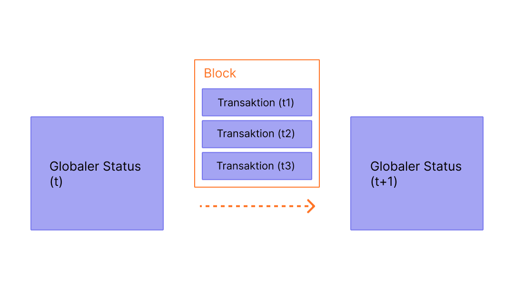

Blöcke sind Stapel von Transaktionen mit einem Hash des vorherigen Blocks in der Kette. Dies verbindet Blöcke (in einer Kette), weil Hashes kryptographisch aus den Blockdaten abgeleitet werden. Dies verhindert Betrug: Eine Änderung in irgendeiner Chronik würde alle nachfolgenden Blöcke ungültig machen, da sich alle nachfolgenden Hashes ändern und jeder, der die Blockchain ausführt, dies bemerken würde.

## Voraussetzungen {#prerequisites}

Blöcke sind ein sehr anfängerfreundliches Thema. Um dir jedoch zu helfen, diese Seite besser zu verstehen, empfehlen wir, zuerst [ Konten](/developers/docs/accounts/), [Transaktionen](/developers/docs/transactions/) und unsere [Einführung in Ethereum](/developers/docs/intro-to-ethereum/) zu lesen.

## Warum Blöcke? {#why-blocks}

Um sicherzustellen, dass alle Teilnehmer des Ethereum-Netzwerks einen synchronisierten Zustand beibehalten und sich über den genauen Verlauf der Transaktionen einig sind, fassen wir die Transaktionen in Blöcken zusammen. Das bedeutet, dass Dutzende (oder Hunderte) Transaktionen auf einmal übergeben, bestätigt und synchronisiert werden.

 _Diagramm angepasst von [Ethereum EVM illustriert](https://takenobu-hs.github.io/downloads/ethereum_evm_illustrated.pdf)_

Durch die Aufteilung der Übertragungen geben wir allen Netzwerkteilnehmern genügend Zeit, einen Konsens zu finden: Obwohl Transaktionsanfragen dutzende Male pro Sekunde auftreten, werden Blöcke auf Ethereum etwa alle fünfzehn Sekunden übertragen.

## Wie Blöcke funktionieren {#how-blocks-work}

Um die Transaktionsgeschichte zu erhalten, sind Blöcke streng sortiert (jeder neu erstellte Block enthält einen Verweis auf den übergeordneten Block), und Transaktionen innerhalb von Blöcken sind ebenfalls streng geordnet. Außer in seltenen Fällen, zu einem bestimmten Zeitpunkt, sind sich alle Teilnehmer des Netzwerks über die genaue Anzahl und Geschichte der Blöcke einig und arbeiten daran, die aktuellen Live-Transaktionsanfragen in den nächsten Block zu integrieren.

Sobald ein Block von einem Miner im Netzwerk zusammengesetzt wird (geschürft), wird er an den Rest des Netzwerks weitergeleitet: Alle Nodes fügen diesen Block am Ende ihrer Blockchain hinzu und das Mining (Schürfen) geht weiter. Der genaue Prozess der Blockmontage (Schürfen) und der Commitment/Konsensus-Prozess werden derzeit durch das „Proof-of-Work-Protokoll" von Ethereum spezifiziert.

### Eine visuelle Demo {#a-visual-demo}

<YouTube id="_160oMzblY8" />

## Proof-of-Work-Protokoll {#proof-of-work-protocol}

Proof-of-Work bedeutet Folgendes:

- Mining-Knoten müssen eine variable, aber beträchtliche Menge an Energie, Zeit und Rechenleistung aufwenden, um ein "Legitimationszertifikat" für einen Block zu erstellen, den sie dem Netzwerk vorschlagen. Dies trägt u. a. zum Schutz des Netzes vor Spam-/Denial-of-Service-Angriffen bei, da Zertifikate in der Herstellung teuer sind.
- Andere Miner, die von einem neuen Block mit einem gültigen Legitimationszertifikat erfahren, müssen den neuen Block als den kanonischen nächsten Block auf der Blockchain akzeptieren.
- Die genaue Zeit, die ein bestimmter Miner benötigt, um dieses Zertifikat zu erstellen, ist eine Zufallsvariable mit hoher Varianz. Dies stellt sicher, dass es unwahrscheinlich ist, dass zwei Miner gleichzeitig Validierungen für einen vorgeschlagenen nächsten Block erstellen. Wenn ein Miner einen zertifizierten neuen Block erstellt und verbreitet, kann er fast sicher sein, dass der Block vom Netzwerk als kanonischer nächster Block auf der Blockchain akzeptiert wird, ohne dass es zu Konflikten kommt (obwohl es auch ein Protokoll für den Umgang mit Konflikten gibt, falls zwei Ketten zertifizierter Blöcke fast gleichzeitig erstellt werden).

[Mehr zum Mining](/developers/docs/consensus-mechanisms/pow/mining/)

## Was enthält ein Block? {#block-anatomy}

- `Zeitstempel` – die Zeit, zu der der Block gemint wurde.
- `Blocknummer` – die Länge der Blockchain in Blöcken.
- `Basisgebühr pro Gas` – die Mindestgebühr pro Gas, die erforderlich ist, damit eine Transaktion in den Block aufgenommen wird.
- `Schwierigkeit` – der Aufwand, der erforderlich ist, um den Block abzubauen.
- `mixHash` – ein eindeutiger Bezeichner für diesen Block.
- `parentHash` – der eindeutige Bezeichner des vorhergehenden Blocks (so werden die Blöcke in einer Kette verknüpft).
- `Transaktionen` – die im Block enthaltenen Transaktionen.
- `stateRoot` – der gesamte Status des Systems: Kontosalden, Vertragsspeicher, Vertragscode und Konto-Nonce sind darin enthalten.
- `nonce` – ein Hash, der in Kombination mit dem mixHash beweist, dass der Block den [Proof-of-Work](/developers/docs/consensus-mechanisms/pow/) durchlaufen hat.

## Blockzeit {#block-time}

Die Blockzeit bezieht sich auf die Zeit, die für das Mining eines neuen Blocks benötigt wird. In Ethereum beträgt die durchschnittliche Blockzeit zwischen 12 und 14 Sekunden und wird nach jedem Block ausgewertet. Die erwartete Blockzeit wird als Konstante auf Protokollebene festgelegt und dient dazu, die Sicherheit des Netzwerks zu schützen, wenn die Miner mehr Rechenleistung einsetzen. Die durchschnittliche Blockzeit wird mit der erwarteten Blockzeit verglichen, und wenn die durchschnittliche Blockzeit höher ist, dann wird die Schwierigkeit im Block-Header verringert. Wenn die durchschnittliche Blockzeit kleiner ist, wird die Schwierigkeit im Block-Header erhöht.

## Blockgröße {#block-size}

Ein finaler, wichtiger Hinweis ist, dass Blöcke selbst in ihrer Größe begrenzt sind. Jeder Block hat eine Zielgröße von 15 Millionen Gas, aber die Größe der Blöcke wird entsprechend der Netznachfrage erhöht oder verringert, bis zur Blockgrenze von 30 Millionen Gas (doppelte Zielblockgröße). Die Gesamtmenge des von allen Transaktionen im Block verbrauchten Gases muss unter dem Blockgaslimit liegen. Dies ist wichtig, weil dadurch sichergestellt wird, dass Blöcke nicht willkürlich groß sein können. Wenn Blöcke beliebig groß sein könnten, würden weniger leistungsstarke Nodes aufgrund von Platz- und Geschwindigkeitsanforderungen allmählich nicht mehr mit dem Netzwerk Schritt halten können.

## Weiterführende Informationen {#further-reading}

_Kennst du eine Community-Ressource, die dir geholfen hat? Bearbeite diese Seite und füge sie hinzu!_

## Verwandte Themen {#related-topics}

- [Mining](/developers/docs/consensus-mechanisms/pow/mining/)
- [Transaktionen](/developers/docs/transactions/)
- [Ressourcen](/developers/docs/gas/)
