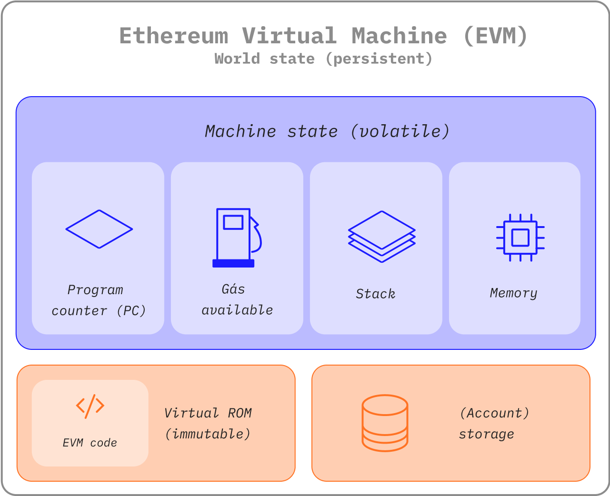

La representación física de EVM no se puede describir del mismo modo que una nube o una ola, pero _existe_ como una única entidad sustentada por miles de computadoras conectadas ejecutando un cliente de Ethereum.

El protocolo de Ethereum en sí mismo existe únicamente con el propósito de mantener el funcionamiento continuo, ininterrumpido e inmutable de esta máquina de estado especial; se trata del entorno que alberga todas las cuentas de Ethereum y los contratos inteligentes. En cualquier bloque de la cadena, Ethereum tiene un único estado "canónico" y la EVM es la que define las reglas de cálculo de un nuevo estado válido de bloque a bloque.

## Requisitos previos {#prerequisites}

Para comprender la EVM es necesario estar familiarizado con terminología básica y común de las ciencias informáticas, como [bytes](https://wikipedia.org/wiki/Byte), [memoria](https://wikipedia.org/wiki/Computer_memory) y [pila](<https://wikipedia.org/wiki/Stack_(abstract_data_type)>). Asimismo, es útil sentirse cómodo con los conceptos de criptografía/blockchain, como [las funciones hash](https://wikipedia.org/wiki/Cryptographic_hash_function), [la Prueba de trabajo](https://wikipedia.org/wiki/Proof_of_work) y [el árbol de Merkle](https://wikipedia.org/wiki/Merkle_tree).

## Del libro de contabilidad a la máquina de estado {#from-ledger-to-state-machine}

La analogía del "libro de contabilidad distribuido" suele utilizarse para describir blockchains como Bitcoin, que permite la existencia de una moneda descentralizada que utiliza herramientas fundamentales de criptografía. Una criptomoneda se comporta como una moneda "normal", debido a las reglas que rigen lo que uno puede o no puede hacer para modificar el libro de contabilidad. Por ejemplo, una dirección de Bitcoin no puede gastar más Bitcoin de los que ha recibido previamente. Estas reglas sustentan todas las transacciones de Bitcoin y muchas otras blockchains.

Aunque Ethereum tenga su propia criptomoneda nativa (Ether), que sigue casi exactamente las mismas reglas intuitivas, esto también permite disponer de una función mucho más poderosa: [los contratos inteligentes](/developers/docs/smart-contracts/). Para explicar esta característica más compleja se requiere una analogía más sofisticada. En lugar de un libro de contabilidad distribuido, Ethereum es una [máquina de estado](https://wikipedia.org/wiki/Finite-state_machine) distribuida. El estado de Ethereum es una gran estructura de datos, que no solo sostiene todas las cuentas y saldos, sino que también alberga el _estado de la máquina_. Este puede cambiar de bloque a bloque según un conjunto de reglas predefinidas, así como ejecutar un código de máquina arbitrario. Las reglas específicas de cambiar el estado de bloque a bloque las define la EVM.

 _Diagrama adaptado de [Ethereum EVM ilustrado](https://takenobu-hs.github.io/downloads/ethereum_evm_illustrated.pdf)_

## Función de transición de estado de Ethereum {#the-ethereum-state-transition-function}

La EVM se comporta como una función matemática: dada una entrada, esta produce una salida determinista. Por tanto, es bastante útil para describir formalmente a Ethereum como una **función de transición de estado**:

```
Y(S, T)= S'
```

Dado un estado válido anterior `(S)` y un nuevo conjunto de transacciones válidas `(T)`, la función de transición de estado de Ethereum `Y(S, T)` produce un nuevo estado de salida válido `S'`.

### Estado {#state}

En el contexto de Ethereum, el estado es una gran estructura de datos llamada [Merkle Patricia Trie modificado](https://eth.wiki/en/fundamentals/patricia-tree), que mantiene todas las [cuentas](/developers/docs/accounts/) enlazadas mediante los hashes y reducibles a un solo hash raíz almacenado en la blockchain.

### Transacciones {#transactions}

Las transacciones son instrucciones firmadas criptográficamente desde las cuentas. Hay dos tipos de transacciones: aquellas que resultan de llamadas de mensajes y aquellas que resultan de la creación de contratos.

La creación de contratos da lugar a la creación de una nueva cuenta de contrato, que contiene el bytecode compilado del [contrato inteligente](/developers/docs/smart-contracts/anatomy/). Cada vez que otra cuenta realiza una llamada de mensaje al contrato, este ejecuta su bytecode.

## Instrucciones de la EVM {#evm-instructions}

La EVM se ejecuta como una [máquina de estado](https://wikipedia.org/wiki/Stack_machine) con una profundidad de 1024 ítems. Cada ítem tiene una palabra de 256 bits, que se eligió para ofrecer la máxima compatibilidad con el esquema del hash SHA-3-256.

Durante la ejecución, la EVM mantiene una _memoria_ transitoria (con un array de bytes direccionado con palabras), que no persiste entre transacciones.

Sin embargo, los contratos contienen un intento de Merkle Patricia trie de _almacenamiento_ (como un array de palabras direccionado mediante palabras), relacionado con la cuenta en cuestión y parte del estado global.

El bytecode compilado del contrato inteligente se ejecuta como un número de la EVM: [códigos de operación](https://www.ethervm.io/), que realizan operaciones estándar de la pila como `XOR`, `AND`, `ADD`, `SUB`, etc. La EVM también implementa un número de operaciones de pila específicas de la blockchain, como `DIRECCIÓN`, `SALDO`, `SHA3`, `BLOCKHASH`, etc.

 _Diagramas adaptados de la [EVM ilustrada de Ethereum](https://takenobu-hs.github.io/downloads/ethereum_evm_illustrated.pdf)_

## Implementaciones de la EVM {#evm-implementations}

Todas las implementaciones de la EVM deben adherirse a la especificación descrita en el protocolo de Ethereum.

A lo largo de los 5 años de historia de Ethereum, la EVM ha experimentado varias revisiones y existen varias implementaciones de la EVM en varios lenguajes de programación.

Todos los [clientes de Ethereum](/developers/docs/nodes-and-clients/#execution-clients) incluyen una implementación de la EVM. Adicionalmente hay varias implementaciones independientes, entre las que se incluyen las siguientes:

- [Py-EVM](https://github.com/ethereum/py-evm) - _Python_.
- [evmone](https://github.com/ethereum/evmone) - _C++_.
- [ethereumjs-vm](https://github.com/ethereumjs/ethereumjs-vm) - _JavaScript_.
- [eEVM](https://github.com/microsoft/eevm) - _C++_.
- [Hyperledger Burrow](https://github.com/hyperledger/burrow) - _Go_.

## Más información {#further-reading}

- [Protocolo de Ethereum](https://ethereum.github.io/yellowpaper/paper.pdf).
- [Especificación técnica](https://github.com/chronaeon/beigepaper)
- [Códigos de operación de la máquina virtual de Ethereum](https://www.ethervm.io/)

## Temas relacionados {#related-topics}

- [Gas](/developers/docs/gas/)
