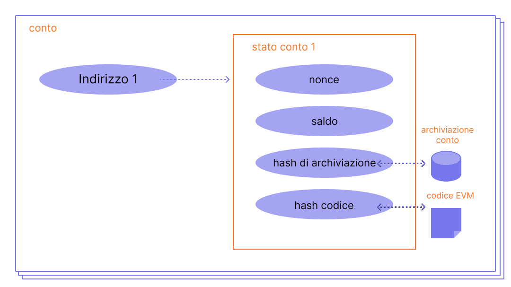

Un conto di Ethereum è un'entità con un saldo in ether (ETH) che può inviare transazioni su Ethereum. I conti sono controllabili da utenti o distribuibili come Contratti Intelligenti.

## Prerequisiti {#prerequisites}

I conti sono un argomento piuttosto basilare. Ma per meglio comprendere questa pagina, ti consigliamo innanzi tutto di leggere la nostra [introduzione a Ethereum](/developers/docs/intro-to-ethereum/).

## Tipi di conto {#types-of-account}

Ethereum ha due tipi di conto:

- Di proprietà esterna: controllato da chiunque possieda le chiavi private
- Contratto: un Contratto Intelligente distribuito in rete, controllato dal codice. Scopri di più sugli [Smart Contract](/developers/docs/smart-contracts/)

Entrambi i tipi di conto hanno l'abilità di:

- Ricevere, conservare e inviare ETH e token
- Interagire con i contratti intelligenti distribuiti

### Differenze fondamentali {#key-differences}

**Posseduti esternamente**

- Creare un conto non costa nulla
- Può avviare transazioni
- Le transazioni tra account esterni possono riguardare unicamente trasferimenti di ETH/token

**Contratto**

- Creare un contratto ha un costo, poiché l'utente utilizza l'archiviazione di rete
- Può inviare transazioni solo in risposta alla ricezione di una transazione
- Le transazioni da un account esterno a un account basato su un contratto possono innescare un codice che può eseguire le azioni più svariate, come il trasferimento di token o persino la creazione di un nuovo contratto

## Esaminando un conto {#an-account-examined}

I conti di Ethereum hanno quattro campi:

- `nonce`: un contatore che indica il numero di transazioni inviate dal conto. Questo assicura che le transazioni siano elaborate una volta. In un account basato su contratto, questo numero rappresenta il numero di contratti creati dall'account.
- `balance`: il numero di wei posseduti da questo indirizzo. Wei è una denominazione di ETH e ci sono 1e+18 wei per ETH.
- `codeHash`: questo hash si riferisce al _codice_ di un account sulla Macchina virtuale Ethereum (EVM). Gli account basati su contratto contengono frammenti di codice programmati per eseguire diverse operazioni. Questo codice EVM viene eseguito se l'account riceve una chiamata di messaggio. Non è modificabile, a differenza degli altri campi dell'account. Tutti i frammenti di codice sono conservati nel database di stato sotto gli hash corrispondenti, per riferimento futuro. Questo valore dell'hash è noto come un codeHash. Per gli account esterni, il campo del codeHarsh è l'hash di una stringa vuota.
- `storageRoot`: detto anche hash di archiviazione. Hash a 256 bit del nodo radice di un trie di Merkle Patricia che codifica il contenuto dello spazio di archiviazione dell'account (una mappatura tra valori interi a 256 bit), codificato nel trie come mappatura tra l'hash di Keccak a 256 bit delle chiavi intere a 256 bit e i valori interi codificati in RLP a 256 bit. Questo trie codifica l'hash dei contenuti d'archiviazione di questo account ed è vuoto di default.

 _Diagramma adattato da [Ethereum EVM illustrato](https://takenobu-hs.github.io/downloads/ethereum_evm_illustrated.pdf)_

## I conti posseduti esternamente e le coppie di chiavi {#externally-owned-accounts-and-key-pairs}

Un conto è composto da una coppia di chiavi crittografiche: pubblica e privata. Aiutano a provare che una transazione è stata realmente firmata dal mittente e prevenire le falsificazioni. La tua chiave privata è ciò che usi per firmare le transazioni, quindi ti concede la custodia dei fondi associati al tuo conto. Non possiedi mai realmente le criptovalute, possiedi le chiavi private; i fondi sono sempre nel registro mastro di Ethereum.

Questo impedisce ai malintenzionati di trasmettere false transazioni perché puoi sempre verificare il mittente di una transazione.

Se Alice vuole inviare ether dal proprio conto a quello di Bob, Alice deve creare una richiesta di transazione e inviarla alla rete per la verifica. L'uso di Ethereum della crittografia a chiave pubblica assicura che Alice possa provare che abbia originariamente avviato la richiesta di transazione. Senza i meccanismi crittografici, un utente malintenzionato "Eve" potrebbe semplicemente trasmettere pubblicamente una richiesta che somiglia a qualcosa del tipo "invia 5 ETH dal conto di Alice a quello di Eve" e nessuno potrebbe verificare che non fosse provenuto da Alice.

## Creazione del conto {#account-creation}

Quando vuoi creare un conto, gran parte delle librerie genererà una chiave privata casuale.

Una chiave privata si compone di 64 caratteri hex ed è codificabile con una password.

Esempio:

`fffffffffffffffffffffffffffffffebaaedce6af48a03bbfd25e8cd036415f`

La chiave pubblica è generata dalla chiave privata usando [Elliptic Curve Digital Signature Algorithm](https://wikipedia.org/wiki/Elliptic_Curve_Digital_Signature_Algorithm). Puoi ottenere un indirizzo pubblico per il tuo account impiegando gli ultimi 20 byte dell'hash Keccak-256 della chiave pubblica e aggiungendo `0x` all'inizio.

Ecco un esempio di creazione di un conto nella console usando il `personal_newAccount` di GETH

```go
> personal.newAccount()
Passphrase:
Repeat passphrase:
"0x5e97870f263700f46aa00d967821199b9bc5a120"

> personal.newAccount("h4ck3r")
"0x3d80b31a78c30fc628f20b2c89d7ddbf6e53cedc"
```

[Documentazione di GETH](https://geth.ethereum.org/docs)

È possibile derivare nuove chiavi pubbliche dalla tua chiave privata ma non puoi derivare una chiave privata dalle chiavi pubbliche. Questo significa che è vitale mantenere al sicuro una chiave privata, come suggerito dal nome, **PRIVATA**.

Necessiti di una chiave privata per firmare i messaggi e le transazioni che producono una firma. Gli altri possono quindi prendere la firma per derivare la tua chiave pubblica, provando l'autore del messaggio. Nella tua applicazione, puoi usare una libreria javascript per inviare le transazioni alla rete.

## Account contratto {#contract-accounts}

Anche gli account contratto hanno un indirizzo di 42 caratteri esadecimali:

Esempio:

`0x06012c8cf97bead5deae237070f9587f8e7a266d`

L'indirizzo dell'account contratto viene solitamente indicato quando un contratto viene distribuito nella blockchain di Ethereum. L’indirizzo deriva da quello del creatore e dal numero di transazioni inviate da tale indirizzo (il “nonce”).

## Chiavi del validatore {#validators-keys}

Esiste inoltre un altro tipo di chiave su Ethereum, introdotto quando Ethereum è passato dal consenso basato sul proof-of-work al proof-of-stake. Queste sono le chiavi 'BLS' e sono usate per identificare i validatori. Queste chiavi possono esser aggregate efficientemente per ridurre la larghezza di banda necessaria affinché la rete raggiunga il consenso. Senza questa chiave, l'aggregazione della quota minima per un validatore saremme molto maggiore.

[Di più sulle chiavi del validatore](/developers/docs/consensus-mechanisms/pos/keys/).

## Una nota sui portafogli {#a-note-on-wallets}

Un conto non è un portafoglio. Un conto è la coppia di chiavi per un conto di Ethereum di proprietà dell'utente. Un portafoglio è un'interfaccia o un'applicazione che ti consente di interagire col tuo conto di Ethereum.

## Dimostrazione visiva {#a-visual-demo}

Fatti guidare da Austin attraverso le funzionalità di hash e le coppie di chiavi.

<YouTube id="QJ010l-pBpE" />

<YouTube id="9LtBDy67Tho" />

## Ulteriori letture {#further-reading}

_Conosci una risorsa pubblica che ti è stata utile? Modifica questa pagina e aggiungila!_

## Argomenti correlati {#related-topics}

- [Contratti intelligenti](/developers/docs/smart-contracts/)
- [Transazioni](/developers/docs/transactions/)
