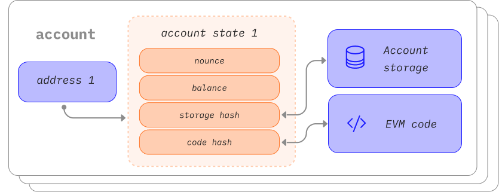

Un account Ethereum è un'entità con un saldo in ether (ETH) che può inviare transazioni su Ethereum. Gli account possono essere controllati da utenti o distribuiti come Smart Contract.

## Prerequisiti {#prerequisites}

Gli account sono un argomento piuttosto basico. Per capire meglio questa pagina, consigliamo tuttavia di leggere prima la nostra [introduzione a Ethereum](/developers/docs/intro-to-ethereum/).

## Tipi di account {#types-of-account}

Ethereum ha due tipi di account:

- Di proprietà esterna: controllato da chiunque possieda chiavi private
- Contratto: uno Smart Contract distribuito sulla rete, controllato da codice. Scopri di più sugli [Smart Contract](/developers/docs/smart-contracts/)

Entrambi i tipi di account hanno la possibilità di:

- Ricevere, conservare e inviare ETH e token
- Interagire con gli Smart Contract distribuiti

### Differenze fondamentali {#key-differences}

**Di proprietà esterna**

- Creare un account non costa nulla
- Può avviare transazioni
- Le transazioni tra account di proprietà esterna possono essere solo trasferimenti di ETH

**Contratto**

- La creazione di un account ha un costo perché utilizzi spazio di archiviazione della rete
- Può inviare transazioni solo in risposta alla ricezione di una transazione
- Le transazioni da un account esterno a un account contratto possono attivare codice, che a sua volta può eseguire molte azioni diverse, come il trasferimento di token o anche la creazione di un nuovo contratto

## Un account da vicino {#an-account-examined}

Gli account Ethereum hanno quattro campi:

- `nonce`: contatore che indica il numero di transazioni inviate dall'account. Garantisce che le transazioni vengano elaborate una sola volta. Se si tratta di un account contratto, questo numero rappresenta il numero di contratti creati dall'account
- `balance`: il numero di Wei di proprietà di questo indirizzo. Wei è un taglio dell'ETH. Ci sono 1e+18 Wei per ogni ETH.
- `codeHash`: tutti questi frammenti di codice sono contenuti nel database di stato sotto i relativi hash per un recupero futuro. Per gli account contratto, è il codice a cui viene applicato un hash e che viene archiviato come codeHash. Per gli account di proprietà esterna, il campo codeHash è l'hash della stringa vuota.
- `storageRoot`: detto anche hash di archiviazione. Hash a 256 bit del nodo radice di un albero di Merkle Patricia che codifica il contenuto dello spazio di archiviazione dell'account (una mappatura tra valori interi a 256 bit), codificato nel trie come mappatura tra l'hash di Keccak a 256 bit delle chiavi intere a 256 bit e i valori interi codificati in RLP a 256 bit. Questo albero codifica l'hash del contenuto dello storage di questo account ed è vuoto di default.

 _Diagramma adattato da [Ethereum EVM illustrated](https://takenobu-hs.github.io/downloads/ethereum_evm_illustrated.pdf)_

## Account di proprietà esterna e coppie di chiavi {#externally-owned-accounts-and-key-pairs}

Un account è costituito da una coppia di chiavi crittografiche: pubblica e privata. Le chiavi contribuiscono a dimostrare che una transazione è stata effettivamente firmata dal mittente e a prevenire falsificazioni. La chiave privata è ciò che viene utilizzato per firmare le transazioni, quindi garantisce la custodia dei fondi associati all'account. La proprietà delle criptovalute non è mai veramente dell'utente. L'utente possiede le chiavi private, i fondi si trovano sempre nel ledger di Ethereum.

Questo impedisce ai malintenzionati di trasmettere transazioni false perché è sempre possibile verificare il mittente di una transazione.

Se Alice vuole inviare ether dal suo account a quello di Bob, deve creare una richiesta di transazione e inviarla alla rete per la verifica. L’uso di Ethereum della crittografia a chiave pubblica garantisce che Alice possa dimostrare di aver avviato originariamente la richiesta di transazione. Senza meccanismi crittografici, un utente malintenzionato, ad esempio Eva, potrebbe semplicemente trasmettere pubblicamente una richiesta del tipo “inviare 5 ETH dall'account di Alice a quello di Eva", e nessuno sarebbe in grado di verificare che non provenga da Alice.

## Creazione di account {#account-creation}

Quando vuoi creare un account, la maggior parte delle librerie generano genereranno una chiave privata casuale.

Una chiave privata è composta da un massimo di 64 caratteri esadecimali e può essere crittografata con una password.

Esempio:

`fffffffffffffffffffffffffffffffebaaedce6af48a03bbfd25e8cd036415f`

La chiave pubblica viene generata dalla chiave privata usando l'algoritmo di firma digitale della curva ellittica. Ottieni un indirizzo pubblico per il tuo account prendendo gli ultimi 20 byte della chiave pubblica e aggiungendo `0x` all'inizio.

Ecco un esempio di creazione di un account nella console utilizzando `personal_newAccount` di GETH

```go
> personal.newAccount()
Passphrase:
Repeat passphrase:
"0x5e97870f263700f46aa00d967821199b9bc5a120"

> personal.newAccount("h4ck3r")
"0x3d80b31a78c30fc628f20b2c89d7ddbf6e53cedc"
```

[Documentazione GETH](https://geth.ethereum.org/docs)

È possibile ricavare nuove chiavi pubbliche dalla chiave privata ma non è possibile ricavare una chiave privata da chiavi pubbliche. Significa che è fondamentale mantenere le chiavi private al sicuro e, come suggerisce il nome, **PRIVATE**.

Serve una chiave privata per firmare i messaggi e le transazioni che producono una firma. Gli altri utenti possono quindi utilizzare la firma per ricavare la chiave pubblica e dimostrare chi è l'autore del messaggio. Nelle applicazioni ch si creano, è possibile utilizzare una libreria javascript per inviare transazioni alla rete.

## Account contratto {#contract-accounts}

Anche gli account contratto hanno un indirizzo di 42 caratteri esadecimali:

Esempio:

`0x06012c8cf97bead5deae237070f9587f8e7a266d`

L'indirizzo dell'account contratto viene solitamente indicato quando un contratto viene distribuito nella blockchain di Ethereum. L’indirizzo deriva da quello del creatore e dal numero di transazioni inviate da tale indirizzo (il “nonce”).

## Una nota sui portafogli {#a-note-on-wallets}

Un account non è un portafoglio. Un portafoglio è una coppia di chiavi associata a un account di proprietà di un utente, che permette all'utente di eseguire transazioni dall'account e di gestirlo.

## Letture consigliate {#further-reading}

_Conosci una risorsa della community che ti è stata utile? Modifica questa pagina e aggiungila!_

## Argomenti correlati {#related-topics}

- [Smart Contract](/developers/docs/smart-contracts/)
- [Transazioni](/developers/docs/transactions/)
