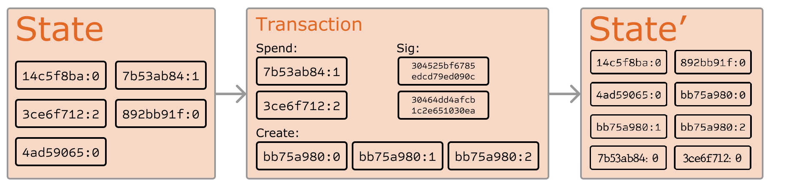
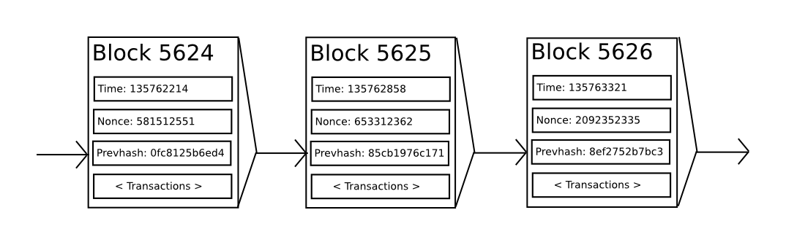
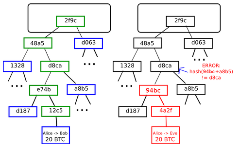
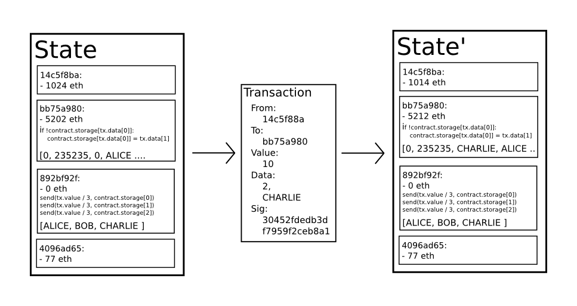
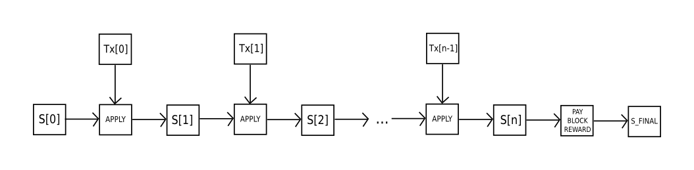
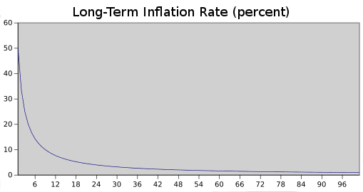

# Whitepaper Ethereum {#ethereum-whitepaper}

_Questo documento introduttivo è stato originariamente pubblicato nel 2013 da Vitalik Buterin, fondatore di [Ethereum](/what-is-ethereum/), prima del lancio del progetto nel 2015. Vale la pena ricordare che Ethereum, come molti progetti software open-source basati su una comunità, si è evoluto dai primi tempi._

_Anche se ormai ha alcuni anni, continuiamo a usare questo documento perché rimane un utile riferimento e una rappresentazione accurata di Ethereum e della sua visione. Per conoscere gli ultimi sviluppi di Ethereum e come vengono apportate modifiche al protocollo, consigliamo di consultare [questa guida](/learn/)._

## Smart Contract di prossima generazione e piattaforma applicativa decentralizzata {#a-next-generation-smart-contract-and-decentralized-application-platform}

Lo sviluppo di Bitcoin da parte di Satoshi Nakamoto nel 2009 è stato spesso considerato come una trasformazione radicale dei concetti di denaro e valuta, essendo il primo esempio di risorsa digitale che allo stesso tempo non ha supporto reale, [valore intrinseco](http://Bitcoinmagazine.com/8640/an-exploration-of-intrinsic-value-what-it-is-why-Bitcoin-doesnt-have-it-and-why-Bitcoin-does-have-it/), emittente o controllore centralizzato. Tuttavia, un'altra (probabilmente più importante) parte dell'esperimento Bitcoin è la tecnologia blockchain che sta alla base, sotto forma di strumento di consenso distribuito, e l'attenzione sta cominciando rapidamente a passare a questo altro aspetto di Bitcoin. Le applicazioni citate comunemente come alternative della tecnologia blockchain includono risorse digitali su blockchain che rappresentano valute e strumenti finanziari personalizzati ([colored coins](https://docs.google.com/a/buterin.com/document/d/1AnkP_cVZTCMLIzw4DvsW6M8Q2JC0lIzrTLuoWu2z1BE/edit) o moneta colorata), la proprietà di un dispositivo fisico sottostante ([smart property](https://en.Bitcoin.it/wiki/Smart_Property)), risorse non fungibili come nomi di dominio ([Namecoin](http://namecoin.org)) e applicazioni più complesse che comportano la presenza di risorse digitali controllate direttamente da codice che attua regole arbitrarie ([Smart Contract](http://www.fon.hum.uva.nl/rob/Courses/InformationInSpeech/CDROM/Literature/LOTwinterschool2006/szabo.best.vwh.net/idea.html)) o addirittura [organizzazioni autonome decentralizzate](http://Bitcoinmagazine.com/7050/bootstrapping-a-decentralized-autonomous-corporation-part-i/) (DAO) basate su blockchain. Quello che Ethereum intende fornire è una blockchain con un linguaggio di programmazione esaustivo Turing completo, che può essere utilizzato per creare "contratti", i quali a loro volta possono essere utilizzati per codificare funzioni di transizione di stato arbitrarie, permettendo agli utenti di creare uno dei sistemi sopra descritti (e molti altri che non abbiamo ancora immaginato), semplicemente scrivendo la logica in poche righe di codice.

## Introduzione a Bitcoin e concetti esistenti {#introduction-to-bitcoin-and-existing-concepts}

### Storia {#history}

Il concetto di valuta digitale decentralizzata, così come di applicazioni alternative come i registri di proprietà, esiste da decenni. I protocolli anonimi di moneta elettronica degli anni '80 e '90, per lo più basati su una primitiva crittografica nota come Chaumian blinding, fornivano una valuta con un elevato grado di privacy, ma i protocolli non riuscivano ad avere successo a causa della loro dipendenza da un intermediario centralizzato. Nel 1998, Wei Da con [b-money](http://www.weidai.com/bmoney.txt) introdusse la proposta di creare denaro attraverso la risoluzione di enigmi di calcolo e il consenso decentralizzato, che però era povera di dettagli su come ottenere quest'ultimo. Nel 2005, Hal Finney introdusse il concetto di [Proof of Work riutilizzabili](http://nakamotoinstitute.org/finney/rpow/), un sistema che utilizzava le idee di b-money insieme agli enigmi Hashcash ad alta difficoltà di calcolo di Adam Back per creare un concetto di criptovaluta. Ma anche questo tentativo fallì in quanto si basava su elaborazione attendibile come backend. Nel 2009 fu per la prima volta creata da Satoshi Nakamoto una valuta decentralizzata, combinando concetti già assodati per gestire la proprietà attraverso la crittografia a chiave pubblica, con un algoritmo di consenso per tenere traccia della proprietà delle monete. Questo sistema era noto come "proof-of-work".

Il meccanismo che stava alla base della proof-of-work era una novità assoluta nel campo perché risolveva contemporaneamente due problemi. In primo luogo, forniva un semplice e moderatamente efficace algoritmo di consenso, permettendo ai nodi della rete di concordare collettivamente una serie di aggiornamenti canonici allo stato del libro mastro di Bitcoin. In secondo luogo, forniva un meccanismo per consentire il libero ingresso nel processo di consenso, rivolvendo il problema politico di decidere chi poteva influenzare il consenso e contemporaneamente impedendo gli attacchi sybil. Lo faceva sostituendo un ostacolo formale alla partecipazione (cioè l'obbligo di essere registrati come entità unica in un determinato elenco) con un ostacolo economico: il peso di un solo nodo nel processo di voto per il consenso era direttamente proporzionale alla potenza di calcolo associata al nodo. Da allora, è stato proposto un approccio alternativo chiamato _proof-of-stake_, che calcola il peso di un nodo in modo proporzionale alla quantità di valuta che possiede e non alla sua potenza di calcolo; la discussione sui meriti relativi dei due approcci va oltre lo scopo di questo documento ma è importante notare che entrambi gli approcci possono essere usati come punto di partenza per una criptovaluta.

Ecco un post del blog di Vitalik Buterin, il fondatore di Ethereum, sulla [storia precedente a Ethereum](https://vitalik.ca/general/2017/09/14/prehistory.html). [Qui](https://blog.ethereum.org/2016/02/09/cut-and-try-building-a-dream/) trovate un altro post di blog con altri cenni storici.

### Bitcoin come sistema di transizione tra stati {#bitcoin-as-a-state-transition-system}

Da un punto di vista tecnico, il libro mastro di una criptovaluta come Bitcoin può essere pensato come un sistema di transizione tra stati, dove esiste uno "stato" che consiste nello stato di proprietà di tutti i Bitcoin esistenti e una "funzione di transizione tra stati" che prende uno stato e una transazione e produce un nuovo stato come risultato. In un sistema bancario tradizionale, ad esempio, lo stato è un estratto conto, mentre una transazione è una richiesta di spostare $X da A a B, e la funzione di transizione tra stati riduce il valore del conto di A di $X, aumentando quello del conto di B di $X. Se l'account di A ha meno di $X, la funzione di transizione tra stati restituisce un errore. Pertanto, si può formalmente definire:

    APPLY(S,TX) -> S' or ERROR

Nel sistema bancario sopra definito:

    APPLY({ Alice: $50, Bob: $50 },"send $20 from Alice to Bob") = { Alice: $30, Bob: $70 }

Ma:

    APPLY({ Alice: $50, Bob: $50 },"send $70 from Alice to Bob") = ERROR

Lo "stato" in Bitcoin è la raccolta di tutte le monete (tecnicamente, "output delle transazioni non speso" o UTXO) di cui è stato eseguito il mining e che non sono ancora state spese, dove ogni UTXO ha un taglio e un proprietario (definito da un indirizzo a 20 byte che è essenzialmente una chiave pubblica crittografica[fn. 1](#notes)). Una transazione contiene uno o più input, dove ogni input contiene un riferimento a un UTXO esistente e una firma crittografica prodotta dalla chiave privata associata all'indirizzo del proprietario, e uno o più output, dove ogni output contiene un nuovo UTXO da aggiungere allo stato.

La funzione di transizione tra stati `APPLY(S,TX) -> S'` può essere definita approssimativamente come segue:

1.  Per ogni input in `TX`:

    - Se l'UTXO a cui si fa riferimento non è in `S`, viene restituito un errore.
    - Se la firma fornita non corrisponde al proprietario dell'UTXO, viene restituito un errore.

2.  Se la somma dei tagli di tutti gli UTXO in ingresso è inferiore alla somma dei tagli di tutti gli UTXO in uscita, viene restituito un errore.
3.  Viene restituito `S'` con tutti gli UTXO in ingresso rimossi e tutti gli UTXO in uscita aggiunti.

La prima metà del primo passaggio impedisce ai mittenti delle transazioni di spendere monete che non esistono, la seconda metà del primo passaggio impedisce ai mittenti delle transazioni di spendere monete altrui e il secondo passaggio implementa la conservazione del valore. Per utilizzare queste regole per il pagamento, il protocollo è il seguente. Supponiamo che Alice voglia inviare 11,7 BTC a Bob. In primo luogo, Alice cercherà una serie di UTXO disponibili che possiede, che ammontino almeno a un totale di 11,7 BTC. Realisticamente, Alice non sarà in grado di ottenere esattamente 11,7 BTC; supponiamo che il minimo che riesce a ottenere sia 6+4+2=12. Quindi crea una transazione con questi tre input e due output. Il primo output sarà 11,7 BTC con l'indirizzo di Bob come proprietario, e il secondo output sarà il restante 0,3 BTC di "resto", aventi come proprietario Alice stessa.

### Mining {#mining}

Se avessimo accesso a un servizio centralizzato affidabile, il sistema sarebbe facile da implementare; si potrebbe semplicemente programmare come descritto, usando il disco rigido di un server centralizzato per tenere traccia dello stato. Invece con Bitcoin stiamo cercando di costruire un sistema di valuta decentralizzato, quindi dovremo combinare il sistema di transizione tra stati con un sistema di consenso, per garantire che tutti concordino sull'ordine delle transazioni. Il processo di consenso decentralizzato di Bitcoin richiede che i nodi nella rete tentino continuamente di produrre pacchetti di transazioni chiamati "blocchi". La rete è destinata a produrre circa un blocco ogni dieci minuti, dove ogni blocco contiene un indicatore data/ora, un nonce, un riferimento (hash) al blocco precedente e un elenco di tutte le transazioni che sono state effettuate dopo il blocco precedente. Nel tempo, questa situazione crea una "blockchain" persistente, in continua crescita, che si aggiorna costantemente per rappresentare l'ultimo stato del libro mastro di Bitcoin.

L'algoritmo per controllare se un blocco è valido, espresso in questo paradigma, è il seguente:

1.  Verifica se il blocco precedente a cui fa riferimento il blocco corrente esiste ed è valido.
2.  Verifica che l'indicatore data/ora del blocco sia maggiore di quello del blocco precedente[fn. 2](#notes) e meno di 2 ore nel futuro
3.  Verifica che la proof-of-work del blocco sia valida.
4.  Supponiamo che `S[0]` sia lo stato alla fine del blocco precedente.
5.  Supponiamo che `TX` sia la lista delle transazioni del blocco con `n` transazioni. Per ogni `i` in `0...n-1`, si applica `S[i+1] = APPLY(S[i], X[i])` Se una o più applicazioni restituiscono un errore, il codice esce e restituisce false.
6.  Restituisce true, e registra `S[n]` come stato alla fine del blocco.

In sostanza, ogni transazione nel blocco deve fornire una transizione di stato valida da quello che era lo stato canonico prima che la transazione fosse eseguita al nuovo stato. Si noti che lo stato non è codificato in alcun modo nel blocco; è puramente un'astrazione che il nodo che esegue la convalida deve ricordare e può essere calcolato in sicurezza per ogni blocco solo partendo dallo stato genesi e applicando sequenzialmente ogni transazione in ogni blocco. Si noti inoltre che l'ordine in cui il miner include le transazioni nel blocco è importante; se ci sono due transazioni A e B in un blocco, in modo tale che B spenda un UTXO creato da A, il blocco sarà valido solo se A viene prima di B e non viceversa.

L'unica condizione di validità presente nell'elenco qui sopra che non si trova in altri sistemi è il requisito di "proof-of-work". La condizione esatta è che l'hash double-SHA256 di ogni blocco, trattato come un numero a 256 bit, deve essere inferiore a un target regolato dinamicamente, che al momento della scrittura di questo documento è di circa 2187. Lo scopo è rendere la creazione di blocchi "difficile" dal punto di vista del calcolo, impedendo così ad attacchi sybil di ricreare l'intera blockchain a loro favore. Dato che SHA256 è progettato per essere una funzione pseudocasuale completamente imprevedibile, l'unico modo per creare un blocco valido è semplicemente tramite un processo di tentativo ed errore, incrementando ripetutamente il nonce e controllando se il nuovo hash coincide.

All'attuale obiettivo di \~2187, la rete deve fare una media di \~269 tentativi prima di trovare un blocco valido; in generale, l'obiettivo viene ricalibrato dalla rete ogni 2016 blocchi, in modo che in media un nuovo blocco venga prodotto da un nodo nella rete ogni dieci minuti. Al fine di ricompensare i miner per questo lavoro di calcolo, il miner di ogni blocco ha il diritto di includere una transazione assegnandosi 12,5 BTC creati dal nulla. Inoltre, se una o più transazioni hanno un taglio totale superiore nei propri input rispetto agli output, anche la differenza va al miner come "commissione sulle transazioni". Per inciso, questo è anche l'unico meccanismo con cui vengono emessi nuovi BTC; lo stato genesi non conteneva alcuna moneta.

Al fine di comprendere meglio lo scopo del mining, vediamo cosa succede in caso di attacco da parte di un malintenzionato. Poiché la crittografia sottostante di Bitcoin è nota per essere sicura, l'attaccante rivolgerà la sua attenzione all'unica parte del sistema Bitcoin che non è protetta direttamente dalla crittografia: l'ordine delle transazioni. La strategia dell'attaccante è semplice:

1.  Invia 100 BTC ad un esercente in cambio di un prodotto (preferibilmente un prodotto digitale a consegna rapida)
2.  Attende la consegna del prodotto
3.  Esegue un'altra transazione inviando gli stessi 100 BTC a se stesso
4.  Cerca di convincere la rete che la transazione che ha inviato a se stesso è quella che è arrivata prima.

Dopo alcuni minuti dall'esecuzione del passaggio (1), un miner includerà la transazione in un blocco, ad esempio nel blocco 270. Dopo circa un'ora, altri cinque blocchi saranno stati aggiunti alla catena dopo quel blocco, e ciascuno di questi blocchi punterà indirettamente alla transazione, pertanto confermandola. A questo punto, l'esercente accetterà il pagamento come finalizzato e consegnerà il prodotto; dal momento che supponiamo che si tratti di un bene digitale, la consegna è immediata. Ora, l'attaccante crea un'altra transazione, inviando i 100 BTC a se stesso. Se l'attaccante inviasse questa transazione semplicemente a caso, la transazione non verrebbe elaborata; i miner cercherebbero di eseguire `APPLY(S, X)` e noterebbero che `TX` consuma un UTXO che non è più nello stato. Invece l'attaccante crea una "diramazione" della blockchain, iniziando a eseguire il mining di un'altra versione del blocco 270 e puntando allo stesso blocco 269 come padre, ma con la nuova transazione al posto di quella vecchia. Poiché i dati del blocco sono diversi, la situazione richiede una ripetizione della proof-of-work. Inoltre, la nuova versione del blocco 270 dell'aggressore ha un hash diverso, quindi i blocchi originali da 271 a 275 non "puntano" ad esso; così la catena originale e la nuova catena dell'aggressore sono completamente separate. La regola è che, in caso di diramazione, la blockchain più lunga è considerata quella vera, così i miner legittimi lavoreranno sulla catena 275 mentre solo l'aggressore lavora sulla catena 270. Per far diventare la propria blockchain la più lunga, l'aggressore ha bisogno di disporre di più potenza di calcolo rispetto al resto della rete combinata, per recuperare il ritardo (da qui il termine "attacco del 51%").

### Alberi di Merkle {#merkle-trees}

_A sinistra: basta presentare solo un piccolo numero di nodi in un albero di Merkle per fornire una prova della validità di un ramo._

_A destra: ogni tentativo di cambiare una parte dell'albero di Merkle causerà incoerenze ai livelli superiori della catena._

Una caratteristica importante per la scalabilità di Bitcoin è che il blocco è memorizzato in una struttura dati multi-livello. L'"hash" di un blocco è in realtà solo l'hash dell'intestazione del blocco, dati per circa 200 byte che contengono indicatore data/ora, nonce, hash del blocco precedente e hash radice di una struttura di dati chiamata albero di Merkle, che memorizza tutte le transazioni nel blocco. Un albero di Merkle è un tipo di albero binario, composto da un insieme di nodi con un gran numero di nodi foglia in fondo all'albero contenenti i dati sottostanti, un insieme di nodi intermedi in cui ogni nodo è l'hash dei suoi due figli e infine un solo nodo radice, anch'esso formato dall'hash dei suoi due figli, che rappresenta la cima dell'albero. Lo scopo dell'albero di Merkle è di consentire che i dati in un blocco siano consegnati pezzo per pezzo: un nodo può scaricare solo l'intestazione di un blocco da una sorgente, la parte limitata dell'albero relativa a se stesso da un'altra sorgente ed essere comunque certo che tutti i dati siano corretti. Il motivo per cui questo funziona è che gli hash si propagano verso l'alto: se un utente malintenzionato tenta di inserire una transazione falsa nella parte inferiore dell'albero di Merkle, questo cambiamento causerà un cambiamento nel nodo superiore e poi un cambiamento nel nodo ancora superiore finché, alla fine, cambierà la radice dell'albero e quindi l'hash del blocco, causando la registrazione di un blocco completamente diverso da parte del protocollo (quasi certamente con una "proof-of-work" non valida).

Il protocollo dell'albero di Merkle è probabilmente essenziale per la sostenibilità a lungo termine. Un nodo completo nella rete Bitcoin è un nodo che memorizza ed elabora per intero tutti i blocchi e occupa circa 15 GB di spazio su disco nella rete Bitcoin ad aprile 2014, e cresce di oltre un gigabyte al mese. Attualmente, questo è fattibile per alcuni computer desktop e non smartphone, ma in futuro solo aziende e hobbisti saranno in grado di partecipare. Un protocollo noto come "simplified payment verification" (SPV) consente l'esistenza di un'altra classe di nodi, chiamati nodi leggeri, che scaricano le intestazioni dei blocchi, verificano la proof-of-work sulle intestazioni dei blocchi, quindi scaricano solo i rami associati alle transazioni che sono rilevanti per loro. Questo permette ai nodi leggeri di determinare con una forte sicurezza quale è lo stato di qualsiasi transazione Bitcoin, e il loro saldo corrente, scaricando solo una piccolissima porzione dell'intera blockchain.

### Applicazioni blockchain alternative {#alternative-blockchain-applications}

L'idea di prendere il concetto di blockchain e applicarlo ad altri campi ha una lunga storia. Nel 1998, Nick Szabo ideò il concetto di [titoli di proprietà sicuri con l'autorizzazione del proprietario](http://nakamotoinstitute.org/secure-property-titles/), in un documento che descriveva come "nuovi progressi nella tecnologia dei database replicati" permetteranno ad un sistema basato su blockchain di memorizzare un registro che indichi chi possiede un appezzamento di terreno, creando un elaborato framework che include concetti come piccola proprietà terriera, usucapione e tassa fondiaria georgiana. Tuttavia ai tempi non esisteva purtroppo alcun efficace sistema di database replicato e quindi il protocollo non è mai stato realizzato. Dopo il 2009, però, una volta sviluppato il consenso decentralizzato di Bitcoin, un certo numero di applicazioni alternative ha rapidamente iniziato a emergere.

- **Namecoin** - creato nel 2010, [Namecoin](https://namecoin.org/) è meglio descritto come un database di registrazione dei nomi decentralizzato. In protocolli decentralizzati come Tor, Bitcoin e BitMessage, ci deve essere un modo per identificare gli account, affinché altre persone possano interagire con loro, ma in tutte le soluzioni esistenti l'unico tipo di identificatore disponibile è un hash pseudocasuale come `1LW79wp5ZBqaHW1jL5TCiBCrhQYtHagUWy`. Idealmente, si dovrebbe poter avere un account con un nome come "george". Però il problema è che se una persona può creare un account chiamato "george", qualcun altro può usare lo stesso processo per registrare "george" per se stesso e impersonarlo. L'unica soluzione è un paradigma first-to-file, dove la prima registrazione ha successo e la seconda fallisce, problema che calza a pennello con il protocollo del consenso di Bitcoin. Namecoin è l'implementazione più antica, e più riuscita, di un sistema di registrazione dei nomi che utilizza questa idea.
- **Colored coin** - lo scopo di [colored coin](https://docs.google.com/a/buterin.com/document/d/1AnkP_cVZTCMLIzw4DvsW6M8Q2JC0lIzrTLuoWu2z1BE/edit) è di fungere da protocollo per consentire di creare le proprie valute digitali o, come nel caso banale ma importante di una valuta con una sola unità, token digitali, sulla blockchain di Bitcoin. Nel protocollo dei colored coins, qualcuno "emette" una nuova valuta assegnando pubblicamente un colore a uno specifico UTXO Bitcoin e il protocollo definisce ricorsivamente il colore di altri UTXO sullo stesso degli input spesi della transazione per la creazione (si applicano alcune regole speciali nel caso di input a colori misti). Questo permette agli utenti di avere portafogli contenenti solo UTXO di un colore specifico, inviarli come Bitcoin standard e poterli tracciare su tutta la blockchain per determinare il colore di ogni UTXO che ricevono.
- **Metacoin** - l'idea che sta alla base di una metacoin è avere un protocollo basato su Bitcoin, che utilizza le transazioni Bitcoin per memorizzare transazioni di metacoin ma con una diversa funzione di transizione tra stati, `APPLY'`. Poiché il protocollo metacoin non può impedire che transazioni metacoin non valide appaiano nella blockchain Bitcoin, viene aggiunta una regola che se `APPLY'(S,TX)` restituisce un errore, il protocollo passa automaticamente a `APPLY'(S,TX) = S`. Si tratta di un facile meccanismo per creare un protocollo di criptovalute arbitrario, potenzialmente con funzionalità avanzate che non possono essere implementate all'interno di Bitcoin, ma con un costo di sviluppo molto basso poiché le complessità di mining e networking sono già gestite dal protocollo Bitcoin. Metacoin è stato usato per implementare alcune classi di contratti finanziari, registrazione dei nomi e scambio decentralizzato.

Quindi, in generale, ci sono due approcci per creare un protocollo di consenso: creare una rete indipendente e creare un protocollo basato su Bitcoin. Il primo approccio, pur essendo ragionevolmente riuscito nel caso di applicazioni come Namecoin, è difficile da attuare; ogni implementazione individuale deve avviare una blockchain indipendente, oltre a creare e testare tutta la transizione tra stati necessaria e il codice di networking. Inoltre, prevediamo che l'insieme di applicazioni per la tecnologia decentralizzata di consenso seguirà una distribuzione secondo una legge esponenziale, in cui la stragrande maggioranza delle applicazioni sarebbe troppo piccola per garantire una propria blockchain, e notiamo che esistono grandi classi di applicazioni decentralizzate, in particolare organizzazioni autonome decentrate, che hanno bisogno di interagire tra loro.

L'approccio basato su Bitcoin, d'altra parte, ha il difetto che non eredita le funzionalità semplificate di verifica dei pagamenti di Bitcoin. SPV funziona per Bitcoin perché può utilizzare la profondità della blockchain come delega di validità cioè, a un certo punto, quando gli antenati di una transazione sono abbastanza vecchi, si può affermare con sicurezza che erano legittimamente parte dello stato. Meta-protocolli basati sulla blockchain, invece, non possono obbligare la blockchain a non includere le transazioni che non sono valide nel contesto dei propri protocolli. Quindi, un'implementazione completamente sicura del meta-protocollo SPV dovrebbe eseguire una scansione all'indietro fino all'inizio della blockchain Bitcoin per stabilire se alcune transazioni sono valide. Attualmente, tutte le implementazioni leggere dei meta-protocolli basati su Bitcoin fanno riferimento a un server attendibile per fornire i dati, probabilmente un risultato molto poco ottimale, soprattutto se uno degli scopi principali di una criptovaluta è quello di eliminare la necessità di attendibilità.

### Scripting {#scripting}

Anche senza alcuna estensione, il protocollo Bitcoin in realtà facilita una versione debole del concetto di "Smart Contract". UTXO in Bitcoin può essere posseduto non solo da una chiave pubblica, ma anche da uno script più complesso, espresso in un semplice linguaggio di programmazione basato su stack. In questo paradigma, una transazione che spende quell'UTXO deve fornire dati che soddisfano lo script. In realtà, anche il meccanismo base di proprietà della chiave pubblica è implementato tramite uno script: lo script accetta una firma a curva ellittica come input, la verifica in base alla transazione e all'indirizzo che possiede l'UTXO e restituisce 1 se la verifica dà esito positivo, altrimenti 0. Esistono altri script più complicati per altri casi d'uso. Ad esempio, si può creare uno script che richieda firme da due chiavi private su tre per convalidare ("multisig"), una configurazione utile per account aziendali, account di risparmio sicuri e alcune situazioni di deposito per esercenti. Gli script possono anche essere utilizzati per pagare taglie per soluzioni a problemi di calcolo e si può anche creare uno script che indichi qualcosa del tipo "questo UTXO Bitcoin è tuo se puoi fornire una prova SPV che hai inviato una transazione Dogecoin di questo taglio a me", essenzialmente consentendo lo scambio decentralizzato tra criptovalute diverse.

Il linguaggio di scripting implementato in Bitcoin ha però diverse importanti limitazioni:

- **Mancanza di completezza di Turing** - il linguaggio di scripting Bitcoin supporta un vasto sottoinsieme di calcoli, ma non tutto. La categoria principale che manca sono i cicli. Viene fatto per evitare cicli infiniti durante la verifica delle transazioni; teoricamente è un ostacolo sormontabile per i programmatori di script, dato che qualsiasi ciclo può essere simulato semplicemente ripetendo il codice sottostante molte volte con un'istruzione if condizionale, ma questo crea script molto poco efficienti dal punto di vista dello spazio. Ad esempio, l'implementazione di un algoritmo di firma a curva ellittica alternativo richiederebbe probabilmente 256 cicli di moltiplicazione ripetuti inclusi singolarmente nel codice.
- **Mancata visibilità del valore** - non c'è modo per uno script UTXO di fornire un controllo granulare sull'importo prelevabile. Ad esempio, un caso d'uso interessante di un contratto oracolo sarebbe un contratto di copertura, dove A e B hanno messo $1000 in BTC e dopo 30 giorni lo script invia $1000 in BTC ad A e il resto a B. Questo richiederebbe un oracolo per stabilire il valore di 1 BTC in USD, ma anche in questo caso si tratterebbe di un enorme miglioramento in termini di attendibilità e requisiti infrastrutturali rispetto alle soluzioni completamente centralizzate attualmente disponibili. Tuttavia, poiché UTXO sono tutto o niente, il solo modo per ottenere questo risultato è attraverso il trucco molto poco efficiente di avere molti UTXO di vari tagli (ad esempio un UTXO di 2k per ogni k fino a 30) e chiedere a O di scegliere quale UTXO inviare a A e quale a B.
- **Mancanza di stato** - un [UTXO può essere speso o non speso](https://Bitcoin.org/en/glossary/unspent-transaction-output); non vi è alcuna possibilità di avere contratti multi-stage o script con uno stato interno diverso. Questo rende difficile creare contratti con opzioni a più fasi, offerte di scambio decentralizzate o protocolli di impegno crittografico a due fasi (necessari per ricompense di calcolo sicure). Significa anche che UTXO può essere utilizzato solo per creare contratti semplici e monouso e non per più complessi contratti con stato, come le organizzazioni decentralizzate, e rende i meta-protocolli difficili da implementare. Lo stato binario combinato alla mancanza di visibilità sul valore impedisce anche un'altra importante applicazione, il limite di prelievo.
- **Mancanza di visibilità sulla blockchain** - gli UTXO non possono accedere ai dati della blockchain come il nonce, l'indicatore data/ora e l'hash del blocco precedente. Questo limita seriamente le applicazioni del gioco d'azzardo, e molte altre categorie, privando il linguaggio di scripting di una fonte potenzialmente preziosa di casualità.

Quindi abbiamo tre approcci alla creazione di applicazioni per le criptovalute: creare una nuova blockchain, usare lo scripting basato su Bitcoin e creare un meta-protocollo basato su Bitcoin. Creare una nuova blockchain offre libertà illimitata nella creazione di un set di funzionalità, ma a scapito del tempo di sviluppo, del lavoro necessario per partire e della sicurezza. L'utilizzo di script è facile da implementare e standardizzare, ma è molto limitato in termini di capacità e i meta-protocolli, sebbene semplici, peccano in termini di scalabilità. Con Ethereum, vogliamo creare un framework alternativo che fornisca vantaggi anche maggiori in termini di facilità di sviluppo, proprietà di light client più complete e consenta allo stesso tempo alle applicazioni di condividere un ambiente economico e la sicurezza della blockchain.

## Ethereum {#ethereum}

L'intento di Ethereum è creare un protocollo alternativo per sviluppare applicazioni decentralizzate, fornendo una serie diversa di compromessi che crediamo saranno molto utili per una vasta classe di applicazioni decentralizzate, con enfasi particolare sulle situazioni dove i tempi di sviluppo rapidi, la sicurezza per le applicazioni piccole e usate raramente e la possibilità per applicazioni diverse di interagire molto efficientemente sono importanti. Ethereum raggiunge questo obiettivo costruendo ciò che è essenzialmente l'ultimo livello fondamentale astratto: una blockchain con un linguaggio di programmazione integrato e Turing completo, che permette a tutti di scrivere Smart Contract e applicazioni decentralizzate dove si possono creare le proprie regole arbitrarie per proprietà, formati delle transazioni e funzioni di transizione tra stati. Una versione base di Namecoin può essere scritta in due righe di codice e altri protocolli come valute e sistemi di reputazione sono costruibili in meno di venti. Gli Smart Contract, "scatole" crittografiche che contengono valore e si sbloccano solo se vengono soddisfatte certe condizioni, possono anche essere sviluppati sulla piattaforma, con una potenza molto più ampia di quanto offerto dallo scripting di Bitcoin grazie alla completezza di Turing, alla consapevolezza del valore, alla consapevolezza della blockchain e allo stato.

### Filosofia {#philosophy}

La progettazione di Ethereum si basa sui seguenti principi:

1.  **Semplicità**: il protocollo di Ethereum deve essere il più semplice possibile, anche a costo di inefficienze di archiviazione dati o tempi.[fn. 3](#notes) Un programmatore medio deve idealmente poter seguire e implementare l'intera specifica,[fn. 4](#notes) così da realizzare completamente il potenziale democratico senza precedenti associato alla criptovaluta oltre alla visione di Ethereum di protocollo aperto a tutti. Ogni ottimizzazione che aggiunge complessità non deve essere inclusa, a meno che non offra benefici veramente sostanziali.
2.  **Universalità**: una parte fondamentale della filosofia di progettazione di Ethereum è che Ethereum non ha "funzionalità".[fn. 5](#notes) Ethereum fornisce invece un linguaggio di scripting interno Turing completo, che un programmatore può usare per creare tutti i tipi di Smart Contract o di transazioni che possano essere definiti matematicamente. Vuoi inventare uno strumento finanziario derivato personalizzato? Con Ethereum puoi. Vuoi creare una valuta nuova? Configurala come contratto Ethereum. Vuoi configurare un Daemon o Skynet completo? Potrebbero essere necessarie alcune migliaia di contratti collegati tra di loro e potresti doverli finanziare generosamente, ma con Ethereum niente ti ferma.
3.  **Modularità**: le componenti del protocollo di Ethereum devono essere progettate per essere più modulari e separabili possibile. Nel corso dello sviluppo, il nostro obiettivo è creare un programma dove, se qualcuno eseguisse una piccola modifica del protocollo in un punto, lo stack dell'applicazione continuerebbe a funzionare senza ulteriori modifiche. Invenzioni come Ethash (vedi l'[appendice dello Yellow Paper](https://ethereum.github.io/yellowpaper/paper.pdf#appendix.J) o l'[articolo della wiki](https://github.com/ethereum/wiki/wiki/Ethash)), gli alberi di Patricia modificati ([Yellow Paper](https://ethereum.github.io/yellowpaper/paper.pdf#appendix.D), [wiki](https://github.com/ethereum/wiki/wiki/%5BEnglish%5D-Patricia-Tree)) e RLP ([YP](https://ethereum.github.io/yellowpaper/paper.pdf#appendix.B), [wiki](https://github.com/ethereum/wiki/wiki/%5BEnglish%5D-RLP)) devono essere e sono implementate come librerie complete di funzionalità e separate. Per questo motivo, anche se vengono usate in Ethereum, sebbene Ethereum non richieda certe funzionalità, sono comunque utilizzabili anche in altri protocolli. Lo sviluppo di Ethereum deve puntare a offrire vantaggi all'intero ecosistema di criptovalute, non solo a se stesso.
4.  **Agilità**: i dettagli del protocollo di Ethereum non sono scritti sula pietra. Saremo comunque estremamente prudenti nell'apportare modifiche a costrutti di alto livello, ad esempio con la [sharding roadmap](https://ethresear.ch/t/sharding-phase-1-spec/1407/) l'esecuzione con astrazione, dove la disponibilità dei dati è garantita solo dal consenso. I test di calcolo nelle fasi più avanzate del processo di sviluppo potrebbero farci scoprire che determinate modifiche, ad esempio all'architettura del protocollo o alla macchina virtuale di Ethereum (EVM), miglioreranno sostanzialmente scalabilità o sicurezza. Se verranno scoperte opportunità di questo tipo, le perseguiremo.
5.  **Non discriminazione** e **mancanza di censura**: il protocollo non deve tentare di limitare attivamente o impedire categorie specifiche d'uso. Tutti i meccanismi regolatori nel protocollo devono essere progettati per regolare direttamente i danni e non per tentare di opporsi ad applicazioni specifiche indesiderate. Un programmatore può anche eseguire uno script con cicli infiniti su Ethereum se desidera pagare la necessaria commissione sulle transazioni legata a ogni passaggio di calcolo.

### Account Ethereum {#ethereum-accounts}

In Ethereum, lo stato è costituito da oggetti detti "account", dove ogni account ha un indirizzo di 20 byte e transizioni di stato che sono trasferimenti diretti di valore e informazioni tra account. Un account Ethereum contiene quattro campi:

- Il **nonce**, un contatore usato per garantire che ogni transazione venga elaborata una sola volta
- Il **saldo di ether** corrente dell'account
- Il **codice del contratto** dell'account, se presente
- Lo **storage** dell'account (vuoto di default)

L'ether è il cripto-carburante interno principale di Ethereum, ed è usato per pagare le commissioni sulle transazioni. In generale, esistono due tipi di account: **account con proprietà esterna**, controllati da chiavi private e **account contratto**, controllati dal relativo codice di contratto. Un account con proprietà esterna non ha codice; si possono inviare messaggi da un account con proprietà esterna creando e firmando una transazione. In un account contratto, ogni volta che l'account riceve un messaggio, il suo codice si attiva, consentendogli di leggere e scrivere nello storage interno e inviare altri messaggi o creare contratti a sua volta.

Si noti che i contratti in Ethereum non devono essere considerati come qualcosa da rispettare o a cui attenersi. Sono invece simili ad "agenti autonomi" che vivono all'interno dell'ambiente di esecuzione di Ethereum, sempre eseguendo codice specifico quando richiamato da un messaggio o una transazione, e con controllo diretto sul proprio saldo di ether e il proprio store di chiave/valore per monitorare costantemente le variabili persistenti.

### Messaggi e transazioni {#messages-and-transactions}

Il termine "transazione" in Ethereum fa riferimento al pacchetto di dati firmati che contiene un messaggio da inviare da un account con proprietà esterna. Le transazioni contengono:

- Il destinatario del messaggio
- Una firma che identifica il mittente
- L'importo di ether da trasferire dal mittente al destinatario
- Un campo di dati facoltativo
- Un valore `STARTGAS`, che rappresenta il numero massimo di passaggi di calcolo che l'esecuzione della transazione è autorizzata ad eseguire
- Un valore `GASPRICE`, che rappresenta la commissione che il mittente paga per il passaggio di calcolo

I primi tre sono campi standard previsti in ogni criptovaluta. Il campo dei dati non ha funzione per default, ma la macchina virtuale ha un opcode che un contratto può usare per accedere ai dati. Come caso d'uso d'esempio, se un contratto funziona come servizio di registrazione di domini sulla blockchain, potrebbe aver bisogno di interpretare i dati che gli vengono passati, ad esempio contenenti due campi: il primo con il dominio da registrare e il secondo con l'indirizzo IP a cui eseguire la registrazione. Il contratto leggerebbe questi valori dai dati del messaggio e li inserirebbe come necessario nello storage.

I campi `STARTGAS` e `GASPRICE` sono cruciali per l'anti-diniego di Ethereum del modello del servizio. Per impedire cicli infiniti accidentali o malevoli o altri sprechi di calcolo nel codice, ogni transazione deve impostare un limite al numero di passaggi di esecuzione di codice che può eseguire. L'unità fondamentale di calcolo è il "carburante". Solitamente, un passaggio di calcolo costa 1 unità di carburante, ma alcune operazioni costano di più perché richiedono più calcoli o incrementano la quantità di dati che devono essere archiviati come parte dello stato. È inoltre presente una commissione di 5 unità di carburante per ogni byte di dati della transazione. L'intento del sistema di commissioni è richiedere a un aggressore di pagare in proporzione per ogni risorsa che utilizza, tra cui calcolo, larghezza di banda e storage. Quindi, ogni transazione che porta la rete a utilizzare una quantità maggiore di ognuna di queste risorse deve avere una commissione di carburante più o meno proporzionale all'incremento.

### Messaggi {#messages}

I contratti possono inviare "messaggi" ad altri contratti, cioè oggetti virtuali che non vengono mai serializzati ed esistono solo nell'ambiente di esecuzione di Ethereum. Un messaggio contiene:

- Il mittente del messaggio (implicito)
- Il destinatario del messaggio
- L'importo di ether da trasferire con il messaggio
- Un campo opzionale di dati
- Un valore di `STARTGAS`

Essenzialmente, un messaggio è come una transazione, ad eccezione nel fatto che è prodotto da un contratto e non è un attore esterno. Un messaggio è prodotto quando un contratto che sta eseguendo codice esegue l'opcode `CALL`, che produce ed esegue un messaggio. Come una transazione, un messaggio conduce all'account del destinatario che ne esegue il codice. Dunque, i contratti possono avere rapporti con altri contratti esattamente come possono fare gli attori esterni.

Nota che la quota di carburante assegnata da una transazione o da un contratto si applica al carburante totale consumato da quella transazione e tutte le esecuzioni secondarie. Ad esempio, se un attore esterno A invia una transazione a B con 1000 unità di carburante e B consuma 600 unità di carburante prima di inviare un messaggio a C, e l'esecuzione interna di C consuma 300 unità di carburante prima di restituire il valore, allora B può spendere altre 100 unità di carburante prima di finirlo.

### Funzione di transizione tra stati di Ethereum {#ethereum-state-transition-function}

La funzione di transizione tra stati di Ethereum, `APPLY(S,TX) -> S'` può essere definita come segue:

1.  Controlla se la transazione ha un formato corretto (ad esempio ha il numero esatto di valori), la firma è valida e il nonce corrisponde a quello dell'account del mittente. Se non è così, viene restituito un errore.
2.  Calcola la commissione sulle transazioni come ` STARTGAS * GASPRICE` e determina l'indirizzo del mittente dalla firma. Sottrae la commissione dal saldo dell'account del mittente e aumenta il nonce del mittente. Se il saldo non è sufficiente, viene restituito un errore.
3.  Inizializza `GAS = STARTGAS` e preleva una certa quantità di carburante per byte per pagare i byte nella transazione.
4.  Trasferisce il valore della transazione dell'account del mittente a quello del ricevente. Se l'account ricevente non esiste ancora, lo crea. Se l'account ricevente è un contratto, esegue il codice del contratto fino al completamento o finché l'esecuzione esaurisce il carburante.
5.  Se il trasferimento del valore fallisce perché il mittente non aveva abbastanza denaro o perché l'esecuzione del codice ha esaurito il carburante, annulla tutte le modifiche di stato tranne il pagamento delle commissioni e aggiunge quest'ultime all'account del miner.
6.  In caso contrario, rimborsa le commissioni per tutto il carburante rimanente al mittente e invia le commissioni pagate per il carburante consumato al miner.

Per esempio, supponi che il codice del contratto sia:

    if !self.storage[calldataload(0)]:
        self.storage[calldataload(0)] = calldataload(32)

In realtà il codice del contratto è scritto nel codice di basso livello dell'EVM; questo esempio invece è scritto in Serpent, uno dei nostri linguaggi di alto livello, per maggiore chiarezza, ed è compilabile in codice dell'EVM. Supponiamo che lo storage del contratto inizi vuoto e che la transazione sia inviata con un valore di 10 ether, 2000 unità di carburante, 0,001 di prezzo del carburante in ether e 64 byte di dati, con i byte da 0 a 31 che rappresentano il numero `2` e i byte da 32 a 63 che rappresentano la stringa `CHARLIE`.[fn. 6](#notes) Il processo per la funzione di transizione tra stati in questo caso sarà il seguente:

1.  Si controlla che la transazione sia valida e abbia un formato corretto.
2.  Si controlla che il mittente della transazione abbia almeno 2000 \* 0,001 = 2 ether. Se sì, si sottraggono 2 ether dall'account del mittente.
3.  Si inizializza carburante = 2000; supponendo che la transazione sia lunga 170 byte e che la commissione per byte sia 5, si sottrae 850 in modo che rimangano 1150 unità di carburante.
4.  Si sottraggono altri 10 ether dall'account del mittente e si aggiungono all'account del contratto.
5.  Si esegue il codice. In questo caso è semplice: si controlla se lo storage del contratto all'indice `2` è usato, si nota che non lo è e quindi si imposta lo storage all'indice `2` sul valore `CHARLIE`. Supponiamo che questo richieda 187 unità di carburante, l'importo rimanente di carburante è 1150 - 187 = 963
6.  Si aggiungono nuovamente 963 \* 0,001 = 0,963 ether all'account del mittente e si restituisce lo stato risultante.

Se non fosse esistito alcun contratto dal lato della transazione del ricevente, la commissione totale sulle transazioni sarebbe stata semplicemente pari al valore `GASPRICE` fornito moltiplicato per la lunghezza della transazione in byte e i dati inviati con la transazione sarebbero stati irrilevanti.

Tieni presente che i messaggi funzionano in modo analogo alle transazioni in termini di ripristino: se l'esecuzione di un messaggio esaurisce il carburante, l'esecuzione di quel messaggio e tutte le altre esecuzioni causate da quella, vengono annullate, tranne le esecuzioni padre. Questo significa che è "sicuro" per un contratto chiamarne un altro, perché se A chiama B con G carburante, allora è garantito che l'esecuzione di A esaurirà al massimo G carburante. Infine, tieni presente che esiste un opcode, `CREATE`, che crea un contratto; le sue meccaniche di esecuzione sono generalmente simili a `CALL`, ad l'eccezione del fatto che l'output dell'esecuzione determina il codice di un contratto appena creato.

### Esecuzione del codice {#code-execution}

Il codice nei contratti Ethereum è scritto in un linguaggio bytecode basato su stack di basso livello, detto "codice della macchina virtuale Ethereum" o "codice dell'EVM". Il codice consiste in una serie di byte, dove ogni byte rappresenta un'operazione. In generale, l'esecuzione del codice è un ciclo infinito che consiste nella ripetuta esecuzione dell'operazione al contatore corrente del programma (che inizia da zero) e poi nell'aumento del contatore del programma di uno, finché non viene raggiunta la fine del codice, si verifica un errore o viene rilevata l'istruzione `STOP` o `RETURN`. Le operazioni hanno accesso ai tre tipi di spazio in cui memorizzare dati:

- Lo **stack**, un contenitore LIFO (last-in-first-out) in cui i valori è possibile fare il push dei valori ed estrarli
- La **memoria**, un array di byte espandibili infinitamente
- Lo **storage** a lungo termine del contratto, un archivio chiave/valore. A differenza di stack e memoria, che si ripristinano alla fine del calcolo, lo storage persiste a lungo termine.

Il codice può anche accedere a valore, mittente e dati del messaggio in arrivo, nonché ai dati dell'intestazione del blocco e il codice può anche restituire un array byte di dati come output.

Il modello di esecuzione formale del codice dell'EVM è sorprendentemente semplice. Mentre la macchina virtuale di Ethereum è in esecuzione, il suo stato di calcolo completo può essere definito dalla tupla `(block_state, transaction, message, code, memory, stack, pc, gas)`, dove `block_state` è lo stato globale che contiene tutti gli account e include saldi e storage. All'inizio di ogni turno d'esecuzione, l'istruzione corrente si trova accettando il `pc`esimo byte di `code` (o 0 se `pc >= len(code)`) e ogni istruzione ha la propria definizione che indica come influenzerà la tupla. Ad esempio, `ADD` prende due elementi dallo stack e ne esegue il push della somma, riduce il valore di `gas` di 1 e aumenta il valore di `pc` di 1, e `SSTORE` prende i primi due elementi dello stack e inserisce il secondo nello storage del contratto all'indice specificato dal primo elemento. Sebbene ci siano molti modi per ottimizzare l'esecuzione della macchina virtuale di Ethereum tramite una compilazione just-in-time, un'implementazione di base di Ethereum è eseguibile in poche centinaia di righe di codice.

### Blockchain e mining {#blockchain-and-mining}

La blockchain di Ethereum è per molti versi simile a quella di Bitcoin, ma con alcune differenze. La differenza principale tra Ethereum e Bitcoin, riguardo l'architettura della blockchain, è che, a differenza di Bitcoin che contiene solo una copia dell'elenco delle transazioni, i blocchi di Ethereum contengono una copia sia dell'elenco delle transazioni che dello stato più recente. A parte questo, anche altri due valori, il numero del blocco e la difficoltà, sono memorizzati nel blocco. L'algoritmo di convalida del blocco di base in Ethereum avviene come segue:

1.  Si controlla se il blocco a cui si fa riferimento in precedenza esiste ed è valido.
2.  Si controlla che la data e l'ora del blocco siano maggiori di quelli del blocco a cui si fa riferimento in precedenza e inferiori a 15 minuti nel futuro
3.  Si controlla che il numero del blocco, la difficoltà, la radice di transazione, la radice zio e il limite di carburante (vari concetti specifici di Ethereum a basso livello) siano validi.
4.  Si controlla che la proof-of-work sul blocco sia valida.
5.  Si rende `S[0]` lo stato alla fine del blocco precedente.
6.  Si rende `TX` l'elenco delle transazioni del blocco, con `n` transazioni. Per tutti gli `i` in `0...n-1`, si imposta `S[i+1] = APPLY(S[i],TX[i])`. Se una o più applicazioni restituisce un errore o se il carburante totale consumato nel blocco fino a questo punto eccede il valore di `GASLIMIT`, viene restituito un errore.
7.  Si rende `S_FINAL` `S[n]`, ma aggiungendo la ricompensa del blocco pagata al miner.
8.  Si controlla se la radice dell'albero di Merkle dello stato `S_FINAL` è pari alla radice dello stato finale indicata nell'intestazione del blocco. In caso affermativo, il blocco è valido; in caso negativo, no.

L'approccio potrebbe sembrare altamente inefficiente a prima vista, perché deve memorizzare l'intero stato con ogni blocco, ma in realtà l'efficienza dovrebbe essere paragonabile a quella di Bitcoin. Il motivo è che lo stato è memorizzato nella struttura dell'albero e dopo ogni blocco solo una piccola parte dell'albero deve essere modificata. Dunque, in generale, tra due blocchi adiacenti l'ampia maggioranza dell'albero sarà la stessa e quindi i dati possono essere memorizzati una volta e vi si può fare riferimento due volte usando i puntatori (es. hash degli alberi secondari). A questo scopo, viene usato un tipo di albero speciale, noto come "albero di Patricia", includendo una modifica al concetto di albero di Merkle che consente ai nodi di essere inseriti ed eliminati, e non solo modificati, in modo efficiente. Inoltre, poiché tutte le informazioni di stato sono parte dell'ultimo blocco, non è necessario memorizzare l'intera cronologia della blockchain. Questa strategia, se potesse essere applicata a Bitcoin, secondo alcuni calcoli potrebbe far risparmiare da 5 a 20 volte lo spazio usato.

Ci si chiede spesso "dove" sia eseguito il codice del contratto, in termini di hardware fisico. La risposta è semplice: il processo di esecuzione del codice del contratto fa parte della definizione della funzione di transizione tra gli stati, che a sua volta fa parte dell'algoritmo di convalida del blocco. Quindi se una transazione viene aggiunta al blocco `B`, l'esecuzione del codice generata da quella transazione avverrà in tutti i nodi, ora e in futuro, che eseguono e convalidano il blocco `B`.

## Applicazioni {#applications}

In generale, esistono tre tipi di applicazioni su Ethereum. La prima categoria è quella delle applicazioni finanziarie, che forniscono agli utenti metodi più potenti per gestire i contratti e accedervi usando il proprio denaro. Questa categoria include le valute secondarie, i derivati finanziari, i contratti di copertura, i portafogli di risparmio, i testamenti e anche alcune classi di contratti di impiego su larga scala. La seconda categoria è quella delle applicazioni semi-finanziarie, dove il denaro è coinvolto ma esiste anche un aspetto decisamente non monetario; un esempio perfetto è l'auto-imposizione di ricompense per soluzioni a problemi di calcolo. Infine, esistono applicazioni come il voto online e la governance decentralizzata, che non sono affatto finanziarie.

### Sistemi di token {#token-systems}

I sistemi di token sulla blockchain hanno molte applicazioni che vanno dalle valute secondarie che rappresentano risorse come USD o oro ad azioni aziendali, token singoli che rappresentano proprietà intelligenti, coupon non falsificabili sicuri e persino sistemi di token assolutamente privi di legami al valore convenzionale, usati come sistemi di punti a scopo di incentivo. I sistemi di token sono sorprendentemente facili da implementare in Ethereum. Il punto principale per capire questo aspetto è che una valuta, o sistema di token, fondamentalmente è un database con un'operazione: sottrarre X unità da A e dare X unità a B, con l'indicazione che (1) A abbia almeno X unità prima della transazione e che (2) la transazione sia approvata da A. Tutto ciò che serve per implementare un sistema di token è implementare questa logica in un contratto.

Il codice di base per implementare un sistema di token in Serpent è simile al seguente:

    def send(to, value):
        if self.storage[msg.sender] >= value:
            self.storage[msg.sender] = self.storage[msg.sender] - value
            self.storage[to] = self.storage[to] + value

Questa essenzialmente è un'implementazione letterale della funzione di transizione tra stati "sistema bancario" descritta in precedenza in questo documento. È necessario aggiungere alcune righe di codice extra per il passaggio iniziale della distribuzione delle unità di valuta in primo luogo e per pochi altri casi limite e, idealmente, una funzione per permettere ad altri contratti di interrogare il saldo di un indirizzo. E questo è tutto. In teoria, i sistemi di token basati su Ethereum che agiscono come valute secondarie possono potenzialmente includere un'altra importante funzionalità mancante alle meta-valute basate su Bitcoin sulla catena: la possibilità di pagare le commissioni sulle transazioni direttamente in quella valuta. Il modo in cui questo verrebbe implementato sarebbe che il contratto manterrebbe un saldo di ether con cui rimborserebbe gli ether usati per pagare le commissioni al mittente e ricaricherebbe il saldo raccogliendo le unità di valuta interne ottenute dalle commissioni e rivendendole in un'asta costantemente attiva. Gli utenti avrebbero quindi bisogno di "attivare" i propri account con ether, ma una volta che gli ether sono presenti potrebbero essere riutilizzati, perché il contratto li rimborserebbe ogni volta.

### Derivati finanziari e valute dal valore stabile {#financial-derivatives-and-stable-value-currencies}

I derivati finanziari sono l'applicazione più comune di uno "Smart Contract" e tra le più semplici da implementare nel codice. La sfida principale legata all'implementazione di contratti finanziari è che la maggioranza richiede riferimenti a un ticker di prezzi esterni; ad esempio, un'applicazione molto utile sarebbe uno Smart Contract che copra dalla volatilità dell'ether (o di un'altra criptovaluta) rispetto al dollaro US, ma in questo caso il contratto dovrebbe conoscere il valore di ETH/USD. Il modo più semplice per implementare questa funzione è tramite un contratto di "feed di dati" gestito da una parte specifica (es. NASDAQ), progettato in modo che quella parte abbia la possibilità di aggiornare il contratto quando necessario, e fornendo un'interfaccia che consenta ad altri contratti di inviare un messaggio al contratto originario e ottenere una risposta con il prezzo.

Dato l'aspetto critico appena evidenziato, il contratto di copertura sarebbe simile a:

1.  Si attende che la parte A inserisca 1000 ether.
2.  Si attende che la parte B inserisca 1000 ether.
3.  Si registra il valore USD di 1000 ether, calcolato interrogando il contratto di feed di dati, nello storage. Supponiamo che il valore sia $x.
4.  Dopo 30 giorni, si consente ad A o B di "riattivare" il contratto per inviare $x in ether (calcolato interrogando di nuovo il contratto di feed di dati per ottenere il nuovo prezzo) ad A e il resto a B.

Un contratto del genere avrebbe un potenziale significativo nel commercio di criptovalute. Uno dei problemi principali menzionati in relazione alle criptovalute è il fatto che siano volatili; sebbene molti utenti ed esercenti possano cercare la sicurezza e la comodità di aver a che fare con risorse crittografiche, potrebbero non voler rischiare di perdere il 23% del valore dei propri fondi in un solo giorno. Finora, la soluzione proposta più comunemente sono le risorse sostenute dall'emittente; l'idea è che un'emittente crei una valuta secondaria per la quale abbia il diritto di emettere e revocare unità e fornisca un'unità della valuta a tutti coloro che le forniscono (offline) un'unità di una risorsa sottostante specificata (ad esempio oro, USD). L'emittente poi promette di fornire un'unità della risorsa sottostante a chiunque restituisca un'unità della criptorisorsa. Questo meccanismo consente a tutte le risorse non crittografiche di essere "accumulate" in una risorsa crittografica, a patto che l'emittente sia attendibile.

In pratica, però, gli emittenti non sono sempre affidabili e in alcuni casi l'infrastruttura bancaria è troppo debole, o troppo ostile, per permette l'esistenza di questi servizi. I derivati finanziari rappresentano un'alternativa. In questo caso, invece di un singolo emittente che fornisce i fondi per sostenere una risorsa, il ruolo è rivestito da un mercato decentralizzato di speculatori che scommettono che il prezzo di una risorsa di riferimento crittografica (es. ETH) aumenterà. A differenza degli emittenti, gli speculatori non hanno convenienza a far fallire la loro posizione perché il contratto di copertura tiene in deposito i loro fondi. Tieni presente che questo approccio non è completamente decentralizzato, perché una fonte attendibile è ancora necessaria per fornire il ticker dei prezzi, sebbene probabilmente si tratti di un enorme miglioramento in termini di riduzione dei requisiti dell'infrastruttura (anziché essere un'emittente, emettere un feed di prezzi non richiede alcuna licenza e potrebbe essere categorizzato come libertà di parola) e riduzione delle potenziali frodi.

### Identità e sistemi di reputazione {#identity-and-reputation-systems}

La prima criptovaluta alternativa, [Namecoin](http://namecoin.org/), tentò di usare una blockchain in stile Bitcoin per fornire un sistema di registrazione dei nomi, dove gli utenti potevano registrare i propri nomi in un database pubblico insieme ad altri dati. Il caso d'uso principale è per un sistema [DNS](https://wikipedia.org/wiki/Domain_Name_System), la mappatura tra nomi di dominio come "Bitcoin.org" (o, nel caso di Namescoin, "Bitcoin.bit") e un indirizzo IP. Altri casi d'uso includono l'autenticazione email e sistemi di reputazione potenzialmente più avanzati. Questo è il contratto di base per fornire un sistema di registrazione dei nomi in stile Namecoin su Ethereum:

    def register(name, value):
        if !self.storage[name]:
            self.storage[name] = value

Il contratto è molto semplice; è un database all'interno della rete Ethereum, aggiungibile, ma non modificabile o rimovibile da essa. Tutti possono registrare un nome con un dato valore e quella registrazione rimarrà per sempre. Un contratto di registrazione dei nomi più sofisticato avrà anche una "clausola di funzione" che consentirà ad altri contratti di interrogarlo, nonché un meccanismo per il "proprietario" di un nome (cioè chi lo ha registrato per primo) per cambiare i dati o trasferire la proprietà. Si possono anche aggiungere funzionalità di reputazione e web-of-trust.

### Storage di file decentralizzato {#decentralized-file-storage}

Negli ultimi anni, sono emerse molte startup popolari che si occupano di storage di file online (la più prominente è Dropbox). Puntano a consentire agli utenti di caricare un backup del proprio disco rigido, facendo memorizzare il backup al servizio e consentendo all'utente di accedervi in cambio di un abbonamento mensile. Però attualmente il mercato dello storage di file a volte è piuttosto inefficiente; un breve sguardo a varie [soluzioni esistenti](http://online-storage-service-review.toptenreviews.com/) mostra che, in particolare a livello dei 20-200 GB, detti "uncanny valley", in cui non sono disponibili né quote gratuite né sconti a livello aziendale, i prezzi mensili per lo storage di file sono superiori a quelli di un intero disco rigido per un mese. I contratti di Ethereum possono consentire lo sviluppo di un'ecosistema di storage di file decentralizzato, dove i singoli utenti possono guadagnare piccole quantità di denaro affittando i propri dischi fissi e lo spazio inutilizzato è utilizzabile per abbassare ulteriormente i costi dello storage di file.

La chiave su cui si basa questo meccanismo sarebbe quella che abbiamo definito "contratto decentralizzato di Dropbox". Questo contratto funziona come segue. Innanzitutto, si dividono i dati desiderati in blocchi, crittografandone ognuno a scopo di privacy e derivandone un albero di Merkle. Poi si crea un contratto con la regola che, ogni N blocchi, il contratto selezionerà un indice casuale nell'albero di Merkle (usando l'hash del blocco precedente, accessibile dal codice del contratto, come fonte di casualità) e assegnerà X ether alla prima entità che offrirà una transazione con una prova di proprietà del pagamento semplificata in stile verifica del blocco a quel particolare indice dell'albero. Quando un utente vuole riscaricare il suo file, può usare un protocollo del canale di micropagamento (es. paga 1 szabo per 32 kilobyte) per recuperare il file; l'approccio più efficiente in termini di commissioni è non pubblicare la transazione fino alla fine, ma sostituirla con una lievemente più lucrativa con lo stesso nonce per ogni 32 kilobyte.

Un'importante funzionalità del protocollo è che, sebbene possa sembrare che ci si fidi di molti nodi casuali per non dimenticare il file, si può ridurre tale rischio quasi a zero dividendo il file in molte parti tramite la condivisione del segreto e controllando i contratti per vedere che ogni parte sia ancora in possesso di qualche nodo. Se un contratto sta ancora pagando denaro, fornisce una prova crittografica che qualcuno sta ancora utilizzando lo storage per il file.

### Organizzazioni autonome decentralizzate {#decentralized-autonomous-organizations}

Il concetto generale di "organizzazione autonoma decentralizzata" (DAO) corrisponde a un'entità virtuale che ha una determinata serie di membri o azionisti che, forse con una maggioranza del 67%, hanno il diritto di spendere i fondi dell'entità e modificarne il codice. I membri deciderebbero collettivamente come l'organizzazione dovrebbe allocare i propri fondi. I metodi per allocare i fondi di una DAO vanno da ricompense, a salari, fino a meccanismi molto più particolari come una valuta interna per premiare il lavoro. Questo replica essenzialmente le trappole legali di un'azienda tradizionale o no profit, ma usando solo la tecnologia crittografica della blockchain per applicarle. Finora gran parte delle discussioni sulle DAO si è concentrata sul modello "capitalista" di una "corporazione autonoma decentralizzata" (DAC) con azionisti che ricevono dividendi e azioni scambiabili; un'alternativa, forse descritta come una "community autonoma decentralizzata", farebbe avere ai membri una parte uguale nel processo decisionale e richiederebbe al 67% dei membri esistenti di raggiungere un accordo per aggiungere o rimuovere un membro. Dovrebbe poi essere imposto collettivamente dal gruppo il requisito che una persona possa far parte di una sola organizzazione.

Segue una descrizione di massima di come programmare una DAO. Il design più semplice è un codice auto-modificante che cambia se due terzi dei membri concordano su una modifica. Sebbene in teoria il codice sia immutabile, questa situazione è facilmente aggirabile inserendo parti di codice in contratti distinti (garantendo, di fatto, mutabilità) e memorizzando l'indirizzo dei contratti da chiamare nello storage modificabile. In una semplice implementazione di un simile contratto DAO, ci sarebbero tre tipi di transazione, distinti dai dati forniti nella transazione:

- `[0,i,K,V]` per registrare una proposta con indice `i` che cambi l'indirizzo all'indice dello storage `K` e al valore `V`
- `[1,i]` per registrare un voto a favore della proposta `i`
- `[2,i]` per finalizzare la proposta `i` se sono stati dati abbastanza voti

Il contratto avrebbe poi clausole per ognuno dei punti. Manterrebbe un registro di tutte le modifiche aperte nello storage, insieme a una lista di chi le ha votate. Avrebbe anche un elenco di tutti i membri. Quando un cambiamento dello storage arriva ai due terzi dei membri che lo votano, una transazione finalizzante potrebbe eseguire la modifica. Uno scheletro più sofisticato avrebbe anche una capacità di voto integrata per caratteristiche come l'invio di una transazione, l'aggiunta e la rimozione di membri e potrebbe persino assicurare la delega del voto in stile [democrazia liquida](https://wikipedia.org/wiki/Delegative_democracy) (cioè chiunque può delegare qualcuno a votare per conto suo, e la delega è transitiva, quindi se A delega B e B delega C, allora C determina il voto di A). Questa progettazione consentirebbe alla DAO di crescere organicamente come community decentralizzata, consentendo di delegare agli specialisti il compito di escludere i membri sebbene, a differenza di quanto avviene nel "sistema corrente", gli specialisti possono facilmente comparire e scomparire nel tempo quando i singoli membri della community cambiano i loro allineamenti.

Un modello alternativo si riferirebbe a una corporazione decentralizzata, dove ogni account può avere zero o più quote e per prendere una decisione sono necessari due terzi delle quote. Uno scheletro completo coinvolgerebbe la gestione delle risorse, la possibilità di fare un'offerta di acquisto o vendita di quote, nonché di accettare offerte (preferibilmente con un meccanismo di abbinamento degli ordini all'interno del contratto). Esisterebbe anche una delega in stile democrazia liquida, generalizzando il concetto di "consiglio di amministrazione".

### Ulteriori applicazioni {#further-applications}

**1. Portafogli di risparmio**. Supponi che Alice voglia mantenere i propri fondi al sicuro, ma è preoccupata di perdere la sua chiave privata o che qualcuno la comprometta. Inserisce ether in un contratto con Bob, una banca, come segue:

- Alice da sola può prelevare al massimo l'1% dei fondi ogni giorno.
- Bob da solo può prelevare al massimo l'1% dei fondi ogni giorno, ma Alice ha la possibilità di effettuare una transazione con la sua chiave per revocare questa possibilità.
- Alice e Bob insieme possono prelevare tutto.

Normalmente, l'1% al giorno è abbastanza per Alice, e se Alice vuole prelevare di più può contattare Bob e chiedergli aiuto. Nel caso la chiave di Alice venga compromessa, Alice si potrebbe rivolgere a Bob per spostare i fondi in un nuovo contratto. Se Alice perdesse la sua chiave, Bob potrebbe prelevare i fondi. Se Bob si rivelasse malintenzionato, Alice potrebbe revocare la sua capacità di prelievo.

**2. Assicurazione dei raccolti**. Si può facilmente creare un contratto di derivati finanziari utilizzando un feed di dati sul clima anziché un indice dei prezzi. Se un agricoltore in Iowa acquista un derivato che paga inversamente rispetto alle precipitazioni nello stato dell'Iowa, in caso di siccità l'agricoltore riceverebbe automaticamente denaro, mentre se piovesse abbastanza, l'agricoltore sarebbe felice perché l'andamento del raccolto sarebbe positivo. Questo discorso può essere esteso a alle assicurazioni sulle calamità naturali in generale.

**3. Un feed dati decentralizzato**. Per i contratti finanziari per differenza, in realtà potrebbe essere possibile decentralizzare il feed dati attraverso un protocollo chiamato [SchellingCoin](http://blog.ethereum.org/2014/03/28/schellingcoin-a-minimal-trust-universal-data-feed/). In pratica, SchellingCoin funziona così: N parti mettono tutte nel sistema il valore di un determinato dato (ad esempio il prezzo di ETH/USD), i valori vengono ordinati e tutti quelli tra il 25° e il 75° percentile ottengono un token come ricompensa. Tutti sono incentivati a fornire la risposta che daranno tutti gli altri, e l'unico valore su cui un grande numero di partecipanti può realisticamente concordare è quello più ovvio: la verità. Questo crea un protocollo decentralizzato che può teoricamente fornire qualsiasi numero di valori, tra cui il prezzo di ETH/USD, la temperatura a Berlino o persino il risultato di un calcolo particolarmente difficile.

**4. Deposito multi-firma intelligente**. Bitcoin permette contratti di transazioni multi-firma dove, ad esempio, tre di cinque chiavi possono spendere i fondi. Ethereum consente una granularità maggiore; ad esempio, quattro su cinque possono spendere tutto, tre su cinque possono spendere fino al 10% al giorno e due su cinque possono spendere fino allo 0,5% al giorno. Inoltre, la multi-firma di Ethereum è asincrona: due parti possono registrare le proprie firme sulla blockchain in momenti diversi e l'ultima firma invierà automaticamente la transazione.

**5. Cloud computing**. La tecnologia dell'EVM può essere usata anche per creare un ambiente di calcolo verificabile, che consenta agli utenti di chiedere ad altri di effettuare i calcoli e quindi, facoltativamente, chiedere una prova del fatto che i calcoli, a certi punti di controllo selezionati casualmente, siano stati eseguiti correttamente. Questa situazione consente di creare un mercato di cloud computing, dove ogni utente può partecipare con il proprio desktop, notebook o server specializzato e il controllo a campione unito a depositi di sicurezza può essere utilizzato per garantire che il sistema sia attendibile (cioè che i nodi non possano aggirare il sistema traendone profitto). Un sistema del genere potrebbe non essere idoneo per tutte le operazioni; quelle che richiedono un alto livello di comunicazione tra processi, ad esempio, non possono essere eseguite facilmente su un cloud di nodi di grandi dimensioni. Altre operazioni, invece, sono molto più facili da parallelizzare; progetti come SETI@home, folding@home e algoritmi genetici possono essere facilmente implementati su una piattaforma di questa natura.

**6. Gioco d'azzardo peer to peer**. Sulla blockchain di Ethereum può essere implementato qualsiasi numero di protocolli di gioco d'azzardo peer-to-peer, come [Cyberdice](http://www.cl.cam.ac.uk/~fms27/papers/2008-StajanoCla-cyberdice.pdf) di Frank Stajano e Richard Clayton. Il più semplice protocollo di gioco d'azzardo è in realtà semplicemente un contratto che controlla la differenza sull'hash del blocco successivo, e da questo possono essere realizzati protocolli più avanzati, creando servizi di gioco d'azzardo con commissioni pari quasi a zero, che non hanno alcuna possibilità di aggirare il sistema.

**7. Mercati predittivi**. Con un oracolo o SchellingCoin, anche i mercati predittivi sono facili da implementare e, insieme a SchellingCoin, possono rivelarsi la prima applicazione mainstream di [futarchy](http://hanson.gmu.edu/futarchy.html) come protocollo di governance per le organizzazioni decentrate.

**8. Marketplace decentralizzati sulla catena**, che utilizzano il sistema di reputazione e di identità come base.

## Problematiche e varie {#miscellanea-and-concerns}

### Implementazione GHOST modificata {#modified-ghost-implementation}

Il protocollo "Greedy Heaviest Observed Subtree" (GHOST) è un'innovazione introdotta per la prima volta da Yonatan Sompolinsky e Aviv Zohar nel [dicembre 2013](https://eprint.iacr.org/2013/881.pdf). La motivazione che sta alla base di GHOST è che le blockchain con tempi di conferma rapidi attualmente hanno una sicurezza ridotta a causa di un elevato tasso di obsolescenza, perché i blocchi impiegano un certo periodo di tempo per propagarsi attraverso la rete. Se il miner A esegue il mining di un blocco e poi il miner B esegue il mining di un altro blocco prima che il blocco del miner A si propaghi a B, il blocco del miner B andrà sprecato e non contribuirà alla sicurezza della rete. Inoltre, è presente un problema di centralizzazione: se il miner A è un pool di mining con il 30% di hashpower e B ha il 10% di hashpower, A corre il rischio di produrre un blocco obsoleto per il 70% del tempo (dato che per il rimanente 30% del tempo produce l'ultimo blocco e quindi ottiene subito i dati di mining) mentre B corre il rischio di produrre un blocco obsoleto per il 90% del tempo. Quindi, se l'intervallo del blocco è abbastanza breve affinché il tasso di obsolescenza sia elevato, A sarà notevolmente più efficiente semplicemente in virtù delle sue dimensioni. Con la combinazione di questi due effetti, nelle blockchain che producono blocchi rapidamente è probabile che un pool di mining con una percentuale abbastanza elevata di hashpower in rete abbia di fatto il controllo sul processo di mining.

Come descritto da Sompolinsky e Zohar, GHOST risolve il primo problema di perdita di sicurezza della rete includendo blocchi obsoleti nel calcolo della catena "più lunga"; cioè, al calcolo del blocco con la proof-of-work più elevata vengono aggiunti non solo il padre e gli elementi ancora superiori di un blocco, ma anche i discendenti obsoleti dell'antenato del blocco (nel gergo di Ethereum gli "zii"). Per risolvere il secondo problema della propensione alla centralizzazione, andiamo oltre il protocollo descritto da Sompolinsky e Zohar e forniamo ricompense anche per i blocchi obsoleti: un blocco obsoleto riceve l'87,5% della ricompensa di base dovuta e il nipote che include il blocco obsoleto il restante 12,5%. Le commissioni sulle transazioni però non vengono assegnate agli zii.

Ethereum implementa una versione semplificata di GHOST che scende solo di sette livelli. In particolare, è definito come segue:

- Un blocco deve specificare un padre, oltre che 0 o più zii
- Uno zio incluso nel blocco `B` deve avere le seguenti proprietà:
- Deve essere figlio diretto dell'antenato di `k`a generazione di `B`, dove `2 <= k <= 7`.
- Non può essere un antenato di `B`
- Uno zio deve essere un'intestazione di blocco valida, ma non per forza un blocco verificato in precedenza e neanche valido
- Uno zio deve essere diverso da tutti gli zii inclusi nei precedenti blocchi e da tutti quelli inclusi nello stesso blocco (inclusione non doppia)
- Per ogni zio `U` nel blocco `B`, alla ricompensa base del miner di `B` viene aggiunto un ulteriore 3,125% e il miner di U ottiene il 93,75% di una ricompensa base standard.

Questa versione limitata di GHOST, con zii che possono essere inclusi solo fino a 7 generazioni, è stata utilizzata per due motivi. In primo luogo, una versione di GHOST illimitata includerebbe troppe complicazioni nel calcolo degli zii validi per un determinato blocco. Secondo, una versione di GHOST illimitata con compenso come in Ethereum non incentiverebbe un miner ad eseguire il mining sulla catena principale anziché sulla catena di un aggressore pubblico.

### Commissioni {#fees}

Poiché ogni transazione pubblicata nella blockchain impone alla rete l'obbligo di scaricarla e verificarla, nasce la necessità di avere un meccanismo di regolamentazione, che in genere includa commissioni sulle transazioni, per prevenire abusi. L'approccio predefinito, utilizzato anche in Bitcoin, è quello di avere solo commissioni volontarie, facendo affidamento sui miner affinché agiscano da guardiani e impongano valori minimi dinamici. Questo approccio è stato accolto molto favorevolmente dalla community Bitcoin, soprattutto perché "si basa sul mercato", cioè consente di determinare il prezzo in base all’offerta e alla domanda tra miner e chi invia le transazioni. Il problema di questo tipo di ragionamento però è che l'elaborazione delle transazioni non è un mercato. Anche se può sembrare attraente configurare l'elaborazione delle transazioni come un servizio che il miner offre al mittente, in realtà ogni transazione che un miner include dovrà essere elaborata da ogni nodo della rete, quindi la stragrande maggioranza del costo legato all'elaborazione delle transazioni è a carico di terzi e non del miner che decide se includere il blocco. Di conseguenza, è molto probabile che si verifichi una situazione di tragedia dei beni comuni.

Tuttavia, questo difetto nel meccanismo basato sul mercato, se viene fatta una determinata ipotesi di semplificazione imprecisa, si annulla magicamente. L'argomentazione è indicata di seguito. Si supponga che:

1.  Una transazione porti a `k` operazioni, offrendo la ricompensa `kR` al miner che la include, dove `R` è impostato dal mittente e `k` e `R` sono (approssimativamente) visibili al miner in anticipo.
2.  Un'operazione ha un costo di elaborazione di `C` per ogni nodo (cioè tutti i nodi hanno uguale efficienza)
3.  Ci sono `N` nodi di mining, ognuno con esattamente la stessa potenza di elaborazione (quindi `1/N` del totale)
4.  Non esistono nodi completi che esulino dal mining.

Un miner è disposto a elaborare una transazione se la ricompensa prevista è superiore al costo. Quindi, la ricompensa prevista è `kR/N` dal momento che il miner ha una possibilità di `1/N` di elaborare il blocco successivo e il costo di elaborazione è semplicemente `kC`. Secondo questo calcolo, i miner includeranno transazioni dove `kR/N > kC` o `R > NC`. Si noti che `R` è la commissione per operazione fornita dal mittente ed è quindi un limite inferiore sul vantaggio che il mittente ottiene dalla transazione, e `NC` è il costo per l'intera rete per l'elaborazione di un'operazione. Di conseguenza, i miner sono incentivati a includere solo le transazioni per cui il beneficio utilitaristico totale supera il costo.

Tuttavia, nella realtà, ci sono diverse deviazioni importanti da queste ipotesi:

1.  Il miner in realtà paga un costo più elevato per elaborare la transazione rispetto agli altri nodi di verifica, dal momento che il tempo di verifica supplementare ritarda la propagazione del blocco e quindi aumenta la possibilità che il blocco diventi obsoleto.
2.  Esistono nodi completi non sottoposti a mining.
3.  La distribuzione di potenza di mining nella pratica può risultare non affatto equa.
4.  Sono presenti speculatori, avversari politici e squilibrati la cui funzione di utilità include il causare danni alla rete, che possono abilmente configurare contratti con costo molto inferiore rispetto al costo pagato da altri nodi di verifica.

(1) favorisce una tendenza per il miner a includere meno transazioni e (2) aumenta `NC`; di conseguenza, questi due effetti si annullano a vicenda almeno parzialmente.[Come?](https://github.com/ethereum/wiki/issues/447#issuecomment-316972260) (3) e (4) sono il problema principale; per risolverli semplicemente stabiliamo un limite fluttuante: nessun blocco può avere un numero di operazioni superiore a `BLK_LIMIT_FACTOR` volte la media mobile esponenziale a lungo termine. Nello specifico:

    blk.oplimit = floor((blk.parent.oplimit \* (EMAFACTOR - 1) +
    floor(parent.opcount \* BLK\_LIMIT\_FACTOR)) / EMA\_FACTOR)

`BLK_LIMIT_FACTOR` e `EMA_FACTOR` sono costanti che per il momento saranno impostate a 65536 e 1,5, ma questo probabilmente cambierà dopo ulteriori analisi.

C'è un altro fattore che disincentiva blocchi di grandi dimensioni in Bitcoin: i blocchi grandi richiedono più tempo per essere propagati e quindi hanno una maggiore probabilità di diventare obsoleti. In Ethereum, anche i blocchi ad alto consumo di carburante possono richiedere più tempo per essere propagati, sia perché sono fisicamente più grandi che perché impiegano più tempo per elaborare le transizioni di stato delle transazioni da convalidare. Questo disincentivo al ritardo è una problematica importante in Bitcoin ma meno in Ethereum, a causa del protocollo GHOST; quindi, i limiti di blocco regolamentati offrono una base più stabile.

### Calcolo e Turing equivalenza {#computation-and-turing-completeness}

È importante tenere presente che la macchina virtuale di Ethereum è Turing completa. Significa che il codice dell'EVM può codificare qualsiasi calcolo eseguibile dal punto di vista concettuale, compresi i cicli infiniti. Il codice dell'EVM permette il looping in due modi. In primo luogo, sono presenti un'istruzione `JUMP`, che permette al programma di tornare a un punto precedente nel codice, e un'istruzione `JUMPI`, per fare un salto condizionale, consentendo istruzioni come `while x < 27: x = x * 2`. In secondo luogo, i contratti possono chiamarsi a vicenda, consentendo potenzialmente il looping attraverso la ricorsività. Questo fa nascere naturalmente un problema: gli utenti malintenzionati possono danneggiare miner e nodi completi costringendoli a entrare in un ciclo infinito? Questa questione si presenta a causa di un problema informatico noto come problema della terminazione: non c'è modo di prevedere, in termini generali, se un dato programma si arresterà o meno.

Come descritto nella sezione sulla transizione tra stati, la nostra soluzione funziona richiedendo che una transazione imposti un numero massimo di passaggi di calcolo eseguibili. Se l'esecuzione richiede un calcolo più lungo, viene ripristinata, ma le commissioni vengono pagate comunque. I messaggi funzionano allo stesso modo. Per spiegare i motivi che stanno alla base della nostra soluzione, si considerino i seguenti esempi:

- Un aggressore crea un contratto che esegue un ciclo infinito, poi invia una transazione che attiva quel ciclo per il miner. Il miner elabora la transazione, eseguendo il ciclo infinito e attende che il carburante si esaurisca. Anche se l'esecuzione esaurisce il carburante e si ferma a metà, la transazione è comunque valida e il miner chiede comunque la commissione all'aggressore per ogni fase di calcolo.
- Un aggressore crea un ciclo infinito molto lungo con l'intento di costringere il miner ad eseguire il calcolo per un tempo talmente lungo che, nel momento in cui il calcolo terminerà, saranno stati creati alcuni nuovi blocchi e non sarà possibile per il miner includere la transazione per richiedere la commissione. L'aggressore però dovrà inviare un valore per `STARTGAS` limitando il numero dei passaggi di calcolo permessi per l'esecuzione, in modo che il miner sappia in anticipo che il calcolo richiederà un numero di passaggi eccessivo.
- Un aggressore vede un contratto con il seguente codice `send(A,contract.storage[A]); contract.storage[A] = 0` e invia una transazione con carburante sufficiente per eseguire solo il primo passaggio ma non il secondo (ad esempio per effettuare un prelievo, senza far diminuire il saldo). L'autore del contratto non si deve preoccupare di proteggersi da tali attacchi, perché se l'esecuzione si ferma a metà, le modifiche apportate vengono ripristinate.
- Un contratto finanziario funziona prendendo la mediana di nove feed di dati proprietari per ridurre al minimo il rischio. Un aggressore prende possesso di uno dei feed di dati, che è progettato per essere modificabile tramite il meccanismo di chiamata a indirizzo variabile descritto nella sezione sulle DAO, e lo converte per eseguire un ciclo infinito, tentando così di forzare tutti i tentativi di rivendicare fondi dal contratto finanziario ad esaurire il carburante. Tuttavia, il contratto finanziario può impostare un limite di carburante sul messaggio per impedire il verificarsi di questa situazione.

L'alternativa alla Turing equivalenza è l'incompletezza di Turing, dove `JUMP` e `JUMPI` non esistono e può esistere solo una copia di ogni contratto nello stack di chiamate in un determinato momento. Con questo sistema, il sistema di commissioni descritto e le incertezze sull'efficacia della nostra soluzione potrebbero non essere necessari, in quanto il costo di esecuzione di un contratto sarebbe limitato dalla sua dimensione. Inoltre, l'incompletezza di Turing non è neanche una limitazione eccessiva; tra tutti gli esempi di contratto che abbiamo concepito internamente, finora solo uno richiedeva un ciclo, e anche questo ciclo potrebbe essere rimosso inserendo 26 ripetizioni di una riga di codice. Considerate le gravi implicazioni della Turing equivalenza, e i vantaggi limitati, perché non usare semplicemente un linguaggio Turing incompleto? In realtà, l'incompletezza di Turing è lungi dall'essere una vera soluzione al problema. Per capire perché, prendiamo in considerazione i contratti seguenti:

    C0: call(C1); call(C1);
    C1: call(C2); call(C2);
    C2: call(C3); call(C3);
    ...
    C49: call(C50); call(C50);
    C50: (esegue un passaggio di un programma e registra la modifica nello storage)

Ora, si invia una transazione ad A. Così, in 51 transazioni, abbiamo un contratto che richiede 250 passaggi di calcolo. I miner potrebbero cercare di rilevare queste bombe logiche in anticipo, mantenendo un valore insieme a ogni contratto che specifichi il numero massimo di passaggi di calcolo che può accettare, e calcolandolo per i contratti che chiamano ricorsivamente altri contratti. Per fare questo però i miner dovrebbero vietare ai contratti di creare altri contratti (poiché la creazione e l'esecuzione di tutti i 26 contratti di cui sopra potrebbero facilmente essere inseriti in un unico contratto). Un altro punto problematico riguarda il fatto che il campo dell'indirizzo di un messaggio è una variabile, quindi in generale potrebbe non essere neanche possibile sapere in anticipo quali altri contratti verranno chiamati da un determinato contratto. Quindi, tutto sommato, giungiamo a una conclusione sorprendente: la Turing equivalenza è incredibilmente facile da gestire, mentre l'incompletezza di Turing è altrettanto incredibilmente difficile da gestire, a meno che non vengano messi in atto esattamente gli stessi controlli. Ma in tal caso, perché non lasciare che il protocollo rimanga Turing completo?

### Valuta ed emissione {#currency-and-issuance}

La rete Ethereum include una propria valuta integrata, l'ether, che ha il duplice scopo di fornire un livello di liquidità primaria per consentire uno scambio efficiente tra vari tipi di risorse digitali e, soprattutto, un meccanismo per il pagamento delle commissioni sulle transazioni. Per comodità e per evitare discussioni in futuro (vedi l'attuale dibattito su mBTC/uBTC/satoshi in Bitcoin), i tagli saranno predefiniti:

- 1: wei
- 1012: szabo
- 1015: finney
- 1018: ether

Deve essere considerata come una versione ampliata del concetto di "dollari" e "centesimi" o "BTC" e "satoshi". Nel prossimo futuro, prevediamo che l'ether verrà utilizzato per le transazioni ordinarie, il finney per le microtransazioni e lo szabo e il wei per discussioni tecniche su commissioni e implementazione del protocollo; i rimanenti tagli possono risultare utili in un secondo momento e non devono essere inclusi nei client in questo momento.

L'emissione avverrà secondo il seguente modello:

- L'ether sarà rilasciato in una vendita di valuta al prezzo di 1000-2000 ether per BTC, un meccanismo destinato a finanziare l'organizzazione Ethereum e a pagare lo sviluppo, utilizzato con successo su altre piattaforme come Mastercoin e NXT. Chi acquisterà nelle prime fasi beneficerà di sconti maggiori. I BTC ottenuti dalla vendita saranno utilizzati interamente per pagare stipendi e ricompense per gli sviluppatori e verranno investiti in vari progetti con e senza scopo di lucro nell'ecosistema di Ethereum e delle criptovalute.
- Lo 0,099x dell'importo totale venduto (60102216 ETH) sarà assegnato all'organizzazione per retribuire chi ha fornito un contributo nelle prime fasi e pagare le spese legate a ETH prima del blocco genesi.
- Lo 0,099x dell'importo totale venduto verrà mantenuto come riserva a lungo termine.
- Lo 0,26x dell'importo totale venduto sarà assegnato ai miner ogni anno per sempre dopo quel momento.

| Gruppo                          | al lancio | Dopo 1 anno | Dopo 5 anni |
| ------------------------------- | --------- | ----------- | ----------- |
| Unità di valuta                 | 1,198X    | 1,458X      | 2,498X      |
| Acquirenti                      | 83,5%     | 68,6%       | 40,0%       |
| Riserva spesa pre-vendita       | 8,26%     | 6,79%       | 3,96%       |
| Riserva utilizzata post-vendita | 8,26%     | 6,79%       | 3,96%       |
| Miner                           | 0%        | 17,8%       | 52,0%       |

**Tasso di crescita a lungo termine (in percentuale)**

_Nonostante l'emissione lineare della valuta, come è avvenuto nel tempo con Bitcoin, il tasso di crescita dell'offerta tende comunque a zero_

Le due scelte principali nel modello di cui sopra sono (1) l'esistenza e la dimensione di un pool di sovvenzioni e (2) l'esistenza di un'offerta lineare in continua crescita, anziché limitata come in Bitcoin. Il pool di sovvenzioni è giustificato come segue. Se non esistesse, e l’emissione lineare fosse ridotta a 0,217x per garantire un tasso di inflazione costante, la quantità totale di ether sarebbe 16,5% in meno e quindi ogni unità varrebbe il 19,8% in più. Di conseguenza, nell'equilibrio verrebbe acquistato il 19,8% in più di ether nella vendita, quindi ogni unità avrebbe di nuovo esattamente lo stesso valore che aveva in precedenza. L'organizzazione avrebbe inoltre 1.198x BTC, che si possono considerare come suddivisi in due parti: i BTC originali e l'ulteriore 0,198x. Quindi, questa situazione è _esattamente equivalente_ alla sovvenzione, ma con una differenza importante: l'organizzazione detiene puramente BTC e quindi non è incentivata a supportare il valore dell'unità ether.

Il modello di crescita lineare permanente dell'offerta riduce il rischio di quello che alcuni considerano un'eccessiva concentrazione di ricchezza in Bitcoin, e dà agli individui che vivono in epoche presenti e future un'equa possibilità di acquistare unità di valuta, assicurando allo stesso tempo un forte incentivo a ottenere e conservare ether, perché il "tasso di crescita dell'offerta" in percentuale con il tempo tende ancora a a zero. Teorizziamo questo anche perché le monete vengono sempre perse nel tempo per negligenza, decesso, ecc. e la perdita di monete può essere modellata come percentuale dell'offerta totale annua, dove l'offerta totale di valuta in circolazione si stabilizzerà alla fine su un valore pari all'emissione annua diviso per il tasso di perdita (cioè con un tasso di perdita dell'1%, quando l'offerta raggiunge 26X, verrà eseguito il mining di 0,26X e 0,26X andrà perso ogni anno, creando un equilibrio).

Si noti che, in futuro, è probabile che Ethereum passerà a un modello proof-of-stake per motivi di sicurezza, riducendo l'obbligo di emissione a un valore compreso tra 0 e 0,05X l'anno. Nel caso in cui l'organizzazione Ethereum perda fondi o per qualsiasi altro motivo scompaia, lasciamo aperto un "contratto sociale": chiunque ha il diritto di creare un candidato futuro di Ethereum, all'unica condizione che la quantità di ether deve essere al massimo uguale a `60102216 * (1,198 + 0,26 * n)` dove `n` è il numero di anni dopo il blocco genesi. I creatori sono liberi di vendere tramite crowd-selling o assegnare in altro modo una parte o tutta la differenza tra l'espansione dell'offerta basata su PoS e l'espansione massima consentita dell'offerta per finanziare lo sviluppo. Gli upgrade candidati che non sono conformi al contratto sociale possono creare diramazioni giustificate verso versioni conformi.

### Centralizzazione del mining {#mining-centralization}

L'algoritmo di mining di Bitcoin si basa sul fatto che i miner calcolano SHA256 su versioni leggermente modificate dell'intestazione del blocco milioni di volte, in continuazione, fino a quando alla fine trovano un nodo con una versione di hash inferiore al target (attualmente circa 2192). Tuttavia, questo algoritmo di mining è vulnerabile a due forme di centralizzazione. In primo luogo, l'ecosistema di mining è attualmente dominato da ASIC (circuiti integrati specifici per applicazioni), chip di computer progettati specificamente per il mining su Bitcoin e quindi migliaia di volte più efficienti per questo compito. Significa che il mining su Bitcoin non è più un'attività altamente decentralizzata ed egualitaria, che richiede milioni di dollari di capitale per partecipare in modo efficace. In secondo luogo, la maggior parte dei miner Bitcoin non esegue realmente la convalida del blocco localmente, ma si basa su un pool di mining centralizzato che fornisce le intestazioni dei blocchi. Questa situazione è probabilmente anche peggiore: nel momento in cui questo documento è stato scritto, i tre principali pool di mining controllano indirettamente circa il 50% della potenza di elaborazione nella rete Bitcoin, anche se questo è mitigato dal fatto che i miner possono passare ad altri pool di mining se un pool o una coalizione tenta un attacco del 51%.

L'intento corrente di Ethereum è di utilizzare un algoritmo di mining in cui i miner devono recuperare dati casuali dallo stato, calcolare alcune transazioni selezionate casualmente dagli ultimi N blocchi della blockchain e restituire l'hash del risultato. Questo ha due vantaggi importanti. In primo luogo, i contratti Ethereum possono includere qualsiasi tipo di calcolo, quindi un ASIC Ethereum sarebbe essenzialmente un ASIC per il calcolo generale, cioè una CPU migliore. In secondo luogo, il mining richiede l'accesso all'intera blockchain e costringe quindi i miner a memorizzare l'intera blockchain e ad essere almeno in grado di verificare ogni transazione. Questo elimina la necessità di avere pool di mining centralizzati. Anche se i pool di mining possono comunque svolgere il ruolo legittimo di uniformare la casualità della distribuzione delle ricompense, questa funzione può essere svolta altrettanto bene da pool peer-to-peer senza controllo centrale.

Questo modello non è testato e si possono presentare difficoltà lungo il percorso nell'evitare determinate ottimizzazioni intelligenti quando si utilizza l'esecuzione del contratto come algoritmo di mining. Tuttavia, una caratteristica particolarmente interessante di questo algoritmo è che permette a chiunque di "avvelenare il pozzo", introducendo un gran numero di contratti nella blockchain appositamente progettati per ostacolare determinati ASIC. I produttori di ASIC sono incentivati economicamente a utilizzare un trucco di questo tipo per attaccarsi a vicenda. Per questo motivo, la soluzione che stiamo sviluppando è in ultima analisi una soluzione economica adattabile piuttosto che puramente tecnica.

### Scalabilità {#scalability}

Una problematica sollevata spesso in riferimento a Ethereum è la questione della scalabilità. Come Bitcoin, Ethereum ha lo svantaggio che ogni transazione deve essere elaborata da ogni nodo della rete. Con Bitcoin, la dimensione della blockchain corrente rimane a circa 15 GB, e cresce di circa 1 MB all'ora. Se la rete Bitcoin dovesse elaborare le 2000 transazioni di Visa al secondo, crescerebbe di 1 MB ogni tre secondi (1 GB all'ora, 8 TB all'anno). È probabile che Ethereum sperimenti un modello di crescita simile, peggiorato dal fatto che ci saranno molte applicazioni basate sulla blockchain Ethereum e non solo una valuta, come nel caso di Bitcoin, ma migliorato dal fatto che i nodi completi di Ethereum devono memorizzare solo lo stato e non l'intera cronologia della blockchain.

Il problema legato a una dimensione della blockchain così elevata è il rischio di centralizzazione. Se la dimensione della blockchain aumenta ad esempio a 100 TB, lo scenario probabile sarebbe che solo un numero molto esiguo di grandi imprese eseguirebbe nodi completi, mentre tutti gli utenti abituali utilizzerebbero nodi SPV leggeri. In una situazione del genere, si presenta il problema potenziale che i nodi completi potrebbero aggregarsi e accordarsi per aggirare il sistema in qualche modo redditizio (ad esempio cambiando la ricompensa del blocco e attribuendosi BTC). I nodi leggeri non avrebbero modo di rilevare immediatamente la situazione. Naturalmente, rimarrebbe almeno un nodo completo onesto e dopo alcune ore le informazioni sulla frode si presenterebbero attraverso canali come Reddit. Ma a quel punto sarebbe troppo tardi; spetterebbe agli utenti standard organizzare uno sforzo per bandire i blocchi interessati, un problema di coordinamento massiccio e probabilmente impraticabile su una scala simile, che corrisponderebbe all'esclusione di un attacco del 51% riuscito. Nel caso di Bitcoin, questo è attualmente un problema, ma esiste una modifica della blockchain [suggerita da Peter Todd](https://web.archive.org/web/20140623061815/http://sourceforge.net/p/bitcoin/mailman/message/31709140/) che mitigherà la situazione.

A breve termine, Ethereum utilizzerà due strategie aggiuntive per affrontare il problema. In primo luogo, a causa degli algoritmi di mining basati sulla blockchain, almeno ogni miner sarà costretto a essere un nodo completo, creando un limite inferiore al numero di nodi completi. In secondo luogo (ancora più importante), includeremo però una radice intermedia dell'albero di stati nella blockchain dopo l'elaborazione di ogni transazione. Anche se la convalida dei blocchi è centralizzata, a patto che sia presente un nodo di verifica onesto, il problema della centralizzazione può essere aggirato tramite un protocollo di verifica. Se un miner pubblica un blocco non valido, questo blocco sarà formattato in modo scorretto oppure lo stato `S[n]` non sarà corretto. Dal momento che `S[0]` è sempre corretto, ci deve essere un primo stato `S[i]` errato, dove `S[i-1]` è corretto. Il nodo di verifica fornirebbe l'indice `i`, insieme a una "prova di non validità" costituita dal sottoinsieme dei nodi dell'albero di Patricia che devono elaborare `APPLY(S[i-1], X[i]) -> S[i]`. I nodi potrebbero usare quei nodi di Patricia per eseguire quella parte del calcolo e notare che il `S[i]` generato non corrisponde al `S[i]` fornito.

Un altro attacco più sofisticato coinvolgerebbe miner malevoli che pubblicano blocchi incompleti. In questo caso non esistono nemmeno informazioni complete per determinare se i blocchi sono validi o meno. La soluzione a questa situazione è un protocollo challenge-response: nodi di verifica emettono "challenge" sotto forma di indici delle transazioni target; al ricevimento di un nodo, un nodo leggero considera il blocco non attendibile fino a quando un altro nodo (il miner o un altro autore della verifica) fornisce un sottoinsieme dei nodi di Patricia come prova di validità.

## Conclusioni {#conclusion}

Il protocollo Ethereum è stato concepito originariamente come una versione aggiornata di una criptovaluta, che fornisce funzionalità avanzate come deposito sulla blockchain, limiti di prelievo, contratti finanziari, mercati per il gioco d'azzardo e simili attraverso un linguaggio di programmazione altamente generalizzato. Il protocollo Ethereum non "supporta" direttamente nessuna delle applicazioni, ma l'esistenza di un linguaggio di programmazione Turing completo significa che possono essere creati contratti arbitrari teoricamente per qualsiasi tipo di transazione o applicazione. L'aspetto più interessante di Ethereum, però, è che il protocollo va oltre la valuta. Protocolli che riguardano storage decentralizzato di file, calcolo decentralizzato e mercati predittivi decentralizzati, tra decine di altri concetti, hanno il potenziale di aumentare sostanzialmente l'efficienza dell'industria del calcolo e fornire un'enorme spinta ad altri protocolli peer-to-peer aggiungendo per la prima volta un livello di natura economica. Per concludere, è presente anche una gamma notevole di applicazioni che non hanno nulla a che fare con il denaro.

Il concetto di funzione di transizione arbitraria tra stati implementato dal protocollo di Ethereum fornisce una piattaforma con un potenziale unico: anziché essere un protocollo chiuso e con un unico scopo, pensato per una gamma specifica di applicazioni di storage dei dati, gioco d'azzardo o finanza, Ethereum è aperto per natura e crediamo che sia altamente idoneo per essere utilizzato nei prossimi anni base per moltissimi protocolli di natura sia finanziaria che non.

## Note e ulteriori letture {#notes-and-further-reading}

### Note {#notes}

1.  Un lettore con esperienza potrebbe far notare che in realtà un indirizzo Bitcoin è l'hash della chiave pubblica della curva ellittica e non la chiave pubblica stessa. Tuttavia, in realtà è perfettamente legittimo dal punto di vista della terminologia della crittografia fare riferimento all'hash pubkey hash come chiave pubblica. La crittografia di Bitcoin infatti può essere considerata un algoritmo di firma digitale personalizzato, dove la chiave pubblica è costituita dall'hash della pubkey ECC, la firma è costituita dalla pubkey ECC concatenata con la firma ECC e l'algoritmo di verifica comporta il controllo della pubkey ECC nella firma rispetto all'hash della pubkey ECC fornito come chiave pubblica e quindi la verifica della firma ECC sulla base della pubkey ECC.
2.  Tecnicamente, la mediana degli 11 blocchi precedenti.
3.  Il protocollo Ethereum deve essere il più possibile semplice e pratico, ma può essere necessario avere un livello abbastanza elevato di complessità, ad esempio in caso di necessità di ampliamento, per interiorizzare i costi di storage, larghezza di banda e I/O, per motivi di sicurezza, privacy, trasparenza ecc. Laddove sia necessaria una certa complessità, la documentazione deve essere il più chiara, concisa e aggiornata possibile, in modo che chi non conosce Ethereum possa imparare ad usarlo e diventare esperto.
4.  Vedere il [Yellow Paper](https://ethereum.github.io/yellowpaper/paper.pdf) della macchina virtuale Ethereum (utile come specifica e come riferimento per creare un client Ethereum da zero), mentre sono disponibili anche molti argomenti in [Ethereum wiki](https://github.com/ethereum/wiki/wiki), come lo sviluppo con sharding, lo sviluppo di base, lo sviluppo di dapp, la ricerca, Casper R&D e i protocolli di rete. A scopo di ricerca e possibile implementazione futura c'è [ethresearch.ch](https://ethresear.ch).
5.  Un altro modo per esprimere questo concetto è l'astrazione. L'[ultima roadmap](https://ethresear.ch/t/sharding-phase-1-spec/1407/67) sta pianificando di astrarre l'esecuzione, in modo da permettere ai motori di esecuzione di non seguire necessariamente una specifica canonica, ma per esempio di permettere la personalizzazione per un'applicazione specifica o per uno shard. (Questa eterogeneità dei motori di esecuzione non è indicata esplicitamente nella roadmap. È previsto anche lo sharding eterogeneo, teorizzato da Vlad Zamfir.)
6.  Internamente, sia 2 che "CHARLIE" sono numeri, dove quest'ultimo è una rappresentazione big-endian in base 256. I numeri possono essere da 0 a 2256-1.

### Letture consigliate {#further-reading}

1.  [Intrinsic value](http://bitcoinmagazine.com/8640/an-exploration-of-intrinsic-value-what-it-is-why-bitcoin-doesnt-have-it-and-why-bitcoin-does-have-it/)
2.  [Smart property](https://en.bitcoin.it/wiki/Smart_Property)
3.  [Smart contracts](https://en.bitcoin.it/wiki/Contracts)
4.  [B-money](http://www.weidai.com/bmoney.txt)
5.  [Reusable proofs of work](http://www.finney.org/~hal/rpow/)
6.  [Secure property titles with owner authority](http://szabo.best.vwh.net/securetitle.html)
7.  [Bitcoin whitepaper](http://bitcoin.org/bitcoin.pdf)
8.  [Namecoin](https://namecoin.org/)
9.  [Zooko's triangle](https://wikipedia.org/wiki/Zooko's_triangle)
10. [Colored coins whitepaper](https://docs.google.com/a/buterin.com/document/d/1AnkP_cVZTCMLIzw4DvsW6M8Q2JC0lIzrTLuoWu2z1BE/edit)
11. [Mastercoin whitepaper](https://github.com/mastercoin-MSC/spec)
12. [Decentralized autonomous corporations, Bitcoin Magazine](http://bitcoinmagazine.com/7050/bootstrapping-a-decentralized-autonomous-corporation-part-i/)
13. [Simplified payment verification](https://en.bitcoin.it/wiki/Scalability#Simplifiedpaymentverification)
14. [Merkle trees](https://wikipedia.org/wiki/Merkle_tree)
15. [Patricia trees](https://wikipedia.org/wiki/Patricia_tree)
16. [GHOST](https://eprint.iacr.org/2013/881.pdf)
17. [StorJ and Autonomous Agents, Jeff Garzik](http://garzikrants.blogspot.ca/2013/01/storj-and-bitcoin-autonomous-agents.html)
18. [Mike Hearn on Smart Property at Turing Festival](http://www.youtube.com/watch?v=Pu4PAMFPo5Y)
19. [Ethereum RLP](https://github.com/ethereum/wiki/wiki/%5BEnglish%5D-RLP)
20. [Ethereum Merkle Patricia trees](https://github.com/ethereum/wiki/wiki/%5BEnglish%5D-Patricia-Tree)
21. [Peter Todd on Merkle sum trees](http://sourceforge.net/p/bitcoin/mailman/message/31709140/)

_Per la cronologia del white paper, vedere https://github.com/ethereum/wiki/blob/old-before-deleting-all-files-go-to-wiki-wiki-instead/old-whitepaper-for-historical-reference.md_

_Ethereum, come molti progetti software open source basati su una comunità, si è evoluto dai primi tempi. Per conoscere gli ultimi sviluppi di Ethereum e come vengono apportate modifiche al protocollo, consigliamo di consultare [questa guida](/learn/)._
