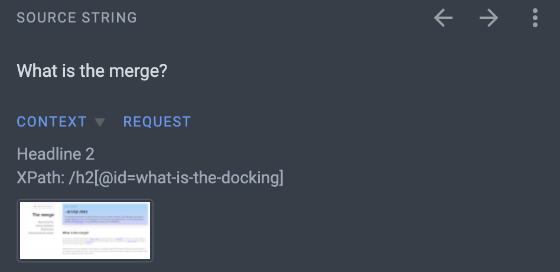
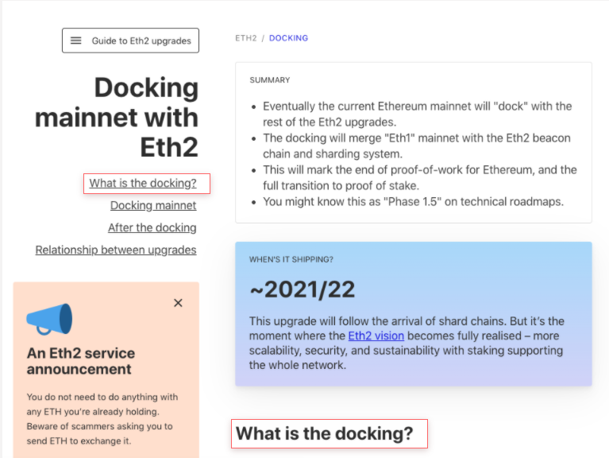

# ethereum.org サイトの翻訳ガイド {#translating-ethereum-guide}

翻訳プログラムが初めてで、飛び込むのをためらっているのであれば、始めるのに役立つこちらの FAQ をご参照ください。 このガイドでは、よくある質問に対する答えを見つけることができます。

## `<HTMLタグ>` がある文字列を翻訳するにはどうすればいいですか? {#tags}

すべての文字列が純粋なテキスト形式で書かれているわけではありません。 HTML タグ(`<0>`, `</0>`)などのスクリプトが含まれている文字列もあります。これは通常、ハイパーリンクや文章の途中でスタイルを変えるためのものです。

- タグ内のテキストは翻訳しますが、タグはそのまま残します。 `<` と `>`の間は、翻訳したり削除しないでください。
- 間違えないようにするために、左下の[Copy Source]ボタンをクリックすることをお勧めします。 クリックすると、元の文字列がコピーされ、テキストボックスに貼り付けられます。 これで、タグがどこにあるかがよくわかり、ミスを避けることができます。

![[Copy Source]ボタンがハイライトされているCrowdinインターフェイス](../../../../../contributing/translation-program/faq/html-tag-strings.png)

あなたの言語でより自然な文章になるよう、文字列内のタグの位置を移動することができますが、すべてのタグを移動するようにしてください。

## 該当する文字列はどこで使われていますか? {#strings}

時にはソースの文字列だけでは、情報が足らず、正確な翻訳ができないことがあります。

- 詳細な情報については、「Screenshot」と「Context」を参照してください。 ソースの文字列セクションに、その文字列がどのように使われているのか、コンテクストが分かるスクリーンショット画像が表示されます。
- それでも不明な場合は、「Comment Section」で質問してください。 [コメントを残す方法が分かりません](#comment)

## コメントや質問をするにはどうすればいいですか? 問題や誤字を指摘したいのですが… {#comment}

もし、注意が必要な特定の文字列を指摘したい場合は、気軽にコメントを投稿してください。

- 右上のバーの 2 番目のボタンをクリックします。 右側に非表示のタブが表示されます。 新しいコメントを記入し、下部にある[Issue]のチェックボックスをクリックしてください。 ドロップダウンメニューからオプションを選択し、問題の種別を指定できます。
- 送信された時点で、私たちのチームに報告されます。 問題を修正してから、コメントに返信してお知らせし、問題をクローズします。

## 翻訳メモリ(TM) とは何ですか? {#translation-memory}

翻訳メモリ(TM)とは、[ethereum.org](http://ethereum.org/)全体で過去に翻訳されたすべての文字列を保存する Crowdin の機能の一つです。 文字列が翻訳されると、自動的にプロジェクトの TM に保存されます。 これは、時間を節約する上で便利なツールになります。

- 「TM and MT Suggestions」のセクションから、他の翻訳者が同じまたは類似する文字列をどのように翻訳したかがわかります。 マッチ率の高い提案を見つけたら、その翻訳をクリックして気軽に使用してください。
- リストに何もない場合は、一貫性を持たせるために、過去の翻訳を TM で検索し、再利用することができます。

## Crowdin の用語集はどのように使用しますか? {#glossary}

新しい技術用語は多くの言語にローカライズされていないため、Ethereum の用語も翻訳作業の中で重要な役割を果たします。 また、文脈によって意味が異なる用語もあります。 [Ethereum 用語の翻訳の詳細](#terminology)

Crowdin の用語集は、用語や定義を明確にするのに最適な場所です。 用語集を参照するには、2 つの方法があります。

- まず、ソースの文字列に下線が引かれている用語を見つけたら、マウスオーバーするとその用語の簡単な定義を見ることができます。

- 次に、知らない単語で下線が引かれていないものの場合は、Glossary タブ(右欄の 3 番目のボタン)から検索することができます。 プロジェクト内で頻繁に使用される用語の説明が表示されます。

- それでも見つからない場合は、新しい用語を追加してください。 検索エンジンで調べて、その説明を用語集に加えることをお勧めします。 他の翻訳者にとっても、その用語をより理解する上で大きな助けとなるでしょう。

### 用語集翻訳ポリシー {#terminology}

_名前(ブランド、企業、人)および新しい技術用語(ETH2、ビーコンチェーンなど)について_

Ethereum には、最近作られた新しい用語がたくさん使われています。 それぞれの言語に公式な翻訳がないため、翻訳者によって用語が異なる場合があります。 このような不一致は、読み手の誤解を生じさせ、また読みやすさも損ないます。

言語の多様性や各言語での標準化が異なるため、対応するすべての言語に適応できる統一された用語翻訳ポリシーを打ち出すことはほぼ不可能でした。

慎重に検討した結果、使用頻度の高い用語については、翻訳者の皆様にお任せすることにしました。

知らない用語が出てきたときにお勧めの方法をご紹介します。

- [Glossary of terms](#glossary)を参照すると、他の翻訳者が過去にどのように翻訳したかが分かる場合があります。 以前に翻訳された用語が適切でないと思われる場合は、Crowdin の Glossary に新しい用語を追加することで、翻訳を修正することができます。
- 過去の翻訳が用語集に存在しない場合は、検索エンジンやメディアの記事などで、その用語が実際にどのように使われているかを調べてみることをお勧めします。
- もし参考文献が全く見つからなかったら、自分の直感を信じて、あなたの言語への新しい翻訳を提案してみてください!
- 自信がない場合は、その用語を翻訳せずに英語のまま残しておきます。 正確な意味を提供するには、英語のままで十分な場合があります。

ブランド名、会社名、人名などは、翻訳すると余計な混乱や SEO 上の問題が生じる可能性があるため、翻訳しないことをお勧めします。

## お問い合わせ {#contact}

これら全文を読んでいただき、ありがとうございました。 本書があなたが翻訳プログラムに参加するのに役立つことを願っています。 [Discord translation channel](https://discord.gg/TkJFaewsaM) に参加して、質問をしたり、他の翻訳者とコラボレーションしてください!
