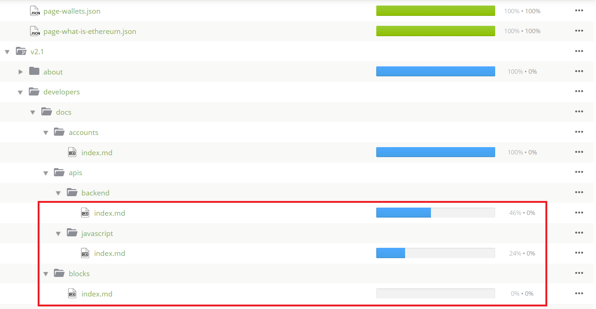
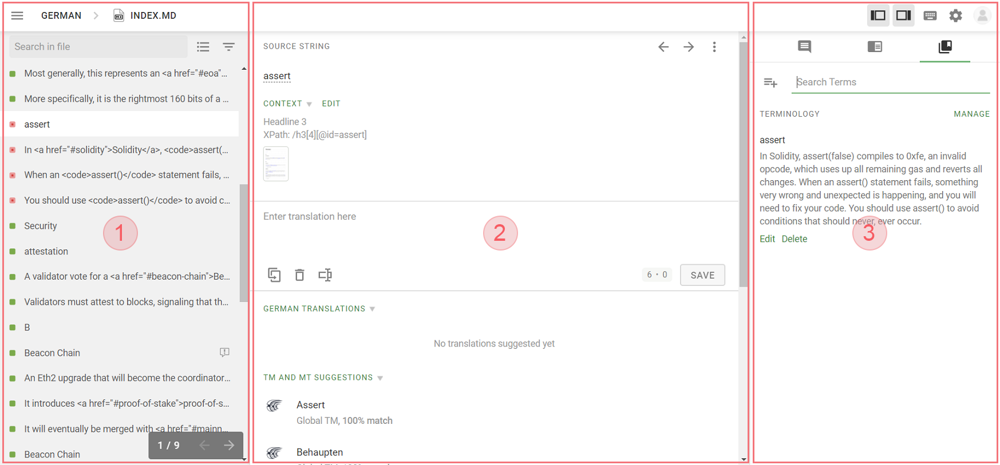

# 翻訳プログラム {#translation-program}

翻訳プログラムは、世界中の何十億もの英語を話さない人たちが、よりアクセスしやすくなるように、ethereum.org をさまざまな言語に翻訳するための共同作業です。

これまでの進捗:

- **2,000 人**以上の翻訳者
- **37** 言語に対応
- **190 万語**の翻訳(2021 年)

ウェブサイトを自分の言語に翻訳して、グローバルな Ethereum コミュニティの発展に貢献したいとお考えの方は、以下の手順に従ってください。

<InfoBanner shouldCenter emoji=":tada:">
  申請して、POAPトークンを受け取りましょう! 2021年にethereum.orgの翻訳をした方には、特別なPOAPが準備されています。<a href="/contributing/#poap"> POAPについての詳細</a>
</InfoBanner>

## ミッションとビジョン {#mission-and-vision}

Ethereum コミュニティはグローバルで包括的であることを目指していますが、そのコンテンツの多くは英語を話す人向けになっており、世界 60 億人の英語を話さない人たちを考慮していません。 ethereum.org が世界中のコミュニティにとって Ethereum へのポータルとして機能するためには、英語を話さない人に母国語で Ethereum のコンテンツを提供することが不可欠だと考えています。

その中で、ethereum.org 翻訳プログラムは、ethereum.org やその他の Ethereum コンテンツをできるだけ多くの言語に翻訳することで、誰もが Ethereum にアクセスできるようにすることを目的としています。

**私たちのミッション**

- 世界中の訪問者が母国語で Ethereum について学べるよう、サイトの翻訳版の提供
- グローバルな Ethereum コミュニティへのより多くのメンバーの参加の促進
- Ethereum の情報や知識を、よりアクセスしやすく、より包括的に共有
- コミュニティメンバーが Ethereum に翻訳を提供し、エコシステムに足跡を残すことを実現
- エコシステムに参加しようとしている熱心な貢献者を特定し、連絡を取り、ガイダンスの提供

**私たちのビジョン**

- できるだけ多くの国や地域の Ethereum コミュニティのメンバーのために、必要なコンテンツの翻訳
- 言語を超えた知識の共有をサポートし、より多くの情報と知識を持つ Ethereum コミュニティの構築
- 英語を話さない人がエコシステムに参加することを妨げる言語の障壁を取り除くことで、Ethereum の包括性とアクセシビリティの向上

## 翻訳方法 {#how-to-translate}

1. **[Crowdin でのプロジェクト参加](https://crowdin.com/project/ethereum-org/invite)**  
   Crowdin のアカウントにログイン、まだアカウントをお持ちでない場合はサインアップする必要があります。 サインアップに必要なのは、E メールとパスワードだけです。

2. **翻訳したい言語を開き、作業するドキュメントを検索**  
   ウェブサイトのコンテンツは、いくつかのドキュメントと言語のバージョンに分かれています。 各ドキュメントの進捗状況は右側で確認できます。翻訳の進捗が 100％以下の場合は、ぜひご協力ください!

   あなたの言語が表示されてない場合は、 [問題を報告](https://github.com/ethereum/ethereum-org-website/issues/new/choose)してください

   

   コンテンツのバージョンについての注意点: 追加されたコンテンツの翻訳が遅れることを防ぐために、Crowdin 内でバージョン管理を行っています。 言語をチェックするとき、例えば  [フィリピン語](https://crowdin.com/project/ethereum-org/fil#)  をクリックすると、サイトのバージョンごとのフォルダ（v2.0、v2.1 など）が表示されます。

   バージョンの低いものから順にサイトに更新されていきますので、まずはバージョンの低いものから翻訳していただき、徐々にバージョンを上げていってください(v.2.0 → v.2.1 → v.2.2 → ⋯)。

   [ethereum.org コンテンツのバージョンについてはこちらをご覧ください。](/contributing/translation-program/content-versions/)

3. **翻訳**  
   翻訳したいファイルを選択すると、オンラインエディターが開きます。 Crowdin を使ったことがない方は、このクイックガイドで基本的なことを確認してください。

   

   **_1 - 左サイドバー_**

   - Untranslated (赤) - まだ翻訳されていないテキスト。 これらは、翻訳が必要な文字列です。
   - Translated (緑) - 翻訳はされていますが、まだレビューされていないテキスト。 別の翻訳を提案したり、エディタの「+」と「-」ボタンを使って、既存の翻訳への投票が自由にできます。
   - Approved (チェックマーク) - すでにレビューが完了し、現在ウェブサイトに掲載されているテキスト。

   また、上部のボタンを使って、特定の文字列を検索したり、ステータスでフィルタリングしたり、表示を変更したりすることができます。

   **_2 - エディターエリア_**

   メインの翻訳エリア - 原文が上部に表示され、追加でコンテキストやスクリーンショットがある場合はそれらも表示されます。 新しい翻訳を提案するには、「Enter translation here」の欄に翻訳を入力し、[Save]をクリックします。

   また、このセクションでは、文字列の既存の翻訳や他の言語への翻訳のほか、翻訳メモリの一致や機械翻訳の候補も見つけることができます。

   **_3 - 右サイドバー_**

   ここには、コメントや翻訳メモリのエントリ、用語集のエントリがあります。 デフォルトの表示では、コメントが表示され、翻訳者がコミュニケーションを取ったり、問題を提起したり、間違った翻訳を報告したりすることができます。

   また、上部のボタンで、既存の翻訳を検索できる「翻訳メモリ」や、重要な用語の説明や標準的な翻訳を収録した「用語集」に切り替えることができます。

   詳細をご希望の場合は、 [Crowdin オンラインエディターの使用方法に関するドキュメント](https://support.crowdin.com/online-editor/)をご参照ください。

4. **レビュープロセス**  
   翻訳が完了したら(コンテンツバージョンの全ファイルが 100％と表示)、プロの翻訳サービスがコンテンツをレビューします。またレビューの際は、編集する場合もあります。 レビューが完了(レビューの進捗率が 100％)したら、ウェブサイトに追加されます。

何かご質問がある場合や 私たちのチームや他の翻訳者とコラボレーションしたい場合は、 [ethereum.org Discord server](https://discord.gg/6WX7E97)の#translation チャネルに投稿してください。

または、translations@ethereum.orgまでご連絡ください

ethereum.org 翻訳プログラムにご参加いただき、ありがとうございます。

<InfoBanner shouldCenter emoji=":information_source:">
  翻訳のお手伝いをされている方は、「翻訳に関するFAQ」に役立つ情報が掲載されていますので、ご一読ください。 
  {" "}<a href="/contributing/translation-program/faq/">ethereum.orgの翻訳に関するFAQ</a>
</InfoBanner>

## リソース {#resources}

**ツール**

- [Microsoft Language Portal](https://www.microsoft.com/en-us/language) _– 技術用語の標準的な訳語を検索・確認するのに便利なポータル_
- [Linguee](https://www.linguee.com/) _– 単語やフレーズでの検索が可能な翻訳・辞書検索エンジン_
- [Proz term search](https://www.proz.com/search/) _– 専門用語の翻訳辞書・用語集のデータベース_
- [Eurotermbank](https://www.eurotermbank.com/) _– 42 言語の欧州用語集_

**コミュニティ**

- [Language-specific Translation Groups](https://discord.gg/6WX7E97) _– ethereum.org の翻訳者を翻訳グループにつなげるイニシアティブ_
- [中国語翻訳者グループ](https://www.notion.so/Ethereum-org-05375fe0a94c4214acaf90f42ba40171) _– 中国語翻訳者間の調整を容易にするノーションページ_

**バージョンの概要**

- [コンテンツバージョン](/contributing/translation-program/content-versions/) _– ethereum.org の各コンテンツバージョンに含まれてるページ_

**最新情報**

最新の翻訳プログラムの進捗状況については、[イーサリアム財団ブログ](https://blog.ethereum.org/)をご覧ください。

- [2020 年 12 月マイルストーンの更新](https://blog.ethereum.org/2020/12/21/translation-program-milestones-updates-20/)
- [2020 年 7 月のマイルストーンの更新](https://blog.ethereum.org/2020/07/29/ethdotorg-translation-milestone/)
- [2019 年 8 月翻訳プログラム始動](https://blog.ethereum.org/2019/08/20/translating-ethereum-for-our-global-community/)

## Ethereum ステーキング・ローンチパッドの翻訳 {#staking-launchpad}

翻訳コミュニティでは、 [ステーキング・ローンチパッド](https://launchpad.ethereum.org/en/) の翻訳にも取り組んでいます。 これにより、誰でも Ethereum のバリデータとして設定でき、Ethereum ネットワークを保護することができます。 ローンチパッドは現在 17 言語に対応しています。

ご興味があれば、[Crowdin の Ethereum ステーキングローンチパッドの翻訳プロジェクトにご参加ください](https://crowdin.com/project/ethereum-staking-launchpad)。 Crowdin で利用できない言語がある場合は、GitHub で[問題を作成](https://github.com/ethereum/staking-launchpad/issues/new)して、新しい言語の追加をリクエストすることができます。
