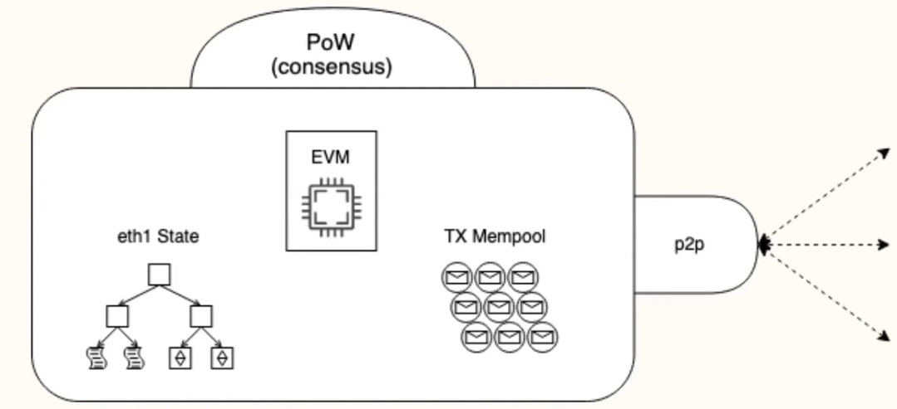
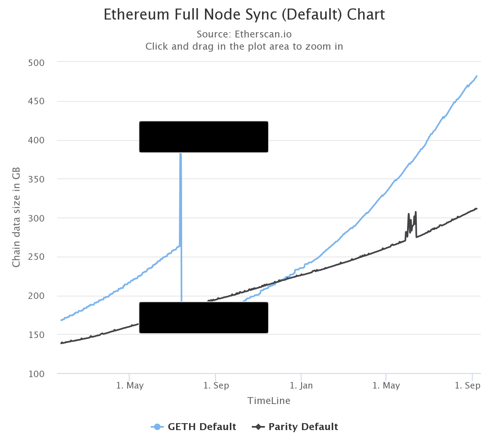
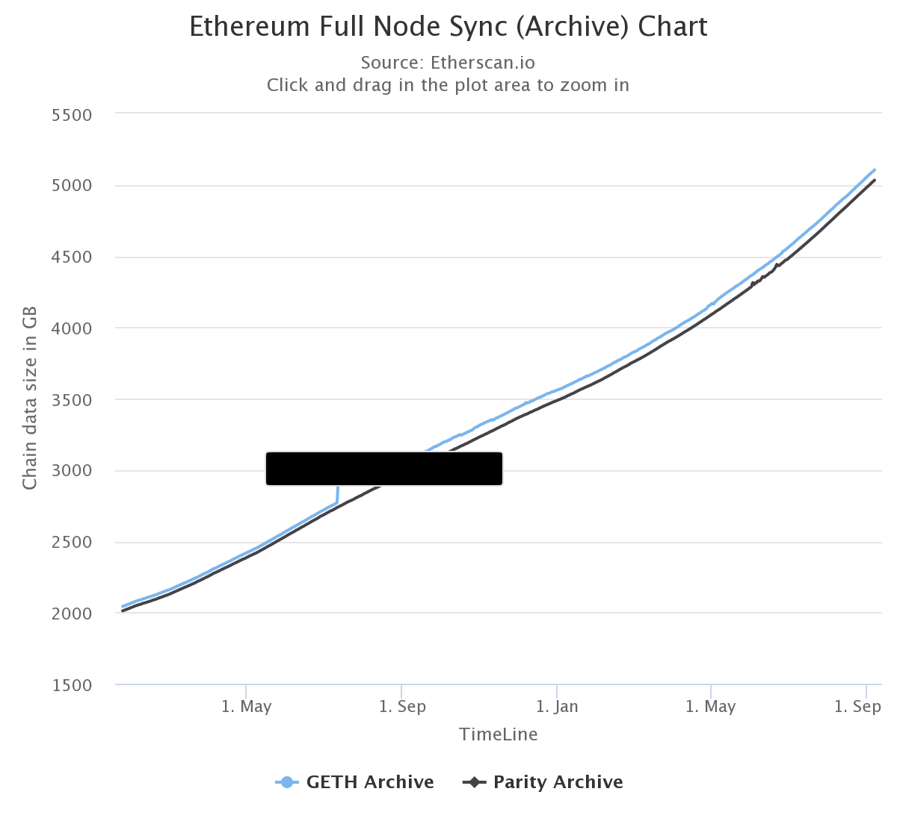

Aby Ethereum działało w sposób zdecentralizowany, potrzebuje rozproszonej sieci węzłów, która może weryfikować bloki i dane transakcji. Potrzebujesz aplikacji znanej jako klient, aby „uruchomić węzeł”.

## Wymagania wstępne {#prerequisites}

Powinieneś zrozumieć koncepcję zdecentralizowanej sieci, zanim zagłębisz się w nią i uruchomisz własną instancję klienta Ethereum. Spójrz na nasze [wprowadzenie do Ethereum](/developers/docs/intro-to-ethereum/).

## Czym są węzły i klienci? {#what-are-nodes-and-clients}

„Węzeł” odnosi się do oprogramowania znanego jako klient. Klient jest implementacją Ethereum, która za zadanie ma weryfikację wszystkich transakcji w kolejnych blokach, utrzymywać bezpieczeństwo sieci i poprawność danych.

Możesz zobaczyć widok sieci Ethereum w czasie rzeczywistym, patrząc na [mapę węzłów](https://etherscan.io/nodetracker).

Wiele [implementacji klientów Ethereum](/developers/docs/nodes-and-clients/#execution-clients) istnieje w wielu językach. Cechą wspólną tych implementacji klienckich jest to, że wszystkie są zgodne z formalną specyfikacją. Ta specyfikacja określa, jak działa sieć Ethereum i blockchain.

 Uproszczony schemat funkcji klienta Ethereum.

## Typy węzłów {#node-types}

Jeśli chcesz uruchomić swój własny węzeł, powinieneś zrozumieć, że istnieją różne typy węzłów, które zużywają dane w inny sposób. W rzeczywistości klienci mogą uruchamiać 3 różne typy węzłów — lekki, pełny i archiwalny. Istnieją również opcje różnych strategii synchronizacji, które umożliwiają szybszą synchronizację. Synchronizacja odnosi się do tego, jak szybko może uzyskać najbardziej aktualne informacje o stanie Ethereum.

### Pełny węzeł {#full-node}

- Przechowuje pełne dane blockchainu.
- Uczestniczy w walidacji bloków, weryfikuje wszystkie bloki i stany.
- Wszystkie stany mogą pochodzić z pełnego węzła.
- Obsługuje sieć i dostarcza dane na żądanie.

### Lekki węzeł {#light-node}

- Przechowuje łańcuch nagłówków i żąda wszystkiego innego.
- Potrafi zweryfikować poprawność danych względem korzeni stanu w nagłówkach bloków.
- Przydatne dla urządzeń o niskiej przepustowości, takich jak urządzenia wbudowane lub telefony komórkowe, które nie stać na przechowywanie gigabajtów danych blockchainu.

### Węzeł archiwum {#archive-node}

- Przechowuje wszystko w pełnym węźle i buduje archiwum stanów historycznych. Potrzebne, jeśli chcesz zapytać o coś takiego jak saldo konta w bloku #4 000,000.
- Dane te reprezentują jednostki terabajtów, co sprawia, że ​​węzły archiwów są mniej atrakcyjne dla przeciętnych użytkowników, ale mogą być przydatne w przypadku usług takich jak eksploratory bloków, dostawcy portfeli i analizy łańcuchów.

Synchronizowanie klientów w dowolnym trybie innym niż archiwum spowoduje wyczyszczenie danych łańcucha bloków. Oznacza to, że nie ma archiwum wszystkich stanów historycznych, ale cały węzeł jest w stanie budować je na żądanie.

## Dlaczego należy uruchomić węzeł Ethereum? {#why-should-i-run-an-ethereum-node}

Uruchomienie węzła pozwala Ci bezspornie i prywatnie korzystać z Ethereum podczas wspierania ekosystemu.

### Korzyści dla Ciebie {#benefits-to-you}

Prowadzenie własnego węzła umożliwia korzystanie z Ethereum w sposób naprawdę prywatny, samowystarczalny i pozbawiony zaufania. Nie musisz ufać sieci, ponieważ możesz samodzielnie zweryfikować dane ze swoim klientem. „Nie ufaj, sprawdź” jest popularną mantrą blockchainu.

- Twój węzeł samodzielnie weryfikuje wszystkie transakcje i bloki pod kątem zasad konsensusu. Oznacza to, że nie musisz polegać na żadnych innych węzłach w sieci ani w pełni im zaufać.
- Nie będziesz musiał ujawniać swoich adresów i sald do przypadkowych węzłów. Wszystko można sprawdzić z własnym klientem.
- Twoja zdecentralizowana aplikacja może być bezpieczniejsza i bardziej prywatna, jeśli używasz własnego węzła. [MetaMask](https://metamask.io), [MyEtherWallet](https://myetherwallet.com) i kilka innych portfeli można łatwo skierować na swój własny lokalny węzeł.

### Korzyści dla sieci {#network-benefits}

Różnorodny zestaw węzłów jest ważny dla zdrowia, bezpieczeństwa i odporności operacyjnej Ethereum.

- Zapewniają one dostęp do danych blockchainu dla niewielkich klientów, którzy od niego zależą. W szczytowych okresach użytkowania musi być wystarczająca liczba pełnych węzłów, aby ułatwić synchronizację lekkich węzłów. Lekkie węzły nie przechowują całego łańcucha bloków, zamiast tego weryfikują dane za pomocą [głównych stanów w nagłówkach bloków](/developers/docs/blocks/#block-anatomy). Mogą żądać więcej informacji od bloków, jeśli ich potrzebują.
- Pełne węzły wymuszają reguły konsensusu proof-of-work, więc nie można ich oszukać w celu zaakceptowania bloków, które ich nie przestrzegają. Zapewnia to dodatkowe bezpieczeństwo w sieci, ponieważ jeśli wszystkie węzły były lekkimi węzłami, które nie przeprowadzają pełnej weryfikacji, górnicy mogą zaatakować sieć i na przykład tworzyć bloki z wyższymi nagrodami.

Jeśli uruchomisz pełny węzeł, korzysta z niego cała sieć Ethereum.

## Uruchamianie własnego węzła {#running-your-own-node}

### Projekty {#projects}

[**Wybierz klienta i postępuj zgodnie z jego instrukcjami**](#clients)

**ethnode —** **_uruchom węzeł Ethereum (Geth lub Parity) do celów rozwoju lokalnego._**

- [GitHub](https://github.com/vrde/ethnode)

**DAppNode —** **_system operacyjny do uruchamiania węzłów Web3, w tym Ethereum, na dedykowanym komputerze._**

- [dappnode.io](https://dappnode.io)

### Źródła {#resources}

- [Uruchamianie pełnych węzłów Ethereum: kompletny przewodnik](https://medium.com/coinmonks/running-ethereum-full-nodes-a-guide-for-the-barely-motivated-a8a13e7a0d31) _7 listopada 2019 r. – Justin Leroux_
- [Schemat konfiguracji węzła](https://dev.to/5chdn/ethereum-node-configuration-modes-cheat-sheet-25l8) _5 stycznia, 2019 – Afryka Schoeden_
- [Jak zainstalować i uruchomić węzeł Geth](https://www.quiknode.io/guides/infrastructure/how-to-install-and-run-a-geth-node) _4 października 2020 r. – Sahil Sen_
- [Jak zainstalować i uruchomić węzeł OpenEthereum (poprzednio węzeł parzystości)](https://www.quiknode.io/guides/infrastructure/how-to-run-a-openethereum-ex-parity-client-node) _22 września 2020 r. – Sahil Sen_

## Alternatywy {#alternatives}

Uruchamianie własnego węzła może być trudne i nie zawsze musisz uruchamiać własną instancję. W tym przypadku możesz użyć zewnętrznego dostawcy API, takiego jak [Infura](https://infura.io), [Alchemia](https://alchemyapi.io) lub [QuikNode](https://www.quiknode.io). Alternatywnie [ArchiveNode](https://archivenode.io/) to wspierany przez społeczność węzeł archiwizacji, który ma nadzieję na przekazanie danych archiwalnych w blockchain Ethereum niezależnym programistom, którzy w przeciwnym razie nie mogli sobie na nie pozwolić.

Jeśli ktoś uruchamia węzeł Ethereum z publicznym API w Twojej społeczności, możesz wskazać swoje lekkie portfele (takie jak MetaMask) do węzła społeczności [za pośrednictwem niestandardowego RPC](https://metamask.zendesk.com/hc/en-us/articles/360015290012-Using-a-Local-Node) i zyskać większą prywatność niż korzystając z zaufanej trzeciej strony.

Z drugiej strony, jeśli uruchamiasz klienta, możesz podzielić się nim ze znajomymi, którzy mogą tego potrzebować.

## Klienci {#execution-clients}

Ethereum jest zaprojektowany do oferowania różnych klientów, stworzonych przez różne zespoły przy użyciu różnych języków programowania. Dzięki temu sieć jest silniejsza i bardziej zróżnicowana. Idealnym celem jest osiągnięcie różnorodności bez zdominowania przez żadnego klienta w celu zmniejszenia pojedynczych punktów niepowodzenia.

W tabeli przedstawiono podsumowanie poszczególnych klientów. Wszystkie z nich są aktywnie opracowywane, utrzymywane i przechodzą [testy klienckie](https://github.com/ethereum/tests).

| Klient                                                       | Język    | Systemy operacyjne    | Sieci                                     | Strategie synchronizacji       | Wycinanie stanu |
| ------------------------------------------------------------ | -------- | --------------------- | ----------------------------------------- | ------------------------------ | --------------- |
| [Geth](https://geth.ethereum.org/)                           | Go       | Linux, Windows, macOS | Mainnet, Görli, Rinkeby, Ropsten          | Szybka, pełna                  | Archive, Pruned |
| [OpenEthereum](https://github.com/openethereum/openethereum) | Rust     | Linux, Windows, macOS | Mainnet, Kovan, Ropsten i więcej          | Warp, pełna                    | Archive, Pruned |
| [Nethermind](http://nethermind.io/)                          | C#, .NET | Linux, Windows, macOS | Mainnet, Görli, Ropsten, Rinkeby I więcej | Szybka, pełna                  | Archive, Pruned |
| [Besu](https://besu.hyperledger.org/en/stable/)              | Java     | Linux, Windows, macOS | Mainnet, Rinkeby, Ropsten, i Görli        | Szybka, pełna                  | Archive, Pruned |
| [Trinity](https://trinity.ethereum.org/)                     | Python   | Linux, macOS          | Mainnet, Görli, Ropsten, Rinkeby i więcej | Pełna, wiązka, szybka/nagłówek | Archive         |

Więcej informacji o obsługiwanych sieciach znajdziesz w rozdziale [Sieci Ethereum](/developers/docs/networks/).

### Zalety różnych implementacji {#advantages-of-different-implementations}

Każdy klient ma unikalne przypadki i zalety, więc powinieneś wybrać jeden na podstawie własnych preferencji. Różnorodność pozwala implementacjom skupić się na różnych funkcjach i odbiorcach. Możesz wybrać klienta na podstawie funkcji, wsparcia, języka programowania lub licencji.

#### Go Ethereum {#geth}

Go Ethereum (w skrócie Geth) jest jedną z oryginalnych implementacji protokołu Ethereum. Obecnie jest to najbardziej rozpowszechniony klient z największą bazą użytkowników i różnorodnością narzędzi dla użytkowników i programistów. Jest napisany w Go, w pełni open source i licencjonowany na mocy GNU LGPL v3.

#### OpenEthereum {#openethereum}

OpenEthereum jest szybkim, bogatym w funkcje i zaawansowanym klientem Ethereum opartym na CLI. Został zbudowany w celu zapewnienia niezbędnej infrastruktury dla szybkich i niezawodnych usług, które wymagają szybkiej synchronizacji i maksymalnego czasu pracy. Celem OpenEthereum jest być najszybszy, najlżejszy i najbezpieczniejszy klient Ethereum. Zapewnia czystą, modułową bazę kodową pozwalającą na:

- łatwe dostosowywanie.
- łatwą integrację z usługami lub produktami.
- minimalną ilość pamięci i miejsca przechowywania.

OpenEthereum jest rozwijany przy użyciu najnowocześniejszego języka programowania Rust i licencjonowanego na licencji GPLv3.

#### Nethermind {#nethermind}

Nethermind to implementacja Ethereum stworzona za pomocą stosu technologicznego C# .NET, działająca na wszystkich głównych platformach, w tym ARM. Oferuje ona wspaniałe wyniki dzięki:

- zoptymalizowanej maszynie wirtualnej
- dostępowi do stanu
- funkcjom sieciowym i bogatym funkcjom, takim jak pulpity nawigacyjne Prometheus/Graphana, obsługa rejestrowania sekwencyjnego dla przedsiębiorstw, śledzenie RPC JSON i wtyczki analityczne.

Nethermind ma również [dokładną dokumentację](https://docs.nethermind.io), silne wsparcie dla programistów, społeczność online i wsparcie 24/7 dostępne dla użytkowników premium.

#### Besu {#besu}

Hyperledger Besu to klient Ethereum klasy korporacyjnej dla sieci publicznych i autoryzowanych. Obsługuje wszystkie funkcje sieci głównej Ethereum, od śledzenia do GraphQL, ma rozbudowany monitoring i jest obsługiwany przez ConsenSys, zarówno w otwartych kanałach społecznościowych, jak i poprzez komercyjne umowy SLA dla przedsiębiorstw. Jest napisany w Java i jest licencjonowany Apache 2.0.

### Tryb synchronizacji {#sync-modes}

- Pełna – pobiera wszystkie bloki (w tym nagłówki, transakcje i paragony) i generuje stan łańcucha bloków stopniowo poprzez wykonanie każdego bloku.
- Szybka (domyślna) – pobiera wszystkie bloki (w tym nagłówki, transakcje i paragony), weryfikuje wszystkie nagłówki i pobiera stan i weryfikuje go w nagłówkach.
- Lekki – pobiera wszystkie nagłówki bloków, dane bloków i weryfikuje niektóre losowo.
- Synchronizacja warp – co 5000 bloków, węzły wykonają migawkę o krytycznym znaczeniu dla konsensusu. Każdy węzeł może pobrać te zrzuty w sieci, umożliwiając szybką synchronizację. [Więcej o warp](https://openethereum.github.io/wiki/Warp-Sync-Snapshot-Format)
- Synchronizacja beam – tryb synchronizacji, który umożliwia szybsze działanie. Nie wymaga długich oczekiwań na synchronizację, zamiast tego wypełnia dane z upływem czasu. [Więcej o beam](https://medium.com/@jason.carver/intro-to-beam-sync-a0fd168be14a)
- Synchronizacja nagłówka – możesz użyć zaufanego punktu kontrolnego, aby rozpocząć synchronizację od nowszego nagłówka, a następnie pozostawić to procesowi w tle, aby ostatecznie wypełnić luki

Typ synchronizacji określasz podczas konfiguracji, na przykład:

**Konfigurowanie synchronizacji lekkiej w [GETH](https://geth.ethereum.org/)**

`geth --syncmode "light"`

**Konfigurowanie synchronizacji nagłówka w Trinity**

`trinity --sync-from-checkpoint eth://block/byhash/0xa65877df954e1ff2012473efee8287252eee956c0d395a5791f1103a950a1e21?score=15,835,269,727,022,672,760,774`

## Sprzęt {#hardware}

Wymagania sprzętowe różnią się w zależności od klienta, ale zazwyczaj nie są wysokie, ponieważ węzeł musi po prostu pozostać zsynchronizowany. Nie należy mylić tego z wydobywaniem, które wymaga dużo większej mocy obliczeniowej. Jednak czas synchronizacji i wydajność poprawiają się dzięki mocniejszemu sprzętowi. W zależności od Twoich potrzeb i pragnień, Ethereum można uruchomić na Twoim komputerze, serwerze domowym, komputerach jednopłytowych lub wirtualnych serwerach prywatnych w chmurze.

Prostym sposobem na uruchomienie własnego węzła jest użycie wtyczek „plug and play”, takich jak [DAppNode](https://dappnode.io/). Zapewnia sprzęt do uruchamiania klientów i aplikacji od nich zależnych z prostym interfejsem użytkownika.

### Wymagania {#requirements}

Przed zainstalowaniem klienta upewnij się, że komputer ma wystarczającą ilość zasobów, aby go uruchomić. Poniżej znajdują się minimalne i zalecane wymagania, jednak kluczowym elementem jest przestrzeń dyskowa. Synchronizacja blockchainu Ethereum jest bardzo intensywna pod kątem wejścia/wyjścia. Najlepiej mieć dysk półprzewodnikowy (SSD). Aby uruchomić klienta Ethereum na dysku twardym, potrzebujesz co najmniej 8 GB pamięci RAM jako pamięci podręcznej.

#### Minimalne wymagania {#recommended-specifications}

- Procesor z 2+ rdzeniami
- Minimum 4 GB RAM z SSD, 8 GB+ jeśli masz HDD
- Przepustowość 8 Mbit/s

#### Zalecane specyfikacje {#recommended-specifications}

- Szybki procesor z ponad 4 rdzeniami
- 16 GB+ RAM
- Szybki SSD z co najmniej 500 GB wolnego miejsca
- 25+ Mbit/s przepustowość

W zależności od tego, które oprogramowanie i tryb synchronizacji mają być używane, potrzebne są setki GB przestrzeni dyskowej. Przybliżone wartości i wzrost można znaleźć poniżej.

| Klient          | Rozmiar dysku (szybka synchronizacja) | Rozmiar dysku (pełne archiwum) |
| --------------- | ------------------------------------- | ------------------------------ |
| Klient Ethereum | 400 GB+                               | 4,7 TB+                        |
| OpenEthereum    | 280 GB+                               | 4,6 TB+                        |
| Nethermind      | 200 GB+                               | 3 TB+                          |
| Besu            | 750 GB+                               | 4 TB+                          |

Te wykresy pokazują, jak zawsze zmieniają się wymagania dotyczące przechowywania. Aby uzyskać najbardziej aktualne dane dla Geth i Parity, zobacz [pełną synchronizację danych](https://etherscan.io/chartsync/chaindefault) i [archiwum danych synchronizacji](https://etherscan.io/chartsync/chainarchive).

### Ethereum na komputerze jednopłytowym {#ethereum-on-a-single-board-computer}

Najbardziej wygodnym i tanim sposobem uruchomienia węzła Ethereum jest korzystanie z jednego komputera z architekturą ARM jak Raspberry Pi. [Ethereum na ARM](https://twitter.com/EthereumOnARM) dostarcza obrazy klientów Geth, Parity, Nethereumd i Besu. Oto prosty samouczek [jak zbudować i skonfigurować klienta ARM](/developers/tutorials/run-node-raspberry-pi/).

Małe, niedrogie i wydajne urządzenia, takie jak te, są idealne do uruchomienia węzła w domu.

## Klienci Eth2 {#consensus-clients}

Pojawili się nowi klienci obsługujący [aktualizacje Eth2](/upgrades/beacon-chain/). Będą obsługiwać łańcuch śledzący i wspierać nowy mechanizm konsensusu [proof-of-stake](/developers/docs/consensus-mechanisms/pos/).

[Wyświetl klientów Eth2](/upgrades/get-involved/#clients).

## Dalsza lektura {#further-reading}

W Internecie jest wiele instrukcji i informacji o klientach Ethereum, tutaj jest kilka, które mogą być pomocne.

- [Ethereum 101 – Część 2 – Zrozumienie węzłów](https://kauri.io/ethereum-101-part-2-understanding-nodes/48d5098292fd4f11b251d1b1814f0bba/a) _–Wil Barnes, 13 lutego 2019_
- [Uruchamianie pełnych węzłów Ethereum: kompletny przewodnik](https://medium.com/@JustinMLeroux/running-ethereum-full-nodes-a-guide-for-the-barely-motivated-a8a13e7a0d31) _7 listopada 2019 r. – Justin Leroux_
- [Uruchomiono węzeł Ethereum](https://docs.ethhub.io/using-ethereum/running-an-ethereum-node/) _– ETHHub, często aktualizowany_
- [Analizowanie wymagań sprzętowych dla Ethereum w pełni zweryfikowany węzeł](https://medium.com/coinmonks/analyzing-the-hardware-requirements-to-be-an-ethereum-full-validated-node-dc064f167902) _– Albert Palau, 24 września 2018 r._
- [Uruchomienie węzła Besu na Ethereum Mainnet: Korzyści, Wymagania i Ustawienia](https://pegasys.tech/running-a-hyperledger-besu-node-on-the-ethereum-mainnet-benefits-requirements-and-setup/) _– Felipe Faraggi, 7 maja 2020_

## Powiązane tematy {#related-topics}

- [Bloki](/developers/docs/blocks/)
- [Sieci](/developers/docs/networks/)

## Powiązane samouczki {#related-tutorials}

- [Uruchamianie węzła za pomocą Geth](/developers/tutorials/run-light-node-geth/) _– Jak pobrać, zainstalować i uruchomić Geth. Omówienie trybów synchronizacji, konsoli JavaScript i więcej._
- [Turn your Raspberry Pi 4 into an Eth 1.0 or Eth 2.0 node just by flashing the MicroSD card – Installation guide](/developers/tutorials/run-node-raspberry-pi/) _– Flash your Raspberry Pi 4, plug in an ethernet cable, connect the SSD disk and power up the device to turn the Raspberry Pi 4 into a full Ethereum 1.0 node or an Ethereum 2.0 node (beacon chain / validator)._
