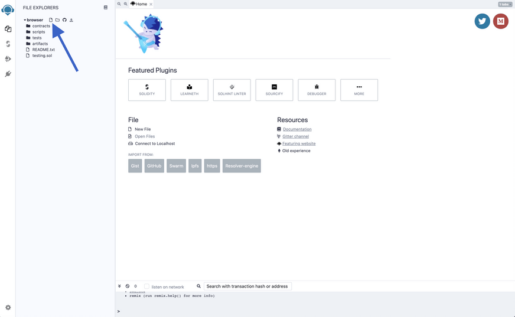
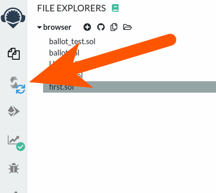
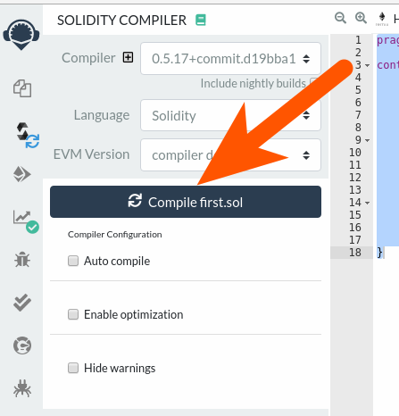
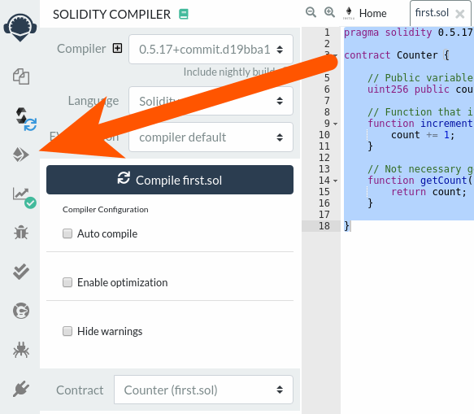
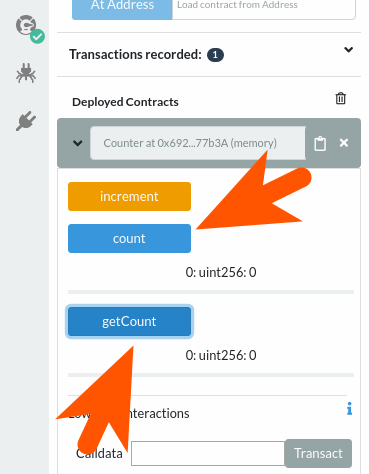
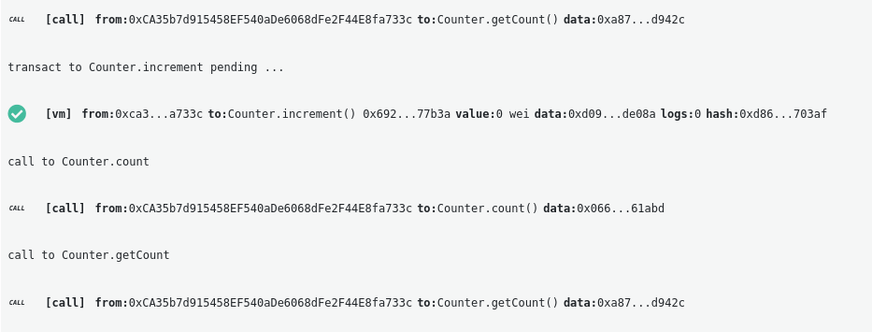
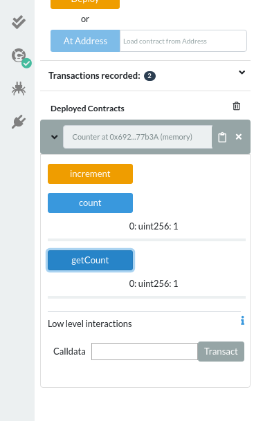

Chyba jesteś tak samo podekscytowany jak my [wdrażaniem](/developers/docs/smart-contracts/deploying/) i interakcją z pierwszym [inteligentnym kontraktem](/developers/docs/smart-contracts/) na blockchainie Ethereum.

Nie martw się, ponieważ jest to nasz pierwszy inteligentny kontrakt, wdrożymy go w [lokalnej sieci testowej](/developers/docs/networks/), więc wdrożenie nic nie kosztuje i możesz bawić się nim tyle, ile chcesz.

## Pisanie kontraktu {#writing-our-contract}

Pierwszym krokiem jest [odwiedzenie Remix](https://remix.ethereum.org/) i utworzenie nowego pliku. W lewej górnej części interfejsu Remix dodaj nowy plik i wprowadź żądaną nazwę pliku.



W nowym pliku wkleimy następujący kod.

```solidity
pragma solidity 0.5.17;

contract Counter {

    // Public variable of type unsigned int to keep the number of counts
    uint256 public count = 0;

    // Function that increments our counter
    function increment() public {
        count += 1;
    }

    // Not necessary getter to get the count value
    function getCount() public view returns (uint256) {
        return count;
    }

}
```

Jeśli masz doświadczenie w programowaniu, możesz łatwo odgadnąć, co robi ten program. Oto wyjaśnienie kolejnych wierszy:

- Wiersz 3: Określamy kontrakt nazwą `Counter`.
- Wiersz 6: Nasz kontrakt przechowuje jedną niepodpisaną liczbę całkowitą o nazwie `count` zaczynając od 0.
- Wiersz 9: Pierwsza funkcja zmieni stan kontraktu i zwiększy `increment()` zmienną `count`>.
- Wiersz 14: Druga funkcja to tylko getter, który może odczytywać wartość zmiennej `count` poza inteligentnym kontraktem. Zauważ, że ponieważ zdefiniowaliśmy zmienną `count` jako publiczną, to nie jest konieczne, ale jest to przykład.

To wszystko dotyczy naszego pierwszego prostego inteligentnego kontraktu. Jak możesz wiedzieć, wygląda to na klasę z języków programowania obiektowego takich jak Java lub C++. Nadszedł czas, aby pobawić się naszym kontraktem.

## Wdrażanie kontraktu {#deploying-our-contract}

Ponieważ napisaliśmy pierwszy inteligentny kontrakt, teraz wdrożymy go w blockchainie, aby móc się nim bawić.

[Wdrażanie inteligentnego kontraktu w blockchainie](/developers/docs/smart-contracts/deploying/) to w rzeczywistości tylko wysłanie transakcji zawierającej kod skompilowanego inteligentnego kontraktu bez określania odbiorców.

Najpierw [skompilujemy kontrakt](/developers/docs/smart-contracts/compiling/), klikając ikonę kompilacji po lewej stronie:



Następnie kliknij przycisk kompilacji:



Możesz wybrać opcję „Automatyczna kompilacja”, aby umowa była zawsze kompilowana po zapisaniu zawartości w edytorze tekstowym.

Następnie przejdź do ekranu wdrażania i uruchamiania transakcji:



Po przejściu do ekranu „wdróż i uruchom” transakcje sprawdź dokładnie, czy pojawia się nazwa Twojego kontraktu i kliknij Wdróż. Jak widać na górze strony, obecne środowisko to „Maszyna wirtualna JavaScript”, co oznacza, że ​​wdrożymy inteligentny kontrakt i będziemy nad nim pracować w lokalnym testowym blockchainie, aby móc testować szybciej i bez żadnych opłat.


Po kliknięciu przycisku „Wdróż” na dole pojawi się Twój kontrakt. Kliknij strzałkę po lewej stronie, aby ją rozwinąć i wyświetlić zawartość kontraktu. To jest utworzona zmienna `counter`, funkcja `increment()` i getter `getCounter()`.

Jeśli klikniesz przycisk `count` lub `getCount`, zostanie pobrana i wyświetlona zmienna `count`. Ponieważ funkcja `increment` nie została jeszcze wywołana, wyświetli 0.



Wywołajmy funkcję `increment`, klikając przycisk. Zobaczysz dzienniki transakcji, wyświetlone na dole okna. Zobaczysz, że dzienniki są inne, gdy naciśniesz przycisk pobierania danych zamiast przycisku `increment`. To dlatego, że odczyt danych w blockchainie nie wymaga żadnych transakcji (pisanie) ani opłat. Ponieważ tylko modyfikacja stanu łańcucha bloków wymaga dokonania transakcji:



Po naciśnięciu przycisku inkrement, który wygeneruje transakcję, aby wywołać naszą funkcję `increment()`, jeśli ponownie klikniemy przycisk count lub getCount, odczytamy nowo zaktualizowany stan naszego inteligentnego kontraktu ze zmienną count większą niż 0.



W następnym samouczku omówimy [jak dodawać zdarzenia do inteligentnych kontraktów](/developers/tutorials/logging-events-smart-contracts/). Rejestrowanie zdarzeń jest wygodnym sposobem debugowania inteligentnego kontraktu i zrozumienia, co się dzieje podczas wywoływania funkcji.
