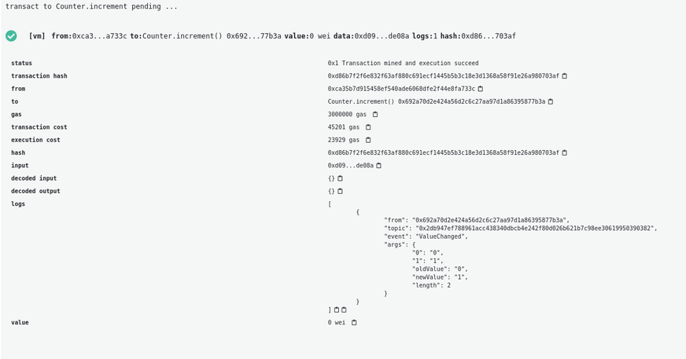

W Solidity [zdarzenia](/developers/docs/smart-contracts/anatomy/#events-and-logs) to wysyłane sygnały, które mogą uruchamiać inteligentne kontrakty. Aplikacje zdecentralizowane lub wszystko, co jest połączone z interfejsem API Ethereum JSON-RPC, może nasłuchiwać tych zdarzeń i odpowiednio działać. Zdarzenie można również zindeksować, aby później można było przeszukiwać historię zdarzeń.

## Zdarzeniami {#events}

Najczęstszym zdarzeniem na blockchainie Ethereum w momencie pisania tego artykułu jest zdarzenie Transfer, które jest emitowane przez tokeny ERC20, gdy ktoś przenosi tokeny.

```solidity
event Transfer(address indexed from, address indexed to, uint256 value);
```

Sygnatura zdarzenia jest deklarowana w kodzie kontraktu i może być emitowana za pomocą słowa kluczowego emit. Na przykład dzienniki zdarzeń transferu, nadawca transferu (<em x-id="4">od</em>), odbiorca transferu (_do_) i ilość przeniesionych tokenów (_wartość_).

Jeśli wrócimy do naszego inteligentnego kontraktu Counter i zdecydujemy się rejestrować za każdym razem, gdy wartość się zmieni. Ponieważ kontrakt ten nie jest przeznaczony do wdrożenia, ale służy jako podstawa do zbudowania kolejnego kontraktu poprzez jego rozszerzenie: nazywa się to kontraktem abstrakcyjnym. W przypadku naszego przykładu counter wyglądałoby to tak:

```solidity
pragma solidity 0.5.17;contract Counter {    event ValueChanged(uint oldValue, uint256 newValue);    // Zmienna prywatna typu unsigned int przechowywania liczby zliczeń    uint256 private count = 0;    // Funkcja zwiększająca licznik    function increment() public {        count += 1;        emit ValueChanged(count - 1, count);    }

    // Getter w celu uzyskania wartości zliczeń    function getCount() public view returns (uint256) {        return count;    }}
```

Zauważ, że:

- **Wiersz 5**: deklarujemy nasze wydarzenie i jego zawartość, starą wartość i nową wartość.

- **Wiersz 13**: Kiedy zwiększamy naszą zmienną count, emitujemy zdarzenie.

Jeżeli teraz wdrożymy umowę i wywołamy funkcję inkrementacji, zobaczymy, że Remix automatycznie ją wyświetli, jeśli zostanie kliknięta nowa transakcja w tablicy nazwanych rejestrów.



Dzienniki są naprawdę przydatne do debugowania inteligentnych kontraktów, ale są również ważne, jeśli tworzysz aplikacje używane przez różne osoby i ułatwiają analizę w celu śledzenia i zrozumienia, w jaki sposób jest używany inteligentny kontrakt. Logi generowane przez transakcje są wyświetlane w popularnych eksploratorach bloków i można je również wykorzystać np. do tworzenia skryptów off-chain do nasłuchiwania określonych zdarzeń i podejmowania działań w momencie ich wystąpienia.
