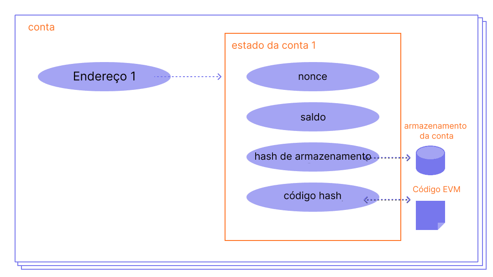

Uma conta Ethereum é uma entidade com um saldo de ether (ETH) que pode enviar transações no Ethereum. As contas podem ser controladas pelo usuário ou implementadas como contratos inteligentes.

## Pré-requisitos {#prerequisites}

As contas são um tema muito amigável para iniciantes. Mas para ajudá-lo a entender melhor esta página, recomendamos que você primeiro leia a nossa [introdução ao Ethereum](/developers/docs/intro-to-ethereum/).

## Tipos de conta {#types-of-account}

Ethereum tem dois tipos de contas:

- Propriedade externa — controlada por qualquer pessoa com as chaves privadas
- Contrato – um contrato inteligente implantado para a rede, controlado por código. Saiba mais sobre [contratos inteligentes](/developers/docs/smart-contracts/)

Ambos os tipos de conta têm capacidade para:

- Receber, guardar e enviar ETH e tokens
- Interagir com contratos inteligentes implementados

### Principais diferenças {#key-differences}

**Propriedade externa**

- Não há custo para criar uma conta
- Pode iniciar transações
- Transações entre contas de propriedade externa só podem ser transferências de ETH/token

**Contrato**

- Criar um contrato tem um custo porque você está usando o armazenamento de rede
- Só pode enviar transações em resposta ao recebimento de transação
- Transações de uma conta externa para uma conta contrato podem acionar um código que pode executar muitas ações diferentes, como transferir tokens ou até mesmo criar um contrato

## Uma conta analisada {#an-account-examined}

As contas Ethereum têm quatro campos:

- `nonce` - um contador que indica o número de transações enviadas pela conta. Isso garante que as transações sejam processadas apenas uma vez. Em uma conta contratual, este número representa o número de contratos criados pela conta.
- `balance` – o número de Wei pertencentes a este endereço. Wei é uma denominação de ETH e existem 1e + 18 Wei por ETH.
- `codeHash` - este hash se refere ao _código_ de uma conta na máquina virtual Ethereum (EVM). Contas contratuais têm fragmentos de código programados que podem executar diferentes operações. Este código EVM é executado se a conta receber uma chamada de mensagem. Diferentemente dos outros campos da conta, ele não pode ser alterado. Todos esses fragmentos de código estão contidos na base de dados de estados sob suas hashes correspondentes para recuperação posterior. Este valor de hash é conhecido como codeHash. Para contas de propriedade externa, o campo codeHash é o hash de uma “string” vazia.
- `storageRoot` – Às vezes conhecido como um hash de armazenamento. Um hash de 256 bits do nó raiz de uma árvore de Merkle que codifica o conteúdo de armazenamento da conta (um mapeamento entre valores inteiros de 256 bits), codificado para o mapeamento a partir do hash Keccak de 256 bits das chaves inteiras de 256 bits para os valores inteiros codificados no RLP-256 bits. Esta árvore codifica o hash do conteúdo de armazenamento desta conta e está vazia por padrão.

 _Diagrama adaptado do [Ethereum EVM ilustrado](https://takenobu-hs.github.io/downloads/ethereum_evm_illustrated.pdf)_

## Contas de propriedade externa e pares de chaves {#externally-owned-accounts-and-key-pairs}

Uma conta é composta por um par de chaves criptografadas: públicas e privadas. Eles ajudam a provar que uma transação foi realmente assinada pelo remetente e evitam falsificações. Sua chave privada é o que você usa para assinar transações, portanto, concede a você a custódia dos fundos associados à sua conta. Você nunca tem criptomoeda, você tem chaves privadas - os fundos estão sempre no livro-razão do Ethereum.

Isso evita que agentes mal-intencionados transmitam transações falsas, porque você sempre pode verificar o remetente de uma transação.

Se Alice quer enviar ether da sua própria conta para a conta do Bob, Alice precisa criar um pedido de transação e enviá-lo para a rede para verificação. O uso da criptografia de chave pública na Ethereum, garante que a Alice possa provar que foi ela quem iniciou originalmente o pedido de transação. Sem mecanismos criptográficos, um adversário malicioso "Eve" poderia simplesmente transmitir publicamente uma solicitação como “enviar 5 ETH da conta de Alice para a conta de Eve", e ninguém poderia verificar que a transmissão não veio da Alice.

## Criação de conta {#account-creation}

Quando você quiser criar uma conta, a maioria das bibliotecas irá gerar uma chave privada aleatória.

Uma chave privada é composta por 64 caracteres hexadecimais e pode ser criptografada com uma senha.

Exemplo:

`fffffffffffffffffffffffffffffffebaaedce6af48a03bbfd25e8cd036415f`

A chave pública é gerada a partir da chave privada usando o [Algoritmo de assinatura digital da curva elíptica](https://wikipedia.org/wiki/Elliptic_Curve_Digital_Signature_Algorithm). Você recebe um endereço público para sua conta a partir dos últimos 20 “bytes” do hash Keccak-256 da chave pública e adiciona `0x` no início.

Aqui está um exemplo da criação de uma conta no terminal usando `personal_newAccount` do GETH's

```go
> personal.newAccount()
Passphrase:
Repeat passphrase:
"0x5e97870f263700f46aa00d967821199b9bc5a120"

> personal.newAccount("h4ck3r")
"0x3d80b31a78c30fc628f20b2c89d7ddbf6e53cedc"
```

[Documentação do GETH](https://geth.ethereum.org/docs)

É possível obter novas chaves públicas de sua chave privada, mas você não pode obter uma chave privada de chaves públicas. Isso significa que é vital manter a chave privada segura e, como o nome sugere, **PRIVADA**.

Você precisa de uma chave privada para assinar mensagens e transações que resultam em uma assinatura. Outros podem então pegar a assinatura derivada da sua chave pública, provando a autoria da mensagem. Em seu aplicativo, você pode usar uma biblioteca de javascript para enviar transações para a rede.

## Contas de contrato {#contract-accounts}

As contas contratuais também têm um endereço hexadecimal de 42 caracteres:

Exemplo:

`0x06012c8cf97bead5deae237070f9587f8e7a266d`

O endereço do contrato é geralmente dado quando um contrato é implantado na Blockchain do Ethereum. O endereço vem do endereço do criador e do número de transações enviadas desse endereço (o “nonce”).

## Mais informações sobre carteiras {#a-note-on-wallets}

Uma conta não é uma carteira. Uma conta é o par de chaves para uma conta Ethereum de propriedade do usuário. Uma carteira é uma “interface” ou aplicativo que permite você interagir com a sua conta Ethereum.

## Uma demonstração visual {#a-visual-demo}

Assista a Austin guiar você pelas funções hash e pelos pares de chaves.

<YouTube id="QJ010l-pBpE" />

<YouTube id="9LtBDy67Tho" />

## Leitura adicional {#further-reading}

_Conhece um recurso da comunidade que ajudou você? Edite esta página e adicione-o!_

## Tópicos relacionados {#related-topics}

- [Smart Contracts](/developers/docs/smart-contracts/)
- [Transações](/developers/docs/transactions/)
