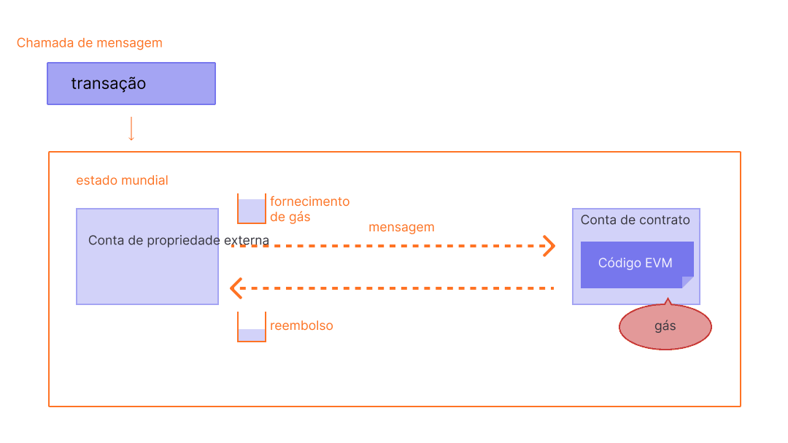

O gás é essencial para a rede Ethereum. É o combustível que permite que ele funcione, da mesma forma que um carro precisa de gasolina para funcionar.

## Pré-requisitos {#prerequisites}

Para entender melhor esta página, recomendamos que você leia primeiro sobre [transações](/developers/docs/transactions/) e [EVM](/developers/docs/evm/).

## O que é gás? {#what-is-gas}

Gás refere-se à unidade que mede a quantidade de esforço computacional necessário para executar operações específicas na rede Ethereum.

Dado que as transações Ethereum requer recursos computacionais para ser executada, cada uma delas requer uma taxa. Gás refere-se à taxa necessária para executar uma transação no Ethereum, independentemente do sucesso ou falha da transação.

 _Diagrama adaptado de [Ethereum EVM ilustrado](https://takenobu-hs.github.io/downloads/ethereum_evm_illustrated.pdf)_

Essencialmente, as taxas de gas são pagas na moeda nativa do Ethereum (ETH). Os preços do gás são indicados em Gwei, uma denominação propria do ETH na qual cada Gwei é igual a 0,00000001 ETH (10-9 OTH). Por exemplo, em vez de dizer que seu gás custa 0.000000001 Ether, pode-se dizer que ele custa 1 Gwei. A própria palavra "gwei" quer dizer "giga-wei", e equivale a 1.000.000.000 "wei". O próprio Wei (nomeado em homenagem a [Wei Dai](https://wikipedia.org/wiki/Wei_Dai), criador do [B-Money](https://www.investopedia.com/terms/b/bmoney.asp)) é a menor unidade de ETH.

## Antes da atualização de Londres {#pre-london}

A forma como as taxas de transação na rede Ethereum são calculadas foram alteradas com a [atualização de Londres](/history/#london) de agosto de 2021. Aqui está uma recapitulação de como as coisas funcionavam:

Digamos que Alice tenha que pagar a Roberto 1 ETH. Na transação, o limite de gás é de 21.000 unidades e o preço do gás é de 200 gwei.

A taxa total fica sendo:: `Gas units (limit) * Gas price per unit`, ou seja, `21,000 * 200 = 4,200,000 gwei` ou 0,0042 ETH

## Depois da atualização de Londres {#post-london}

Digamos que João tenha que pagar a Tomé 1 ETH. Na transação, o limite de gás é de 21.000 unidades e a taxa base é de 10 gwei. João inclui uma gorjeta de 2 gwei.

A taxa total agora seria: `unidades de gás usadas * (taxa base + taxa de prioridade)` em que a `taxa base` é um valor definido pelo protocolo e a `prioridade taxa` é um valor definido pelo usuário como uma gorjeta para o validador.

ou seja, `21.000 * (10 + 2) = 252.000 gwei` ou 0,000252 ETH.

Quando João enviar o dinheiro, 1,000252 ETH serão deduzidos da conta de João. Tomé receberá 1,0000 ETH. O validador recebe a gorjeta de 0,000042 ETH. A taxa base de 0,00021 ETH é queimada.

Além disso, João também pode definir uma taxa máxima (`maxFeePerGas`) para a transação. A diferença entre a taxa máxima e a taxa real é reembolsada a João, ou seja, `reembolso = taxa máxima - (taxa base + taxa de prioridade)`. João pode definir um valor máximo a pagar pela execução da transação e não se preocupar em pagar "além" da taxa base quando a transação for executada.

### Tamanho do bloco {#block-size}

Antes da atualização London, o Ethereum tinha blocos de tamanho fixo. Em momentos de alta demanda de rede, esses blocos operaram em capacidade máxima. Como resultado, os usuários muitas vezes tiveram que esperar a redução da demanda para serem incluídos em um bloco, o que levou a uma má experiência do usuário.

A atualização London introduziu blocos de tamanho variável no Ethereum. Cada bloco tem um tamanho alvo de 15 milhões de gás, mas o tamanho dos blocos aumentará ou diminuirá de acordo com a demanda da rede, até o limite do bloco de 30 milhões de gás (2x o tamanho do bloco alvo). O protocolo atinge um tamanho de bloco de equilíbrio de 15 milhões em média através do processo de _tentativa e erro_. Isso significa que se o tamanho do bloco for maior que o tamanho do bloco alvo, o protocolo aumentará a taxa base para o bloco a seguir. Da mesma forma, o protocolo diminuirá a taxa base se o tamanho do bloco for menor que o tamanho do bloco de destino. A quantidade pela qual a taxa base é ajustada é proporcional ao quão longe o tamanho do bloco atual está do alvo. [Mais sobre blocos](/developers/docs/blocks/).

### Taxa de base {#base-fee}

Cada bloco tem uma taxa base que funciona como um preço de reserva. Para ser elegível para inclusão em um bloco, o preço oferecido por gás deve ser pelo menos igual à taxa base. A taxa base é calculada independentemente do bloco atual e, em vez disso, é determinada pelos blocos anteriores, tornando as taxas de transação mais previsíveis para os usuários. Quando o bloco é minerado, essa taxa base é “queimada”, retirando-o de circulação.

A taxa base é calculada por uma fórmula que compara o tamanho do bloco anterior (a quantidade de gás utilizada para todas as transações) com o tamanho do alvo. A taxa base aumentará em um máximo de 12,5% por bloco se o tamanho do bloco de destino for excedido. Esse crescimento exponencial torna economicamente inviável que o tamanho do bloco permaneça elevado indefinidamente.

| Número do bloco | Gás incluído | Aumento de taxa | Taxa base atual |
| --------------- | -----------: | --------------: | --------------: |
| 1               |          15M |              0% |        100 gwei |
| 2               |          30M |              0% |        100 gwei |
| 3               |          30M |           12,5% |      112,5 gwei |
| 4               |          30M |           12,5% |      126,6 gwei |
| 5               |          30M |           12,5% |      142,4 gwei |
| 6               |          30M |           12,5% |      160,2 gwei |
| 7               |          30M |           12,5% |      180,2 gwei |
| 8               |          30M |           12,5% |      202,7 gwei |

Em relação ao mercado de leilão de gás antes da atualização London, essa mudança no mecanismo de taxa de transação faz com que a previsão de taxa seja mais confiável. Conforme a tabela acima, para criar uma transação no bloco número 9, uma carteira informará o usuário que a **taxa base máxima** a ser adicionada ao próximo bloco é a `taxa base atual * 112,5%` ou `202,7 gwei * 112,5% = 228,1 gwei`.

Também é importante notar que é improvável que vejamos picos prolongados de blocos cheios devido à velocidade com que a taxa base aumenta após um bloco cheio.

| Número do bloco | Gás incluído | Aumento da taxa | Taxa base atual |
| --------------- | -----------: | --------------: | --------------: |
| 30              |          30M |           12,5% |     2705,6 gwei |
| ...             |          ... |           12,5% |             ... |
| 50              |          30M |           12,5% |    28531,3 gwei |
| ...             |          ... |           12,5% |             ... |
| 100             |          30M |           12,5% | 10302608,6 gwei |

### Taxa de prioridade (gorjetas) {#priority-fee}

Antes da atualização London, os mineradores receberiam a taxa total de gás de qualquer transação incluída em um bloco.

Com a nova taxa básica sendo queimada, a atualização London introduziu uma taxa prioritária (gorjeta) para incentivar os mineradores a incluir uma transação no bloco. Sem gorjetas, os mineradores achariam economicamente viável minerar blocos vazios, pois receberiam a mesma recompensa de bloco. Em condições normais, uma pequena gorjeta fornece aos mineradores um incentivo mínimo para incluir uma transação. Para transações que precisam ser executadas preferencialmente antes de outras transações no mesmo bloco, uma gorjeta mais alta será necessária para tentar superar transações concorrentes.

### Taxa máxima {#maxfee}

Para executar uma transação na rede, os usuários podem especificar um limite máximo que estão dispostos a pagar para que a sua transação seja executada. Este parâmetro opcional é conhecido como `maxFeePerGas`. Para que uma transação seja executada, a taxa máxima deve exceder a soma da taxa base e da gorjeta. O remetente da transação é reembolsado pela diferença entre a taxa máxima e a soma da taxa base e da gorjeta.

### Calculando as taxas {#calculating-fees}

Um dos principais benefícios da atualização London é melhorar a experiência do usuário ao definir as taxas de transação. Para carteiras que suportam a atualização, em vez de declarar explicitamente quanto você está disposto a pagar para realizar sua transação, os provedores de carteira definirão automaticamente uma taxa de transação recomendada (taxa base + taxa de prioridade recomendada) para reduzir a quantidade de complexidade imposta a seus usuários.

## EIP-1559 {#eip-1559}

A implementação de [EIP-1559](https://eips.ethereum.org/EIPS/eip-1559) na atualização London tornou o mecanismo de taxa de transação mais complexo do que o leilão anterior sobre o preço de gás, mas tem a vantagem de tornar as taxas de gás mais previsíveis, resultando em um mercado de taxas de transação mais eficiente. Os usuários podem enviar transações com um `maxFeePerGas` correspondente ao quanto estão dispostos a pagar para a transação ser executada, sabendo que não pagarão mais do que o preço de mercado do gás (`baseFeePerGas`), e não receberão nenhum extra, exceto a gorjeta, de reembolso.

Este vídeo explica o EIP-1559 e os benefícios que ele traz:

<YouTube id="MGemhK9t44Q" />

Se você estiver interessado, pode ler [EIP-1559](https://eips.ethereum.org/EIPS/eip-1559).

Continue seguindo o coelho pela toca com estes [Recursos EIP-1559](https://hackmd.io/@timbeiko/1559-resources).

## Porque as taxas de gás existem? {#why-do-gas-fees-exist}

Em resumo, as taxas de gás ajudam a manter a rede Ethereum segura. Ao exigir uma taxa para cada cálculo executado na rede, evitamos que os maus atores enviem spam para a rede. Para evitar loops infinitos acidentais ou hostis ou outro desperdício de cálculo no código, cada transação deve definir um limite para quantas etapas de cálculo de execução de código ela pode usar. A unidade fundamental de cálculo é "gás".

Embora uma transação inclua um limite, qualquer gás não usado em uma transação é devolvido ao usuário (ou seja, `taxa máxima - (taxa base + gorjeta)` é retornada).

 _Diagrama adaptado do [Ethereum EVM ilustrado](https://takenobu-hs.github.io/downloads/ethereum_evm_illustrated.pdf)_

## Qual é o limite de gás? {#what-is-gas-limit}

O limite de gás refere-se à quantidade máxima de gás que você está disposto a consumir em uma transação. Transações mais complicadas envolvendo [contratos inteligentes](/developers/docs/smart-contracts/) exigem mais trabalho de cálculo, portanto, exigem um limite de gás mais alto do que um simples pagamento. Uma transferência ETH padrão requer um limite de gás de 21.000 unidades de gás.

Por exemplo, se você colocar um limite de gás de 50.000 para uma simples transferência de ETH, a EVM consumirá 21.000 e você receberá de volta os 29.000 restantes. No entanto, se você especificar muito pouco gás, por exemplo, um limite de gás de 20.000 para uma simples transferência de ETH, a EVM consumirá suas 20.000 unidades de gás tentando cumprir a transação, mas não será concluída. A EVM então reverte quaisquer alterações, mas como o minerador já fez 20 mil unidades de gás de trabalho, esse gás é consumido.

## Por que as taxas de gás são tão altas? {#why-can-gas-fees-get-so-high}

As altas taxas de gás são devidas à popularidade do Ethereum. A execução de qualquer operação no Ethereum requer o consumo de gás e o espaço de gás é limitado por bloco. As taxas são usadas para pagar cálculos, armazenar, manipular dados ou transferir tokens, com cada um deles consumindo diferentes quantidades de unidades de “gás”. Conforme a funcionalidade do dapp se torna mais complexa, o número de operações que um contrato inteligente realiza também cresce, o que significa que cada transação ocupa mais espaço dentro de um bloco de tamanho limitado. Se houver muita demanda, os usuários devem oferecer um valor de gorjeta mais alto para tentar superar as transações de outros usuários. Uma gorjeta mais alta pode aumentar a probabilidade de sua transação entrar no próximo bloco.

O preço do gás por si só não determina realmente quanto temos de pagar por uma determinada transação. Para calcular a taxa de transação, temos que multiplicar o gás usado pela taxa de gás base, que é medida em gwei.

## Iniciativas para reduzir os custos do gás {#initiatives-to-reduce-gas-costs}

As [atualizações de escalabilidade](/roadmap/) do Ethereum deverão em última análise resolver algumas das questões de taxas de gás, o que, por sua vez, permitirá que a plataforma processe milhares de transações por segundo e escale globalmente.

A escalabilidade da camada 2 é uma iniciativa primária para melhorar significativamente os custos do gás, a experiência do usuário e a escalabilidade. [Mais sobre a escalabilidade de camada 2](/developers/docs/scaling/#layer-2-scaling).

## Estratégias para pagar menos gás {#strategies-for-you-to-reduce-gas-costs}

Se você estiver procurando reduzir os custos de gás para suas transações, você pode definir uma dica para indicar o nível de prioridade de sua transação. Os mineradores "trabalham" e executam transações que oferecem uma gorjeta mais alta por gás, pois eles mantêm as gorjetas que você paga e estarão menos inclinados a executar transações com gorjetas mais baixas definidas.

Se você deseja monitorar os preços do gás, para poder enviar seu ETH por menos, pode usar muitas ferramentas diferentes, como:

- [Etherscan Gas Tracker](https://etherscan.io/gastracker): _calculadora do preço do gas de uma transação_
- [Blocknative ETH Gas Estimator](https://chrome.google.com/webstore/detail/blocknative-eth-gas-estim/ablbagjepecncofimgjmdpnhnfjiecfm): _uma extensão do Chrome para estimar o preço do gás e que suporta transações do tipo 0 e do tipo 2 EIP-1559._

- [ ETH Gas StationH](https://ethgasstation.info/): _métricas orientadas ao consumidor no mercado de gás de Ethereum_
- [Calculadora de taxas de gás Cryptoneur](https://www.cryptoneur.xyz/gas-fees-calculator) _Calcule as taxas de gás em sua moeda local para diferentes tipos de transação na Rede principal, no Arbitrum e Polygon._

## Ferramentas relacionadas {#related-tools}

- [Gas Platform da Blocknative](https://www.blocknative.com/gas): _API para estimativas do gás desenvolvida pela plataforma global de dados mempool da Blocknative_

## Leitura adicional {#further-reading}

- [Explicação sobre o gás de Ethereum](https://defiprime.com/gas)
- [Reduzindo o consumo de gás de seus Contratos Inteligentes](https://medium.com/coinmonks/8-ways-of-reducing-the-gas-consumption-of-your-smart-contracts-9a506b339c0a)
- [Prova de participação em comparação à Prova de trabalho](https://blockgeeks.com/guides/proof-of-work-vs-proof-of-stake/)

## Tópicos relacionados {#related-topics}

- [Mineração](/developers/docs/consensus-mechanisms/pow/mining/)
