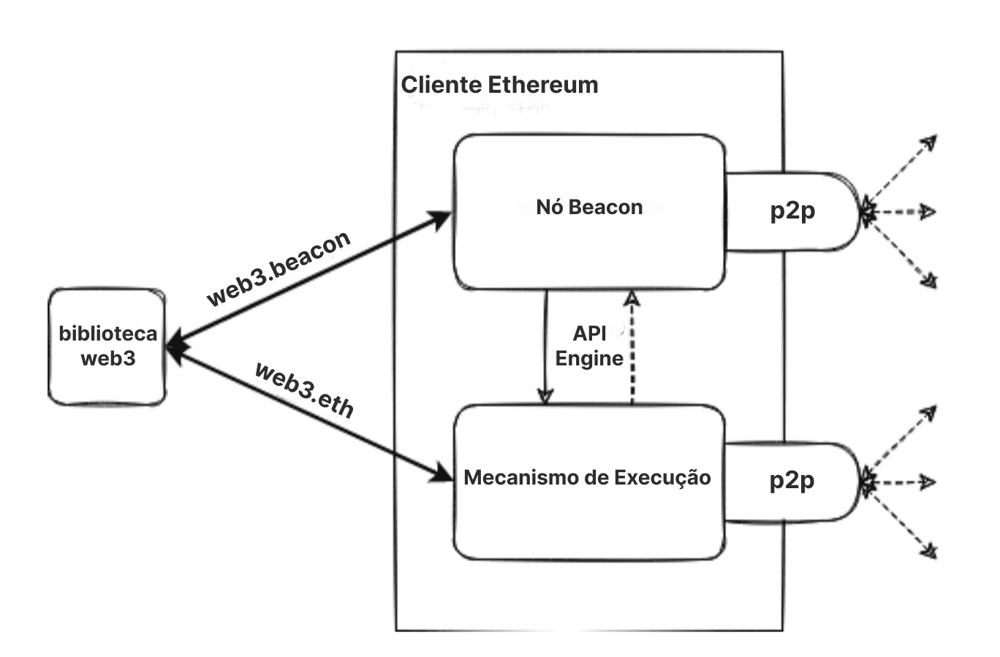

O Ethereum é uma rede distribuída de computadores (conhecidos como nós) executando softwares que podem verificar blocos e dados de transação. O aplicativo de software, conhecido como cliente, deve ser executado no seu computador para transformá-lo em um nó Ethereum.

**Nota: não é mais possível executar um cliente de execução por conta própria. Após [A Fusão](/roadmap/merge), ambos os clientes de execução e consenso devem ser executados juntos para que um usuário obtenha acesso à rede Ethereum.**

## Pré-requisitos {#prerequisites}

Você deve entender o conceito de uma rede peer-to-peer e os [conceitos básicos da EVM](/developers/docs/evm/) antes de mergulhar mais fundo e executar a sua própria instância de um cliente Ethereum. Veja nossa [introdução ao Ethereum](/developers/docs/intro-to-ethereum/).

Se você é novo no tema dos nós, recomendamos primeiro verificar nossa introdução simplificada no [rodando um nó Ethereum](/run-a-node).

## O que são nós e clientes? {#what-are-nodes-and-clients}

Um "nó" é qualquer instância de software do cliente Ethereum que esteja conectado a outros computadores também executando o software Ethereum, formando uma rede. Um cliente é uma implementação do Ethereum que verifica os dados em relação às regras do protocolo e mantém a rede segura.

O Ethereum pós Fusão consiste em duas partes: a camada de execução e a camada de consenso. Ambas as camadas são executadas por software cliente diferente. Nesta página, vamos nos referir a eles como cliente de execução e cliente de consenso.

- O cliente de execução (também conhecido como Execution Engine, cliente EL ou anteriormente cliente Eth1) ouve novas transações transmitidas na rede, executa-as na EVM e mantém o estado mais recente e o banco de dados de todos os dados atuais do Ethereum.
- O cliente de consenso (também conhecido como Beacon Node, cliente CL ou anteriormente cliente Eth2) implementa o algoritmo de consenso de prova de participação, o qual permite que a rede realize um acordo com base nos dados validados do cliente de execução.

Antes da [Fusão](/roadmap/merge/), a camada de consenso e execução eram redes separadas, com todas as transações e atividades do usuário no Ethereum acontecendo, no que é agora a camada de execução. Um software do cliente forneceu ambiente de execução e verificação de consenso de blocos produzidos por mineradores. A camada de consenso, [a Beacon Chain](/roadmap/beacon-chain/), está sendo executada separadamente desde dezembro de 2020. Ela introduziu a prova de participação e coordenou a rede de validadores com base nos dados da rede Ethereum.

Com a Fusão, o Ethereum transita para a prova de participação conectando essas redes. Os clientes de execução e consenso trabalham juntos para verificar o estado do Ethereum.

O design modular com várias peças de software trabalhando em conjunto é chamado de [complexidade encapsulada](https://vitalik.ca/general/2022/02/28/complexity.html). Essa abordagem facilita executar A Fusão sem problemas e permite a reutilização de clientes individuais, por exemplo, no [ecossistema de camada 2](/layer-2/).

 Diagrama simplificado de uma execução associada e de um cliente de consenso.

### Diversidade dos clientes {#client-diversity}

Tanto [clientes de execução](/developers/docs/nodes-and-clients/#execution-clients) quanto [clientes de consenso](/developers/docs/nodes-and-clients/#consensus-clients) existem em uma variedade de linguagens de programação desenvolvidas por diferentes equipes.

As implementações de vários clientes podem tornar a rede mais forte, reduzindo sua dependência de uma única base de código. O objetivo ideal é alcançar a diversidade sem que nenhum cliente domine a rede, eliminando assim um ponto único de falha potencial. A variedade de idiomas também convida uma comunidade de desenvolvedores mais ampla e permite que eles criem integrações em seu idioma preferido.

Saiba mais sobre a [diversidade do cliente](/developers/docs/nodes-and-clients/client-diversity/).

O que essas implementações têm em comum é que todas seguem uma única especificação. As especificações ditam como a rede Ethereum e a cadeia de blocos funcionam. Cada detalhe técnico é definido e as especificações podem ser encontradas como:

- Originalmente, o [Ethereum Yellow Paper](https://ethereum.github.io/yellowpaper/paper.pdf)
- [Especificações de execução](https://github.com/ethereum/execution-specs/)
- [Especificações de consenso](https://github.com/ethereum/consensus-specs)
- [EIPs](https://eips.ethereum.org/) implementados em várias [atualizações de rede](/history/)

### Rastreamento de nós na rede {#network-overview}

Vários rastreadores oferecem uma visão geral em tempo real dos nós na rede Ethereum. Observe que, devido à natureza das redes descentralizadas, esses rastreadores podem fornecer apenas uma visão limitada da rede e podem relatar resultados diferentes.

- Mapa de nós pela Etherscan
- Ethernodes da Bitfly
- [Rastreador de nós Ethereum](https://crawler.ethereum.org/)
- [Nodewatch](https://www.nodewatch.io/) por Chainsafe, rastreando nós de consenso

## Tipos de nó {#node-types}

Se você quer [executar o seu próprio nó](/developers/docs/nodes-and-clients/run-a-node/), você deve entender que existem diferentes tipos de nós que consomem dados de modo diferente. Na verdade, os clientes podem executar 3 tipos diferentes de nó: leve, completo e arquivo. Existem também opções de diferentes estratégias de sincronização que permitem um tempo de sincronização mais rápida. A sincronização se refere ao quão rápido ele pode obter as informações mais atualizadas sobre o estado do Ethereum.

### Nó completo {#full-node}

- Armazena os dados completos da cadeia de blocos (embora isso seja periodicamente reduzido para que um nó completo não armazene todos os dados de estado de volta à origem)
- Participa na validação de bloco, verifica todos os blocos e estados.
- Todos os estados podem ser derivados de um nó completo (embora estados muito antigos sejam reconstruídos a partir de solicitações feitas a nós de arquivo).
- Serve a rede e fornece dados mediante solicitação.

### Nó leve {#light-node}

Em vez de baixar cada bloco, nós leves baixam os cabeçalhos dos blocos. Esses cabeçalhos contêm apenas informações resumidas sobre o conteúdo dos blocos. Qualquer outra informação pelo nó leve é solicitada de um nó completo. O nó leve pode então verificar de modo independente os dados que ele recebe em relação às raízes de estado nos cabeçalhos de bloco. Os nós leves permitem que os usuários participem da rede Ethereum sem o hardware poderoso ou a alta largura de banda necessária para executar nós completos. Por fim, os nós leves podem ser executados em telefones celulares ou dispositivos embutidos. Os nós leves não participam do consenso (ou seja, eles não podem ser mineradores/validadores), mas podem acessar a cadeia de blocos Ethereum com as mesmas funcionalidades e garantias de segurança de um nó completo.

O cliente de execução Geth inclui uma opção [sincronização leve](https://github.com/ethereum/devp2p/blob/master/caps/les.md). No entanto, um nó Geth leve depende de nós completos que atendem a dados de nós leves. Poucos nós completos optam por servir dados de nós leves, o que significa que nós leves muitas vezes não conseguem encontrar pares.

Clientes leves são uma área de desenvolvimento ativo para o Ethereum e esperamos ver em breve novos clientes leves para a camada de consenso e a camada de execução. Também existem rotas em potencial para fornecer dados de clientes leves pela [rede gossip](https://www.ethportal.net/). Isso é vantajoso porque a rede gossip pode suportar uma rede de nós leves sem exigir nós completos para atender às solicitações.

O Ethereum ainda não suporta uma grande quantidade de nós leves, mas o suporte a nós leves é uma área que deve se desenvolver rapidamente em um futuro próximo. Em particular, clientes como [Nimbus](https://nimbus.team/), [Hélios](https://github.com/a16z/helios), e [LodeStar](https://lodestar.chainsafe.io/) atualmente estão bastante concentrados em nós leves.

### Nó de arquivo {#archive-node}

- Armazena tudo o que é mantido no nó completo e constrói um arquivo de estados históricos. Ele é necessário se você quiser consultar algo como um saldo de conta no bloco #4.000.000, ou testar de forma simples e confiável seu próprio conjunto de transações sem minerá-las usando rastreamento.
- Esses dados representam unidades de terabytes, o que torna os nós de arquivo menos atraentes para usuários comuns, mas pode ser útil para serviços como exploradores de blocos, fornecedores de carteiras e análises da cadeia.

Sincronizar clientes em qualquer modo que não seja o de arquivo resultará na remoção de dados da cadeia de blocos. Isso significa que não há arquivo de todo o estado histórico, mas o nó completo é capaz de criá-lo sob demanda.

Saiba mais sobre [Nós de arquivo](/developers/docs/nodes-and-clients/archive-nodes).

## Por que devo executar um nó Ethereum? {#why-should-i-run-an-ethereum-node}

A execução de um nó permite que você use o Ethereum de forma direta, confiável e privada, enquanto dá suporte à rede, mantendo-a mais robusta e descentralizada.

### Vantagens para você {#benefits-to-you}

A execução de seu próprio nó permite que você use o Ethereum de maneira privada, autossuficiente e confiável. Você não precisa confiar na rede porque você pode verificar os dados por conta própria com seu cliente. "Não confie, verifique" é um mantra popular da cadeia de blocos.

- Seu nó verifica todas as transações e blocos contra as regras de consenso por si só. Isso significa que você não precisa confiar em nenhum outro nó da rede nem confiar totalmente neles.
- Você pode usar uma carteira Ethereum com seu próprio nó. Você pode usar dapps com mais segurança e privacidade porque não precisará vazar seus endereços e saldos para nós aleatórios. Tudo pode ser verificado com seu próprio cliente. [MetaMask](https://metamask.io), [Frame](https://frame.sh/) e [muitas outras carteiras](/wallets/find-wallet/) oferecem importação de RPC, permitindo que elas usem seu nó.
- Você pode executar e auto-hospedar outros serviços que dependem de dados do Ethereum. Por exemplo, isso pode ser um validador Beacon Chain, software como camada 2, infraestrutura, exploradores de bloco, processadores de pagamento etc.
- Você pode fornecer seus próprios [pontos de extremidade RPC](https://ethereum.org/en/developers/docs/apis/json-rpc/) personalizados. O ponto de extremidade Ethereum hospedado publicamente pela comunidade ou de modo privado, permite que as pessoas usem seu nó e evitem grandes provedores centralizados.
- Você pode se conectar ao seu nó usando **Comunicações entre processos (IPC)** ou reescrever o nó para carregar seu programa como um plugin. Isso garante baixa latência, o que ajuda muito, por exemplo, ao processar muitos dados usando bibliotecas Web3 ou quando você precisa substituir suas transações o mais rápido possível (isto é, de forma acelerada).
- Você pode colocar ETH diretamente para proteger a rede e ganhar recompensas. Veja [participação solo](https://ethereum.org/en/staking/solo/) para começar.

### Benefícios da rede {#network-benefits}

Um conjunto diversificado de nós é importante para a integridade, segurança e resiliência operacional do Ethereum.

- Os nós completos impõem as regras de consenso para que não possam ser induzidos a aceitar blocos que não as seguem. Isso fornece segurança extra na rede, pois se todos os nós fossem nós leves, que não fazem a verificação completa, os validadores poderiam atacar a rede.
- No caso de um ataque que supere as defesas criptoeconômicas de [prova de participação](/developers/docs/consensus-mechanisms/pos/#what-is-pos), uma recuperação social pode ser realizada por nós completos escolhendo seguir a cadeia honesta.
- Mais nós na rede resultam em uma rede mais diversificada e robusta, o objetivo final da descentralização, que permite um sistema confiável e resistente à censura.
- Eles fornecem acesso a dados da cadeia de blocos para clientes leves que dependem disso. Em picos altos de uso, é necessário que haja nós completos suficientes para ajudar na sincronização dos nós. Os nós leves não armazenam toda a cadeia de blocos. Em vez disso, eles verificam dados por meio das [raízes do estado nos cabeçalhos de blocos](/developers/docs/blocks/#block-anatomy). Eles podem solicitar mais informações a partir dos blocos, se precisarem.

Se você executa um nó completo, toda a rede Ethereum se beneficia disso.

## Executando seu próprio nó {#running-your-own-node}

Interessado em executar o seu próprio cliente Ethereum?

Para ver uma introdução simplificada para iniciantes, visite a nossa página [Executar um nó](/run-a-node) para saber mais.

Se você é mais que um usuário técnico, mergulhe em mais detalhes e opções sobre como [executar o seu próprio nó](/developers/docs/nodes-and-clients/run-a-node/).

## Alternativas {#alternatives}

Configurar seu próprio nó pode custar tempo e recursos, mas nem sempre você precisa executar sua própria instância. Nesse caso, você pode usar um provedor de API de terceiros, como [Infura](https://infura.io), [Alchemy](https://alchemyapi.io), [Chainstack](https://chainstack.com), [QuikNode](https://www.quiknode.io), [Tenderly](https://tenderly.co/web3-gateway), [Blast](https://blastapi.io/) ou [GetBlock](https://getblock.io/). Para obter uma visão geral do uso desses serviços, confira [nós como serviço](/developers/docs/nodes-and-clients/nodes-as-a-service/).

Se alguém executa um nó Ethereum com uma API pública em sua comunidade, você pode apontar suas carteiras ligeiras (como MetaMask) para um nó da comunidade [via RPC personalizado](https://metamask.zendesk.com/hc/en-us/articles/360015290012-Using-a-Local-Node) e ganhar mais privacidade do que com alguns terceiros aleatórios de confiança.

Por outro lado, se você executar um cliente, você pode compartilhá-lo com quem precisar.

## Clientes de execução (antigos clientes 'Eth1') {#execution-clients}

A comunidade do Ethereum mantém vários clientes de execução (previamente conhecidos como clientes "Eth1", ou apenas "clientes Ethereum") de código aberto, desenvolvidos por diferentes equipes usando diferentes linguagens de programação. Isso torna a rede mais forte e [diversificada](/developers/docs/nodes-and-clients/client-diversity/). O objetivo ideal é alcançar a diversidade sem que nenhum cliente predomine, a fim de reduzir os pontos únicos de falha.

Esta tabela resume os diferentes clientes. Todos eles passam por [testes de cliente](https://github.com/ethereum/tests) e são mantidos ativamente para ter as atualizações de rede em dia.

| Client                                          | Linguagem de programação | Sistemas operacionais | Redes                                     | Estratégias de sincronização                 | Limpeza de estado |
| ----------------------------------------------- | ------------------------ | --------------------- | ----------------------------------------- | -------------------------------------------- | ----------------- |
| [Geth](https://geth.ethereum.org/)              | Go                       | Linux, Windows, macOS | Rede principal, Sepolia, Goerli           | Instantâneo, Completo                        | Arquivo, Removido |
| [Nethermind](http://nethermind.io/)             | C#, .NET                 | Linux, Windows, macOS | Rede principal, Sepolia, Goerli, e outras | Instantâneo (sem servidor), Rápido, Completo | Arquivo, Removido |
| [Besu](https://besu.hyperledger.org/en/stable/) | Java                     | Linux, Windows, macOS | Rede principal, Sepolia, Goerli, e outras | Instantâneo, Rápido, Completo                | Arquivo, Removido |
| [Erigon](https://github.com/ledgerwatch/erigon) | Go                       | Linux, Windows, macOS | Rede principal, Sepolia, Goerli, e outras | Completo                                     | Arquivo, Removido |

**Observe que o OpenEthereum [foi descontinuado](https://medium.com/openethereum/gnosis-joins-erigon-form-turbo-geth-to-release-next-gen-ethereum-client-c6708dd06dd) e não está mais sendo mantido.** Use-o com cuidado e, de preferência, mude para outra implementação de cliente!

Para saber mais sobre redes suportadas, leia sobre as [redes Ethereum](/developers/docs/networks/).

Cada cliente tem casos de uso e vantagens exclusivas, então você deve escolher um com base nas suas próprias preferências. A diversidade permite que as implementações se concentrem em diferentes recursos e públicos de usuários. Você pode escolher um cliente baseado em recursos, suporte, linguagem de programação ou licenças.

### Besu {#besu}

Hyperledger Besu é um cliente Ethereum de nível empresarial para redes públicas e autorizadas. Ele executa todos os recursos da Rede principal do Ethereum, do rastreamento ao GraphQL, possui monitoramento extensivo e conta com o suporte da ConsenSys, tanto em canais comunitários abertos, quanto por meio de SLAs comerciais para empresas. Ele é escrito em Java e tem licença Apache 2.0.

A [documentação](https://besu.hyperledger.org/en/stable/) extensa do Besu irá guiá-lo por todos os detalhes sobre seus recursos e configurações.

### Erigon {#erigon}

Erigon, anteriormente conhecido como Turbo-Geth, começou como uma bifurcação do Go Ethereum orientado para velocidade e eficiência de espaço em disco. Erigon é uma implementação completamente rearquitetada do Ethereum, atualmente escrita em Go, mas com implementações em outras linguagens em desenvolvimento. O objetivo do Erigon é fornecer uma implementação mais rápida, modular e otimizada do Ethereum. Ele pode realizar uma sincronização completa do nó de arquivamento usando cerca de 2TB de espaço em disco, em menos de 3 dias.

### Go Ethereum {#geth}

Go Ethereum (Geth para abreviar) é uma das implementações originais do protocolo Ethereum. Atualmente, ele é o cliente mais difundido, com a maior base de usuários e variedade de ferramentas para usuários e desenvolvedores. Ele está escrito em Go, totalmente de código aberto e sob a licença GNU LGPL v3.

Saiba mais sobre Geth em sua [documentação](https://geth.ethereum.org/docs/).

### Nethermind {#nethermind}

Nethermind é uma implementação do Ethereum criada com a pilha de tecnologia C# .NET, licenciada com LGPL-3.0, em execução em todas as principais plataformas, incluindo ARM. Ela oferece grande desempenho com:

- uma máquina virtual otimizada
- acesso ao estado
- rede e recursos ricos como painéis Prometheus/Graphana, suporte ao registro empresarial seq, rastreamento JSON RPC e plugins de análise.

A Nethermind também conta com uma [documentação detalhada](https://docs.nethermind.io), suporte eficaz ao desenvolvedor, comunidade online e suporte 24/7 disponível para usuários premium.

## Clientes de consenso (antigos clientes 'Eth2') {#consensus-clients}

Existem vários clientes de consenso (anteriormente conhecidos como clientes "Eth2") para oferecer suporte às [atualizações de consenso](/upgrades/beacon-chain/). Eles estão executando a Beacon Chain e fornecerão um mecanismo de consenso de prova de participação para clientes de execução após [A Fusão](/upgrades/merge/).

[Visualizar clientes de consenso](/upgrades/get-involved/#clients).

| Cliente                                                       | Linguagem de programação | Sistemas operacionais | Redes                                                          |
| ------------------------------------------------------------- | ------------------------ | --------------------- | -------------------------------------------------------------- |
| [Lighthouse](https://lighthouse.sigmaprime.io/)               | Rust                     | Linux, Windows, macOS | Beacon Chain, Goerli, Pyrmont, Sepolia, Ropsten e mais         |
| [Lodestar](https://lodestar.chainsafe.io/)                    | TypeScript               | Linux, Windows, macOS | Beacon Chain, Goerli, Sepolia, Ropsten e mais                  |
| [Nimbus](https://nimbus.team/)                                | Nim                      | Linux, Windows, macOS | Beacon Chain, Goerli, Sepolia, Ropsten e mais                  |
| [Prysm](https://docs.prylabs.network/docs/getting-started/)   | Go                       | Linux, Windows, macOS | Beacon Chain, Gnosis, Goerli, Pyrmont, Sepolia, Ropsten e mais |
| [Teku](https://consensys.net/knowledge-base/ethereum-2/teku/) | Java                     | Linux, Windows, macOS | Beacon Chain, Gnosis, Goerli, Sepolia, Ropsten e mais          |

### Lighthouse {#lighthouse}

Lighthouse é uma implementação de cliente de consenso escrita em Rust sob a licença Apache-2.0. Ela é mantida pela Sigma Prime e tem se mantido estável e pronta para produção desde a origem da Beacon Chain. Várias empresas, grupos de participação e indivíduos confiam nela. Ela visa ser segura, eficiente e interoperável em uma ampla variedade de ambientes, de PCs desktop a implantações automatizadas sofisticadas.

A documentação pode ser encontrada no [Livro da Lighthouse](https://lighthouse-book.sigmaprime.io/)

### Lodestar {#lodestar}

Lodestar é uma implementação de cliente de consenso pronta para produção escrita em Typescript sob a licença LGPL-3.0. Ela é mantida pela ChainSafe Systems e é a mais recente dos clientes de consenso para participantes solo, desenvolvedores e pesquisadores. A Lodestar consiste em um nó beacon e um cliente validador alimentado por implementações JavaScript de protocolos Ethereum. A Lodestar visa melhorar a usabilidade do Ethereum com clientes leves, expandir a acessibilidade a um grupo maior de desenvolvedores e contribuir ainda mais para a diversidade do ecossistema.

Mais informações podem ser encontradas em nosso [site da Lodestar](https://lodestar.chainsafe.io/)

### Nimbus {#nimbus}

Nimbus é uma implementação de cliente de consenso escrita em Nim sob a licença Apache-2.0. Nimbus é um cliente pronto para produção usado por participantes solo e pools de participação. A Nimbus foi projetada para eficiência de recursos, facilitando a execução em dispositivos com recursos restritos e infraestrutura corporativa com a mesma facilidade, sem comprometer a estabilidade ou o desempenho da recompensa. Uma memória de recursos mais leve significa que o cliente tem uma maior margem de segurança quando a rede está sob estresse.

Implementado pela Trinity. Funciona como sincronização rápida, mas também baixa os dados necessários para executar os blocos mais recentes, o que permite consultar a cadeia nos primeiros minutos desde o início.

- Sincroniza o estado primeiro e permite que você consulte RPC em poucos minutos.
- Ainda em desenvolvimento e não totalmente confiável, a sincronização em segundo plano é desacelerada e as respostas do RPC podem falhar.

Saiba mais na [documentação da Nimbus](https://nimbus.guide/)

### Prysm {#prysm}

O Prysm é um cliente de consenso de código aberto completo, escrito em Go sob a licença GPL-3.0. Ele apresenta uma interface de usuário de aplicativo Web opcional e prioriza a experiência do usuário, a documentação e a configurabilidade para usuários institucionais e particulares.

Visite a [documentação do Prysm](https://docs.prylabs.network/docs/getting-started/) para saber mais.

### Teku {#teku}

Teku é um dos clientes originais da origem da Beacon Chain. Além dos objetivos habituais (segurança, robustez, estabilidade, usabilidade, desempenho), o Teku visa especificamente cumprir integralmente todos os padrões de cliente de consenso.

O Teku oferece opções de implantação muito flexíveis. O nó beacon e o cliente validador podem ser executados juntos como um único processo, o que é extremamente conveniente para participantes solo, ou os nós podem ser executados separadamente para operações de participação sofisticadas. Além disso, o Teku é totalmente interoperável com o [Web3Signer](https://github.com/ConsenSys/web3signer/) para assinar a segurança da chave e a proteção contra golpes.

O Teku é escrito em Java e sob licença Apache 2.0. Ele é desenvolvido pela equipe de Protocolos da ConsenSys, que também é responsável pelo Besu e Web3Signer. Saiba mais na [documentação do Teku](https://docs.teku.consensys.net/en/latest/).

## Modos de sincronização {#sync-modes}

Para acompanhar e verificar os dados atuais na rede, o cliente Ethereum precisa sincronizar com o estado da rede mais recente. Para isso, é necessário baixar dados de pares, verificar criptograficamente sua integridade e construir um banco de dados local da cadeia de blocos.

Os modos de sincronização representam diferentes abordagens para este processo com várias compensações. Os clientes também variam em sua implementação de algoritmos de sincronização. Sempre consulte a documentação oficial do cliente escolhido para obter detalhes sobre a implementação.

### Modos de sincronização na camada de execução {#execution-layer-sync-modes}

#### Sincronização completa {#full-sync}

A sincronização completa baixa todos os blocos (incluindo cabeçalhos, transações e recibos) e gera o estado da cadeia de blocos de forma incremental, executando cada bloco a partir da origem.

- Minimiza a confiança e oferece a mais alta segurança, verificando cada transação.
- Com um número crescente de transações, pode levar dias ou semanas para processar todas as transações.

#### Sincronização rápida {#fast-sync}

A sincronização rápida baixa todos os blocos (incluindo cabeçalhos, transações e recibos), verifica todos os cabeçalhos, baixa o estado e verifica-os em relação aos cabeçalhos.

- Depende da segurança do mecanismo de consenso.
- A sincronização leva apenas algumas horas.

#### Sincronização leve {#light-sync}

O modo de cliente leve baixa todos os cabeçalhos de bloco, dados de bloco e verifica alguns aleatoriamente. Somente sincroniza a ponta da cadeia do ponto de verificação confiável.

- Obtém apenas o estado mais recente, enquanto conta com a confiança dos desenvolvedores e o mecanismo de consenso.
- Cliente pronto para uso com o estado atual da rede em poucos minutos.

**NB** A sincronização leve ainda não funciona com a prova de participação do Ethereum – novas versões de sincronização leve deverão ser lançadas em breve!

[Mais sobre clientes leves](https://www.parity.io/blog/what-is-a-light-client/)

#### Sincronização instantânea {#snap-sync}

A sincronização instantânea é a abordagem mais recente para sincronizar um cliente, lançada pela equipe Geth. O uso de instantâneos dinâmicos servidos por pares recupera todos os dados de conta e armazenamento sem baixar nós de árvores intermediárias e, em seguida, reconstrói a árvore Merkle localmente.

- Estratégia de sincronização mais rápida, atualmente padrão na rede principal do Ethereum
- Economiza muito uso de disco e largura de banda de rede sem sacrificar a segurança

[Mais sobre sincronização instantânea](https://github.com/ethereum/devp2p/blob/master/caps/snap.md)

### Modos de sincronização de camada de consenso {#consensus-layer-sync-modes}

#### Sincronização otimista {#optimistic-sync}

A sincronização otimista é uma estratégia de sincronização pós-fusão projetada para ser compatível e retrocompatível com versões anteriores, permitindo que os nós de execução sincronizem por meio de métodos estabelecidos. O mecanismo de execução pode, de modo _otimista_, importar blocos beacon sem verificá-los completamente, encontrar o cabeçalho mais recente e começar a sincronizar a cadeia com os métodos acima. Em seguida, após o cliente de execução ter sido alcançado, ele informará ao cliente de consenso sobre a validade das transações na Beacon Chain.

[Mais sobre sincronização otimista](https://github.com/ethereum/consensus-specs/blob/dev/sync/optimistic.md)

#### Sincronização de ponto de verificação {#checkpoint-sync}

A sincronização do ponto de verificação, também conhecida como sincronização de subjetividade fraca, cria uma experiência de usuário superior para sincronizar o Nó Beacon. Ele é baseado em suposições de [subjetividade fraca](/developers/docs/consensus-mechanisms/pos/weak-subjectivity/) que permitem sincronizar a Beacon Chain de um ponto de verificação de subjetividade fraca recente em vez da origem. A sincronização do ponto de verificação torna o tempo de sincronização inicial significativamente mais rápido, com suposições de confiança semelhantes às da sincronização da [origem](/glossary/#genesis-block).

Na prática, isso significa que seu nó se conecta a um serviço remoto para baixar os estados finalizados recentes e continua verificando os dados a partir desse ponto. A terceira parte que fornece os dados é confiável e deve ser escolhida com cuidado.

Mais sobre [sincronização de ponto de verificação](https://notes.ethereum.org/@djrtwo/ws-sync-in-practice)

## Leitura adicional {#further-reading}

Há muitas informações sobre os clientes Ethereum na internet. Aqui estão alguns recursos que podem ser úteis.

- [Ethereum 101 – Parte 2 – Entendendo os nós](https://kauri.io/ethereum-101-part-2-understanding-nodes/48d5098292fd4f11b251d1b1814f0bba/a) _- Wil Barnes, 13 de fevereiro de 2019_
- [Executando nós completos do Ethereum: um guia para os pouco motivados](https://medium.com/@JustinMLeroux/running-ethereum-full-nodes-a-guide-for-the-barely-motivated-a8a13e7a0d31) _– Justin Leroux, 7 de novembro de 2019_

## Tópicos relacionados {#related-topics}

- [Blocos](/developers/docs/blocks/)
- [Redes](/developers/docs/networks/)

## Tutoriais relacionados {#related-tutorials}

- [Transforme seu Raspberry Pi 4 em um nó validador apenas instalando o cartão MicroSD – Guia de instalação](/developers/tutorials/run-node-raspberry-pi/) _– Ligue seu Raspberry Pi 4, conecte um cabo Ethernet, conecte o disco SSD e ligue o dispositivo para transformar o Raspberry Pi 4 em um nó Ethereum completo executando a camada de execução (Rede principal) e/ou a camada de consenso (Beacon Chain / validador)._
