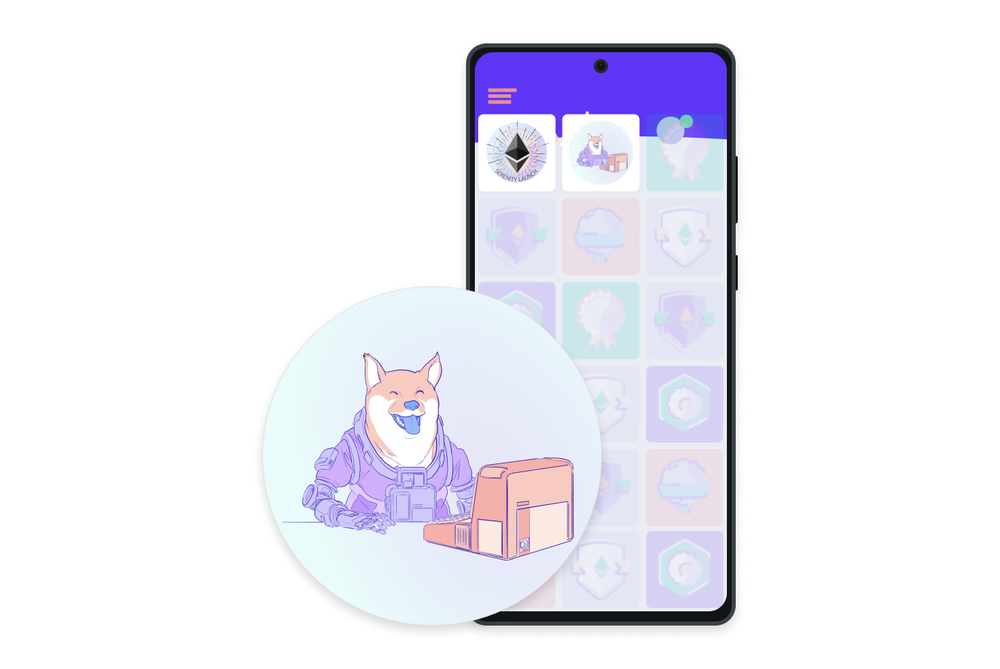

非同质化代币目前在数字艺术品和收藏品世界中掀起风潮。 得益于新加密货币受众带来巨额销售，数字艺术家的生活正在发生变化。 一些名人也纷纷加入，因为他们发现了与粉丝们联系的新契机。 但数字艺术品只是使用非同质化代币的一种方式。 实际上，它们可以代表任何独特资产的所有权，如数字世界或物理王国里持有某项物品的凭据。

如果 Andy Warhol 出生在 90 年代后期，他很可能会将 Campbell's Soup 制作成一个非同质化代币。 Nike 把 Jordan 系列运动鞋放到以太坊上只是时间问题。 某一天，您可以用非同质化代币来证明自己对汽车的所有权。

## 什么是非同质化代币？ {#what-are-nfts}

非同质化代币是我们用以代表独特物品所有权的代币。 它们让我们把诸如艺术品、收藏品甚至房地产等物品代币化。 资产所有权由以太坊区块链保护 - 任何人都不能修改所有权记录或复制/粘贴新的非同质化代币。

NFT 代表非同质化代币。 非同质化是一个经济术语，您可以用它来描述家具、歌曲文件或您的电脑等物品。 这些东西不能与其他物品互换，因为它们具有独特属性。

另一方面，同质化物品可以互换，这取决于它们的价值而非独特属性。 例如，以太币或美元具有同质化属性，因为 1 个以太币/1 美元可以兑换成另外的 1 以太币/1 美元。

<YouTube id="Xdkkux6OxfM" />

## 资产互联网 {#internet-of-assets}

非同质化代币和以太坊解决了当前互联网上存在的一些问题。 随着一切都变得更加数字化，我们需要复制实体物品的属性，如稀缺性、独特性和所有权证明。 更不用说数字物品常常只是在其产品范围内有用。 例如，您不能转售已购买的 iTunes mp3，又或者说，即便有市场，您也无法将一家公司的忠诚度积分兑换成其他平台的信用额度。

与我们今天大多数人使用的互联网相比，下面是使用非同质化代币互联网的情况...

### 对比 {#nft-comparison}

| 非同质化代币互联网                                                                                                                                                     | 当今互联网                                                                                                |
| ---------------------------------------------------------------------------------------------------------------------------------------------------------------------- | --------------------------------------------------------------------------------------------------------- |
| 非同质化代币在数字世界里是独一无二的，没有两个相同的非同质化代币。                                                                                                     | 文件副本（如.mp3 或 .jpg）与原始文件并无二致。                                                            |
| 每个非同质化代币必须有一个所有者，而且是一条公开记录，任何人都可以轻松核实。                                                                                           | 数字物品的所有权记录存储在由机构控制的服务器上 - 您必须相信他们的话。                                     |
| 非同质化代币与使用以太坊构建的任何内容都兼容。 一场活动的非同质化代币门票可以在任意以太坊市场上进行交易，兑换完全不同的非同质化代币。 您可以用一件艺术品换取一张门票！ | 拥有数字产品的公司必须构建自己的基础设施。 例如，一个售卖活动数字门票的应用程序必须建立自己的门票交易所。 |
| 内容创建人可以在任何地方出售他们的作品，并可以进入全球市场。                                                                                                           | 创建人依靠所用平台的基础设施和分布。 这些通常受到使用条款和地理限制的制约。                               |
| 创建人可以保留对自己作品的所有权，并直接要求收取转售版税。                                                                                                             | 音乐媒体服务等平台扣留了大部分销售利润。                                                                  |
| 人们可以通过一些出人意料的方式使用物品。 例如，您可以将数字作品用作去中心化的贷款的抵押物。                                                                            |                                                                                                           |

### 非同质化代币示例 {#nft-examples}

非同质化代币世界相对较新。 理论上，非同质化代币的应用范围是任何需要证明所有权的独特事物。 以下是现今一些非同质化代币示例，有助于了解情况。

- [独特的数字艺术品](https://foundation.app/artworks)
- [独一无二的限量版时尚系列跑鞋](https://www.metagrail.co/auctions/91cf83fb-3477-4155-aae8-6dcb9b853397)
- [游戏内物品](https://market.decentraland.org/)
- [文章](https://zora.co/0x517bab7661C315C63C6465EEd1b4248e6f7FE183/145)
- [数字收藏品](https://www.larvalabs.com/cryptopunks/details/1)
- [域名](https://app.ens.domains/name/ethereum.eth)
- [可以参加某项活动的门票或优惠券](https://www.yellowheart.io/)
- [购买实物商品](https://www.tangible.store/)
- [分割房地产](https://realt.co/)
- [学位证书](https://www.degreecert.com/)
- [通过非同质化代币获得音乐版权](https://opulous.org/)
- [边运动边赚取](https://yeticoineth.com/about.html)
- [数字身份](https://photochromic.io/)

### ethereum.org 示例 {#ethereum-org-examples}

我们用非同质化代币来回馈我们的贡献者，我们甚至有自己的非同质化代币域名。

#### 出勤证明协议 {#poaps}

如果您对 ethereum.org 做了贡献，即可认领出勤证明协议非同质化代币。 这些是证明您参加过活动的收藏品。 一些秘密聚会使用出勤证明协议作为一种活动门票。 [关于贡献的更多信息](/contributing/#poap)。

#### ethereum.eth {#ethereum-dot-eth}

该网站有一个由非同质化代币提供支持的备用域名：**ethereum.eth**。 我们的 `.org` 地址由域名系统 (DNS) 提供商集中管理，而 ethereum`.eth` 则通过以太坊域名服务 (ENS) 在以太坊上注册。 并由我们所有与管理。 [查看我们的 ENS 记录](https://app.ens.domains/name/ethereum.eth)

[关于以太坊域名服务的更多信息](https://app.ens.domains)

## 非同质化代币的工作原理是什么？ {#how-nfts-work}

非同质化代币不同于 DAI 或 LINK 等 ERC-20 代币，因为每个代币都完全独一无二、不可分割。 非同质化代币支持分配或声明任何独特数字数据的所有权，可通过使用以太坊的区块链作为公共账本进行追踪。 非同质化代币由代表数字或非数字资产的数字对象铸成。 例如，非同质化代币可以代表：

- 数字艺术品：
  - GIF
  - 收藏品
  - 音乐
  - 视频
- 实物：
  - 车内饰品
  - 真实世界活动的门票
  - 代币化发票
  - 法律文档
  - 签名
- 有很多很多的选择，可以发挥创意。

非同质化代币的所有权通过唯一的 ID 和元数据进行管理，其他代币无法复制。 非同质化代币通过智能合约铸造，智能合约分配非同质化代币的所有权并管理它们的可转让性。 当有人创建或铸造非同质化代币时，他们会执行存储在符合不同标准（例如 [ERC-721](/developers/docs/standards/tokens/erc-721/)）的智能合约中的代码。 此信息会添加到管理非同质化代币的区块链中。 从高层次来看，铸造过程包含以下步骤：

- 新建区块
- 验证信息
- 将信息录入区块链

非同质化代币有一些特殊属性：

- 铸造的每个代币都有直接链接到以太坊地址的唯一标识符。
- 不能直接与其代币 1:1 互换。 例如，1 个以太币与另一个以太币完全相同。 非同质化代币却并非如此。
- 每个代币都有主人，这个信息很容易验证。
- 它们依托于以太坊，可以在任何基于以太坊的非同质化代币市场上买卖。

换句话说，如果您*拥有*一个非同质化代币：

- 您可以轻松地证明自己拥有它。
  - 证明您拥有非同质化代币和证明您的帐户中有以太币十分类似。
  - 例如，假设您购买了一个非同质化代币，此唯一代币的所有权通过公共地址转移到您的钱包里。
  - 该代币证明您的数字文件副本是原件。
  - 您的私钥是原始的所有权证明。
  - 内容创建人的公钥作为该特定数字艺术品的真实性证书。
    - 创建人的公钥基本上是代币历史的永久组成部分。 创建人的公钥可以证明您持有的代币是由特定个人制作，从而促进其市场价值（与假货相比）。
  - 证明您拥有非同质化代币的另一种方式是通过签署信息来证明您拥有地址背后的私钥。
    - 如上所述，您的私钥是原始所有权证明。 由此可以得知，地址背后的私钥掌控着非同质化代币。
    - 通过已签名消息，无需向任何人透露私钥即可证明您拥有私钥，进而证明您拥有非同质化代币！
- 没有人能够以任何方式操纵它。
- 您可以出售它，在某些情况下，这可以让原创建人赚到转售版税。
- 或者，您可以一直持有它，知道您的资产由以太坊上的钱包担保，便可安心无虞。

并且如果您*创建*了一个非同质化代币：

- 您可以轻松地证明自己是创建人。
- 由您确定其稀有性。
- 每次出售您都可以赚取版税。
- 您可以在任何非同质化代币市场或点对点出售。 您没有被限制在任何平台上，也不需要任何中介。

### 稀缺性 {#scarcity}

非同质化代币的创建人需要决定其资产的稀缺性。

例如，拿体育活动的门票来说。 就像活动组织方可以选择出售多少门票一样，非同质化代币的创建人可以决定有多少份复制品。 有的是完整复制品，如 5000 张普通门票。 有时会制作一些非常相似但略有不同的门票，如指定座位的门票。 在另一种情况下，创建人可能想创造一种非同质化代币，其中只有一个被当成特殊的稀有收藏品。

在这些情况下，每个非同质化代币仍然有一个独特的标识符（像传统“票据”上的条形码），只有一个所有者。 非同质化代币的预期稀缺性很重要，这取决于创建人。 创建人可能打算使每个非同质化代币完全独特以营造稀缺性，或者有理由生产几千个复制品。 记住，这些信息都是公开的。

### 版税 {#royalties}

某些非同质化代币会自动向其创建人支付版税。 这个概念还有待完善，但不失为最强大的概念之一。 [EulerBeats Originals](https://eulerbeats.com/) 的原始所有者在非同质化代币每次出售时都会获得 8% 的版税。 而一些平台，如[Foundation](https://foundation.app) 和 [Zora](https://zora.co/)，则支持为其艺术家提供版税。

这是完全自动化的，他们的作品会在人们手上流转，因此创建人可以坐赚版税。 目前，弄清楚版税是一个体力活，而且缺乏准确性 - 很多创建人都没有得到应得的报酬。 如果您的非同质化代币已编入版税，您就不会错过。

## 非同质化代币有哪些用武之地？ {#nft-use-cases}

以下详细描述了一些以太坊上发展不错的非同质化代币使用案例和愿景。

- [数字内容](#nfts-for-creators)
- [游戏物品](#nft-gaming)
- [域名](#nft-domains)
- [实体物品](#nft-physical-items)
- [投资和抵押品](#nfts-and-defi)
- [代币门控](#tokengating)

<Divider />

### 为创建人带来更大的收益 {#nfts-for-creators}

目前，非同质化代币的最大用途是在数字内容领域。 这是因为现在该行业已走向崩坏。 内容创建人眼看着自己的利润和潜在收入被平台吞噬。

艺术家在社交网络上发表作品，为平台赚钱，而平台向艺术家的粉丝出售广告。 他们得到曝光度的回报，但曝光度并不能带来真金白银。

非同质化代币为新的创建人经济提供动力，创建人不会将其内容的所有权交给他们用来发布的平台。 所有权融入到内容本身。

当他们出售内容时，资金直接转给他们。 如果新所有者随后出售非同质化代币，原创建人甚至可以自动收到版税。 这在每次出售时都有保证，因为创建人的地址是代币元数据的一部分 - 元数据无法修改。

<InfoBanner shouldSpaceBetween emoji=":eyes:">
  
探索、购买或创建您自己的非同质化代币艺术/收藏品...

  <ButtonLink to="/dapps/?category=collectibles">
    探索非同质化代币艺术
  </ButtonLink>
</InfoBanner>

#### 复制/粘贴问题 {#nfts-copy-paste}

反对者们常常提及这样一件事实，他们一般会拿出一个非同质化代币作品截图的图片来证明非同质化代币是“愚蠢至极”的。 “看，现在我免费得到这个图像了！”他们得意地说。

是的。 但是，在谷歌上搜索毕加索的《格尔尼卡》图片，是否会让您骄傲地成为这件在艺术史上价值数百万美元的画作的新主人呢？

归根结底，拥有真正的东西才能享有市场赋予它的价值。 一段内容被屏幕抓取、分享和普遍使用的次数越多，它的价值就越大。

拥有可供鉴定的真迹总会比赝品更有价值。

<Divider />

### 提升游戏的潜力 {#nft-gaming}

非同质化代币已经看到了来自游戏开发者的极大兴趣。 非同质化代币可以为游戏中的物品提供所有权记录，促进游戏中的经济发展，并为玩家带来很多好处。

在许多常规游戏中，您可以购买物品供您在游戏中使用。 但如果该物品是一个非同质化代币，您可以在游戏完成后将其出售来收回本钱。 如果该物品增值了的话，您甚至还可以额外赚一笔。

对于游戏开发者（作为非同质化代币的发行者）来说，商品在开放市场上重新销售时，他们都可以赚取版税。 这就创造了一个更加互惠的商业模式，玩家和开发人员都可以从二级非同质化代币市场获利。

这也意味着，如果开发商不再维护该游戏，您收集的东西仍然归您所有。

最终，您在游戏磨练中获得的物品可以超过游戏本身。 即使游戏不再维护，物品将始终为您所有。 这意味着游戏内的物品变成数字纪念品，并且在游戏外也有价值。

Decentraland 是一款虚拟现实游戏，甚至允许玩家购买代表虚拟土地的非同质化代币，您可以按需使用这些土地。

<InfoBanner shouldSpaceBetween emoji=":eyes:">
  
查看由非同质化代币提供支持的以太坊游戏。

  <ButtonLink to="/dapps/?category=gaming">
    探索非同质化代币游戏
  </ButtonLink>
</InfoBanner>

<Divider />

### 让以太坊地址更好记 {#nft-domains}

以太坊域名服务使用非同质化代币为您的以太坊地址提供一个好记的名字，如 `mywallet.eth`。 这意味着您可以要求某人通过 `mywallet.eth` 而不是 `0x123456789.....` 来向您发送非同质化代币。

这与网站域名相似，使得 IP 地址更好记。 跟域名一样，以太坊域名服务名称有价值，通常取决于长度和相关性。 有了以太坊域名服务，就不再需要域名注册机构来促进所有权转移。 相反，您可以在非同质化代币市场上交易您的以太坊域名服务名称。

您的以太坊域名服务名称可以：

- 接收加密货币和其他非同质化代币。
- 指向一个去中心化网站，例如 [ethereum.eth](https://ethereum.eth.link)。 [关于网站去中心化的更多信息](https://docs.ipfs.io/how-to/websites-on-ipfs/link-a-domain/#domain-name-service-dns)
- 存储任何信息，包括电子邮件地址和 Twitter 用户名等个人资料信息。

<Divider />

### 实体物品 {#nft-physical-items}

实物物品的代币化还没有像数字物品那样发达。 但是有许多项目在探索房地产、独特的时尚物品等实物的代币化。

由于非同质化代币本质上是契约，有一天您可以用以太坊买车或买房，并收到作为非同质化代币回报的契约（在同一交易中）。 随着事情变得越来越高科技，不难想象，在这个世界上，您的以太坊钱包会成为车子或房子的钥匙 - 加密的所有权证明可以用来开锁。

随着像汽车和财产这类贵重资产得以在以太坊上标识，您可以在去中心化贷款中使用非同质化代币作为抵押品。 如果您没有现金或数字货币，但拥有有价值的实物物品，这尤为有用。 [关于去中心化金融的更多信息](/defi/)

<Divider />

### 非同质化代币和去中心化金融 {#nfts-and-defi}

非同质化代币世界和[去中心化金融 (DeFi)](/defi/) 世界正在以一些有趣的方式开始合作。

#### 非同质化代币担保贷款 {#nft-backed-loans}

有一些去中心化金融应用程序允许通过抵押借款。 例如，您抵押了 10 个以太币，所以可以借到 5000 个 DAI（[一个稳定币](/stablecoins/)）。 这保证了贷款人得到回报 - 如果借款人不偿还 DAI，抵押品就会发送给贷款人。 然而，并非每个人都有足够的数字货币来作为抵押品。

一些项目开始探索使用非同质化代币作为抵押品。 想象一下，您当年买了一种稀有的 CryptoPunk 非同质化代币 - 以今天的价格，它们可以卖到 1000 美元。 以此作为抵押品，您可以按同样的规则获得贷款。 如果不退还 DAI，您的 CryptoPunk 将作为抵押品发送给贷款人。 这最终可以适用于任何非同质化代币化的物品。

而这在以太坊上并不难，因为两个体系（非同质化代币和去中心化金融）采用相同的基础架构。

#### 分割所有权 {#fractional-ownership}

非同质化代币创建人也可以为他们的非同质化代币创建“股份”。 这使投资者和粉丝们有机会拥有非同质化代币的一部分，而不必购买全部。 这为非同质化代币的铸造者和收藏家们增加了更多机会。

- 部分产权化的非同质化代币可以在 [DEX](/defi/#dex) 上像 Uniswap 一样交易，而不仅是[非同质化代币市场](/dapps?category=collectibles)。 这意味着有更多的买家和卖家。
- 非同质化代币的总价格可以根据其部分的价格来确定。
- 您有更多的机会拥有您关注的物品并从中获利。 拥有非同质化代币的人更难被定价。

这仍处于试验中，但您可以在以下交易所了解关于分割非同质化代币所有权的更多信息。

- [NIFTEX](https://landing.niftex.com/)
- [NFTX](https://gallery.nftx.org/)

从理论上讲，这将释放更多可能性，比如拥有一件毕加索的作品。 您将成为毕加索非同质化代币的股东，这意味着您将在受益分红等方面拥有发言权。 很有可能在不久的将来，拥有非同质化代币的部分所有权就能让您进入一个去中心化自治组织来管理该资产。

这些是由以太坊提供支持的组织，允许陌生人（如某个资产的全球股东）在不一定要信任其他人的情况下安全地加以协调。 这是因为未经团体批准就无法花费一分钱。

正如我们所提到的，这是一个新兴空间。 非同质化代币、DAO、分割的代币都以不同的速度发展。 但他们所有的基础设施都存在，并且可以轻松地系统工作，因为他们都使用同样的语言：以太坊。 因此，不妨关注一下这个领域。

[关于去中心化自治组织的更多信息](/dao/)

### 真证书 {#certificates}

据报道，提供虚假大学学位证书的公司构成了一个价值数十亿美元的行业，非同质化代币可以帮助与之对抗。 非同质化代币可成为验证某人学位证书的安全且快速的方式。

[在韩国，一所大学已经使用非同质化代币颁发学位证书](https://forkast.news/headlines/south-korea-nfts-graduates-hoseo/)，希望借此为学生提供更好的管理服务，并防止伪造或篡改学位。 [爱尔兰的圣三一商学院 (TBS) 也计划从 2023 年起提供非同质化代币](https://trinitynews.ie/2022/04/business-school-to-offer-degree-nfts/)。

<Divider />

### 代币门控 {#tokengating}

代币门控是一种访问限制方式，它使用非同质化代币解除访问限制。 受访问限制的内容千变万化，极大程度上取决于平台，常见的例子有门控内容、私聊服务器以及电子商业领域的专属产品。

使用代币门控的平台通常要求你连接钱包，来证实你有所需的非同质化代币。 如果你有所需的非同质化代币，就可以访问。 如果没有，要访问的内容将受到门控保护，你将无法访问。 非同质化代币具有独特性，是实现代币门控的绝佳方式，因为用户无法伪造所有权来进行访问。

由于非同质化代币在以太坊上，可以使用它们解锁任意平台上的以太坊代币门控。 仅需一个非同质化代币，你就可以解锁完全不同的网站和应用中的门控内容、私聊服务器及专属产品。

如果铸造和发放非同质化代币涉及社区的产生或社区数字化，那么代币门控则涉及社区的扶持与发展。 使用的非同质化代币更多地被视为表示成员资格或忠诚度的工具，也是一种可靠地提供随之而来的奖励的好办法。

#### 示例

- [Collab.land](https://collab.land/) 为 Discord 聊天服务器或 Telegram 群组提供代币门控
- [Unlock 协议](https://unlock-protocol.com/)是代币门控协议
- [Shopify](https://help.shopify.com/en/manual/products/digital-service-product/nfts) 提供的应用不断增多，帮助商家对产品和优惠的访问实施代币门控。

<Divider />

## 以太坊与非同质化代币 {#ethereum-and-nfts}

以太坊出于以下原因采用非同质化代币：

- 交易历史记录和代币元数据可以公开验证 - 证明所有权历史记录简便易行。
- 一旦确认交易，几乎不可能操纵这些数据来“窃取”所有权。
- 非同质化代币交易可以点对点进行，无需通过平台中介，因为中介会赚取大额佣金。
- 所有以太坊产品共享同一“后端”。 换句话说，所有以太坊产品都可以轻松地相互理解 - 这使得非同质化代币可以在产品间流通。 你可以在一个产品上购买非同质化代币，然后在另一个产品上轻松出售。 作为创作者，你可以同时在多个产品上展示自己的非同质化代币 - 每个产品都拥有最新的所有权信息。
- 以太坊永远不会下线，这意味着你的代币将永远可以出售。

## 非同质化代币的环境影响 {#environmental-impact-nfts}

创建和转让非同质化代币仅仅是以太坊交易而已 - 铸造、购买、交换非同质化代币或与其互动并不直接消耗能源。 [合并](/roadmap/merge)后，以太坊成为一种低能耗区块链，这意味着使用非同质化代币对环境的影响微不足道。

[关于以太坊能源消耗的更多信息](/energy-consumption/)。

### 不要归咎于非同质化代币 {#nft-qualities}

整个非同质化代币生态系统行之有效，归功于以太坊的去中心化与安全特性。

去中心化意味着你和其他任何人都可以验证你的所有权。 所有操作都无需信任，也无需将监管权授予可以随意强加规则的第三方。 它也意味着你的非同质化代币可以在许多不同的产品和市场上流通。

安全性意味着任何人都不能复制/粘贴或窃取你的非同质化代币。

得益于以太坊的这些特性，现在可以通过数字方式拥有独特的物品并为你的物品获得合理价格。 以太坊采用包括[“权益证明”](/developers/docs/consensus-mechanisms/pos)在内的去中心化共识机制保护资产。 这是一种确定谁可以将交易区块添加到链中的低碳方法，并且被认为比另一种能源密集型共识机制[“工作量证明”](/developers/docs/consensus-mechanisms/pow)更安全。 非同质化代币一直都和高能耗关联，因为以往使用工作量证明来保护以太坊。 情况已经不再是如此。

#### 铸造非同质化代币 {#minting-nfts}

铸造非同质化代币时，必然会发生以下情况：

- 需要将其确认为链上资产。
- 帐户所有者的帐户余额必须更新以包含该资产。 从而以便之后进行交易或验证为自己“所有”。
- 确认上述内容的交易需要被添加到一个区块中，并在链上“永存”。
- 该区块需要由网络中的所有人确认为“正确”。 这种共识消除了对中介机构的需求，因为网络同意您的非同质化代币存在并属于您。 这是在链上的，任何人都可以检查。 这是以太坊帮助非同质化代币创造者最大化收益的方式之一。

所有这些任务都由区块生产者和验证者完成。 区块提议者将你的非同质化代币交易添加到区块中，并将其广播到网络其余部分。 验证者检查交易是否有效，然后将其添加到他们的数据库中。 有很多加密经济激励措施可以确保验证者诚实行事。 否则，任何人都可以声称他们拥有你刚刚铸造的非同质化代币并以欺诈方式转移所有权。

#### 非同质化代币安全性 {#nft-security}

以太坊的安全性来自权益证明。 该机制旨在通过经济手段遏制恶意行为，使以太坊防篡改。 这便是非同质化代币的由来。 一旦包含你的非同质化代币交易的区块最终确定后，攻击者需要花费数百万个以太币才能更改它。 运行以太坊软件的任何人都能立即检测到对非同质化代币的不诚实篡改，并且不良行为者将受到经济处罚并被驱逐出网络。

非同质化代币相关安全问题通常与网络钓鱼诈骗、智能合约漏洞或用户错误（例如无意中暴露私钥）有关，因此良好的钱包安全性对于非同质化代币所有者至关重要。

<ButtonLink to="/security/">
  有关安全性的更多信息
</ButtonLink>

## 开发非同质化代币 {#build-with-nfts}

大多数非同质化代币都使用一个统一标准 [ERC-721](/developers/docs/standards/tokens/erc-721/) 创建。 然而，你可能也想了解其他标准。 [ERC-1155](/developers/docs/standards/tokens/erc-1155/) 标准涵盖半同质化代币，这种代币在游戏领域特别有用。 最近提出的 [EIP-2309](https://eips.ethereum.org/EIPS/eip-2309) 标准显著提升了铸造非同质化代币的效率。 该标准允许你在一次交易中随意铸币！

## 延伸阅读 {#further-reading}

- [加密艺术数据](https://cryptoart.io/data)– Richard Chen，自动更新
- [OpenSea：非同质化代币圣经](https://opensea.io/blog/guides/non-fungible-tokens/)- _Devin Fizner，2020 年 1 月 10 日_
- [非同质化代币初学者指南](https://linda.mirror.xyz/df649d61efb92c910464a4e74ae213c4cab150b9cbcc4b7fb6090fc77881a95d) - _Linda Xie，2020 年 1 月_
- [您需要了解的元宇宙](https://foundation.app/blog/enter-the-metaverse) - _Foundation 团队，foundation.app_
- [CryptoArtists 没有危害地球](https://medium.com/superrare/no-cryptoartists-arent-harming-the-planet-43182f72fc61)
- [以太坊的能源消耗](/energy-consumption/)

<QuizWidget quizKey="nfts" />
